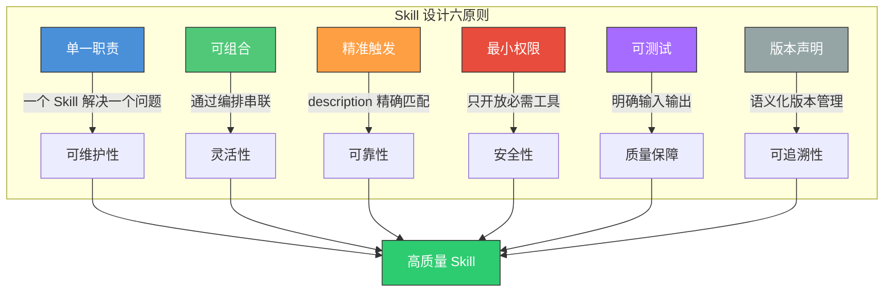
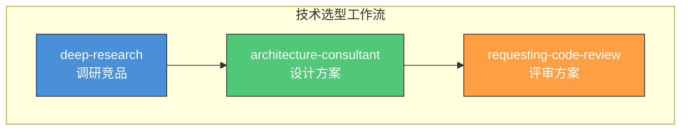
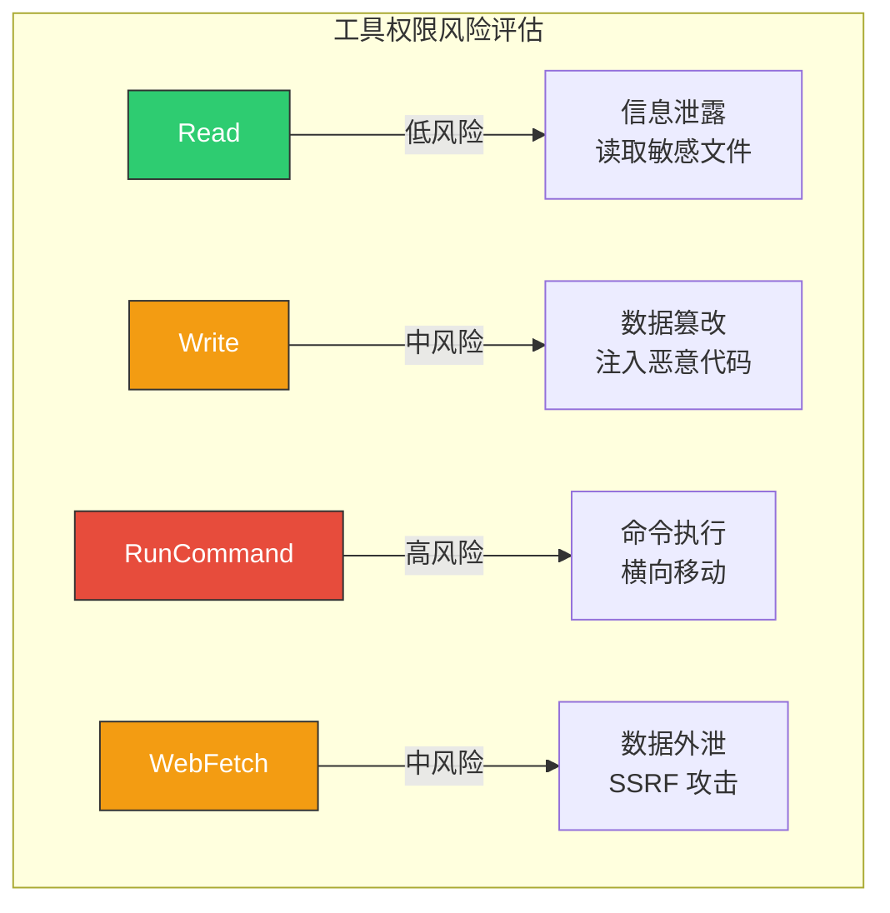
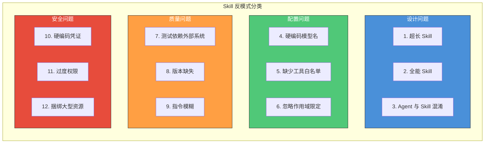
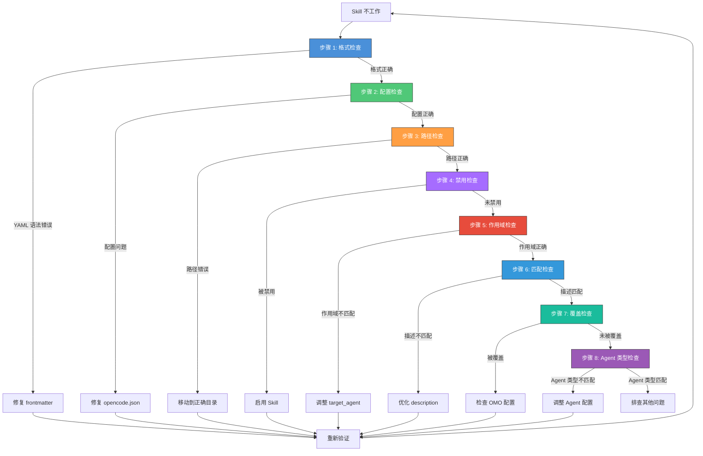
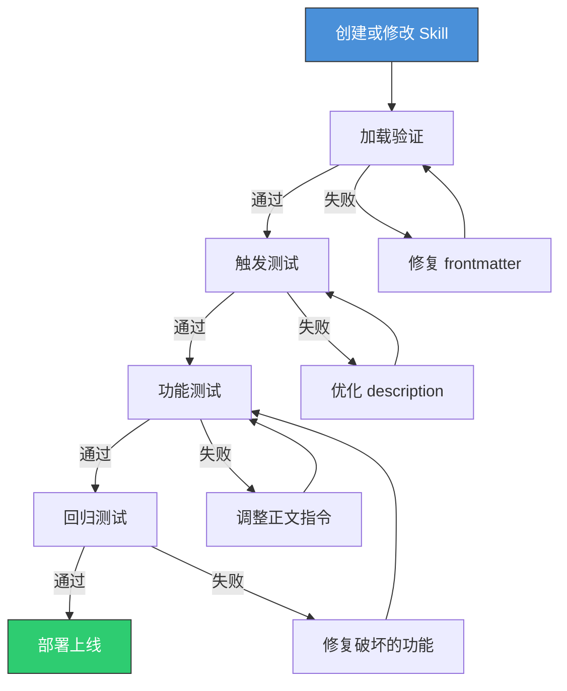
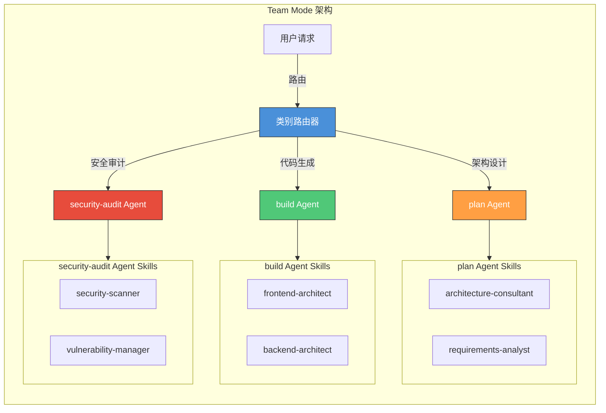

# Skill 最佳实践

> 从真实项目中提炼的 Skill 设计原则、反模式清单和调试方法，避免踩坑，写出高质量的 Skill。

## 文章概述

创建 Skill 很容易，但写出高质量的 Skill 需要经验和判断力。本文汇集了来自多个真实项目的实践总结：什么样的 Skill 设计是好的？哪些"看起来不错"的做法其实是反模式？当 Skill 不按预期工作时应该从哪里入手排查？

本文从 6 条核心设计原则出发，剖析 12 种常见反模式及其正确做法，提供可操作的 8 步调试清单，并讨论 Skill 在 Team Mode 中的集成策略——特别是 target_agent 与类别路由的协同工作原理。这些经验不仅适用于个人开发者，对团队层面的 Skill 治理同样有参考价值。

## Skill 设计 6 条核心原则

好的 Skill 设计可以归纳为六个维度。这些原则不是孤立的，而是相互支撑形成一个完整的设计框架。



### 原则 1：单一职责

**定义**：一个 Skill 只解决一个领域问题。

**架构顾问视角**：这与你设计微服务或模块时的原则一致。当一个 Skill 承担过多职责时，它会变得难以理解、难以测试、难以复用。

**前端架构师类比**：就像 React 组件应该只做一件事。一个包含"用户登录 + 商品列表 + 购物车"的组件是反模式，同样，一个包含"前端开发 + 后端开发 + 测试"的 Skill 也是反模式。

```yaml
# ❌ 反模式：全能 Skill
---
name: full-stack-developer
description: 全栈开发专家，精通前端、后端、数据库、测试、部署
allowed-tools:
  - Read
  - Write
  - RunCommand
  - WebSearch
  - WebFetch
---

# ✅ 正确做法：拆分为多个专业 Skill
---
name: frontend-architect
description: 前端架构设计专家，精通 React/Vue 组件设计、状态管理、性能优化
allowed-tools:
  - Read
  - Write
  - Glob
  - Grep
---

---
name: backend-architect
description: 后端架构设计专家，精通 API 设计、数据库建模、微服务架构
allowed-tools:
  - Read
  - Write
  - Glob
  - Grep
---
```

**判断标准**：如果你需要用"和"来描述 Skill 的职责，它可能需要拆分。

### 原则 2：可组合

**定义**：Skill 之间能通过 Agent 编排串联，形成更强大的工作流。

**架构顾问视角**：可组合性是架构设计的核心价值。当每个 Skill 都很"小"且专注时，Agent 可以灵活组合它们完成复杂任务。这就像 Unix 哲学：每个程序只做一件事，但可以通过管道组合。

**前端架构师类比**：组件的可组合性。`Button`、`Modal`、`Form` 是独立组件，但可以组合成 `UserEditDialog`。同样，`deep-research`、`architecture-consultant`、`requesting-code-review` 可以组合成一个完整的"技术选型"工作流。



**设计要点**：

| 要点 | 说明 | 示例 |
|------|------|------|
| 输入输出标准化 | Skill 的输出应能成为另一个 Skill 的输入 | 研究报告 → 架构设计输入 |
| 避免状态依赖 | Skill 之间不应有隐式状态共享 | 不依赖全局变量 |
| 明确前置条件 | 在 description 中说明需要什么输入 | "需要已有的代码仓库" |

### 原则 3：精准触发

**定义**：description 设计精确到不用看正文就知道是否匹配。

**需求分析师视角**：description 是 Skill 的"广告语"，它决定了 Agent 能否准确匹配到你的 Skill。太宽容易误触发，太窄难以匹配。

**description 写作模板**：

```yaml
description: |
  [一句话说明核心能力]
  提供：[该 Skill 包含的资源]
  适用：[触发场景1]、[触发场景2]
  不适用：[边界场景1]
```

**对比示例**：

```yaml
# ❌ 反例：过于宽泛，容易误触发
description: "帮助开发"

# ❌ 反例：过于狭窄，难以匹配
description: "在 React 18.2.0 版本使用 TypeScript 4.9 时优化 useEffect 性能"

# ✅ 正例：精确且完整
description: |
  React Hooks 性能优化专家。
  提供：useEffect/useMemo/useCallback 优化策略、内存泄漏排查方法。
  适用：React 组件性能问题、Hook 依赖优化、渲染性能调优。
  不适用：Vue/Angular 框架问题、后端性能优化。
```

**触发词设计技巧**：

| 技巧 | 说明 | 示例 |
|------|------|------|
| 包含领域关键词 | 让语义匹配更精准 | "React"、"安全"、"测试" |
| 说明核心能力 | 区分相似 Skill | "精通性能优化" vs "精通架构设计" |
| 明确排除边界 | 避免误触发 | "不适用于 Vue 框架" |

### 原则 4：最小权限

**定义**：只给完成任务必需的工具，不多给一个。

**安全架构师视角**：权限边界即攻击面。给 Skill 超过需要的工具，就像给实习生 root 权限——短期方便但长期危险。这是 Harness Engineering "可控"原则的核心体现。

**权限风险评估**：



**allowed-tools 配置指南**：

| Skill 类型 | 推荐 allowed-tools | 安全考量 |
|------------|-------------------|----------|
| 代码审查 | `Read`, `Glob`, `Grep` | 只读，无修改风险 |
| 代码生成 | `Read`, `Write`, `Glob` | 需要写入，但禁止命令执行 |
| 部署脚本 | `Read`, `Write`, `RunCommand` | 高风险，需严格审计 |
| 安全审计 | `Read`, `Grep`, `RunCommand` | 需要执行扫描工具，但禁止写入 |
| 调查研究 | `WebSearch`, `WebFetch`, `Read` | 网络访问，需注意数据外泄风险 |

```yaml
# ✅ 正确做法：代码审查 Skill 只给只读权限
---
name: requesting-code-review
description: 代码审查专家，识别代码异味和安全漏洞
allowed-tools:
  - Read      # 读取代码文件
  - Glob      # 搜索文件
  - Grep      # 搜索内容
  # 注意：没有 Write，禁止修改代码
  # 注意：没有 RunCommand，禁止执行命令
---
```

### 原则 5：可测试

**定义**：Skill 有明确的输入输出和验证方式。

**QA 工程师视角**：如果不知道一个 Skill 在什么场景下应该输出什么结果，就无法判断它是否正常工作。可测试性是质量保障的基础。

**测试场景设计**：

| 测试类型 | 说明 | 示例 |
|----------|------|------|
| 正向测试 | 应该触发时是否触发 | "帮我审查这段代码" → 触发 code-reviewer |
| 负向测试 | 不应触发时是否误触发 | "帮我写一个组件" → 不应触发 code-reviewer |
| 边界测试 | 边界条件是否正确处理 | "审查这个配置文件" → 是否在范围内 |

**测试用例模板**：

```markdown
## 测试用例：code-reviewer Skill

### 正向测试
- 输入："请审查 src/App.tsx 的代码质量"
- 预期：触发 code-reviewer，输出审查报告

### 负向测试
- 输入："帮我创建一个新的 React 组件"
- 预期：不触发 code-reviewer

### 边界测试
- 输入："审查 package.json 的依赖安全性"
- 预期：可能触发，但应说明这是依赖审查而非代码审查
```

### 原则 6：版本声明

**定义**：明确标记版本和兼容性，遵循语义化版本规范。

**架构顾问视角**：版本管理是软件工程的基础设施。没有版本声明的 Skill 就像没有版本号的 npm 包——无法追溯、无法回滚、无法管理兼容性。

**语义化版本规范**：

| 版本类型 | 格式 | 变更类型 | 示例 |
|----------|------|----------|------|
| 主版本 | X.0.0 | 不兼容的 API 变更 | 2.0.0（重构工作流） |
| 次版本 | 1.X.0 | 向后兼容的功能新增 | 1.1.0（新增输出模板） |
| 修订版本 | 1.0.X | 向后兼容的问题修复 | 1.0.1（修复描述错误） |

```yaml
---
name: frontend-architect
description: 前端架构设计专家
license: MIT
metadata:
  version: "2.1.0"
  author: opencode-community
  min_opencode_version: "2.0.0"
  changelog:
    - "2.1.0: 新增 Server Components 支持"
    - "2.0.0: 重构为 React 18 兼容"
    - "1.0.0: 初始版本"
---
```

## 12 种反模式及正确做法

从多个项目中，我们总结了 12 种最常见的 Skill 反模式。每一条都来自真实的踩坑经验。



### 反模式 1：超长 Skill

**问题**：Skill 超过 500 行，包含大量冗余内容，难以维护和调试。

**前端架构师类比**：就像一个超过 1000 行的 React 组件——难以理解、难以测试、难以复用。

```yaml
# ❌ 反模式：超长 Skill（500+ 行）
---
name: enterprise-solution
description: 企业级解决方案，包含需求分析、架构设计、代码生成、测试、部署...
---
# 正文超过 500 行，包含所有可能的内容...
```

```yaml
# ✅ 正确做法：拆分为多个子 Skill
---
name: requirements-analyst
description: 需求分析专家，编写用户故事和验收标准
allowed-tools: [Read, Write, Glob]
---

---
name: architecture-consultant
description: 架构设计专家，输出架构图和 ADR
allowed-tools: [Read, Write, Glob, Grep]
---

---
name: test-engineer
description: 测试工程师，设计测试用例和自动化测试
allowed-tools: [Read, Write, Glob, RunCommand]
---
```

**判断标准**：如果 Skill 正文超过 200 行，考虑拆分。

### 反模式 2：全能 Skill

**问题**：名字叫"全栈开发"，试图覆盖所有领域，结果每个领域都不专业。

```yaml
# ❌ 反模式：全能 Skill
---
name: super-developer
description: 全栈开发专家，精通前端、后端、数据库、DevOps、安全、测试...
allowed-tools:
  - Read
  - Write
  - RunCommand
  - WebSearch
  - WebFetch
  - Glob
  - Grep
  - Glob
---
```

```yaml
# ✅ 正确做法：专注一个领域
---
name: frontend-architect
description: |
  前端架构设计专家。
  提供：React/Vue 组件设计、状态管理方案、性能优化策略。
  适用：前端架构设计、组件拆分、技术选型。
  不适用：后端开发、数据库设计。
allowed-tools:
  - Read
  - Write
  - Glob
  - Grep
---
```

### 反模式 3：Agent 与 Skill 混淆

**问题**：在 Skill 里定义 Agent 行为，混淆了"方法论"和"执行者"的角色。

```yaml
# ❌ 反模式：在 Skill 里定义 Agent 行为
---
name: my-agent
description: 我的智能助手
---
# 正文
你是一个 Agent，应该：
1. 自动决定使用哪个工具
2. 管理会话状态
3. 与其他 Agent 协作...
```

```yaml
# ✅ 正确做法：Skill 只做方法论
---
name: code-review-checklist
description: 代码审查清单，提供系统化的审查维度
---
# 正文
## 代码审查清单

### 正确性
- [ ] 逻辑是否正确
- [ ] 边界条件是否处理
- [ ] 错误处理是否完善

### 可读性
- [ ] 命名是否清晰
- [ ] 结构是否合理
- [ ] 注释是否充分
```

**区分要点**：

| 概念 | 职责 | 配置位置 |
|------|------|----------|
| Agent | 执行者，决定"谁来做" | opencode.json 的 agents 字段 |
| Skill | 方法论，决定"怎么做" | SKILL.md 文件 |

### 反模式 4：硬编码模型名

**问题**：在 Skill 中硬编码特定模型名，失去灵活性。

```yaml
# ❌ 反模式：硬编码模型名
---
name: code-generator
description: 代码生成器
---
# 正文
 使用 best-capability-model[^model-tier] 模型生成代码...
```

模型层级说明[^model-tier]见脚注。

[^model-tier]: 此处使用层级化模型代称：`best-capability-model` 指代当前最强的旗舰模型（如 Claude Opus 4 或同等竞品），`balanced-model` 指代性价比均衡模型（如 Claude Sonnet 4 或同等竞品），`fast-model` 指代快速响应模型（如 Claude Haiku 或同等竞品）。实际使用时应替换为具体的模型名称。

```yaml
# ✅ 正确做法：使用类别路由
---
name: code-generator
description: 代码生成器
---
# 正文
使用配置的代码生成模型（由类别路由决定）生成代码...

# 在 opencode.json 中配置类别路由
{
  "model": {
    "routing": {
      "code_generation": "best-capability-model",
      "code_review": "balanced-model"
    }
  }
}
```

### 反模式 5：缺少工具白名单

**问题**：不设置 allowed-tools，Skill 可以访问所有工具，存在安全风险。

**安全架构师视角**：这是最常见的安全隐患。没有 allowed-tools 的 Skill 就像没有门禁的房间——任何人都可以进出。

```yaml
# ❌ 反模式：缺少 allowed-tools
---
name: data-processor
description: 数据处理专家
---
# Skill 可以访问所有工具，包括 RunCommand、Delete 等高风险工具
```

```yaml
# ✅ 正确做法：设置最小工具集
---
name: data-processor
description: 数据处理专家
allowed-tools:
  - Read      # 读取数据文件
  - Write     # 写入处理结果
  - Glob      # 搜索文件
  # 不包含 RunCommand，禁止执行命令
  # 不包含 WebFetch，禁止网络访问
---
```

### 反模式 6：忽略作用域限定

**问题**：专业 Skill 没有 target_agent 限定，可能被错误的 Agent 加载。

```yaml
# ❌ 反模式：安全审计 Skill 没有作用域限定
---
name: security-scanner
description: 安全漏洞扫描专家
allowed-tools:
  - Read
  - Grep
  - RunCommand  # 高风险权限
---
# 任何 Agent 都可以加载这个 Skill，存在权限滥用风险
```

```yaml
# ✅ 正确做法：限定为安全审计 Agent
---
name: security-scanner
description: 安全漏洞扫描专家
target_agent: security-audit  # 只有 security-audit Agent 可见
allowed-tools:
  - Read
  - Grep
  - RunCommand
---
```

### 反模式 7：测试依赖外部系统

**问题**：Skill 测试依赖外部 API 或服务，导致测试不稳定。

```yaml
# ❌ 反模式：测试依赖外部系统
---
name: api-tester
description: API 测试专家
---
# 正文
调用 https://api.example.com 进行测试...
```

```yaml
# ✅ 正确做法：使用 Mock 或明确标注
---
name: api-tester
description: API 测试专家
---
# 正文
## 测试策略

### 开发环境
使用 Mock 服务器进行测试：
- Mock 服务器地址：配置在 opencode.json 中
- 测试数据：使用 templates/test-data.json

### 生产环境
调用真实 API 进行测试：
- 需要用户确认
- 记录所有请求到审计日志
```

### 反模式 8：版本缺失

**问题**：Skill 没有版本号，修改后无法追溯。

```yaml
# ❌ 反模式：缺少版本信息
---
name: my-skill
description: 我的 Skill
---
# 修改后无法知道是哪个版本
```

```yaml
# ✅ 正确做法：语义化版本管理
---
name: my-skill
description: 我的 Skill
metadata:
  version: "1.2.0"
  author: developer
  changelog:
    - "1.2.0: 新增输出模板"
    - "1.1.0: 优化工作流程"
    - "1.0.0: 初始版本"
---
```

### 反模式 9：指令模糊

**问题**：Skill 中的指令过于抽象，没有具体步骤。

```yaml
# ❌ 反模式：指令模糊
---
name: code-reviewer
description: 代码审查专家
---
# 正文
做好代码审查，确保代码质量。
```

```yaml
# ✅ 正确做法：步骤化、可执行的流程
---
name: code-reviewer
description: 代码审查专家
---
# 正文
## 代码审查流程

### 步骤 1：理解上下文
- 阅读相关的设计文档或需求说明
- 理解代码的预期行为

### 步骤 2：检查正确性
- [ ] 逻辑是否正确
- [ ] 边界条件是否处理
- [ ] 错误处理是否完善

### 步骤 3：检查可读性
- [ ] 命名是否清晰
- [ ] 结构是否合理
- [ ] 注释是否充分

### 步骤 4：检查安全性
- [ ] 是否有 SQL 注入风险
- [ ] 是否有 XSS 风险
- [ ] 敏感信息是否暴露

### 步骤 5：输出审查报告
使用 templates/review-report.md.tmpl 生成报告
```

### 反模式 10：硬编码凭证

**问题**：API Key 或密码直接写在 Skill 中，存在严重安全风险。

**安全架构师视角**：这是最危险的反模式。硬编码凭证可能导致：
- 凭证泄露到版本控制系统
- 无法轮换凭证
- 审计追踪困难

```yaml
# ❌ 反模式：硬编码凭证
---
name: github-operations
description: GitHub 操作专家
---
# 正文
使用以下 Token 进行认证：
GITHUB_TOKEN: ghp_xxxxxxxxxxxxxxxxxxxx
```

```yaml
# ✅ 正确做法：使用环境变量
---
name: github-operations
description: GitHub 操作专家
---
# 正文
使用环境变量 {env:GITHUB_TOKEN} 进行认证。

配置方式：
1. 在终端设置：export GITHUB_TOKEN=your-token
2. 或在 opencode.json 中配置：
   {
     "environment": {
       "GITHUB_TOKEN": "${GITHUB_TOKEN}"
     }
   }
```

### 反模式 11：过度权限

**问题**：allowed-tools 包含不必要的工具，扩大攻击面。

```yaml
# ❌ 反模式：过度权限
---
name: documentation-writer
description: 文档编写专家
allowed-tools:
  - Read
  - Write
  - RunCommand      # 文档编写不需要执行命令
  - WebFetch  # 文档编写不需要网络访问
  - Delete    # 文档编写不需要删除文件
---
```

```yaml
# ✅ 正确做法：最小权限原则
---
name: documentation-writer
description: 文档编写专家
allowed-tools:
  - Read   # 读取现有文档
  - Write  # 编写新文档
  - Glob   # 搜索文档文件
---
```

### 反模式 12：捆绑大型资源文件

**问题**：Skill 捆绑大量资源文件，导致加载缓慢。

```yaml
# ❌ 反模式：捆绑大型资源
my-skill/
├── SKILL.md
├── reference/
│   ├── large-database.db      # 100MB 数据库
│   ├── training-data.json     # 50MB 训练数据
│   └── video-tutorials/       # 1GB 视频文件
```

```yaml
# ✅ 正确做法：轻量引用
my-skill/
├── SKILL.md
├── reference/
│   └── external-resources.md  # 记录外部资源链接

# external-resources.md 内容
## 外部资源

- 数据库：https://example.com/database.db
- 训练数据：https://example.com/training-data.json
- 视频教程：https://example.com/tutorials
```

### 反模式汇总表

| # | 反模式 | 问题 | 正确做法 |
|---|--------|------|---------|
| 1 | 超长 Skill | 难以维护、测试、复用 | 拆分为多个子 Skill |
| 2 | 全能 Skill | 每个领域都不专业 | 专注一个领域 |
| 3 | Agent 与 Skill 混淆 | 角色不清 | Skill 只做方法论 |
| 4 | 硬编码模型名 | 失去灵活性 | 使用类别路由 |
| 5 | 缺少工具白名单 | 安全风险 | 设置最小工具集 |
| 6 | 忽略作用域限定 | 权限滥用风险 | 使用 target_agent |
| 7 | 测试依赖外部系统 | 测试不稳定 | 使用 Mock 或标注 |
| 8 | 版本缺失 | 无法追溯 | 语义化版本管理 |
| 9 | 指令模糊 | 执行不确定 | 步骤化流程 |
| 10 | 硬编码凭证 | 严重安全风险 | 使用环境变量 |
| 11 | 过度权限 | 扩大攻击面 | 最小权限原则 |
| 12 | 捆绑大型资源 | 加载缓慢 | 轻量引用 |

## 8 步调试清单

当 Skill 不按预期工作时，按照以下 8 步清单系统排查。



### 步骤 1：格式检查

检查 SKILL.md 的 frontmatter 格式是否正确。

**检查项**：
- YAML 语法是否正确
- 必需字段是否完整（name、description）
- 字段类型是否匹配

**调试命令**：

```bash
# 查看 frontmatter
head -20 .opencode/skills/my-skill/SKILL.md

# 验证 YAML 语法（需要安装 yq）
head -20 .opencode/skills/my-skill/SKILL.md | yq .
```

**常见问题**：

| 问题 | 症状 | 解决方案 |
|------|------|----------|
| YAML 缩进错误 | Skill 不加载 | 使用 YAML 验证工具检查 |
| 字段名拼写错误 | 字段被忽略 | 对照规范检查字段名 |
| description 过长 | 被截断 | 控制在 1024 字符内 |

### 步骤 2：配置检查

验证 opencode.json 中的 Skill 配置。

**检查项**：
- Skill 是否在配置中声明
- 配置是否覆盖了 SKILL.md 的默认值

**调试命令**：

```bash
# 查看 Skill 配置
cat opencode.json | grep -A 10 "skills"

# 检查特定 Skill 配置
cat opencode.json | grep -A 5 "my-skill"
```

### 步骤 3：路径检查

确认 Skill 文件在正确的目录。

**检查项**：
- 文件是否在 `.opencode/skills/` 目录
- 目录名是否与 `name` 字段一致
- 是否有命名冲突

**调试命令**：

```bash
# 列出所有 Skill
ls -la .opencode/skills/

# 检查特定 Skill
ls -la .opencode/skills/my-skill/

# 验证文件名
find .opencode/skills -name "SKILL.md"
```

**搜索路径优先级**：

| 优先级 | 路径 | 用途 |
|--------|------|------|
| 1（最高） | `.opencode/skills/` | 项目级 Skill |
| 2 | `~/.config/opencode/skills/` | 用户级 Skill |
| 3 | 内置 Skills | 官方 Skill |
| 4 | Skills Marketplace | 社区 Skill |

### 步骤 4：禁用检查

确认 Skill 没有被配置禁用。

**检查项**：
- opencode.json 中是否设置了 `disabled: true`
- 是否有其他配置禁用了该 Skill

**调试命令**：

```bash
# 检查禁用状态
cat opencode.json | grep -A 3 "disabled"
```

### 步骤 5：作用域检查

检查 target_agent 是否限制了 Skill 的可见性。

**检查项**：
- Skill 是否设置了 target_agent
- 当前 Agent 类型是否匹配

**调试命令**：

```bash
# 检查 target_agent
grep "target_agent:" .opencode/skills/my-skill/SKILL.md

# 查看当前 Agent 配置
cat opencode.json | grep -A 5 "agent"
```

**作用域规则**：

| target_agent 设置 | 可见性 |
|-------------------|--------|
| 未设置 | 所有 Agent 可见 |
| 设置为 `build` | 只有 build Agent 可见 |
| 设置为 `security-audit` | 只有 security-audit Agent 可见 |

### 步骤 6：匹配检查

验证 description 是否能正确匹配用户请求。

**检查项**：
- description 是否包含关键触发词
- description 是否过于狭窄或宽泛

**测试方法**：

```markdown
### 正向测试
输入："请帮我审查这段代码"
预期：触发 code-reviewer Skill

### 负向测试
输入："帮我创建一个新组件"
预期：不触发 code-reviewer Skill
```

### 步骤 7：覆盖检查

检查 OMO 配置是否覆盖了 Skill 的默认行为。

**检查项**：
- opencode.json 中是否有覆盖配置
- 覆盖优先级是否正确

**覆盖优先级**：

```
OMO 配置 > 项目级 SKILL.md > 用户级 SKILL.md > 内置 SKILL.md
```

**调试命令**：

```bash
# 检查覆盖配置
cat opencode.json | grep -A 10 "overrides"
```

### 步骤 8：Agent 类型检查

确认当前 Agent 类型与 Skill 要求匹配。

**检查项**：
- 当前 Agent 类型是什么
- Skill 的 target_agent 是否匹配

**调试命令**：

```bash
# 查看当前 Agent
cat opencode.json | grep "default_agent"

# 查看所有 Agent 配置
cat opencode.json | grep -A 20 "agents"
```

### 调试清单汇总

| 步骤 | 检查项 | 命令 |
|------|--------|------|
| 1 | 格式检查 | `head -20 SKILL.md` |
| 2 | 配置检查 | `cat opencode.json \| grep skills` |
| 3 | 路径检查 | `ls -la .opencode/skills/` |
| 4 | 禁用检查 | `grep disabled opencode.json` |
| 5 | 作用域检查 | `grep target_agent SKILL.md` |
| 6 | 匹配检查 | 手动测试触发 |
| 7 | 覆盖检查 | `grep overrides opencode.json` |
| 8 | Agent 类型检查 | `grep default_agent opencode.json` |

## 模板测试验证指南

创建或修改 Skill 后，需要验证它能否被正确加载和使用。本节提供系统化的验证方法，覆盖加载、触发、功能和回归四个维度。



### 加载验证

确认 Skill 文件能被 OpenCode 正常识别：

```bash
# 检查文件结构
ls -la .opencode/skills/my-skill/
cat .opencode/skills/my-skill/SKILL.md

# 验证 frontmatter 可解析
head -20 .opencode/skills/my-skill/SKILL.md
```

**加载验证清单**：

| 检查项 | 验证方法 | 通过标准 |
|--------|----------|----------|
| 目录存在 | `ls .opencode/skills/<name>/` | 目录存在且名称与 `name` 字段一致 |
| SKILL.md 存在 | `ls SKILL.md` | 文件存在，大小写正确 |
| YAML 语法 | `head -20 SKILL.md \| yq .` | 无语法错误 |
| name 字段 | `grep "name:" SKILL.md` | 小写连字符，与目录名一致 |
| description 字段 | `grep "description:" SKILL.md` | 非空，1024 字符以内 |
| allowed-tools | `grep "allowed-tools:" SKILL.md` | 按最小权限原则配置 |

### 触发测试

通过实际请求验证 Skill 能否被正确触发。这是所有测试中最重要的一环——如果触发不对，后面的测试都没有意义。

| 测试类型 | 操作 | 示例 |
|----------|------|------|
| 正向测试 | 输入匹配的请求，确认 Skill 被加载 | `"请审查这段代码"` → 触发 code-reviewer |
| 负向测试 | 输入不匹配的请求，确认 Skill 未被误触发 | `"帮我写组件"` → 不触发 code-reviewer |
| 边界测试 | 输入模糊请求，观察触发行为 | `"检查这个文件"` → 取决于 description 设计 |

### 功能测试

验证 Skill 正文指令能被正确执行。为每个核心功能编写测试用例：

```markdown
### 测试用例格式

| 项目 | 内容 |
|------|------|
| 测试 ID | TC-001 |
| 测试名称 | code-reviewer 正确性审查 |
| 前置条件 | 提供一个包含明显 bug 的代码文件 |
| 测试步骤 | 1. 触发 code-reviewer<br/>2. 请求审查代码 |
| 预期结果 | 输出审查报告，包含正确性问题和改进建议 |
| 实际结果 |  |
```

**测试用例设计要点**：

- 每个核心指令至少一个正向用例
- 每个约束条件至少一个负向用例
- 边界条件单独测试
- 记录实际结果与预期结果的差异

### 回归测试

修改 Skill 后，重新运行所有测试用例，确保没有破坏已有功能：

```bash
# 检查修改历史
git log --oneline -5 .opencode/skills/my-skill/SKILL.md

# 对比修改前后行为变化
# 建议将测试请求和输出保存为文档，修改后重新执行对比
```

### 常见测试问题

| 问题 | 可能原因 | 解决方法 |
|------|----------|----------|
| Skill 未被加载 | frontmatter 格式错误 | 检查 YAML 语法，确保 name 与目录名一致 |
| Skill 被误触发 | description 过于宽泛 | 增加排除边界，明确"不适用"场景 |
| 指令未被执行 | 正文结构不清晰 | 使用步骤化流程，明确输入输出 |
| 输出不符合预期 | 约束条件不明确 | 增加输出规范和示例 |
| 加载后行为异常 | 与其他 Skill 冲突 | 检查 target_agent 和 category 设置 |

## Team Mode 中的 Skill 集成

Team Mode 是 OpenCode 的多 Agent 协作模式。在 Team Mode 中，Skill 的作用域和集成策略变得尤为重要。

### target_agent 与类别路由协同

在 Team Mode 中，每个 Agent 可以有自己的专属 Skill。通过 `target_agent` 字段，可以实现 Skill 的精确分配。



**配置示例**：

```json
// opencode.json
{
  "agents": {
    "build": {
      "model": "best-capability-model",
      "system_prompt": "你是构建专家..."
    },
    "plan": {
      "model": "balanced-model",
      "system_prompt": "你是规划专家..."
    },
    "security-audit": {
      "model": "best-capability-model",
      "system_prompt": "你是安全审计专家..."
    }
  },
  "skills": {
    "frontend-architect": {
      "target_agent": "build"
    },
    "security-scanner": {
      "target_agent": "security-audit"
    }
  }
}
```

### 成员间 Skill 不可见的设计价值

在 Team Mode 中，不同 Agent 之间的 Skill 默认不可见。这种设计有以下价值：

**安全隔离**

安全审计 Agent 的 Skill 通常具有高风险权限（如 RunCommand）。如果这些 Skill 对其他 Agent 可见，可能导致权限提升攻击。

```yaml
# 安全审计 Skill 只对 security-audit Agent 可见
---
name: security-scanner
description: 安全漏洞扫描专家
target_agent: security-audit
allowed-tools:
  - Read
  - Grep
  - RunCommand  # 高风险权限，需要隔离
---
```

**职责清晰**

每个 Agent 只看到与自己职责相关的 Skill，避免"技能过载"和误触发。

**审计追踪**

当安全事件发生时，可以快速定位是哪个 Agent 的哪个 Skill 执行了操作。

### Overrides 的最佳使用场景

OMO 配置可以覆盖 SKILL.md 的默认值。以下是最佳使用场景：

**场景 1：环境差异**

不同环境使用不同的工具权限：

```json
// 开发环境
{
  "skills": {
    "deployer": {
      "allowed-tools": ["Read", "Write", "RunCommand"]
    }
  }
}

// 生产环境
{
  "skills": {
    "deployer": {
      "allowed-tools": ["Read"],  // 生产环境禁止写入和命令执行
      "disabled": true  // 或直接禁用
    }
  }
}
```

**场景 2：团队规范**

团队统一覆盖某些 Skill 的行为：

```json
{
  "skills": {
    "code-reviewer": {
      // 团队统一使用自定义审查清单
      "overrides": {
        "checklist_path": ".team/review-checklist.md"
      }
    }
  }
}
```

**场景 3：临时禁用**

发现问题 Skill 时临时禁用：

```json
{
  "skills": {
    "problematic-skill": {
      "disabled": true
    }
  }
}
```

### Team Mode Skill 集成清单

| 检查项 | 说明 |
|--------|------|
| [ ] 专业 Skill 设置 target_agent | 限制可见性 |
| [ ] 高风险 Skill 隔离到安全 Agent | 防止权限提升 |
| [ ] 检查 Agent 间的 Skill 冲突 | 避免误触发 |
| [ ] 配置审计日志 | 追踪 Skill 调用 |
| [ ] 定期审查 Overrides 配置 | 确保符合安全策略 |

## 小结

高质量的 Skill 需要遵循 6 条核心设计原则：单一职责、可组合、精准触发、最小权限、可测试、版本声明。这些原则相互支撑，形成一个完整的设计框架。

12 种反模式来自真实项目的踩坑经验，涵盖设计问题、配置问题、质量问题和安全问题。每一条反模式都有对应的正确做法，可以作为 Skill 审查的检查清单。

8 步调试清单提供了系统化的问题排查方法：格式检查→配置检查→路径检查→禁用检查→作用域检查→匹配检查→覆盖检查→Agent 类型检查。

在 Team Mode 中，通过 target_agent 实现 Skill 的精确分配，通过成员间 Skill 不可见实现安全隔离，通过 Overrides 实现环境差异和团队规范的配置。

---

## 学习检查清单

完成本章学习后，请确认你能够：

- [ ] 解释 Skill 设计的 6 条核心原则及其相互关系
- [ ] 识别 12 种常见反模式并给出正确做法
- [ ] 使用 8 步调试清单排查 Skill 问题
- [ ] 配置 target_agent 实现 Team Mode 中的 Skill 隔离
- [ ] 解释最小权限原则的安全含义
- [ ] 编写精准的 description，避免误触发和漏触发

---

## 关联章节

- ← [创建 Skill](creating-skills.md)（基础格式和加载机制）
- ← [Skill 模板](skill-templates.md)（原则和反模式在模板中的体现）
- ← [Skill 系统](../02-core-concepts/skills-system.md)（理论基础）
- → [Teams 多进程协作](../04-workflows/teams-collaboration.md)（Skill 在团队协作中的应用）
- → [安全总览](../06-advanced/security-overview.md)（权限控制的深度分析）
