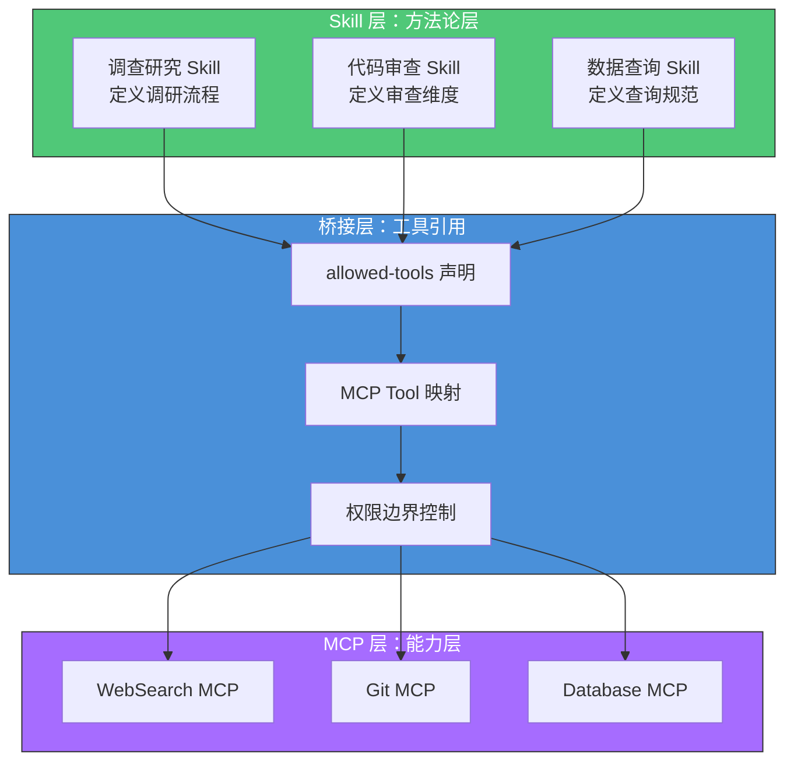
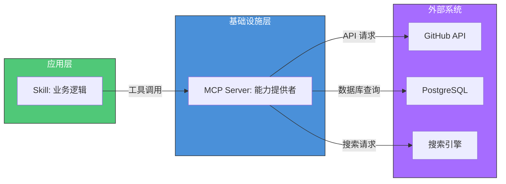

# Skill-MCP 桥接

> 打通 Skill 的方法论与 MCP 的工具能力，让 Agent 既知道"怎么做"也有"用什么做"。

## 文章概述

Skill 擅长流程和方法论，MCP 擅长外部工具集成和数据访问。但实际开发中，一个完整的自动化任务往往同时需要两者——Skill 定义思考步骤，MCP 提供执行手段。Skill-MCP 桥接模式正是为了解决这个分工问题而设计的。读完本文，你将能够将 MCP 工具无缝集成到 Skill 工作流中，根据不同场景选择合适的桥接配置，并理解如何让 Skill 突破 Agent 内置能力的边界。

本文讲解 Skill 如何在内部工作流中调用 MCP 工具，以及如何将 MCP Server 注册为 Skill 的外部依赖。通过调查研究+WebSearch、代码审查+Git、数据查询+Database 等实战示例，展示桥接模式在不同场景下的具体配置。理解这个模式，相当于为 Skill 装上了"机械臂"——不再局限于 Agent 内置能力，可以触达任何外部系统。

> **⏱ 时间有限？先读这些：** 为什么需要 Skill-MCP 桥接 → 桥接模式的设计 → 桥接实战示例 → 最佳实践与反模式

## 为什么需要 Skill-MCP 桥接

### 能力边界的困境

在 OpenCode 生态中，Skill 和 MCP 各有明确的职责边界：

| 组件 | 擅长领域 | 局限性 |
|------|----------|--------|
| **Skill** | 方法论、流程编排、最佳实践封装 | 只能使用 Agent 内置工具，无法访问外部系统 |
| **MCP** | 外部工具集成、数据访问、API 调用 | 不关心业务逻辑，只是"裸"的工具提供者 |

这种分离在设计上是合理的——单一职责原则。但在实际场景中，大多数有价值的任务都需要两者协作：

**场景 1：调查研究任务**
- Skill 知道"如何系统化调研"（方法论）
- 但需要 WebSearch MCP 提供"搜索能力"（工具）

**场景 2：数据库操作任务**
- Skill 知道"如何设计安全的查询"（方法论）
- 但需要 Database MCP 提供"数据库连接"（工具）

**场景 3：代码审查任务**
- Skill 知道"审查哪些维度"（方法论）
- 但需要 Git MCP 提供"版本历史访问"（工具）

### 桥接模式的核心价值

Skill-MCP 桥接模式的核心价值在于**解耦与协作**：



**解耦价值**：
- Skill 不关心底层工具的具体实现（WebSearch 可以是 Exa、Google、Bing）
- MCP 不关心上层的业务逻辑（同一个 Database MCP 可被多个 Skill 使用）

**协作价值**：
- Skill 定义"怎么做"——思考步骤、检查清单、输出规范
- MCP 提供"用什么做"——API 调用、数据访问、外部集成

## 桥接模式的设计

### Skill 内部调用 MCP Tool

在 Skill 中引用 MCP Tool，核心机制是 `allowed-tools` 字段。MCP Tool 的命名遵循 `mcp_{server}_{tool}` 格式：

```yaml
---
name: deep-research
description: |
  用于需要网络研究的任何问题，替代 WebSearch。
  提供：系统化的多角度研究方法论。
  适用：当用户询问"什么是 X"、"比较 X 和 Y"。
allowed-tools:
  - read
  - grep
  - mcp_websearch_search    # MCP Tool：websearch 服务器的 search 工具
  - mcp_websearch_fetch     # MCP Tool：websearch 服务器的 fetch 工具
---
```

**MCP Tool 命名规范**：

| 格式 | 示例 | 说明 |
|------|------|------|
| `mcp_{server}_{tool}` | `mcp_github_create_issue` | 标准 MCP Tool 命名 |
| `mcp_{server}` | `mcp_postgres` | 引用整个 MCP Server（所有工具） |

> ⚠️ `mcp_{server}_{tool}` 命名规范是本书建议的约定，目前未被 OpenCode 或 OMO 强制要求。实际 MCP 工具名以 MCP 服务器配置为准。

### MCP Server 作为外部能力层

MCP Server 在 Skill 架构中扮演"外部能力层"的角色。从后端架构师视角，可以将其理解为**微服务架构中的基础设施层**：



**设计原则**：

1. **单一职责**：每个 MCP Server 只负责一类外部系统
2. **接口隔离**：Skill 只声明它需要的 MCP Tool，不获取整个 Server 的所有能力
3. **依赖倒置**：Skill 依赖抽象的工具接口，不依赖具体的 MCP 实现

### 权限和工具隔离设计

Skill-MCP 桥接的权限设计遵循**最小权限原则**：

```yaml
---
name: security-audit
description: 安全漏洞扫描和审计
allowed-tools:
  - read                    # 读取代码
  - grep                    # 搜索模式
  - mcp_nmap_scan          # 端口扫描（只读操作）
  # 注意：没有 mcp_nmap_exploit —— 禁止攻击性操作
  # 注意：没有 Write —— 禁止修改代码
---
```

**权限隔离层级**：

| 层级 | 控制点 | 示例 |
|------|--------|------|
| Skill 层 | `allowed-tools` 白名单 | 只声明需要的 MCP Tool |
| MCP 层 | MCP Server 配置 | 限制 MCP 可访问的资源 |
| 系统层 | 环境变量和网络策略 | 限制 MCP 的网络访问范围 |

## 桥接实战示例

### 示例 1：调查研究 Skill + WebSearch MCP

**场景**：用户需要进行技术选型调研，Skill 定义调研方法论，MCP 提供搜索能力。

**Skill 定义**：

```yaml
---
name: deep-research
description: |
  用于需要网络研究的任何问题，替代 WebSearch。
  提供：系统化的多角度研究方法论，而非单一浅层搜索。
  适用：当用户询问"什么是 X"、"解释 X"、"比较 X 和 Y"、"研究 X"。
  不适用：简单的代码修改任务。
allowed-tools:
  - read
  - grep
  - mcp_websearch_search
  - mcp_websearch_fetch
---

# Deep Research Skill

## 研究方法论

你是一位资深技术调研专家。当用户提出研究需求时，按以下流程执行：

### 第一阶段：问题分解

1. 将复杂问题拆分为 3-5 个子问题
2. 识别关键概念和术语
3. 确定研究的边界条件

### 第二阶段：多源搜索

使用 `mcp_websearch_search` 工具进行搜索：
- 每个子问题至少使用 2 个不同的搜索词
- 优先搜索官方文档和权威来源
- 记录每个来源的可信度评分

### 第三阶段：信息验证

使用 `mcp_websearch_fetch` 工具获取详细内容：
- 交叉验证关键信息
- 标注信息的时效性
- 识别矛盾信息并标注

### 第四阶段：结构化输出

输出格式：
- 执行摘要（3 句话）
- 详细发现（按子问题组织）
- 信息来源列表（含可信度评分）
- 建议下一步行动

## 搜索策略

| 问题类型 | 搜索策略 |
|---------|---------|
| 技术选型 | 官方文档 + GitHub Stars + 社区讨论 |
| 概念理解 | Wikipedia + 官方规范 + 教程文章 |
| 比较分析 | "A vs B" + Benchmark + 实践案例 |
```

**MCP 配置**（opencode.json）：

```json:opencode.json
{
  "mcp": {
    "websearch": {
      "type": "local",
      "command": "npx",
      "args": ["-y", "@opencode/mcp-websearch"],
      "environment": {
        "SEARCH_API_KEY": "{env:SEARCH_API_KEY}"
      },
      "enabled": true
    }
  }
}
```

**执行流程**：

```
用户: "帮我研究 React Server Components 和 Next.js App Router 的关系"

Agent:
1. 加载 deep-research Skill
2. 识别 allowed-tools 包含 mcp_websearch_search
3. 调用 MCP Tool 执行搜索
4. 按 Skill 定义的方法论组织输出
```

### 示例 2：代码审查 Skill + Git MCP

**场景**：代码审查需要访问 Git 历史和 PR 信息，Skill 定义审查维度，MCP 提供版本控制能力。

**Skill 定义**：

```yaml
---
name: git-code-review
description: |
  基于 Git 历史的深度代码审查。
  提供：变更影响分析、历史上下文、审查清单。
  适用：PR 审查、代码质量检查、变更影响评估。
allowed-tools:
  - read
  - grep
  - glob
  - mcp_git_diff
  - mcp_git_log
  - mcp_git_blame
  - mcp_github_get_pr
  - mcp_github_list_reviews
---

# Git Code Review Skill

## 审查维度

你是一位资深代码审查专家。审查时关注以下维度：

### 1. 变更影响分析

使用 `mcp_git_diff` 分析变更范围：
- 变更涉及多少文件？
- 变更是新增、修改还是删除？
- 变更是否影响公共 API？

### 2. 历史上下文

使用 `mcp_git_log` 和 `mcp_git_blame` 获取上下文：
- 这段代码最近谁修改过？
- 相关的 commit message 是什么？
- 是否有相关的历史问题？

### 3. 代码质量检查

使用 `Read` 和 `Grep` 进行静态分析：
- 是否有明显的 bug？
- 是否符合项目代码规范？
- 是否有安全风险？

### 4. PR 上下文（如适用）

使用 `mcp_github_get_pr` 获取 PR 信息：
- PR 的描述和目标是什么？
- 是否有相关的 Issue？
- 之前的审查意见是什么？

## 输出规范

审查报告格式：

```markdown
## 审查摘要
[一句话总结变更的主要目的和风险]

## 变更概览
- 文件数：X
- 新增行数：+Y
- 删除行数：-Z

## 审查发现

### 🔴 必须修复
[阻止合并的问题]

### 🟡 建议改进
[非阻塞性问题]

### 🟢 值得肯定
[好的实践]

## 历史上下文
[相关历史信息]

## 建议
[下一步行动]
```
```

**MCP 配置**：

```json:opencode.json
{
  "mcp": {
    "git": {
      "type": "local",
      "command": "mcp-git-server",
      "args": ["--repo", "{env:PWD}"],
      "enabled": true
    },
    "github": {
      "type": "local",
      "command": "npx",
      "args": ["-y", "@github/mcp-server"],
      "environment": {
        "GITHUB_TOKEN": "{env:GITHUB_TOKEN}"
      },
      "enabled": true
    }
  }
}
```

### 示例 3：数据查询 Skill + Database MCP

**场景**：安全的数据查询需要参数验证和 SQL 最佳实践，Skill 定义查询规范，MCP 提供数据库连接。

**Skill 定义**：

```yaml
---
name: safe-data-query
description: |
  安全的数据查询助手。
  提供：参数验证、SQL 最佳实践、查询结果格式化。
  适用：数据库查询、数据分析、报表生成。
allowed-tools:
  - read
  - mcp_postgres_query
  - mcp_postgres_schema
---

# Safe Data Query Skill

## 安全查询原则

你是一位数据库查询专家，遵循以下安全原则：

### 1. 参数验证

在执行任何查询前：
- 验证所有用户输入
- 使用参数化查询，禁止字符串拼接
- 限制查询返回行数（默认 1000 行）

### 2. 查询构建

使用 `mcp_postgres_schema` 了解表结构后：
- 优先使用索引列进行过滤
- 避免 SELECT *，明确指定列
- 大表查询必须带 WHERE 条件

### 3. 敏感数据保护

禁止查询以下类型数据：
- 密码哈希
- 个人身份信息（PII）
- 支付信息

如需查询敏感数据，必须：
- 脱敏处理
- 明确告知用户

## 查询流程

```
1. 使用 mcp_postgres_schema 获取表结构
2. 构建安全的参数化查询
3. 使用 mcp_postgres_query 执行查询
4. 格式化输出结果
```

## 输出格式

```markdown
## 查询结果

**执行时间**：Xms
**返回行数**：Y

| 列1 | 列2 | 列3 |
|-----|-----|-----|
| ... | ... | ... |

## 查询语句
```sql
[实际执行的 SQL]
```
```
```

## Skill-embedded MCP 配置

### 内嵌 MCP 声明

Skill 可以在 SKILL.md 中声明其依赖的 MCP Server，实现"即插即用"的体验：

```yaml
---
name: github-operations
description: |
  GitHub 仓库操作 Skill。
  提供：Issue 管理、PR 操作、仓库查询。
  适用：GitHub 相关操作。
allowed-tools:
  - mcp_github_create_issue
  - mcp_github_create_pr
  - mcp_github_list_repos
  - mcp_github_get_pr
mcp:
  github:
    type: local
    command: ["npx", "-y", "@github/github-mcp-server"]
    environment:
      GITHUB_TOKEN: "{env:GITHUB_TOKEN}"
---

# GitHub Operations Skill

## 功能说明

此 Skill 封装了常用的 GitHub 操作：

### Issue 管理

- 创建 Issue：`mcp_github_create_issue`
- 列出 Issues：`mcp_github_list_issues`

### PR 操作

- 创建 PR：`mcp_github_create_pr`
- 获取 PR 详情：`mcp_github_get_pr`

### 仓库查询

- 列出仓库：`mcp_github_list_repos`
- 获取仓库信息：`mcp_github_get_repo`

## 使用前提

确保已设置环境变量：
```bash
export GITHUB_TOKEN="your-token-here"
```
```

### MCP 配置合并规则

当 Skill 声明了内嵌 MCP 配置时，配置合并遵循以下规则：

| 来源 | 优先级 | 说明 |
|------|--------|------|
| opencode.json | 最高 | 用户显式配置，不可被覆盖 |
| Skill 内嵌配置 | 中等 | Skill 声明的依赖 |
| 默认配置 | 最低 | 系统默认值 |

**合并示例**：

```json:opencode.json
// opencode.json 中的配置
{
  "mcp": {
    "github": {
      "type": "remote",
      "url": "https://github-mcp.example.com"
    }
  }
}
```

如果 Skill 内嵌配置声明了 `github` MCP，但 opencode.json 已有同名配置，则使用 opencode.json 的配置（用户配置优先）。

### 多 MCP 协同配置

复杂 Skill 可能依赖多个 MCP Server：

```yaml
---
name: full-stack-audit
description: 全栈代码审计，包含安全扫描和依赖检查
allowed-tools:
  - read
  - grep
  - mcp_snyk_check        # 依赖漏洞检查
  - mcp_sonarqube_scan    # 代码质量扫描
  - mcp_github_get_pr     # PR 上下文
mcp:
  snyk:
    type: local
    command: ["mcp-snyk"]
    environment:
      SNYK_TOKEN: "{env:SNYK_TOKEN}"
  sonarqube:
    type: remote
    url: "{env:SONARQUBE_URL}"
    headers:
      Authorization: "Bearer {env:SONARQUBE_TOKEN}"
---
```

## 最佳实践与反模式

### 最佳实践

**1. 明确声明 MCP 依赖**

```yaml
# ✅ 好的做法：明确声明需要的 MCP Tool
allowed-tools:
  - mcp_github_create_issue
  - mcp_github_list_issues

# ❌ 不好的做法：声明整个 MCP Server
allowed-tools:
  - mcp_github  # 获取了所有 GitHub 工具，权限过大
```

**2. 提供降级策略**

```markdown
## 执行策略

1. 优先使用 MCP Tool（如果可用）
2. 如果 MCP 不可用，提示用户手动操作
3. 记录降级原因，便于后续排查
```

**3. 环境变量管理**

```yaml
# ✅ 使用环境变量占位符
environment:
  API_KEY: "{env:MY_API_KEY}"

# ❌ 硬编码凭证
environment:
  API_KEY: "sk-1234567890"  # 危险！
```

### 反模式清单

| 反模式 | 问题 | 正确做法 |
|--------|------|----------|
| **过度依赖 MCP** | 每个 Skill 都需要 MCP，增加复杂度 | 优先使用内置工具 |
| **MCP 凭证硬编码** | 凭证泄露风险 | 使用 `{env:VAR}` 占位符 |
| **缺少降级策略** | MCP 不可用时 Skill 失效 | 提供替代方案或明确提示 |
| **权限声明过宽** | `allowed-tools: [mcp_github]` 获取所有工具 | 精确声明需要的 Tool |
| **忽略 MCP 版本** | MCP 更新可能破坏兼容性 | 在 metadata 中声明兼容版本 |

### 调试清单

当 Skill-MCP 桥接不工作时，按以下步骤排查：

1. **MCP Server 是否启动**
   ```bash
   # 检查 MCP 进程
   ps aux | grep mcp
   ```

2. **环境变量是否设置**
   ```bash
   # 检查环境变量
   echo $GITHUB_TOKEN
   ```

3. **allowed-tools 是否正确**
   ```yaml
   # 检查 Tool 名称拼写
   allowed-tools:
     - mcp_github_create_issue  # 正确
     - mcp_github_creat_issue   # 错误：拼写错误
   ```

4. **MCP 配置是否生效**
   ```json
   // 检查 opencode.json
   {
     "mcp": {
       "github": {
         "enabled": true  // 确保未禁用
       }
     }
   }
   ```

## 小结

Skill-MCP 桥接模式是 OpenCode 生态中实现复杂自动化的关键设计。通过清晰的职责分离——Skill 定义"怎么做"，MCP 提供"用什么做"——实现了方法论与工具能力的优雅结合。

理解 Skill-MCP 桥接的关键要点：

1. **分工明确**：Skill 是大脑（方法论），MCP 是手（工具能力）
2. **解耦价值**：Skill 不关心 MCP 实现，MCP 不关心业务逻辑
3. **权限控制**：通过 `allowed-tools` 精确控制 Skill 可访问的 MCP Tool
4. **即插即用**：Skill-embedded MCP 配置让 Skill 自带依赖声明
5. **安全第一**：环境变量管理、最小权限原则、降级策略

在下一章 [插件化模式](plugin-patterns.md) 中，我们将看到 Skill 如何从独立单元演进为可组合的插件生态。

---

## 学习检查清单

完成本章学习后，请确认你能够：

- [ ] 解释 Skill 和 MCP 的职责分工（方法论 vs 工具能力）
- [ ] 在 Skill 中正确声明 MCP Tool 依赖（`allowed-tools` 字段）
- [ ] 配置 Skill-embedded MCP（在 SKILL.md 中内嵌 MCP 配置）
- [ ] 应用最小权限原则设计 Skill 的 MCP 访问权限
- [ ] 排查 Skill-MCP 桥接的常见问题

---

## 关联章节

- ← [Skill 系统](../02-core-concepts/skills-system.md)（Skill 的基础概念）
- ← [MCP 服务器](../06-advanced/mcp-servers.md)（MCP 配置和协议基础）
- → [插件化模式](plugin-patterns.md)（桥接是插件化的前置技术）
