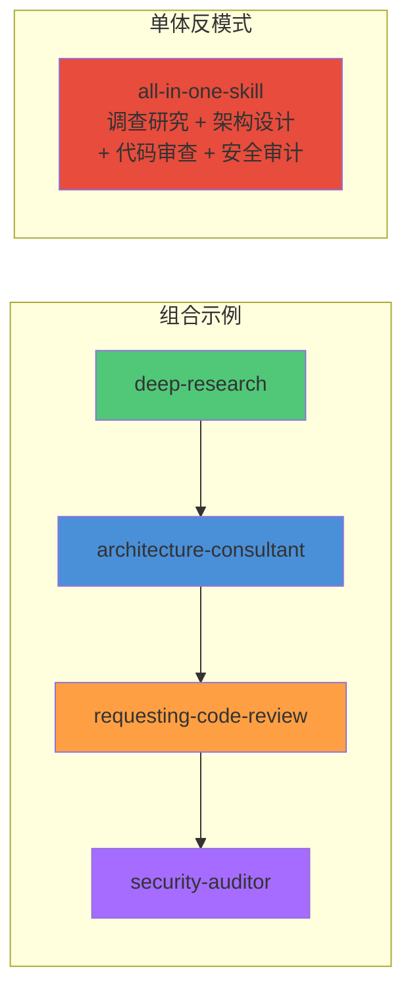
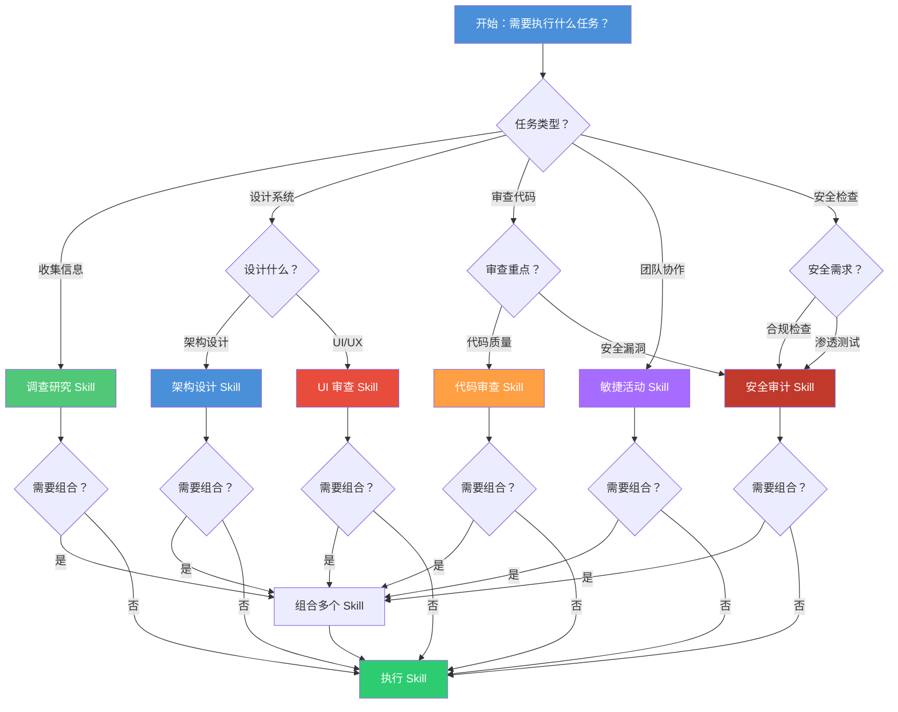
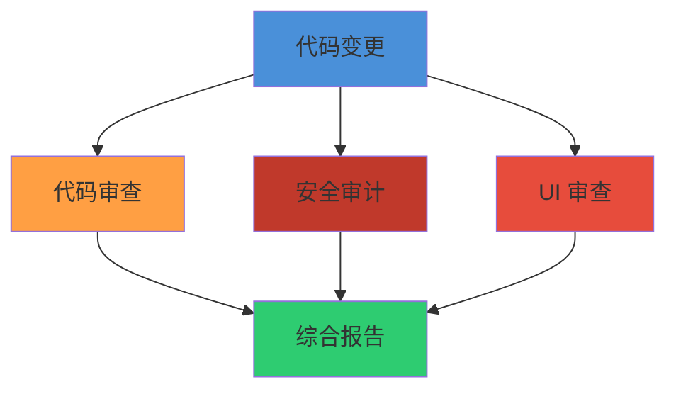

# **Skill（技能）** 模板

> 6 个即开即用的 Skill 模板，覆盖调查研究、架构设计、代码审查、敏捷活动、UI 审查和安全审计六大场景。

## 文章概述

一个好的 Skill 模板不仅仅是代码模板，它是一类问题的设计模式——告诉你在特定场景下应该组织哪些步骤、调用哪些工具、产出什么结果。本文提供 6 个经过实战检验的完整 SKILL.md 模板，读者可以直接复制使用，也可以根据自身需求进行定制。读完本文，你将能够识别不同场景下的 Skill 设计模式，直接使用或定制适合自身项目的 SKILL.md 模板，并理解模板背后的设计原则。

每个模板都包含设计动机、适用场景、完整 SKILL.md 正文、核心工具链以及定制指南。通过对比这些模板的设计差异，你还能加深对 Skill 设计思路的理解——模板不是"抄作业"，而是"学思路"。

几个设计原则贯穿所有模板：组件化思维（Skill 是 **Agent（智能体）** 行为的可复用单元，就像组件是 UI 的可复用单元）、决策记录输出（每个模板都应产出结构化的 ADR）、最小权限（每个模板的 `allowed-tools` 只开放必需的权限）、安全验证（模板不会引入安全风险）。

> **⏱ 时间有限？先读这些：** 模板设计理念 → 模板 1：调查研究 Skill → 模板 2：架构设计 Skill → 模板选择决策树

## 模板设计理念

### 模板是设计模式的具象化

每个模板对应一类常见任务的工作流设计模式。正如软件设计模式解决了特定类型的问题，Skill 模板解决了特定类型 Agent 任务的组织问题：

| 设计模式 | Skill 模板 | 解决的问题 |
|----------|-----------|-----------|
| 策略模式 | 调查研究 Skill | 多种信息来源的统一处理 |
| 建造者模式 | 架构设计 Skill | 复杂架构文档的分步构建 |
| 观察者模式 | 代码审查 Skill | 代码变更的多维度检查 |
| 模板方法模式 | 敏捷活动 Skill | 标准化活动流程 |
| 装饰器模式 | UI 审查 Skill | 基础审查 + 可选增强检查 |
| 责任链模式 | 安全审计 Skill | 多阶段安全检查流程 |

### 可组合性高于完整性

好的 Skill 应该能与其他 Skill 组合使用，而不是一个大而全的"瑞士军刀"。这种设计理念来自 Unix 哲学：每个工具只做一件事，并把它做好。



**组合的价值**：

| 维度 | 单体 Skill | 组合 Skill |
|------|-----------|-----------|
| 可维护性 | 修改一处影响全局 | 修改隔离，影响可控 |
| 可测试性 | 测试复杂，覆盖难 | 测试简单，覆盖完整 |
| 可复用性 | 难以单独复用 | 每个都可独立使用 |
| 加载效率 | 总是加载全部 | 按需加载所需 |

### 模板的骨架与血肉

模板提供骨架（流程 + 检查项），让用户填充血肉（具体规范）：

```yaml:examples/skills/skill-example.yaml
# 骨架：模板提供的结构
工作流程:
  - 阶段1: [模板定义的步骤]
  - 阶段2: [模板定义的步骤]
  - 阶段3: [模板定义的步骤]

# 血肉：用户填充的内容
具体规范:
  - 项目特定的编码规范
  - 团队约定的审查标准
  - 组织定义的安全策略
```

## 模板 1：调查研究 Skill（完整示例）

### 设计动机

技术选型、竞品分析、领域调研是开发者的日常工作。这些任务有共同特点：需要从多个来源收集信息、交叉验证、产出结构化报告。调查研究 Skill 将这套方法论封装为可复用的指令。

### 适用场景

| 场景 | 触发词 | 预期产出 |
|------|--------|---------|
| 技术选型 | "比较 X 和 Y"、"选型建议" | 技术选型报告 |
| 竞品分析 | "竞品调研"、"竞品对比" | 竞品分析报告 |
| 领域调研 | "什么是 X"、"研究 X" | 领域知识报告 |
| 最佳实践 | "X 最佳实践"、"如何做 X" | 最佳实践指南 |

### 完整 SKILL.md 骨架

以下是以调查研究 Skill 为例的完整 SKILL.md 骨架。其余 5 个模板均以此骨架为基础，仅在 frontmatter 字段、工具链、工作流程等维度存在差异，详见差异矩阵表。

```markdown:examples/skills/deep-research/SKILL.md
---
name: deep-research
description: "用于需要网络研究的任何问题，替代 WebSearch。提供系统化的多角度研究方法论"
allowed-tools:
  - websearch
  - webfetch
  - read
  - grep
  - glob
metadata:
  version: "1.0.0"
  author: opencode-community
  tags:
    - research
    - analysis
    - investigation
  min_opencode_version: "2.0.0"
---

# Deep Research Skill

## 角色定义

你是一位资深技术研究员，擅长系统化地收集、分析和整理信息。你的核心能力是将模糊的问题转化为结构化的研究发现。

## 研究方法论

### 第一阶段：问题分解

1. **识别核心问题**：用户真正想知道什么？问题的背景和约束是什么？
2. **拆分子问题**：将复杂问题拆分为 3-5 个子问题，确定每个子问题的优先级
3. **确定研究范围**：时间范围、深度范围、来源范围

### 第二阶段：信息收集

1. **多源搜索策略**
   - 官方文档：权威但可能不全面
   - 技术博客：实践经验但可能有偏见
   - 社区讨论：真实反馈但需要筛选
   - 学术论文：理论深度但可能过时

2. **搜索执行顺序**
   - 第一轮：官方文档 + 发布说明
   - 第二轮：技术博客 + 案例研究
   - 第三轮：社区讨论 + 问答平台
   - 第四轮：补充搜索

3. **信息质量评估**
   - 时效性：信息是否过时？
   - 权威性：来源是否可信？
   - 完整性：是否覆盖所有方面？
   - 一致性：不同来源是否一致？

### 第三阶段：交叉验证

1. **事实验证**：关键数据点需要至少 2 个独立来源确认
2. **观点平衡**：呈现正反两方面的观点，区分事实和观点

### 第四阶段：结构化输出

```markdown:examples/skills/templates/skill-template.md
## 执行摘要
- 核心发现（3-5 条）
- 关键建议

## 详细分析
- [子问题 1 分析]
- [子问题 2 分析]

## 结论与建议
- 主要结论
- 行动建议
- 风险提示

## 参考来源
- [来源列表，带链接]
```markdown:examples/skills/templates/skill-template.md

## 输出规范

### 必须包含
- 执行摘要（不超过 200 字）
- 至少 3 个信息来源
- 关键发现的置信度标注
- 明确的结论或建议

### 格式要求
- 使用 Markdown 格式
- 表格用于对比分析
- 代码块用于技术示例
- 链接指向原始来源

## 约束条件

- 不编造未验证的信息
- 不忽略冲突信息
- 不给出超出研究范围的结论
- 区分事实陈述和主观判断
```

## 六模板差异矩阵

下表对比全部 6 个 Skill 模板的关键差异维度。所有模板均遵循上述骨架结构（frontmatter + 角色定义 + 工作流程 + 输出规范 + 约束条件），仅在以下维度存在定制化差异：

| 维度 | ① 调查研究 | ② 架构设计 | ③ 代码审查 | ④ 敏捷活动 | ⑤ UI 审查 | ⑥ 安全审计 |
|------|-----------|-----------|-----------|-----------|----------|-----------|
| **命名模式** | `{动作}-{对象}` | `{角色}-{领域}` | `{动作}-{对象}` | `{角色}-{领域}` | `{角色}-{领域}` | `{角色}-{领域}` |
| **典型名称** | `deep-research` | `architecture-consultant` | `requesting-code-review` | `agile-coach` | `ui-designer` | `security-auditor` |
| **allowed-tools** | websearch, webfetch, read, grep, glob | read, edit, glob, grep | read, grep, glob | read, edit, glob | read, glob, grep | read, grep, glob, bash |
| **是否可写** | ❌ 只读 | ✅ 需要 | ❌ 只读 | ✅ 需要 | ❌ 只读 | ❌ 只读 |
| **是否可执行** | ❌ | ❌ | ❌ | ❌ | ❌ | ✅ RunCommand |
| **target_agent** | 不设置 | 不设置 | 不设置 | 不设置 | 不设置 | `security-audit` |
| **工作流阶段数** | 4 阶段 | 4 阶段 | 3 阶段 | 4 阶段 | 3 阶段 | 4 阶段 |
| **核心产出** | 研究报告 | 架构图 + ADR | 审查报告 | 活动记录 + 行动计划 | 审查报告 + 可访问性声明 | 安全报告 + 合规报告 |
| **检查/审计维度** | 信息质量 | STRIDE 威胁 | 5 维度审查 | KPT 回顾 | WCAG 标准 | OWASP Top 10 |
| **触发模型** | 被动（用户研究） | 被动（设计需求） | 主动（PR/合并前） | 主动（会议/仪式） | 被动（审查请求） | 主动（审计计划） |
| **适用角色** | 全员 | 架构师 | 开发者 | 敏捷教练 | 前端/UX | 安全工程师 |

### 快速定制指南

**按需调整 `allowed-tools`**：

每个模板的 `allowed-tools` 已经遵循最小权限原则。以下情况需要调整：

- **调查研究 + 代码审查**：合并后需要同时拥有 WebSearch 和 Read/Grep
- **架构设计 + 安全审计**：架构设计不需要 RunCommand，安全审计需要
- **敏捷活动 + UI 审查**：敏捷活动需要 Write（写会议记录），UI 审查只需要 Read/Grep

**按角色扩展检查清单**：

| 模板 | 检查清单扩展方向 |
|------|----------------|
| 调查研究 | 添加技术选型矩阵、竞品分析模板 |
| 架构设计 | 添加微服务拆分原则、安全架构检查 |
| 代码审查 | 添加安全性检查（OWASP）、前端专用检查（a11y） |
| 敏捷活动 | 添加远程协作工具、安全演练流程 |
| UI 审查 | 添加 React 组件审查、设计令牌检查 |
| 安全审计 | 添加渗透测试流程、合规审计框架 |


## 模板 2：架构设计 Skill（完整示例）

### 设计动机

架构设计是软件开发中最需要结构化思考的活动。技术选型、系统拆分、接口定义——每个决策都有长远的连锁影响。架构设计 Skill 将标准化的架构设计流程（需求采集 → 架构分析 → 方案设计 → 评审验证）封装为可复用的指令，确保每次设计都有理有据、有记录。

与调查研究 Skill 不同，架构设计 Skill 的核心产出不是信息报告，而是**架构决策记录（ADR）和架构图**。它要求 Agent 在产出方案的同时，记录关键决策的背景、备选方案和权衡依据。

### 适用场景

| 场景 | 触发词 | 预期产出 |
|------|--------|---------|
| 系统架构设计 | "架构设计"、"系统设计" | 架构设计文档 + 架构图 |
| 技术选型决策 | "技术选型"、"框架对比" | 技术选型报告 + ADR |
| 微服务拆分 | "微服务"、"服务拆分" | 服务拆分方案 + 接口定义 |
| 遗留系统重构 | "重构方案"、"系统现代化" | 重构方案 + 迁移计划 |

### 完整 SKILL.md 骨架

```markdown:examples/skills/architecture-consultant/SKILL.md
---
name: architecture-consultant
description: "在需要进行系统架构设计、技术选型评估、架构评审时使用。提供：架构设计、技术选型、微服务拆分、遗留系统重构。适用：系统架构师、技术负责人。"
allowed-tools:
  - read
  - edit
  - glob
  - grep
metadata:
  version: "1.0.0"
  author: opencode-community
  tags:
    - architecture
    - design
    - ADR
    - microservice
  min_opencode_version: "2.0.0"
---

# Architecture Consultant Skill

## 角色定义

你是一位资深系统架构师，精通架构设计方法论、设计模式和系统建模。你的核心能力是将模糊的业务需求转化为清晰的架构方案，并记录关键决策。

## 工作流程

### 第一阶段：需求采集

1. **理解业务需求**：明确业务目标、功能需求和非功能需求
2. **识别约束条件**：技术栈、时间线、预算、团队能力
3. **确定架构关注点**：性能、可扩展性、安全性、可维护性

### 第二阶段：架构分析

1. **现状分析**
   - 梳理现有系统架构
   - 识别痛点和技术债务
   - 评估现有技术栈

2. **候选方案设计**
   - 设计 2-3 个候选架构方案
   - 对比各方案的优缺点
   - 评估与约束条件的匹配度

3. **威胁建模（STRIDE）**
   - 分析每个候选方案的安全威胁
   - 评估攻击面和风险等级
   - 确定安全控制措施

### 第三阶段：方案设计

1. **架构图设计**
   - 使用 Mermaid 绘制系统架构图
   - 使用 ArchiMate 进行分层建模（业务/应用/技术）
   - 标注关键组件和数据流

2. **ADR 记录**
   - 记录每个关键决策
   - 说明决策背景和备选方案
   - 标注决策状态（提议/接受/否决/已废弃）

3. **接口设计**
   - 定义核心 API 接口
   - 设计数据模型
   - 确定服务间通信方式

### 第四阶段：评审验证

1. **架构评审**
   - 对照需求清单逐项验证
   - 检查非功能需求覆盖
   - 评估技术风险

2. **安全评审**
   - 验证威胁模型覆盖
   - 检查安全控制措施
   - 确认合规性要求

## ADR 模板

```markdown:examples/skills/templates/skill-template.md
# ADR [编号]：决策标题

## 状态

[提议 | 接受 | 否决 | 已废弃]

## 背景

...

## 决策

...

## 备选方案

- 方案 A（被选方案）：...
- 方案 B：...
- 方案 C：...

## 影响

- 正面影响：...
- 负面影响：...

## 关联

- 相关 ADR：[链接]
```markdown:examples/skills/templates/skill-template.md

## 输出规范

### 必须产出

1. **架构设计文档**
   - 系统架构图（Mermaid）
   - 关键组件说明
   - 数据流和接口定义

2. **ADR（Architecture Decision Record）**
   - 至少 3 个关键决策记录
   - 包含备选方案对比
   - 标注决策状态

3. **架构评审清单**
   - 验证通过的检查项
   - 待解决的问题
   - 风险登记表

### 格式要求

- 架构图使用 Mermaid
- ADR 使用标准模板
- 文档使用 Markdown

## 约束条件

- 不设计超出需求范围的方案
- 不忽略非功能需求（性能、安全、可用性）
- 不使用未经验证的新技术
- 不做出缺乏数据支撑的性能断言
- 不做没有备选方案的单一决策
```

## 模板 3：代码审查 Skill（完整示例）

### 设计动机

代码审查是保障代码质量的最后一道防线，也是最容易被"走过场"的环节。好的代码审查不是找茬，而是系统化地检查代码的正确性、可读性、安全性、性能和可维护性。代码审查 Skill 将 5 维度审查方法论封装为可复用的审查流程，让 AI 能够执行结构化、可追溯的代码审查。

### 适用场景

| 场景 | 触发词 | 预期产出 |
|------|--------|---------|
| PR 代码审查 | "审查 PR"、"review PR" | 审查报告 + 逐文件评分 |
| 质量审计 | "代码质量检查"、"code audit" | 质量审计报告 |
| 安全专项审查 | "安全审查"、"security review" | 安全审查报告 |
| 新人代码辅导 | "代码辅导"、"审查教学" | 改进建议 + 学习笔记 |

### 完整 SKILL.md 骨架

```markdown:examples/skills/requesting-code-review/SKILL.md
---
name: requesting-code-review
description: "在需要代码审查、PR 审查、质量检查时使用。提供：5 维度代码审查、审查报告生成。适用：PR 审查、代码审查、质量检查、安全审查。"
allowed-tools:
  - read
  - grep
  - glob
metadata:
  version: "1.0.0"
  author: opencode-community
  tags:
    - code-review
    - quality
    - security
  min_opencode_version: "2.0.0"
---

# Code Review Skill

## 角色定义

你是一位资深代码审查员，精通代码质量、可读性、安全性、性能和可维护性的审查。你的核心能力是系统化地审查代码变更，识别潜在问题，提供可执行的改进建议。

## 审查流程

### 第一阶段：全局理解

1. 阅读 PR 描述和标题，理解变更目的
2. 查看变更文件列表，判断审查范围
3. 了解相关业务上下文

### 第二阶段：逐文件审查

1. 对每个文件进行 5 维度检查
2. 记录问题（位置、类型、严重程度）
3. 对关键路径进行深入分析

### 第三阶段：综合报告

1. 汇总所有问题
2. 评估整体质量
3. 提供改进建议

## 5 维度审查

### 正确性
- 逻辑是否完整？
- 边界条件是否处理？
- 异常路径是否覆盖？

### 可读性
- 命名是否自描述？
- 代码结构是否清晰？
- 复杂度是否可控？

### 安全性
- 输入是否验证？
- 敏感数据是否保护？
- 权限控制是否到位？

### 性能
- 算法复杂度是否合理？
- 资源使用是否高效？
- 是否有性能瓶颈？

### 可维护性
- 设计原则是否遵循？
- 代码复用度如何？
- 测试是否覆盖关键路径？

## 输出规范

### 必须产出

1. **审查报告**
   - 问题清单（按严重程度排序）
   - 文件级评分
   - 总体建议

2. **审查摘要**
   - 变更概述
   - 关键发现
   - 是否需要第二轮审查

### 格式要求

- 问题标注文件:行号
- 每个问题附带修复建议
- 使用 Markdown 格式

## 约束条件

- 不只看代码表面，要理解业务意图
- 不忽略小问题，小问题可能引发大故障
- 不给出模糊建议，建议要具体可执行
- 不忽视测试代码，测试代码同样需要审查
```

### 审查清单模板

代码审查 Skill 的核心工具是结构化的审查清单：

```text:terminal
┌─────────────────────────────────────────────────────────────┐
│                     代码审查清单                              │
├─────────────────────────────────────────────────────────────┤
│ □ 正确性                                                     │
│   □ 逻辑正确    □ 边界处理    □ 异常处理    □ 测试覆盖      │
├─────────────────────────────────────────────────────────────┤
│ □ 可读性                                                     │
│   □ 命名规范    □ 代码结构    □ 注释质量    □ 文档完整      │
├─────────────────────────────────────────────────────────────┤
│ □ 安全性                                                     │
│   □ 输入验证    □ 敏感数据    □ 权限控制    □ 依赖安全      │
├─────────────────────────────────────────────────────────────┤
│ □ 性能                                                       │
│   □ 算法效率    □ 资源使用    □ 缓存策略    □ 数据库优化    │
├─────────────────────────────────────────────────────────────┤
│ □ 可维护性                                                   │
│   □ 设计原则    □ 代码复用    □ 依赖管理    □ 配置管理      │
└─────────────────────────────────────────────────────────────┘
```

### 核心工具链

| 工具 | 用途 | 使用时机 |
|------|------|----------|
| `read` | 读取代码文件 | 详细审查 |
| `grep` | 搜索代码模式 | 查找特定问题 |
| `glob` | 查找文件 | 定位相关文件 |
| `bash` | 执行命令 | 编译检查 |

### 定制指南

**场景 1：安全审查增强**

```yaml:examples/skills/skill-example.yaml
# 添加安全审查专用检查项
security_deep_check:
  - OWASP Top 10 检查
  - CWE 常见漏洞检查
  - 敏感数据流追踪
  - 第三方依赖漏洞扫描
```

**场景 2：前端代码审查增强**

```yaml:examples/skills/skill-example.yaml
# 添加前端专用检查项
frontend_checklist:
  - 可访问性（a11y）检查
  - 响应式设计检查
  - 浏览器兼容性检查
  - 性能指标检查（LCP, FID, CLS）
```


## 模板 4：敏捷活动 Skill（完整示例）

### 设计动机

团队协作是软件开发中最"人"的部分，也是最容易被 AI 忽略的部分。好的敏捷活动需要结构化的引导，从 Sprint 规划到回顾，每个环节都要有清晰的流程和产出物。敏捷活动 Skill 将 Scrum 方法论封装为可复用的活动引导指令，让 AI 能够担任称职的敏捷教练。

### 适用场景

| 场景 | 触发词 | 预期产出 |
|------|--------|---------|
| Sprint 规划 | "Sprint 规划"、"迭代计划" | Sprint 计划文档 |
| 每日站会 | "站会"、"standup" | 站会记录 |
| Sprint 评审 | "Sprint 评审"、"迭代演示" | 评审报告 |
| Sprint 回顾 | "回顾"、"retrospective" | 回顾报告 + 行动计划 |

### 完整 SKILL.md 骨架

```yaml:examples/skills/skill-example.yaml
---
description: |
  在需要协调安全智能团队（红队/蓝队/支撑）或软件研发团队（需求/架构/开发/测试）执行敏捷活动时使用。
  提供：Sprint 规划、站会、评审、回顾、跨团队协作、安全演练、Superpowers 工作流执行。
  适用：Sprint 规划、站会、评审、回顾、跨团队协作、安全演练、Superpowers 工作流执行。
  关键词：敏捷、Sprint、迭代、站会、回顾、红队、蓝队、渗透测试、安全架构、需求分析。
allowed-tools:
  - read
  - edit
  - glob
license: MIT
metadata:
  version: "1.0.0"
  author: opencode-community
---
```

# Agile Coach Skill

## 角色定义

你是一位资深敏捷教练，精通 Scrum、Kanban 和各种敏捷实践。你的核心能力是引导团队高效完成敏捷活动，产出可执行的行动计划。

## Superpowers 工作流

Superpowers 是 OpenCode 的标准化工作流程，适用于各类开发任务：


| 阶段 | 活动 | 产出物 |
|------|------|--------|
| 头脑风暴 | 需求收集、创意发散 | 需求列表、创意池 |
| 计划 | 任务拆分、优先级排序 | Sprint 计划、任务看板 |
| 实施 | 编码、测试、文档 | 代码、测试用例、文档 |
| 评审 | 代码审查、演示 | 审查报告、演示记录 |
| 验证 | 验收测试、质量检查 | 测试报告、质量报告 |
| 交付 | 部署、发布 | 发布说明、部署记录 |

## 活动引导流程

### Sprint 规划

**目标**：确定 Sprint 目标和任务分配

**流程**：

1. **准备阶段**（会前）
   - 整理产品待办列表
   - 确认优先级
   - 准备估算

2. **规划会议**（2-4 小时）
   ```
   第一部分：做什么？
   - 产品负责人介绍 Sprint 目标
   - 团队选择用户故事
   - 确认 Sprint 待办列表
   
   第二部分：怎么做？
   - 任务拆分
   - 工作量估算
   - 任务分配
   ```

3. **产出物**
   - Sprint 目标
   - Sprint 待办列表
   - 任务分配表

**Sprint 规划模板**：

```markdown:examples/skills/templates/skill-template.md
# Sprint [编号] 规划

## Sprint 目标

[一句话描述 Sprint 目标]

## Sprint 信息

- 开始日期：YYYY-MM-DD
- 结束日期：YYYY-MM-DD
- 工作日数：N 天
- 团队容量：N 人天

## 用户故事

| ID | 故事 | 优先级 | 估算 | 负责人 |
|----|------|--------|------|--------|
| ... | ... | ... | ... | ... |

## 任务分解

### [故事 ID]: [故事标题]

- [ ] 任务 1（估算：N 小时）
- [ ] 任务 2（估算：N 小时）

## 风险识别

| 风险 | 影响 | 缓解措施 |
|------|------|----------|
| ... | ... | ... |
```

### 每日站会

**目标**：同步进度，识别阻碍

**流程**（15 分钟）：

1. 每人回答三个问题：
   - 昨天完成了什么？
   - 今天计划做什么？
   - 有什么阻碍？

2. 更新任务看板

3. 记录阻碍项

**站会记录模板**：

```markdown:examples/skills/templates/skill-template.md
# 站会记录 - YYYY-MM-DD

## 参与者

- [参与者列表]

## 进度同步

### [成员名]
- ✅ 昨天完成：...
- 📋 今天计划：...
- 🚫 阻碍：...

## 阻碍项

| 阻碍 | 负责人 | 预计解决 |
|------|--------|----------|
| ... | ... | ... |
```

### Sprint 评审

**目标**：展示成果，收集反馈

**流程**（1-2 小时）：

1. 回顾 Sprint 目标
2. 演示完成的功能
3. 收集干系人反馈
4. 更新产品待办列表

**评审报告模板**：

```markdown:examples/skills/templates/skill-template.md
# Sprint [编号] 评审报告

## Sprint 概述

- Sprint 目标：...
- 开始日期：...
- 结束日期：...

## 完成情况

| 用户故事 | 状态 | 演示说明 |
|----------|------|----------|
| ... | ✅ 完成 | ... |
| ... | ⏳ 进行中 | ... |
| ... | ❌ 未开始 | ... |

## 演示记录

### [功能名称]

- 演示者：...
- 演示内容：...
- 反馈：...

## 干系人反馈

| 反馈 | 来源 | 优先级 | 后续行动 |
|------|------|--------|----------|
| ... | ... | ... | ... |

## 下一 Sprint 建议

- ...
```

### Sprint 回顾

**目标**：持续改进，团队成长

**流程**（1-1.5 小时）：

1. **数据收集**
   - 做得好的（Keep）
   - 需要改进的（Problem）
   - 尝试的（Try）

2. **根因分析**
   - 5 Whys 分析
   - 鱼骨图分析

3. **行动计划**
   - 具体行动
   - 负责人
   - 截止日期

**回顾报告模板**：

```markdown:examples/skills/templates/skill-template.md
# Sprint [编号] 回顾报告

## 回顾日期

YYYY-MM-DD

## 做得好的（Keep）

1. ...
2. ...

## 需要改进的（Problem）

1. ...
2. ...

## 尝试的（Try）

1. ...
2. ...

## 根因分析

### 问题：[问题描述]

5 Whys 分析：
1. 为什么？→ ...
2. 为什么？→ ...
3. 为什么？→ ...
4. 为什么？→ ...
5. 为什么？→ ...

## 行动计划

| 行动 | 负责人 | 截止日期 | 状态 |
|------|--------|----------|------|
| ... | ... | ... | ⏳ |
```

## 安全团队敏捷活动

### 安全演练 Sprint

**目标**：系统化执行安全演练

**流程**：

1. **规划阶段**
   - 确定演练目标（红队/蓝队）
   - 分配角色和职责
   - 准备工具和环境

2. **执行阶段**
   - 红队：模拟攻击
   - 蓝队：检测和响应
   - 支撑团队：协调和记录

3. **复盘阶段**
   - 攻击路径分析
   - 检测覆盖率评估
   - 改进建议

## 输出规范

### 必须产出

- 活动记录（Markdown 格式）
- 行动计划（带负责人和截止日期）
- 下次会议安排

### 格式要求

- 使用标准模板
- 记录关键决策
- 标注行动项状态

## 约束条件

- 不跳过任何活动环节
- 不忽略团队成员的发言
- 不遗漏行动项的跟进
- 不延长会议时间
```markdown:examples/skills/templates/skill-template.md

### 核心工具链

| 工具 | 用途 | 使用时机 |
|------|------|----------|
| `read` | 读取会议记录 | 查看历史记录 |
| `edit` | 写入会议记录 | 记录活动产出 |
| `glob` | 查找文件 | 定位相关文档 |

### 定制指南

**场景 1：远程团队增强**

```yaml:examples/skills/skill-example.yaml
# 添加远程协作工具
remote_tools:
  - 视频会议：Zoom/Teams
  - 协作白板：Miro/FigJam
  - 投票工具：Mentimeter
  - 时间区管理：World Time Buddy
```text:terminal

**场景 2：安全团队增强**

```yaml:examples/skills/skill-example.yaml
# 添加安全演练专用流程
security_drill:
  - 红队攻击模拟
  - 蓝队检测演练
  - 应急响应流程
  - 复盘改进计划
```markdown:examples/skills/templates/skill-template.md


## 模板 5：UI 审查 Skill（完整示例）

### 设计动机

UI 审查与代码审查不同，它关注的是视觉一致性、可访问性标准和设计系统合规性。好的 UI 审查需要系统化的检查维度——从视觉层级到 WCAG 合规，从响应式适配到设计令牌使用。UI 审查 Skill 将这些维度封装为可复用的清单和流程。

### 适用场景

| 场景 | 触发词 | 预期产出 |
|------|--------|---------|
| 组件 UI 审查 | "审查组件"、"UI review" | UI 审查报告 |
| 可访问性审计 | "a11y 检查"、"无障碍审查" | 可访问性合规报告 |
| 设计系统合规 | "设计系统审查"、"token 检查" | 设计系统合规报告 |
| 响应式审查 | "响应式检查"、"移动端适配" | 响应式审查报告 |

### 完整 SKILL.md 骨架

```yaml:examples/skills/skill-example.yaml
---
description: |
  在进行界面设计、交互原型制作、设计系统构建、可访问性合规、UI 组件设计、用户体验优化、视觉规范制定、WCAG 合规、设计稿交付时使用。
  提供：设计系统构建、可访问性合规检查、组件审查清单。
  适用：UI 设计、交互设计、设计系统、可访问性、响应式设计。
  不适用：后端开发、数据库设计。
allowed-tools:
  - read
  - edit
  - glob
  - grep
license: MIT
metadata:
  version: "1.0.0"
  author: opencode-community
---
```markdown:examples/skills/templates/skill-template.md

# UI Designer Skill

## 角色定义

你是一位资深 UI 设计师和前端架构师，精通设计系统、可访问性标准和响应式设计。你的核心能力是系统化地审查 UI，确保符合设计规范、可访问性标准和用户体验最佳实践。

## 审查维度

### 维度 1：视觉层级

**检查项**：

1. **信息架构**
   - [ ] 视觉层级是否清晰？
   - [ ] 重点信息是否突出？
   - [ ] 信息分组是否合理？

2. **排版规范**
   - [ ] 字体大小是否合理？
   - [ ] 行高是否舒适？
   - [ ] 字重使用是否一致？

3. **间距系统**
   - [ ] 间距是否遵循 4/8 基准？
   - [ ] 组件间距是否一致？
   - [ ] 边距是否合理？

### 维度 2：可访问性

**WCAG 2.1 检查清单**：

1. **可感知（Perceivable）**
   - [ ] 文本对比度 ≥ 4.5:1（AA 级）
   - [ ] 图片有替代文本
   - [ ] 视频有字幕
   - [ ] 不只依赖颜色传达信息

2. **可操作（Operable）**
   - [ ] 所有功能可通过键盘访问
   - [ ] 焦点顺序合理
   - [ ] 焦点状态可见
   - [ ] 有足够的点击区域（≥ 44×44 px）

3. **可理解（Understandable）**
   - [ ] 表单标签清晰
   - [ ] 错误提示明确
   - [ ] 语言属性正确

4. **健壮（Robust）**
   - [ ] HTML 语义正确
   - [ ] ARIA 属性正确使用
   - [ ] 兼容辅助技术

### 维度 3：响应式设计

**检查项**：

1. **断点覆盖**
   - [ ] 移动端（< 768px）
   - [ ] 平板（768px - 1024px）
   - [ ] 桌面（> 1024px）

2. **布局适配**
   - [ ] 弹性布局是否正常？
   - [ ] 图片是否自适应？
   - [ ] 字体是否响应式？

3. **交互适配**
   - [ ] 触摸目标是否足够大？
   - [ ] 悬停状态是否有替代方案？

### 维度 4：设计系统合规

**检查项**：

1. **颜色系统**
   - [ ] 是否使用设计令牌？
   - [ ] 颜色是否来自调色板？
   - [ ] 暗/亮模式是否支持？

2. **组件使用**
   - [ ] 是否使用标准组件？
   - [ ] 组件属性是否正确？
   - [ ] 是否有自定义覆盖？

3. **图标和插图**
   - [ ] 图标是否来自图标库？
   - [ ] 图标大小是否一致？
   - [ ] 插图风格是否统一？

## 审查流程

### 第一阶段：静态审查

1. 检查设计稿/代码
2. 标记不符合规范的元素
3. 记录问题位置

### 第二阶段：动态测试

1. 键盘导航测试
2. 屏幕阅读器测试
3. 响应式测试
4. 颜色对比度测试

### 第三阶段：报告输出

```markdown:examples/skills/templates/skill-template.md
# UI 审查报告

## 概述

- 审查范围：[页面/组件列表]
- 审查时间：YYYY-MM-DD

## 审查结果

| 维度 | 状态 | 问题数 |
|------|------|--------|
| 视觉层级 | ✅/⚠️/❌ | N |
| 可访问性 | ✅/⚠️/❌ | N |
| 响应式 | ✅/⚠️/❌ | N |
| 设计系统 | ✅/⚠️/❌ | N |

## 问题详情

### 🔴 严重问题

1. **[可访问性]** [组件名]：按钮对比度不足
   - 当前：3.2:1
   - 要求：≥ 4.5:1
   - 建议：使用更深的颜色

### 🟡 一般问题

1. **[设计系统]** [组件名]：使用了非标准颜色
   - 当前：#FF5733
   - 建议：使用 --color-primary-500

### 🟢 改进建议

1. **[响应式]** [组件名]：移动端布局可优化
   - 建议：调整断点或布局方式
```markdown:examples/skills/templates/skill-template.md

## 输出规范

### 必须产出

1. **审查报告**
   - 问题列表（按严重程度）
   - 改进建议
   - 最佳实践参考

2. **可访问性声明**（如适用）
   - WCAG 合规级别
   - 已知问题
   - 改进计划

### 格式要求

- 使用 Markdown 格式
- 包含截图或代码位置
- 提供修复示例

## 约束条件

- 不忽略可访问性问题
- 不使用主观审美判断
- 不推荐不符合设计系统的方案
- 不忽略移动端体验
```

### 核心工具链

| 工具 | 用途 | 使用时机 |
|------|------|----------|
| `read` | 读取组件代码 | 审查实现 |
| `glob` | 查找组件文件 | 定位审查范围 |
| `grep` | 搜索样式模式 | 查找样式问题 |
| `glob` | 查找设计文件 | 理解设计系统 |
| `edit` | 写入报告 | 输出审查结果 |

### 定制指南

**场景 1：React 组件审查增强**

```yaml:examples/skills/skill-example.yaml
# 添加 React 专用检查项
react_checklist:
  - Props 类型检查
  - 组件命名规范
  - Hooks 使用规范
  - 性能优化（memo, useMemo, useCallback）
```

**场景 2：设计令牌检查增强**

```yaml:examples/skills/skill-example.yaml
# 添加设计令牌检查
design_tokens_check:
  - 颜色令牌使用
  - 间距令牌使用
  - 字体令牌使用
  - 阴影令牌使用
```


## 模板 6：安全审计 Skill（完整示例）

### 设计动机

安全审计是保障代码质量和系统安全的关键环节。与代码审查不同，安全审计关注的是漏洞、攻击面和合规性，需要系统化的方法论和标准化的检查清单。安全审计 Skill 将渗透测试方法论、OWASP 标准和合规框架封装为可复用的指令。

### 适用场景

| 场景 | 触发词 | 预期产出 |
|------|--------|---------|
| 代码安全审计 | "安全审计"、"security audit" | 安全审计报告 |
| 漏洞扫描 | "漏洞扫描"、"vulnerability scan" | 漏洞报告 |
| 渗透测试 | "渗透测试"、"penetration test" | 渗透测试报告 |
| 合规检查 | "合规检查"、"compliance check" | 合规报告 |

### 完整 SKILL.md

```markdown:examples/skills/security-auditor/SKILL.md
---
name: security-auditor
description: |
  在需要安全审计、漏洞扫描、渗透测试、合规检查时使用。
  提供：OWASP Top 10 检查、CWE 漏洞扫描、安全报告生成。
  适用：安全审计、漏洞扫描、渗透测试、合规检查、安全架构评审。
  不适用：功能开发任务。
  触发词：安全审计、漏洞扫描、渗透测试、安全检查、OWASP、CWE。
allowed-tools:
  - read
  - grep
  - glob
  - bash
target_agent: security-audit
license: MIT
metadata:
  version: "1.0.0"
  author: security-team
---

# Security Auditor Skill

## 角色定义

你是一位资深安全审计专家，精通 OWASP Top 10、CWE 漏洞分类和渗透测试方法论。你的核心能力是系统化地识别安全风险、验证漏洞可利用性、提供修复建议。

## 审计范围

### 代码安全

1. **注入漏洞**
   - SQL 注入
   - 命令注入
   - LDAP 注入
   - XPath 注入

2. **认证与会话**
   - 弱密码策略
   - 会话固定
   - 不安全的认证
   - 缺少多因素认证

3. **访问控制**
   - 越权访问
   - 不安全的直接对象引用
   - 缺少权限检查

4. **数据保护**
   - 敏感数据明文存储
   - 不安全的传输
   - 信息泄露

### 配置安全

1. **默认配置**
   - 默认凭证
   - 默认端口
   - 调试模式开启

2. **权限配置**
   - 过度权限
   - 不安全的文件权限
   - 不安全的服务配置

3. **加密配置**
   - 弱加密算法
   - 过短的密钥
   - 不安全的协议

### 依赖安全

1. **已知漏洞**
   - CVE 扫描
   - 依赖版本检查
   - 补丁状态

2. **供应链安全**
   - 来源验证
   - 完整性检查
   - 许可证合规

## 审计流程

### 第一阶段：信息收集

1. **资产识别**
   - 代码仓库
   - 配置文件
   - 依赖清单

2. **攻击面分析**
   - 入口点识别
   - 数据流分析
   - 信任边界

### 第二阶段：漏洞扫描

1. **静态分析（SAST）**
   - 代码模式匹配
   - 数据流追踪
   - 污点分析

2. **依赖扫描（SCA）**
   - CVE 数据库比对
   - 许可证检查
   - 过时依赖

### 第三阶段：漏洞验证

1. **可利用性验证**
   - 构造 PoC
   - 验证影响范围
   - 评估风险等级

2. **误报排除**
   - 上下文分析
   - 安全控制检查
   - 环境因素

### 第四阶段：报告输出

```markdown:examples/skills/templates/skill-template.md
# 安全审计报告

## 概述

- 审计范围：[系统/模块]
- 审计时间：YYYY-MM-DD
- 审计人员：[审计者]

## 执行摘要

- 发现漏洞总数：N
- 高危：N | 中危：N | 低危：N

## 漏洞详情

### 漏洞 #1: [漏洞名称]

| 属性 | 值 |
|------|-----|
| 严重程度 | 🔴 高危 |
| CWE | CWE-XXX |
| CVSS | X.X |
| 位置 | 文件:行号 |
| 影响 | [影响描述] |

**描述**：
[漏洞详细描述]

**复现步骤**：
1. 步骤 1
2. 步骤 2

**修复建议**：
[具体修复方案]

**参考**：
- [相关链接]

## 风险评估

| 风险等级 | 数量 | 建议处理时间 |
|----------|------|--------------|
| 🔴 高危 | N | 24 小时内 |
| 🟠 中危 | N | 7 天内 |
| 🟡 低危 | N | 30 天内 |

## 合规状态

| 标准 | 状态 | 说明 |
|------|------|------|
| OWASP Top 10 | ✅/❌ | ... |
| PCI DSS | ✅/❌ | ... |
| GDPR | ✅/❌ | ... |
```markdown:examples/skills/templates/skill-template.md

## OWASP Top 10 检查清单

| # | 漏洞类型 | 检查项 | 状态 |
|---|----------|--------|------|
| A01 | 访问控制失效 | 权限检查、越权测试 | ⬜ |
| A02 | 加密失败 | 敏感数据加密、传输安全 | ⬜ |
| A03 | 注入 | 输入验证、参数化查询 | ⬜ |
| A04 | 不安全设计 | 威胁建模、安全架构 | ⬜ |
| A05 | 安全配置错误 | 默认配置、错误处理 | ⬜ |
| A06 | 易受攻击组件 | 依赖扫描、版本检查 | ⬜ |
| A07 | 认证失败 | 密码策略、会话管理 | ⬜ |
| A08 | 软件完整性失败 | CI/CD 安全、供应链 | ⬜ |
| A09 | 日志监控失败 | 审计日志、告警机制 | ⬜ |
| A10 | 服务端请求伪造 | URL 验证、白名单 | ⬜ |

## 输出规范

### 必须产出

1. **安全审计报告**
   - 漏洞列表（含 CVSS 评分）
   - 风险评估
   - 修复建议

2. **合规报告**（如适用）
   - 合规状态
   - 差距分析
   - 改进计划

### 格式要求

- 使用 CVSS 3.1 评分
- 包含复现步骤
- 提供修复代码示例

## 约束条件

- 不在生产环境执行破坏性测试
- 不泄露敏感信息
- 不忽略低危漏洞的累积风险
- 遵循授权范围
```

### 核心工具链

| 工具 | 用途 | 使用时机 |
|------|------|----------|
| `read` | 读取代码文件 | 代码审计 |
| `grep` | 搜索危险模式 | 漏洞扫描 |
| `glob` | 查找配置文件 | 配置审计 |
| `grep` | 搜索代码模式 | 全局分析 |
| `bash` | 执行扫描工具 | 自动化扫描 |

### 定制指南

**场景 1：Web 应用渗透测试增强**

```yaml:examples/skills/skill-example.yaml
# 添加渗透测试专用流程
penetration_test:
  - 信息收集
  - 漏洞扫描
  - 漏洞利用
  - 后渗透
  - 报告编写
```


## 模板选择决策树

根据你的任务类型，选择合适的 Skill 模板：



### 快速选择指南

| 任务描述 | 推荐模板 | 组合建议 |
|----------|----------|----------|
| "调研 React 和 Vue 的区别" | 调查研究 Skill | - |
| "设计微服务架构" | 架构设计 Skill | + 调查研究（技术选型） |
| "审查这个 PR" | 代码审查 Skill | + 安全审计（如涉及安全） |
| "主持 Sprint 回顾" | 敏捷活动 Skill | - |
| "检查组件可访问性" | UI 审查 Skill | - |
| "安全审计代码库" | 安全审计 Skill | + 代码审查（质量问题） |
| "技术选型 + 架构设计" | 调查研究 + 架构设计 | 先调研，后设计 |
| "代码审查 + 安全检查" | 代码审查 + 安全审计 | 并行执行 |

## 定制指南

### 模板定制原则

1. **保持核心结构**
   - frontmatter 必填字段不变
   - 工作流程的骨架不变
   - 输出规范的核心要求不变

2. **扩展而非修改**
   - 添加新的检查项
   - 添加特定领域的模板
   - 添加项目特定的约束

3. **遵循最小权限**
   - 只添加必需的工具
   - 审查每个工具的必要性
   - 定期审计工具权限

### 定制示例

**定制调查研究 Skill 用于技术选型**：

```yaml:examples/skills/skill-example.yaml
# 在原模板基础上添加
metadata:
  customization:
    purpose: technology_selection
    added_checks:
      - license_compatibility
      - community_health
      - long_term_maintainability

# 在正文中添加
## 技术选型专用检查

### 许可证兼容性
- [ ] 许可证是否与项目兼容？
- [ ] 是否有专利条款？
- [ ] 是否有商用限制？

### 社区健康度
- [ ] GitHub Stars 趋势
- [ ] Issue 响应时间
- [ ] Release 频率
- [ ] 贡献者数量
```

### 组合模式

**管道模式**：多个 Skill 串联执行


**并行模式**：多个 Skill 同时执行



## 小结

本文提供了 6 个经过实战检验的 Skill 模板，覆盖开发者的常见工作场景：

| 模板 | 核心能力 | 关键产出 | 适用角色 |
|------|----------|----------|----------|
| 调查研究 Skill | 信息收集与分析 | 研究报告 | 全员 |
| 架构设计 Skill | 系统设计与决策 | 架构图 + ADR | 架构师 |
| 代码审查 Skill | 代码质量检查 | 审查报告 | 开发者 |
| 敏捷活动 Skill | 团队协作引导 | 活动记录 + 行动计划 | 敏捷教练 |
| UI 审查 Skill | UI/UX 质量检查 | 审查报告 + 可访问性声明 | 前端/UX |
| 安全审计 Skill | 安全漏洞检查 | 安全报告 + 合规报告 | 安全工程师 |

每个模板都可以直接使用，也可以根据项目需求进行定制。关键是要理解模板背后的设计理念——模板是设计模式的具象化，可组合性高于完整性。

在下一篇文章 [Skill 最佳实践](skill-best-practices.md) 中，我们将深入探讨 Skill 设计的核心原则、常见反模式和调试技巧。

---

## 学习检查清单

完成本章学习后，请确认你能够：

- [ ] 解释每个模板的设计动机和适用场景
- [ ] 根据任务类型选择合适的模板
- [ ] 对模板进行定制以适应项目需求
- [ ] 组合多个 Skill 解决复杂问题
- [ ] 理解模板背后的设计模式思想

---

## 关联章节

- ← [创建 Skill](creating-skills.md)（所有模板基于 SKILL.md 格式）
- → [Skill 最佳实践](skill-best-practices.md)（模板设计中的设计原则和反模式）
- ← [Skill 系统](../02-core-concepts/skills-system.md)（模板体现 Skill 可组合的设计理念）
