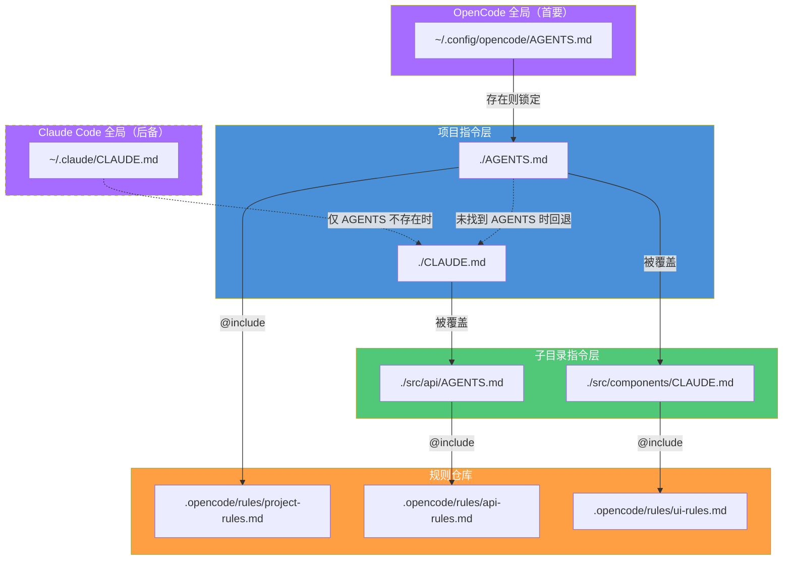

# AGENTS.md 约定系统

> 如果说 AGENTS.md 是项目的"宪法"，CLAUDE.md 就是用户的"行政令"。一个定义根本规则，一个下达具体指令，两者配合构成完整的指令覆盖体系。**在 OpenCode 中，AGENTS.md 是首要指令文件，CLAUDE.md 作为向后兼容的后备方案。**
> **适合读者**: 所有读者

## 文章概述

在 AI 编程工作流中，指令的来源是分层的。AGENTS.md 是 OpenCode 的**首要指令文件**，定义了项目的根本规则和架构决策——它是编写者视角的约束。CLAUDE.md 则代表了使用者的直接指令——用户告诉 **Agent（智能体）** "当前这个任务，我希望你这样做"——同时在 OpenCode 中作为 AGENTS.md 不存在时的后备方案。两者的核心区别：AGENTS.md 是写给所有 Agent 的通用规范，CLAUDE.md 是针对当前项目和任务的特定指令。

本文首先阐述 AGENTS.md 作为项目约定系统的核心角色——架构级约束、编码规范、项目结构的统一载体。然后对比 AGENTS.md 与 CLAUDE.md 的职责划分：AGENTS.md 负责"不变的东西"，CLAUDE.md 负责"今天要这么干的东西"。接着介绍指令覆盖策略的四层结构：**OpenCode 全局 AGENTS.md（首要）→ Claude Code 全局 CLAUDE.md（后备）→ 项目根指令文件（AGENTS.md 优先）→ 子目录 @include**。最后深入 `@include` 指令系统——文件包含、指令嵌套、优先级和合并规则，并给出团队级指令管理的最佳实践。读完本文，你将能够正确划分 AGENTS.md 与 CLAUDE.md 的职责、配置多层指令覆盖策略并管理团队级指令。

> **⏱ 时间有限？先读这些：** AGENTS.md vs CLAUDE.md → 四层覆盖策略 → @include 指令 → 最佳实践

## 内容要点

1. **AGENTS.md 的作用** — 项目级约定系统的核心：定义项目的根本规则、架构决策和编码规范。CLAUDE.md 作为补充载体：代表用户的直接指令。**在 OpenCode 中，AGENTS.md 是首要指令文件，CLAUDE.md 作为兼容后备方案。** 两者的关系：AGENTS.md = 项目的"宪法"（架构规则、编码规范）、CLAUDE.md = 用户的"行政令"（具体怎么做、偏好什么工具）。

2. **指令覆盖策略** — 四层覆盖结构：**OpenCode 全局指令（`~/.config/opencode/AGENTS.md`）→ Claude Code 全局后备（`~/.claude/CLAUDE.md`）→ 项目指令（项目根目录，先找 `AGENTS.md`，未找到则找 `CLAUDE.md`）→ 子目录指令（`@include` 引入，目录级特定）**。每层的覆盖优先级和合并规则。

3. **@include 指令系统** — 包含外部文件的语法（`@include path/to/file.md`），指令嵌套（被包含的文件自身也可以 `@include`），指令的优先级和合并规则（就近优先、显式覆盖隐式、后加载覆盖先加载）。指令冲突检测和解决方案。

4. **最佳实践** — 什么内容放在 AGENTS.md 还是 CLAUDE.md（用 AGENTS.md 定规则，用 CLAUDE.md 给指令）。团队级指令管理的建议（统一模板、定期审查、变更记录）。开发流程中的指令更新策略（任务开始前检查和更新指令文件）。

## AGENTS.md 的定位：项目级约定系统的核心

AGENTS.md 是 OpenCode 指令体系的**第一公民**。它是一个项目管理工具——让团队用一份文件锁定所有 Agent 的行为基线，而不是让每次对话从零开始协商规则。

把它想象成开源项目的 CONTRIBUTING.md：新人来了先读这个，理解项目的规则、架构和约定。AGENTS.md 做的事类似，但它是写给 AI Agent 的。

### OpenCode 中的实际加载机制

OpenCode 的指令加载遵循 **AGENTS.md 优先，CLAUDE.md 后备**的原则。源代码（`packages/opencode/src/session/instruction.ts`）的加载逻辑如下：

```typescript:packages/opencode/src/session/instruction.ts
const FILES = [
  "AGENTS.md",
  ...(FLAG ? [] : ["CLAUDE.md"]),
  "CONTEXT.md",   // 已弃用
]
```

在每一层目录中，**第一个匹配的文件胜出**。如果 `AGENTS.md` 存在，`CLAUDE.md` 就被完全忽略。此外，CLAUDE.md 可通过环境变量 `OPENCODE_DISABLE_CLAUDE_CODE_PROMPT=true` 完全禁用。

### 与 CLAUDE.md 的分工

| 维度 | AGENTS.md | CLAUDE.md |
|------|-----------|-----------|
| 作者 | 项目维护者 / 架构师 | 当前使用者 / 开发者 |
| 生命周期 | 项目整个生命周期 | 当前任务或会话 |
| 变更频率 | 低（架构变更时才改） | 高（每次任务可能改） |
| 作用范围 | 所有 Agent 和所有会话 | 当前会话，可被子目录覆盖 |
| 典型内容 | 编码规范、架构约束、项目结构 | 当前任务目标、临时策略、工具偏好 |
| 可否被覆盖 | 不能被覆盖（但支持扩展） | 可被更具体的指令覆盖 |
| **OpenCode 加载优先级** | **首要（存在即胜出）** | **后备（仅 AGENTS.md 缺失时加载）** |

**原则**：AGENTS.md 写"不变的东西"，CLAUDE.md 写"今天要这么干的东西"。如果你发现总是在改 AGENTS.md，说明那是 CLAUDE.md 的工作。

**OpenCode 实践建议**：在新项目中始终使用 `AGENTS.md` 作为主要的指令文件。仅有当项目需要与 Claude Code 共享指令时，才同时维护 `CLAUDE.md`（此时 `AGENTS.md` 写架构基线，`CLAUDE.md` 写任务级指令）。纯 OpenCode 项目无需创建 `CLAUDE.md`。

## 指令覆盖策略详解

指令覆盖分四层，从上到下优先级递增。OpenCode 在每层目录中**优先查找 `AGENTS.md`，未找到时才回退到 `CLAUDE.md`**。

### 第一层：OpenCode 全局指令（首要）

`~/.config/opencode/AGENTS.md` 放在用户配置目录，对当前用户的所有 OpenCode 项目生效。适合放**个人编码习惯**，比如：

```markdown:AGENTS.md
# ~/.config/opencode/AGENTS.md

## 通用偏好
- 使用 pnpm 而非 npm
- 测试框架使用 Vitest
- 代码风格：单引号、无分号、缩进 2 空格
- 生成 TypeScript 代码时始终显式标注类型
- 优先使用函数组件 + hooks，避免 class 组件

## 安全默认
- 编辑 .env 文件前必须询问
- 不自动执行 deploy/ 目录下的脚本
- 全局禁止 rm -rf /

## 全局忽略
- 不扫描 node_modules/
- 不扫描 .git/
```

### 第一层后备：Claude Code 全局指令（向后兼容）

如果 `~/.config/opencode/AGENTS.md` 不存在，OpenCode 会尝试读取 `~/.claude/CLAUDE.md`（Claude Code 的全局指令文件）。这是为了保证 Claude Code 迁移用户的配置兼容：

```markdown:CLAUDE.md
# ~/.claude/CLAUDE.md

## 通用偏好
- 使用 pnpm 而非 npm
- 测试框架使用 Vitest
- 代码风格：单引号、无分号、缩进 2 空格
- 生成 TypeScript 代码时始终显式标注类型
- 优先使用函数组件 + hooks，避免 class 组件

## 安全默认
- 编辑 .env 文件前必须询问
- 不自动执行 deploy/ 目录下的脚本
- 全局禁止 rm -rf /

## 全局忽略
- 不扫描 node_modules/
- 不扫描 .git/
```

### 第二层：项目指令

项目根目录的指令文件，只对这个项目生效。**OpenCode 优先读取 `AGENTS.md`，若无才读取 `CLAUDE.md`。** 适合放**团队约定**和**项目特定策略**：

> **选型建议**：纯 OpenCode 项目用 `AGENTS.md`；与 Claude Code 双工具协作的项目用 `CLAUDE.md`（或在 `AGENTS.md` 中 `@include` 引用 `CLAUDE.md` 内容）。

```markdown:.opencode/rules/project-rules.md
# 项目指令

## 技术栈
- 前端：React 18 + Next.js 14 + TypeScript
- 后端：Fastify + Prisma + PostgreSQL
- 测试：Vitest + Playwright

## 编码规范
- API 路由统一用 `src/app/api/` 目录结构
- 数据库查询走 Repository 模式，不直接写 SQL
- 错误处理统一使用 `AppError` 类
```

在项目根 `AGENTS.md` 中引用它：

```markdown:AGENTS.md
@include .opencode/rules/project-rules.md

## 当前任务
今天的目标：完成通知列表 API，支持分页和未读标记。
```

如果同时维护 `CLAUDE.md`，也可以在 `CLAUDE.md` 中使用同样的 `@include` 语法加载同一套规则文件。

### 第三层：子目录指令

通过 `@include` 在子目录中引入更细粒度的指令。子目录同样遵循 **AGENTS.md 优先**的查找规则。

```text:terminal
myapp/
├── AGENTS.md                 # 项目级指令（优于 CLAUDE.md 加载）
├── src/
│   ├── api/
│   │   └── AGENTS.md         # @include .opencode/rules/api-rules.md
│   ├── components/
│   │   └── AGENTS.md         # @include .opencode/rules/ui-rules.md
│   └── services/
│       └── AGENTS.md         # @include .opencode/rules/service-rules.md
└── .opencode/
    └── rules/
        ├── api-rules.md
        ├── ui-rules.md
        └── service-rules.md
```

如果需要双工具兼容，子目录也可以用 `CLAUDE.md`：

```text:terminal
└── src/
    ├── api/
    │   └── CLAUDE.md          # 双工具兼容
    └── components/
        └── CLAUDE.md          # 双工具兼容
```

### 指令覆盖架构



### 优先级与合并规则

OpenCode 的指令优先级分为**文件发现层**和**加载层**两个维度。

**文件发现优先级**（OpenCode 在每个目录中的查找顺序）：

```text:terminal
在每个目录中，优先查找 AGENTS.md：
1. AGENTS.md ← 存在即胜出，不再查找 CLAUDE.md
2. CLAUDE.md ← 仅当 AGENTS.md 不存在时
```

**加载层优先级**（各层指令文件的覆盖关系）：

```text:terminal
加载层优先级（高 → 低）：
1. 子目录指令文件（离执行点最近，先找 AGENTS.md，未找到找 CLAUDE.md）
2. 项目根指令文件（先找 AGENTS.md，未找到找 CLAUDE.md）
3. 全局 ~/.config/opencode/AGENTS.md（OpenCode 全局）
4. 全局 ~/.claude/CLAUDE.md（Claude Code 兼容后备）

合并策略：
- 重复指令：高优先级覆盖低优先级
- 同优先级：后加载覆盖先加载
- 不冲突的指令：全部合并生效
- 列表类型（如 ignore 模式）：取并集
```

> **提示**：如果需要同时使用 `AGENTS.md` 和 `CLAUDE.md`，推荐在 `AGENTS.md` 中用 `@include` 引用 `CLAUDE.md`，由 AGENTS.md 统一管理加载顺序。

### 额外的指令加载机制

除了文件系统的自动发现，OpenCode 还提供了两种额外的指令注入方式。

**`opencode.json` 中的 `instructions` 字段**：

```json:opencode.json
{
  "$schema": "https://opencode.ai/config.json",
  "instructions": [
    "CONTRIBUTING.md",
    "docs/guidelines.md",
    ".cursor/rules/*.md"
  ]
}
```

`instructions` 数组支持文件路径、glob 模式和远程 URL。这些指令会**追加**到系统提示词中，优先级低于项目根指令文件。

**远程 URL 指令**：

```json:opencode.json
{
  "instructions": [
    "https://team.example.com/rules/base-instructions.md"
  ]
}
```

远程指令通过 HTTP 获取（5 秒超时），适合团队统一管理指令模板。

### `@include` vs `instructions` 选择指南

| 场景 | 推荐方式 | 理由 |
|------|---------|------|
| 项目根指令中引用子模块规则 | `@include` | 指令加载时可追踪，路径相对目录 |
| 需要加载 git 外的外部文件 | `instructions` 数组 | 支持 glob 和 URL |
| 团队级统一指令 | `instructions` + URL | 修改一处，全局生效 |
| 子目录级特定规则 | `@include`（在子目录 AGENTS.md 中） | 就近加载，职责清晰 |

### 文件格式对比：选择合适的指令文件

OpenCode 支持多种指令文件格式，各有不同的优先级和使用场景：

| 文件 / 方式 | 优先级 | 作用范围 | 加载方式 | 适用场景 |
|------------|--------|---------|---------|---------|
| **AGENTS.md** | **最高** | 目录级（全局/项目/子目录） | 自动发现，存在即加载 | OpenCode 项目首选指令文件 |
| **CLAUDE.md** | 中（后备） | 目录级（全局/项目/子目录） | 自动发现，仅 AGENTS.md 缺失时加载 | Claude Code 兼容 / 双工具项目 |
| **CONTEXT.md** | 低（已弃用） | 目录级 | 自动发现，最后检查 | 遗留项目迁移过渡 |
| **`instructions` 字段** | 低（追加） | 项目级 | 显式配置在 opencode.json 中 | 加载 git 外文件 / 远程 URL |
| **`@include` 指令** | 受包含者优先级影响 | 被包含文件所在目录 | 在指令文件中显式引用 | 模块化规则拆分 / 复用 |

> **选型原则**：优先使用 `AGENTS.md`。仅在需要兼容 Claude Code 时才添加 `CLAUDE.md`。`CONTEXT.md` 已弃用，新项目不应创建。`instructions` 字段适合加载无法放在项目目录中的外部规则。

## @include 指令系统

`@include` 是把一个文件的内容"嵌入"到当前位置的机制。它让你把指令拆成可管理的模块，而不是把所有东西塞进一个文件。

### 语法

```text:terminal
@include path/to/file.md
```

路径可以是相对路径（相对于当前指令文件所在目录）或绝对路径。

### 嵌套规则

被 include 的文件自身也可以 `@include` 其他文件。当前嵌套深度限制为 **5 级**，防止循环引用或失控嵌套。

```markdown:AGENTS.md
# 一级：AGENTS.md
@include .opencode/rules/base.md

# 二级：.opencode/rules/base.md
@include .opencode/rules/security.md

# 三级：.opencode/rules/security.md
@include .opencode/rules/secrets.md

# ...最多 5 级
```

### 优先级与合并

```json:opencode.json
{
  "instruction_overlay": {
    "max_include_depth": 5,
    "merge_strategy": "deep_merge",
    "conflict_resolution": "higher_priority_wins",
    "include_resolution": {
      "relative": "from_current_file_dir",
      "missing_file_behavior": "warn_and_skip",
      "circular_detection": "error_and_stop"
    }
  }
}
```

### 错误处理

| 场景 | 行为 | 示例 |
|------|------|------|
| Include 的文件不存在 | 弹出警告，跳过该指令 | `@include missing.md` → Warning: file not found |
| 循环引用 | 检测到循环，停止加载 | A include B, B include A → Error: circular reference |
| 嵌套超限 | 超过 5 级时停止深入 | 第 6 级被忽略 |
| 路径格式错误 | 解析失败时跳过 | `@include` 后路径为空 → 忽略此行 |

## 最佳实践

### 什么放哪：一张表说清楚

| 内容类型 | 应该放哪 | 理由 |
|---------|---------|------|
| 项目技术栈、架构约定 | AGENTS.md | 所有 Agent 都需要知道，且不常变 |
| 编码规范、lint 配置 | AGENTS.md | 属于项目质量基线 |
| 当前 Sprint 目标 | AGENTS.md（或 `@include` 引用） | 每个 Sprint 都在变。如果同时维护 CLAUDE.md，放后者 |
| 个人编辑器偏好 | `~/.config/opencode/AGENTS.md`（首要）或 `~/.claude/CLAUDE.md`（兼容） | 跟项目无关，跟使用者有关 |
| 子模块特定规则 | 子目录 AGENTS.md + `@include` | 只对指定目录生效 |
| 团队统一指令 | `opencode.json` 的 `instructions` 字段 + URL | 修改一处，全局生效 |
| 安全策略（禁止命令） | AGENTS.md + `opencode.json` 权限双重保险 | AGENTS.md 做指令覆盖，配置文件做权限硬约束 |
| 临时调试策略 | AGENTS.md（任务结束后删除对应段落） | 用完即弃，别污染长期指令 |

### 团队级指令管理

如果你的团队有 10 个人，你不能让每个人各写各的指令文件。你需要一个指令模板仓库：

```text:terminal
team-rules/
├── base/
│   ├── AGENTS.md.template
│   ├── CLAUDE.md.template
│   └── .opencode/
│       └── rules/
│           ├── security-policy.md
│           ├── testing-standards.md
│           └── deployment-guidelines.md
├── projects/
│   ├── frontend-app/
│   │   └── AGENTS.md
│   └── backend-api/
│       └── AGENTS.md
└── scripts/
    └── init-rules.sh
```

新项目快速初始化：

```bash:terminal
#!/bin/bash
# scripts/init-rules.sh
PROJECT=$1
cp team-rules/base/AGENTS.md.template "$PROJECT/AGENTS.md"
cp team-rules/base/CLAUDE.md.template "$PROJECT/CLAUDE.md"
mkdir -p "$PROJECT/.opencode/rules"
cp team-rules/base/.opencode/rules/* "$PROJECT/.opencode/rules/"
echo "Team rules initialized for $PROJECT"
```

### 典型工作流

```text:terminal
1. Sprint 开始
   → 更新项目根 AGENTS.md：写入当前 Sprint 目标
   → Team lead 确认安全策略是否有调整
   → 如果同时使用 CLAUDE.md，同步更新后者

2. 开发者开始任务
   → 检查项目根 AGENTS.md（或 CLAUDE.md）
   → 如果任务只涉及某个子模块，在该模块目录下创建临时指令文件（AGENTS.md 或 CLAUDE.md 均可）
   → 在临时指令文件中用 @include 引入相关规则

3. 任务完成
   → 删除临时指令文件（如果创建了的话）
   → 将有用的经验记录写入 .opencode/rules/ 下

4. Sprint 结束
   → 清理 AGENTS.md 中的 Sprint 目标
   → 审查 @include 引用的规则文件是否需要更新
   → 把常用模式提炼到 team-rules 仓库
```

### 常见陷阱

1. **把个人偏好写进 AGENTS.md** — 改 AGENTS.md 要 PR 审核，但个人偏好（比如用 pnpm 还是 yarn）今天就可能变。个人偏放入 `~/.config/opencode/AGENTS.md`（OpenCode）或 `~/.claude/CLAUDE.md`（Claude Code 兼容）。

2. **`@include` 路径写错** — 路径是相对于当前指令文件所在目录，不是相对于项目根。用绝对路径可以减少混淆，但降低可移植性。

3. **指令冲突不知道谁赢了** — 在指令文件开头加一句注释说明当前生效的覆盖栈。或者检查运行时日志——系统会在启动时打印指令加载顺序。

4. **忘记清理过期指令** — Sprint 结束或任务完成后清理临时指令文件和过期 `@include`。

### 完整示例

项目根 `AGENTS.md`：

```markdown:AGENTS.md
@include .opencode/rules/project-rules.md
@include .opencode/rules/security-policy.md

## 当前 Sprint (Sprint 24)
目标：完成用户通知系统
期限：2026-06-15

## 开发偏好
- 通知优先使用 WebSocket 推送，fallback 到 polling
- UI 组件放在 src/features/notifications/components/
- API 文档用 Swagger 生成，不手写

## 当前任务
今日：实现 GET /api/notifications 接口
- 分页：cursor-based，每页 20 条
- 返回字段：id, type, title, body, isRead, createdAt
- 认证：需要 Bearer token
```

如果同时需要兼容 Claude Code，可在同目录下保留 `CLAUDE.md`，内容格式与此相同，或使用 `@include` 引用 AGENTS.md。

## 常见反模式

### AGENTS.md 变成万能文档

**现象**：在 AGENTS.md 中包含了所有内容——项目架构、编码规范、安全策略、当前 Sprint 目标、个人偏好、调试信息——一个文件几千行。

**原因**：认为"一份文件解决所有问题"最方便。

**对策**：AGENTS.md 应当只包含"不变的东西"——架构约束、核心规范、项目结构。当前 Sprint 目标写在独立的 Sprint 文件中通过 `@include` 引入。个人偏放入全局 AGENTS.md。安全策略单独一个文件。AGENTS.md 超过 200 行时就应该开始拆分了。

### CLAUDE.md 被当作 AGENTS.md 的替代品

**现象**：在 OpenCode 项目中只维护 CLAUDE.md 不维护 AGENTS.md，认为"两者效果一样"。

**原因**：习惯了 Claude Code 的命名方式，或者从 Claude Code 迁移过来没改。

**对策**：OpenCode 中 AGENTS.md 是首要指令文件（存在即胜出），CLAUDE.md 是后备方案。纯 OpenCode 项目应始终使用 AGENTS.md。只有需要双工具兼容时才同时维护 CLAUDE.md。

### 指令文件从不清理

**现象**：项目运行了 6 个月，AGENTS.md 中还有 Sprint 1 的目标、已经废弃的编码规范、三个月前的临时策略。

**原因**：认为"加总比删安全"，或者"反正 Agent 知道哪些是过时的"。

**对策**：Agent 没有能力判断指令是否过时——它会忠实地执行所有指令。每 Sprint 结束时清理 Sprint 目标。已废弃的编码规范或策略必须从 AGENTS.md 中移除，不能仅标注"已废弃"。

## 常见错误与陷阱

### @include 路径写错导致加载失败

**场景**：在子目录的 AGENTS.md 中使用 `@include ../rules/api-rules.md`，但路径相对于当前文件目录计算，结果指向了错误的位置。

**后果**：指令文件加载失败，Agent 无法访问子目录特有的规则。

**预防**：`@include` 路径始终相对于当前指令文件所在的目录。先在终端用 `realpath` 确认路径正确性。嵌套 include 时每层都要确认路径准确性。

### 指令覆盖优先级理解错误

**场景**：在项目根 AGENTS.md 中设置了"禁止使用 rm"，但在子目录的 AGENTS.md 中又设了"允许使用 rm"。

**后果**：子目录的指令优先级更高（子目录 > 项目根），禁止 rm 的规则被意外覆盖。

**预防**：安全策略等全局规则不应放在子目录指令中，也不允许被子目录覆盖。在 AGENTS.md 中使用 `override: never` 标记不可覆盖的规则。安全策略同时在 opencode.json 的 permission 中配置，做到双重保障。

### 远程指令 URL 失效

**场景**：`opencode.json` 的 `instructions` 字段配置了远程 URL 指向团队指令仓库，但 URL 变更后没有更新。

**后果**：Agent 加载了 404 页面内容作为指令，或者指令完全缺失。

**预防**：远程指令至少配置一个本地后备文件。URL 变更时通过 CI/CD 检查更新。在 OpenCode 启动日志中检查远程指令的加载状态。

## 适用场景与限制

### AGENTS.md 的最佳场景

- 所有 OpenCode 项目——无论大小，都应该至少有一个项目根 AGENTS.md
- 多人团队需要统一 Agent 行为基线的场景
- 需要将项目知识（架构、规范、决策记录）通过指令传递给 Agent

### AGENTS.md 的局限

- **不是运行时代码**：AGENTS.md 中的指令是提示词，不是代码。Agent 可能会"忘记"或"忽略"某些指令，尤其是长文件中的后半部分
- **无自动验证**：指令语法错误、逻辑矛盾不会报错，Agent 只会"尽力而为"
- **指令冲突时的行为不确定**：虽然有优先级规则，但在边界情况下 Agent 如何处理冲突指令不完全可预测

### 什么时候不需要 AGENTS.md

一次性的探索性任务、或 Agent 只需要完成一个非常明确的具体操作（如"帮我格式化这个文件"）时，临时提示词就够了。

## 关联章节

- ← [约束系统解析](../02-core-concepts/constraints-system.md)（AGENTS.md 定义项目级约束）
- → [安全总览](security-overview.md)（安全指令覆盖策略）
- → [工作流实战](../04-workflows/)（指令对不同工作流的影响）

## 验证标准

完成本章学习后，请确认你能够：

- [ ] 用一句话说明 AGENTS.md 和 CLAUDE.md 的核心区别
- [ ] 配置全局、项目、子目录三层指令覆盖结构
- [ ] 使用 `@include` 在 AGENTS.md 中引入外部指令文件
- [ ] 说明指令覆盖的优先级排序（子目录 > 项目 > 全局）
- [ ] 为团队设计一套指令模板仓库结构
- [ ] 说出至少 3 个指令文件使用的常见陷阱
- [ ] 给一个正在进行的 Sprint 编写项目级 AGENTS.md
