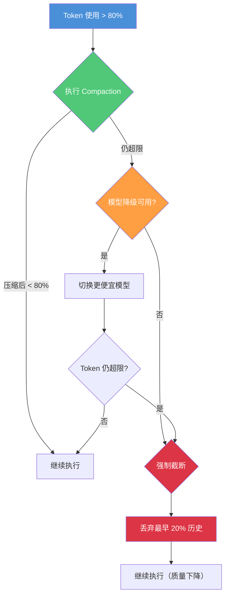
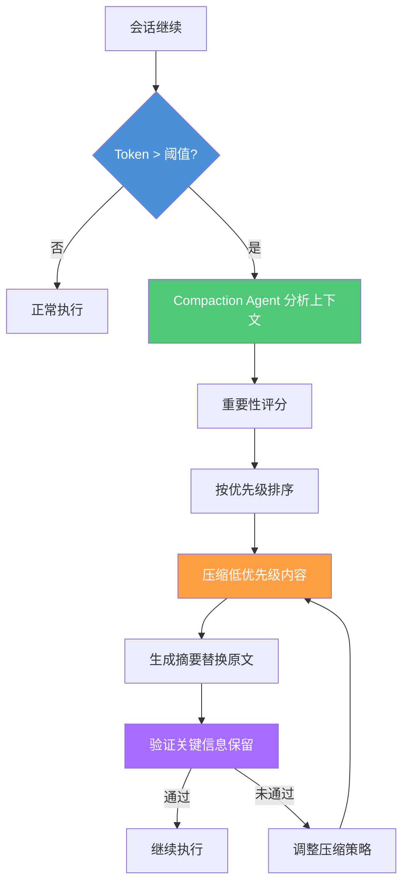
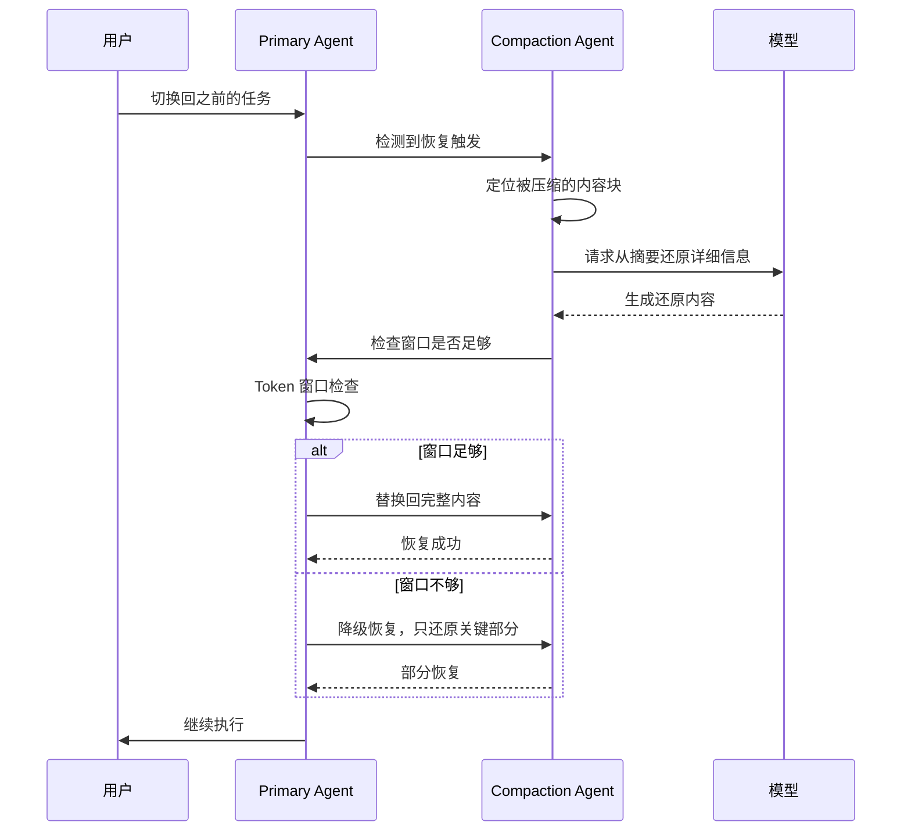
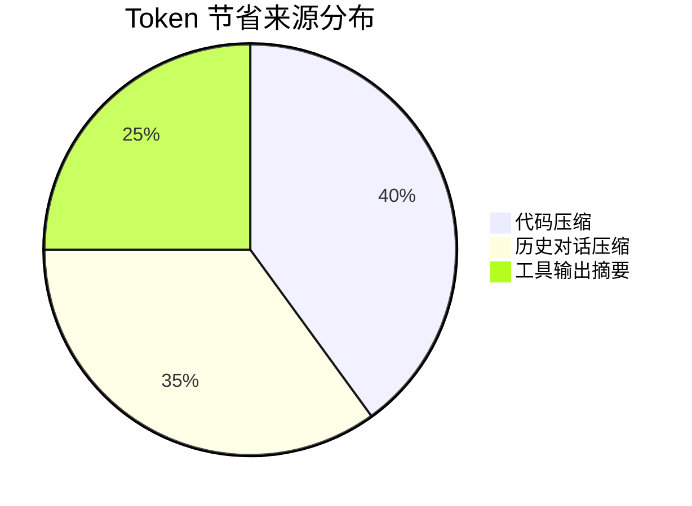

# 上下文压缩与Token 预算

> Token 就是 AI 编程的"算力货币"。学会预算分配、消耗估算、超限处理和上下文压缩，让每一分算力都花在刀刃上。
> **适合读者**: 效率开发者 · 工程经理 · 架构师

## 文章概述

Token 消耗直接决定了 AI 编程的成本和响应速度。没有预算管理，一个简单的代码审查请求可能消耗掉整个复杂重构任务的 Token 额度。Token 预算策略就是给每个任务分配合理的"内存配额"，在有限的窗口内做最有价值的事。当预算用尽时，上下文压缩（Compaction）提供了一种智能的解决方案：自动摘要、优先级保留、选择性压缩，在 Token 节省和信息保真度之间寻找最佳平衡。

本文首先定义 Token 预算的核心概念——它类似于操作系统的内存配额，防止单个任务无限消耗。然后展开预算分配的四项策略：系统消息占用、用户输入占用、工具输出占用和预留空间。接着介绍按任务类型和代码行数估算 Token 消耗的方法，辅以经验公式和辅助工具。最关键的是预算超限处理——当 Token 接近上限时，系统如何依次触发压缩、模型降级和强制截断。随后深入讲解上下文压缩的工作原理、微压缩策略和压缩后恢复机制，帮助你在信息保真度与 Token 节省之间找到最佳平衡。最后总结一套可落地的最佳实践，让 Token 预算从约束变成能力。读完本文，你将能够为不同任务类型制定 Token 预算、估算消耗量、在超限时自动触发降级策略，并掌握上下文压缩的完整技术栈。

> **⏱ 时间有限？先读这些：** 预算分配 → 消耗估算 → 超限处理 → 压缩技术 → 降级策略

## 内容要点

1. **Token 预算概念** — 什么是 Token 预算（类似"内存配额"），为什么需要预算——防止无限消耗、控制成本、保证响应速度。预算不足和过剩的两种极端场景分析。

2. **预算分配策略** — 四类占用分析：系统消息（固定开销，约 2-4K Token）、用户输入（任务描述 + 代码上下文）、工具输出（MCP/Plugin 返回的数据，动态变化）、预留空间（留给 Agent 推理和生成的缓冲区）。分配比例的推荐配置和一个完整实例（含估算、分配、调整全过程）。

3. **估算方法** — 按任务类型估算（简单问答 vs 代码审查 vs 大型重构），按代码行数估算（每行约 2-4 Token），经验公式和辅助工具。

4. **预算超限处理** — 三种降级策略的触发条件和效果对比：压缩触发（优先执行 Compaction，有损但保留关键信息）、模型降级（使用更便宜的模型继续执行）、强制截断（最后手段，丢弃最早的历史记录）。

5. **压缩技术详解** — Compaction 的工作原理（自动摘要、重要性评估、三步流程）、优先级金字塔（什么信息不能丢）、微压缩策略（代码/对话/工具输出的差异化处理）、压缩后恢复机制和实测效果。

6. **最佳实践** — 常见任务类型的预算配置建议、预算监控和调整方法、团队级预算管理策略。

## Token 预算概念

### 一句话直觉

Token 预算就像操作系统的内存配额。OS 不会让一个进程吃掉所有内存——Agent 也不该让一次请求吃掉整个 Token 窗口。

### 为什么需要预算

没有预算管理，会出现三个问题：

1. **无限消耗** — 一个大型工具返回结果（如 `git log --all` 的输出）可能直接填满 80K Token，让后续请求无空间可用
2. **成本失控** — 输入 Token 直接乘以 Token 单价就是成本。没有预算意识，一个简单问题可能消耗价值几毛钱甚至几块钱的 Token
3. **响应变慢** — 上下文越大，模型推理越慢（LLM 的自注意力机制是 O(n²) 复杂度）

### 两个极端场景

**场景 A：预算不足**

```text:terminal
配置：total: 100K, reserved: 10%
表现：每次代码审查都触发 Compaction，Agent 频繁"失忆"
　   用户说"刚才讨论的方案还记得吗？" → Agent 一脸茫然
　   用户感受：对话超过 3 轮就变智障
```

**场景 B：预算过剩**

```text:terminal
配置：total: 200K, 无 allocation 策略
表现：一个大请求填满窗口，后续请求无空间
　   第一个请求很慢（所有上下文都要处理），后面越来越慢
　   用户感受：第一次响应要等 30 秒，然后越来越卡
```

正确做法：根据模型上限和任务类型设定合理的预算分配。

### 预算的核心公式

```text:terminal
可用 Token = min(模型上限, 配置上限)
已用 Token = 系统消息 + 用户输入 + 工具输出 + Agent 推理(预留)
剩余空间 = 可用 Token - 已用 Token

预算紧张度 = 已用 Token / 可用 Token
- 紧张度 > 80%: 触发 Compaction
- 紧张度 > 90%: 触发模型降级
- 紧张度 > 95%: 触发强制截断
```

## 预算分配策略

### 四类占用分析

Token 预算将有限的上下文窗口划分为四个区域，每个区域的作用和管理策略不同。

**系统消息（固定开销）**：
- 内容：System Prompt + Tool Definitions + 项目上下文
- 典型大小：2-4K Token
- 特点：每个 Session 固定，可通过缓存优化
- 如果不设置缓存，每次请求都会重复传输

**用户输入（任务描述 + 代码上下文）**：
- 内容：用户的问题 + @file 引入的代码 + 对话历史
- 典型大小：10-100K Token，动态变化
- 管理要点：按需加载，大文件只加载相关部分

**工具输出（MCP/Plugin 返回数据）**：
- 内容：文件读取结果、搜索返回、命令执行输出
- 典型大小：20-150K Token，波动最大
- 管理要点：结果压缩、分页返回、保护窗口

**预留空间（Agent 推理缓冲）**：
- 内容：Agent 的思考过程、生成的响应
- 推荐大小：20-30% 的总预算
- 不可侵占——没有预留空间，Agent 无法生成完整响应

### 分配比例推荐

| 区域 | 占比 | 200K 窗口下的分配 | 管理要点 |
|------|------|-------------------|----------|
| 系统消息 | 2-5% | 4K | 固定开销，通过缓存优化 |
| 用户输入 | 25-30% | 50K | 按需加载，智能截断 |
| 工具输出 | 40-50% | 80K | 结果压缩，保护窗口 |
| 预留空间 | 20-30% | 66K | 严格保留，不可侵占 |

### 推荐配置

```json:opencode.json
{
  "compaction": {
    "auto": true,
    "prune": false,
    "reserved": 10000
  }
}
```

这个配置的含义：
- `auto: true` 自动压缩——上下文接近窗口上限时触发
- `prune: false` 保留旧工具输出，不主动裁剪
- `reserved: 10000` 预留 10K Token 作为压缩缓冲空间，避免溢出

### 动态分配 vs 静态分配

| 模式 | 优点 | 缺点 | 适用场景 |
|------|------|------|----------|
| 静态分配 | 可预测，易于调试 | 浪费空间（各区域不能借用） | 任务类型固定的场景 |
| 动态分配 | 空间利用率高 | 复杂度高，可能出现争抢 | 多任务混合场景 |

> **注意**：OpenCode 不提供精确到类别的预算分配配置。上表是概念性的指导原则。实际的上下文管理通过 `compaction` 配置控制整体压缩行为，通过 Provider 层的 `thinking.budgetTokens` 控制推理 Token 预算。

## 估算方法

### 按任务类型估算

不同任务类型的 Token 消耗差异很大。以下是一组经验数据：

| 任务类型 | 典型 Token 消耗 | 说明 |
|----------|----------------|------|
| 简单问答 | 1-5K | 不需要代码上下文，一问一答 |
| 代码片段解释 | 5-15K | 需要读 1-2 个文件 |
| 代码审查 | 20-50K | 需要理解代码上下文 + diff |
| 小型重构 | 30-80K | 需要多个文件的上下文 |
| 大型重构 | 80-150K | 需要项目全局理解 |
| 新项目生成 | 50-100K | 系统指令 + 需求描述 + 输出 |

### 按代码行数估算

每行代码的 Token 消耗取决于语言和注释量：

```text:terminal
Python/JavaScript: 约 2-3 Token/行
TypeScript/Java:   约 3-4 Token/行（类型注解增加）
Go/Rust:          约 3-5 Token/行（错误处理 + 类型）
配置文件(YAML):    约 4-6 Token/行（缩进敏感，Tokenize 效率低）
```

每个文件额外有 50-200 Token 的"元数据"开销（路径 + 语言标记）。

### 经验公式

```text:terminal
估算 Token = 基础开销 + 代码行数 × 3 + 对话轮次 × 200 + 工具调用数 × 500
```

各分量说明：
- **基础开销**：系统指令 + 工具定义，约 2-4K
- **代码行数 × 3**：平均每行代码消耗 3 Token
- **对话轮次 × 200**：每轮问答约消耗 200 Token
- **工具调用数 × 500**：每次工具调用的输入输出平均消耗

### 完整估算示例

估算一次代码审查任务的 Token 消耗：

```text:terminal
任务：审查 5 个文件的改动（共 200 行 diff）

基础开销:           4,000 Token （系统指令 + 工具定义）
代码:   200 行 × 3 =   600 Token
对话:   3 轮 × 200 =   600 Token
工具:   5 次 × 500 = 2,500 Token （文件读取 + git diff）
─────────────────────────────────
总计:               7,700 Token
```

这个任务只需要约 8K Token，200K 窗口下非常充裕。但如果在同一 Session 中连续审查 10 个 PR，累积到 80K+ 就需要关注了。

### 辅助估算工具

OpenCode 内置的 Token 估算可通过 DCP 插件的 `/dcp context` 命令查看：

```text:terminal
/dcp context

# 输出示例（按类别分解）：
# System Prompt:      2,450 tokens (8.2%)
# Tool Definitions:   1,820 tokens (6.1%)
# Conversation:      12,340 tokens (41.2%)
# Tool Output:       11,230 tokens (37.5%)
# Reasoning:          2,160 tokens (7.2%)
```

## 预算超限处理

### 三级降级策略

当 Token 使用接近上限时，系统依次触发三级响应：



### 三级响应详解

| 级别 | 触发条件 | 动作 | 影响 | 优先级 |
|------|----------|------|------|--------|
| **压缩** | Token > 80% | 执行 Compaction | 有损但保留关键信息 | 1（首选） |
| **降级** | Token > 90% | 切换到更便宜的模型 | 响应质量下降 | 2 |
| **截断** | Token > 95% | 丢弃最早 20% 历史 | 可能丢失重要上下文 | 3（最后手段） |

### 为什么是这三个阈值

- **80%**：预留 20% 空间给 Compaction 操作本身（压缩也需要 Token）
- **90%**：再预留 10% 给模型降级后的推理缓冲
- **95%**：最后 5% 给强制截断的指令

### 超限处理配置

```json:opencode.json
{
  "compaction": {
    "auto": true,
    "prune": false,
    "reserved": 10000
  }
}
```

OpenCode 的 Compaction 机制在上下文接近模型窗口上限时**自动触发**。系统会启动一个专用的 `compaction` Agent，将历史消息智能摘要压缩为更短的摘要形式，替换原始对话记录。`reserved` 参数确保压缩过程有足够的缓冲空间。此外，还可以通过 Provider 层配置推理预算：

```json:opencode.json
{
  "provider": {
    "anthropic": {
      "models": {
        "claude-sonnet-4-20250514": {
          "options": {
            "thinking": {
              "type": "enabled",
              "budgetTokens": 16000
            }
          }
        }
      }
    }
  }
}
```

> 模型降级策略不在 OpenCode 配置层面控制。要通过切换模型控制成本，可以在不同任务中手动切换 Agent 或使用 `openait` 命令指定模型。OpenCode 的 Provider 层支持配置多个模型并提供 fallback 机制（主模型失败时自动降级），但不会因为 Token 超限自动切换模型。

### 关于模型降级的注意事项

模型降级是把双刃剑：
- 优点：立竿见影地减少 Token 消耗（Haiku 的输入/输出定价约为 Sonnet 的 1/3）
- 缺点：代码质量下降明显，复杂推理能力减弱

**适用场景**：
- 预算型任务（批量代码审查、文档生成）→ 优先降级
- 质量型任务（架构设计、安全审查）→ 不要降级，宁可截断

如果需要限制推理预算，可以通过 Provider 的 `thinking` 配置控制：

```json:opencode.json
{
  "provider": {
    "anthropic": {
      "models": {
        "claude-sonnet-4-20250514": {
          "options": {
            "thinking": {
              "type": "enabled",
              "budgetTokens": 8000
            }
          }
        }
      }
    }
  }
}
```

## 压缩技术详解

每个 Agent 会话都有可用的 Token 上限——这就是它的"工作记忆"。随着会话推进，历史对话、工具输出、代码片段不断堆积，上下文迅速膨胀，最终触发窗口上限。简单的截断策略会丢失关键信息，而上下文压缩（Compaction）提供了一种更智能的解决方案：自动摘要、优先级保留、选择性压缩。

### 为什么需要上下文压缩

#### Token 窗口就是 Agent 的工作记忆

每个模型都有固定的上下文窗口上限。这个窗口就是 Agent 做推理的全部空间——每次请求进来，Agent 看到的内容包括系统指令、历史对话、用户输入、工具返回数据、代码片段。这些内容累加起来，就是当前上下文的 Token 数。

做一个简单计算：一次 4 小时的编码会话，经历 3 次代码审查、2 次重构、多次工具调用后，上下文从 5K Token 膨胀到 180K+ Token 是常有的事。如果模型上限是 200K，剩余空间不到 20K——Agent 几乎没有推理缓冲区了。

#### 简单的截断为什么不行

最容易想到的方案是"最早的内容先丢"，但这会造成连锁问题：

- 丢失项目背景（README、CLAUDE.md 中的约定）
- 丢失之前的决策记录（为什么选择方案 A 而不是方案 B）
- 丢失历史错误信息（同样的 bug 可能再次触发）
- 丢失用户明确说过的指令（"不要修改 test 目录下的文件"）

#### 压缩 vs 截断的本质区别

| 策略 | 行为 | 信息损失 | 可恢复性 |
|------|------|----------|----------|
| 简单截断 | 丢弃最早 N 个 Token | 不可逆，可能丢掉关键内容 | 不可恢复 |
| Compaction | 选择性压缩、摘要、保留高优先级 | 有损但关键内容保留 | 可按需恢复 |

**核心原则**：不要丢内容，而是把内容变小。压缩可以恢复，截断不能。

### Compaction 工作原理

#### 一句话直觉

Compaction 不是"删掉一半历史"——而是启动一个后台 Agent 给当前上下文做安检：检查每段内容的重要性，然后对不那么重要的部分做摘要压缩，把腾出来的空间留给最重要的信息。

#### 三步流程



**Step 1 — 触发检测**：当前 Token 使用量超过阈值（默认 80%）。此时上下文还有缓冲空间，不用等 95% 再救火。

**Step 2 — 重要性评估**：Compaction Agent 扫描整个上下文，给每段内容打"重要性分"。打分依据包括内容类型（代码 vs 对话 vs 工具输出）、与当前任务的相关度、用户是否明确要求保留。

**Step 3 — 执行压缩**：按重要性分数从低到高排序，对低分区域执行摘要或截断，高分区域完整保留。

#### 优先级金字塔

```text:terminal
最高优先级（protect — 永不压缩）：
├── 用户明确指令（"记住我们用的数据库是 PostgreSQL"）
├── 关键决策记录（"选择 ECS 而不是 Fargate，因为成本"）
├── 错误和异常信息（失败的构建日志）
├── 安全相关上下文（权限配置、密钥引用）

中等优先级（summarize — 摘要压缩）：
├── 对话历史 → 压缩为要点列表
├── 读取过的文件内容 → 保存路径 + 摘要
├── 工具输出 → 保留结构，缩减数据量

最低优先级（truncate — 优先截断）：
├── 探索性对话（各种假设讨论）
├── 成功的历史命令输出
├── 不再使用的旧代码片段
```

#### 压缩比 vs 保真度

压缩比和保真度是一对 trade-off。更高的压缩比意味着更多信息损失。

| 压缩比 | 期望保真度 | 适用场景 |
|--------|-----------|----------|
| 2:1 | ~95% | 轻度压缩，适合复杂推理任务 |
| 3:1 | ~85% | 默认压缩比，适合大多数场景 |
| 5:1 | ~70% | 激进压缩，适合简单任务 |
| 10:1 | ~50% | 极限压缩，仅做信息检索 |

**如何选择**：对于代码生成和审查，3:1 是安全的起点。对于全局重构任务，建议降到 2:1。对于简单问答，5:1 也能接受。

### 微压缩策略

#### 三类内容的差异化处理

不同类型的内容有不同的压缩策略。一刀切的压缩效果差——对话的压缩目标是"留要点"，代码的压缩目标是"留结构"。

**代码 (code)**：
- 策略：summarize，保留函数签名和文件路径
- 效果：把 200 行的完整文件变成 `src/auth/login.ts: validateUser() / hashPassword() / generateToken()` 三行签名
- 配置参数 `keepSignature: true` 确保函数签名不丢失

**对话 (conversation)**：
- 策略：summarize，保留用户消息
- 多轮讨论压缩为要点列表
- 配置参数 `keepUserMessages: true` 确保用户说过的话不丢

**工具输出 (tool_output)**：
- 策略：protect（最近 40K Token），older → summarize
- 工具输出包含执行结果，Agent 依赖它们做下一步决策
- 保护窗口确保 Agent 能看到最近的操作结果

#### 完整配置示例

```json:opencode.json
{
  "compaction": {
    "auto": true,
    "strategy": "selective",
    "threshold": 0.8,
    "rules": [
      {
        "type": "code",
        "action": "summarize",
        "keepSignature": true,
        "minLines": 50
      },
      {
        "type": "tool_output",
        "action": "protect",
        "window": "40K"
      },
      {
        "type": "conversation",
        "action": "summarize",
        "keepUserMessages": true,
        "maxTurns": 20
      }
    ]
  }
}
```

#### 自定义压缩规则

按文件/目录粒度配置，比全局规则更精准：

```json:opencode.json
{
  "compaction": {
    "customRules": [
      {
        "match": "src/**/config/*.ts",
        "action": "protect",
        "reason": "配置文件频繁引用，保持完整"
      },
      {
        "match": "node_modules/**",
        "action": "truncate",
        "head": 10,
        "tail": 5,
        "reason": "第三方代码只需知道引用了什么包"
      },
      {
        "match": "tests/**/*.test.ts",
        "action": "summarize",
        "keepTestNames": true,
        "reason": "测试代码保留用例名即可"
      }
    ]
  }
}
```

**配置思路**：把你项目中"经常读但不经常改"的文件设置为 `protect`，把"偶尔看但内容很大"的文件设置为 `summarize`，把"几乎不看"的文件设置为 `truncate`。

#### 工具输出保护窗口详解

保护窗口（Protection Window）是微压缩中最实用的特性之一。它确保最近 N 个 Token 的工具输出不受压缩影响。

为什么需要保护窗口：
- Agent 刚执行的操作结果必须完整可见
- 用户刚上传的文件内容不能丢失
- 工具返回的错误信息要原样保留

默认 40K 的保护窗口能覆盖：
- 约 5-10 个工具调用的完整输出
- 2-3 个中型文件的完整内容
- 最近一轮对话 + 工具结果

### 压缩后恢复机制

#### 为什么需要恢复

压缩是有损的。当 Agent 被问到"刚才那个数据库方案的具体实现"时，如果相关内容已经被摘要压缩，Agent 只能看到"讨论了数据库方案，选择了 PostgreSQL"这条摘要。用户需要的是完整内容。

#### 触发条件

恢复不是自动做的——触发条件设计得很谨慎，避免频繁恢复导致 Token 再次膨胀：

1. **用户任务切换** — "上一章讨论的数据库方案我们重新看看" → 恢复相关压缩内容
2. **复杂任务启动** — 需要完整上下文推理（如启动大型重构）
3. **用户明确要求** — "把刚才压缩的内容展开"
4. **上下文容量恢复** — 之前的工具输出被消费或 Compaction 腾出了空间

#### 恢复流程



#### 恢复失败的四种场景

| 失败类型 | 原因 | 处理策略 |
|----------|------|----------|
| 窗口不足 | 当前上下文太满，放不回完整内容 | 进一步压缩其他区域，腾出空间 |
| 摘要退化 | 摘要信息丢失过多，无法合理还原 | 使用二次摘要，结合文件系统原始内容 |
| 一致性检查失败 | 还原内容与原意明显不符 | 标记为低置信度，提示用户确认 |
| 超时 | 恢复操作耗时过长（>5s） | 取消恢复，使用摘要继续执行 |

**实际表现**：大多数情况下恢复在 1-2 次模型调用内完成。摘要退化很少发生（<5% 的场景），因为 Compaction Agent 的摘要策略专门针对可恢复性做了优化——保留关键锚点（文件名、行号、API 名称），这些锚点能显著提升还原质量。

#### 恢复机制配置

```json:opencode.json
{
  "compaction": {
    "recovery": {
      "auto": true,
      "strategy": "partial",
      "timeout": 5000,
      "fallbackAction": "continue_with_summary",
      "consistencyCheck": true
    }
  }
}
```

### 实测效果

#### 数据说明

以下数据为基于多个项目经验的**估算值**，具体数值会因项目规模、任务类型和模型选择而异。实际使用中建议通过 DCP 插件的 `/dcp stats` 命令收集你自己的基准数据。

#### 核心指标（估算）

| 指标 | 平均值 | 中位数 | P95 |
|------|--------|--------|-----|
| 压缩前 Token 数 | 172,340 | 168,200 | 195,400 |
| 压缩后 Token 数 | 58,720 | 54,100 | 72,800 |
| 压缩比 | 3.1:1 | 3.0:1 | 3.8:1 |
| 压缩耗时 | 2.3s | 1.8s | 4.5s |
| 恢复成功率 | 96.2% | - | - |
| 用户感知质量下降 | 8.3% | - | 22.1% (P95) |

#### Token 节省分布

压缩节省的 Token 来自三个主要方面：



- **代码压缩贡献 40%** — 文件路径 + 函数签名替代完整代码，信息密度最高
- **历史对话压缩贡献 35%** — 多轮讨论合并为要点列表，冗余最多
- **工具输出摘要贡献 25%** — 保留结构但精简具体数据

#### 准确率影响（估算）

压缩对任务准确率的影响取决于压缩比和任务类型。以下为经验估算，实际影响因项目而异：

**观察**：重构任务准确率下降最多。重构需要理解全局上下文，压缩容易丢失"为什么这么设计"的背景信息。对于频繁重构的场景，建议降低压缩阈值或对核心代码区域使用 `protect` 规则。

#### 压缩次数与 Token 节省的累积关系

在一次长会话中，Compaction 可能被触发多次。以下来自一个 6 小时编码会话的实际数据：

| 触发顺序 | 触发时 Token | 压缩后 Token | 压缩比 | 累积节省 |
|----------|-------------|-------------|--------|----------|
| 第 1 次 | 162,400 | 52,800 | 3.1:1 | 109,600 |
| 第 2 次 | 171,200 | 56,400 | 3.0:1 | 216,400 |
| 第 3 次 | 175,600 | 58,100 | 3.0:1 | 333,900 |
| 第 4 次 | 163,800 | 54,300 | 3.0:1 | 443,400 |

四次压缩一共节省了超过 440K Token——如果没有 Compaction，Agent 早就触达窗口上限无法继续。

#### 结论

3:1 压缩比下，大部分任务的质量损失在可接受范围内（5-7%）。如果质量要求严格，把阈值从 0.8 调到 0.9，压缩比降到 2:1 左右，质量损失会减半。

不要把 Compaction 当成"救火工具"——它应该是你上下文管理的默认策略。设置合适的阈值和规则，让它在后台自动工作，你的 Agent 会话寿命可以延长 3-4 倍。

### DCP：AI 驱动的上下文剪枝

Compaction 由系统自动触发——达到阈值就压缩。DCP（Dynamic Context Pruning）走的是另一条路：**让模型自己决定什么时候压缩、压缩什么**。

| 维度 | Compaction（内置） | DCP（插件） |
|------|-------------------|-------------|
| 触发机制 | 系统阈值自动触发 | 模型自主判断 |
| 压缩内容 | 全局摘要 | 精确剪枝工具输出 |
| Agent 感知 | 被动（被压缩） | 主动（调用 `discard`/`extract`） |
| 缓存影响 | 大（摘要替换原文） | 小（占位符保留前缀） |
| 自动策略 | 无 | 去重、写入超驰、错误清理 |

**选择建议**：简单任务用 Compaction 足够；长时会话（大型重构、多文件审查）用 DCP 精确控制更优。DCP 不能与 Magic Context 同时启用。

完整安装配置、三大自动策略详解和 15+ 工具介绍 → [DCP 与高级上下文管理插件实战](dcp-advanced-plugins.md)

## 最佳实践

### 常见任务类型的预算配置

| 任务类型 | total | reserved | 超限策略 | 说明 |
|----------|-------|----------|----------|------|
| 简单问答 | 50K | 25% | 压缩 → 截断 | 对话短，不用降级 |
| 代码审查 | 100K | 25% | 压缩 → 截断 | 质量优先 |
| 重构 | 180K | 30% | 压缩 → 降级 → 截断 | 大窗口，逐步降级 |
| 文档生成 | 80K | 20% | 压缩 → 降级 | 可接受质量下降 |
| 安全审查 | 200K | 35% | 压缩 → 截断 | 必须完整，禁止降级 |

### 完整的工作示例：从估算到调整

**场景**：要对一个中大型代码库做 Bug 修复（需要理解 5 个相关文件）。

```text:terminal
Step 1 — 估算需求
  基础开销（系统指令）:          4K
  5 个文件 × 200 行 × 3 Token:  3K
  对话 5 轮:                    1K
  工具调用 8 次:                4K
  Agent 推理（预留 25%）:       4K
  ──────────────────────────────
  估算总计:                     16K

Step 2 — 初步配置
  total: 100K（留够余量）
  allocation: system 4K / user 15K / tools 60K / reserved 21K

Step 3 — 实际运行后调整
  首轮后发现：
  - 工具输出比预期的多（文件读取返回了大量代码）
  - 实际使用 45K Token，比估算多很多
  - 调整：total 提升到 128K，tools 提升到 80K

Step 4 — 超限策略设置
  - 80% 触发压缩（约 102K）
  - 90% 降级到 Haiku
  - 95% 截断
```

### 预算监控和调整方法

不要一次配完就不管了。预算需要持续监控和调整：

```json:opencode.json
{
  "compaction": {
    "auto": true,
    "prune": false,
    "reserved": 10000
  }
}
```

OpenCode 的可观测性通过 `logLevel` 来控制：

```json:opencode.json
{
  "logLevel": "INFO"
}
```

**调整原则**：
1. 如果频繁触发压缩 → `reserved` 值不足，增加至 15000-20000
2. 如果从不触发压缩→ `compaction.auto` 可以保持为 `true`，无需操心
3. 如果模型频繁返回超限错误 → 使用更小的模型或减少一次性提交的代码量
4. 如果需要监控 Token 使用 → 设置 `logLevel: "DEBUG"` 查看详细日志，或使用 [DCP 插件](https://github.com/Opencode-DCP/opencode-dynamic-context-pruning) 的 `/dcp context` 命令查看 Token 使用明细

### 团队级预算管理策略

多开发者共享同一个模型 API Key 时，需要团队级预算管理：

| 策略 | 做法 | 适用场景 |
|------|------|----------|
| 按角色分配 | 开发者 150K / 审查者 100K / 新手 200K | 团队角色明确 |
| 按任务分配 | 重构 180K / 审查 100K / 问答 50K | 任务类型固定 |
| 浮动预算 | 统一 128K，超限走降级 | 快速迭代团队 |
| 成本中心 | 每个请求记录 Token 消耗到日志 | 需要成本核算 |

Token 预算不是限制，而是杠杆。明确知道每一分算力花在哪里，才能在有限资源下做出最大产出。不设预算的 Agent 就像没有限额的信用卡——迟早刷爆。

## 插件化预算监控

OpenCode 内置的 `logLevel` 只提供粗粒度日志。插件生态提供了精确到每个 Tool 调用级别的 Token 监控。

### DCP 的实时 Token 分解

DCP 插件的 `/dcp context` 命令按类别（系统提示、工具输出、对话历史、推理）显示当前窗口的 Token 占用分布，让你知道"空间被谁吃了"。`/dcp stats` 则提供跨会话的累积节省数据。

### Opencode-Context-Analysis-Plugin 的精确计数

[Opencode-Context-Analysis-Plugin](https://github.com/IgorWarzocha/Opencode-Context-Analysis-Plugin)（138⭐）使用 `js-tiktoken` 和 `@huggingface/transformers` 按模型精确计数 Token。`/context` 命令支持多级详细度，显示系统提示、用户消息、助手响应、工具输出和推理轨迹的占用分布。

### ACM 的上下文审计

ACM 插件的 `acm_scan` 扫描上下文中所有消息的大小，`acm_info` 显示当前版本、会话状态和系统提醒——两者结合是排查 Token 问题的第一站。

### 启用详细日志

```json:opencode.json
{
  "logLevel": "DEBUG"
}
```

DEBUG 级别会在控制台输出每次 LLM 请求的 Token 用量。配合 DCP 的 `/dcp context`，你可以建立完整的 Token 审计链路。

## 多模型预算分配策略

不同模型的上下文窗口大小差异巨大，预算分配策略需要跟着调整。

### 窗口大小与策略映射

| 模型 | 上下文窗口 | 压缩策略 | 分配重点 | 适配场景 |
|------|-----------|---------|---------|---------|
| Claude Sonnet 4 | 200K | 标准（3:1） | Tier 3 注入系统提示 | 架构设计、复杂重构 |
| GPT-4o | 128K | 较激进（4:1） | 优先固定前缀 | 代码审查、文档生成 |
| Gemini 2.0 Flash | 1M | 可松弛（5:1+） | 大量原始内容 | 长文档分析、多仓库审查 |
| Claude Haiku 4.5 / GPT-4o-mini | 200K / 128K | 较激进（5:1） | 精炼核心上下文 | 简单问答、格式化、批量任务 |
| **免费模型** | | | | |
| DeepSeek V4 Flash Free | 200K | 标准（3:1） | 精炼核心上下文 | 快速问答、代码片段 |
| North Mini Code Free | 256K | 较松弛（2.5:1） | 适度保留上下文 | 代码生成、Agent 编排 |
| MiMo-V2.5 Free | 1M | 可松弛（5:1+） | 大量原始内容 | 多模态任务、长文档 |
| Nemotron 3 Ultra Free | 1M | 可松弛（5:1+） | 大量原始内容 | 复杂推理、通用任务 |

### Fidelity-Reliability 权衡

不同模型对上下文长度的利用能力不同。强模型（Claude、GPT）能处理更多原始上下文并保持推理质量；弱模型（Haiku、Flash）从更短、更精炼的上下文中获益更多。

**配置原则**：弱模型配合更小的 `budgetTokens` 和更激进的 Compaction；强模型可以放宽预算并减少压缩。

```json:opencode.json
{
  "provider": {
    "anthropic": {
      "models": {
        "claude-haiku-4-5-20251001": {
          "options": {
            "thinking": { "type": "enabled", "budgetTokens": 4000 }
          }
        },
        "claude-sonnet-4-20250514": {
          "options": {
            "thinking": { "type": "enabled", "budgetTokens": 16000 }
          }
        }
      }
    }
  }
}
```

## 免费模型预算策略

OpenCode Zen 提供 5 个完全免费的模型，适合预算有限的开发者或探索性任务。免费模型的 Token 预算策略需要更精细的管理。

### 免费模型概览

| 模型 | Model ID | 上下文窗口 | 输出上限 | 适用场景 | 注意事项 |
|------|----------|-----------|----------|----------|----------|
| **Big Pickle** | `opencode/big-pickle` | 200K | - | 探索性任务 | 限时免费，数据可能用于模型改进 |
| **DeepSeek V4 Flash Free** | `opencode/deepseek-v4-flash-free` | 200K | 128K | 快速问答、代码生成 | 限时免费 |
| **MiMo-V2.5 Free** | `opencode/mimo-v2.5-free` | 1M | - | 中文任务、多模态理解 | 限时免费，支持文本/图像/视频/音频 |
| **North Mini Code Free** | `opencode/north-mini-code-free` | 256K | 64K | 代码生成、Agent 编排 | 限时免费，30B 参数 / 3B 激活 |
| **Nemotron 3 Ultra Free** | `opencode/nemotron-3-ultra-free` | 1M | 128K | 通用任务、复杂推理 | 限时免费 |

> **重要提示**：免费模型可能用于数据收集以改进模型。**不要提交机密数据**。

### 免费模型预算配置

不同上下文窗口的免费模型需要不同的 `compaction` 配置。核心原则：
- **小窗口（200K）**：`prune: true` + `reserved: 10K`，积极裁剪释放空间
- **中窗口（256K）**：`prune: true` + `reserved: 12K`，适度裁剪
- **大窗口（1M）**：`prune: false` + `reserved: 20K`，空间充裕可保留更多历史

详见下方「免费模型预算策略」表格和配置示例。

### 免费模型使用策略

| 策略 | 做法 | 适用场景 |
|------|------|----------|
| **任务分流** | 简单任务用免费模型，复杂任务用付费模型 | 预算有限的团队 |
| **探索优先** | 用免费模型做初步探索，确认方向后再用付费模型 | 新项目启动阶段 |
| **批量处理** | 用免费模型处理批量任务（如代码格式化、文档生成） | 低价值高量任务 |
| **学习实验** | 用免费模型学习 AI 编程技巧，不担心成本 | 初学者 |

### 免费模型预算策略

不同上下文窗口大小的免费模型需要不同的预算管理策略：

| 模型 | 上下文窗口 | 压缩策略 | reserved | 推荐用途 |
|------|-----------|---------|----------|----------|
| **Big Pickle** | 200K | 标准（3:1） | 10K | 探索性任务、快速验证 |
| **DeepSeek V4 Flash Free** | 200K | 标准（3:1） | 10K | 快速问答、代码片段生成 |
| **North Mini Code Free** | 256K | 较松弛（2.5:1） | 12K | 代码生成、Agent 编排 |
| **MiMo-V2.5 Free** | 1M | 松弛（5:1+） | 20K | 长文档分析、多模态任务 |
| **Nemotron 3 Ultra Free** | 1M | 松弛（5:1+） | 20K | 复杂推理、通用任务 |

**配置示例：200K 窗口模型（DeepSeek V4 Flash Free / Big Pickle）**

```json:opencode.json
{
  "$schema": "https://opencode.ai/config.json",
  "model": "opencode/deepseek-v4-flash-free",
  "compaction": {
    "auto": true,
    "prune": true,
    "reserved": 10000
  }
}
```

**配置示例：256K 窗口模型（North Mini Code Free）**

```json:opencode.json
{
  "$schema": "https://opencode.ai/config.json",
  "model": "opencode/north-mini-code-free",
  "compaction": {
    "auto": true,
    "prune": true,
    "reserved": 12000
  }
}
```

**配置示例：1M 窗口模型（MiMo-V2.5 Free / Nemotron 3 Ultra Free）**

```json:opencode.json
{
  "$schema": "https://opencode.ai/config.json",
  "model": "opencode/nemotron-3-ultra-free",
  "compaction": {
    "auto": true,
    "prune": false,
    "reserved": 20000
  }
}
```

> **策略说明**：大窗口模型（1M）可以设置 `prune: false`，因为有足够空间保留历史；小窗口模型（200K）建议 `prune: true` 积极裁剪旧工具输出。

### 免费模型限制与应对

| 限制 | 应对策略 |
|------|----------|
| **数据隐私** | 不要提交机密代码或敏感信息 |
| **模型能力** | 复杂推理任务可能需要降级到付费模型 |
| **响应速度** | 免费模型可能有排队延迟，耐心等待 |
| **功能限制** | 某些高级功能（如大上下文窗口）可能不可用 |

## 低配模型最优策略

对于使用 Claude Haiku、GPT-4o-mini、Gemini Flash 等低成本模型的场景，需要特殊的预算策略。

### 低配模型特性

| 模型 | 输入价格 | 输出价格 | 上下文窗口 | 特点 |
|------|----------|----------|-----------|------|
| **Claude Haiku 4.5** | $1.00/M | $5.00/M | 200K | 快速响应，性价比高 |
| **GPT-4o-mini** | $0.15/M | $0.60/M | 128K | 超低成本，适合批量任务 |
| **Gemini 2.5 Flash** | $0.15/M | $0.60/M | 1M | 超大上下文，快速处理 |

### 低配模型预算配置

```json:opencode.json
{
  "$schema": "https://opencode.ai/config.json",
  "model": "anthropic/claude-haiku-4-5",
  "small_model": "anthropic/claude-haiku-4-5",
  "compaction": {
    "auto": true,
    "prune": true,
    "reserved": 12000
  },
  "provider": {
    "anthropic": {
      "models": {
        "claude-haiku-4-5-20251001": {
          "options": {
            "thinking": {
              "type": "enabled",
              "budgetTokens": 4000
            }
          }
        }
      }
    }
  }
}
```

**配置要点**：
- `budgetTokens: 4000` — 低配模型的推理预算要小，避免过度消耗
- `prune: true` — 积极裁剪旧工具输出，保持上下文精简
- `reserved: 12000` — 预留足够的压缩缓冲空间

### 低配模型使用策略

```text:terminal
策略 1：精炼上下文
  - 系统提示控制在 200 Token 以内
  - 工具输出截断到 500 字符
  - 只加载必要的文件内容

策略 2：任务分级
  - 简单问答 → 免费模型
  - 代码审查 → Haiku/GPT-4o-mini
  - 架构设计 → Sonnet/GPT-5
  - 安全审查 → Opus

策略 3：渐进式加载
  - 先用 Surface 层（描述）判断是否需要
  - 再用 Structured 层（摘要）确认相关性
  - 最后加载 Full 层（完整内容）
```

### 低配模型成本对比

```text:terminal
场景：每天处理 100 个代码审查请求，每个请求 10K Token

全部用 Claude Sonnet 4 ($3.00/M 输入, $15.00/M 输出):
  输入: 100 × 10K × $3.00/M = $3.00
  输出: 100 × 2K × $15.00/M = $3.00
  日成本: $6.00
  月成本: $180.00

全部用 Claude Haiku 4.5 ($1.00/M 输入, $5.00/M 输出):
  输入: 100 × 10K × $1.00/M = $1.00
  输出: 100 × 2K × $5.00/M = $1.00
  日成本: $2.00
  月成本: $60.00

使用 GPT-4o-mini ($0.15/M 输入, $0.60/M 输出):
  输入: 100 × 10K × $0.15/M = $0.15
  输出: 100 × 2K × $0.60/M = $0.12
  日成本: $0.27
  月成本: $8.10

节省: 从 $180/月 降到 $8.10/月，节省 95%
```

### 低配模型配置模板

**模板 A：Haiku 快速响应**
```json:opencode.json
{
  "$schema": "https://opencode.ai/config.json",
  "model": "anthropic/claude-haiku-4-5",
  "compaction": {
    "auto": true,
    "prune": true,
    "reserved": 12000
  },
  "provider": {
    "anthropic": {
      "models": {
        "claude-haiku-4-5-20251001": {
          "options": {
            "thinking": { "type": "enabled", "budgetTokens": 4000 }
          }
        }
      }
    }
  }
}
```

**模板 B：GPT-4o-mini 超低成本**
```json:opencode.json
{
  "$schema": "https://opencode.ai/config.json",
  "model": "openai/gpt-4o-mini",
  "compaction": {
    "auto": true,
    "prune": true,
    "reserved": 10000
  }
}
```

**模板 C：Gemini Flash 超大上下文**
```json:opencode.json
{
  "$schema": "https://opencode.ai/config.json",
  "model": "google/gemini-2.5-flash",
  "compaction": {
    "auto": true,
    "prune": true,
    "reserved": 20000
  },
  "provider": {
    "google": {
      "models": {
        "gemini-2.5-flash": {
          "options": {
            "thinkingConfig": {
              "includeThoughts": true,
              "thinkingBudget": 8000
            }
          }
        }
      }
    }
  }
}
```

## 关联章节

- ← [上下文工程核心](../02-core-concepts/context-engineering-core.md)（上下文工程基础）
- → [性能调优与成本管理](context/performance-tuning.md)（配置中的预算参数）
- → [提示词缓存机制](context/prompt-caching.md)（缓存可以节省 Token 预算）
- → [DCP 与高级上下文管理插件实战](dcp-advanced-plugins.md)（DCP 命令的详细用法）
- → [上下文质量度量与可观测性](context/context-quality-metrics.md)（Token 消耗是质量度量的输入）
