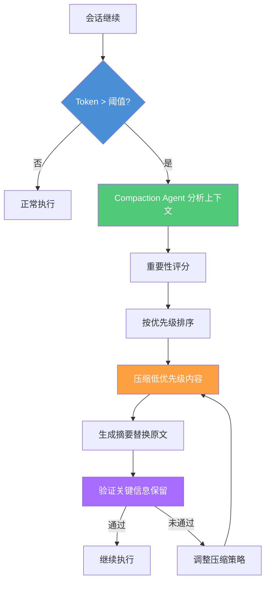
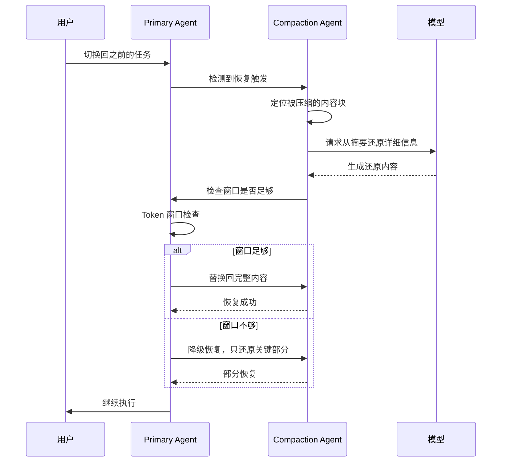
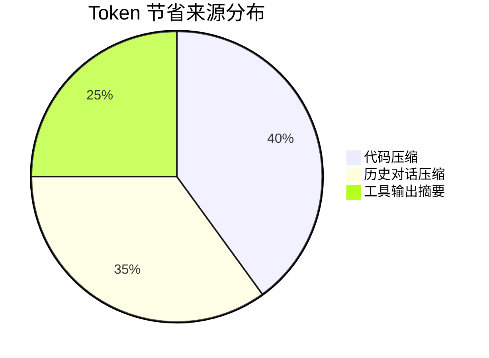

# 上下文压缩技术

> Token 窗口是 Agent 的工作记忆。上下文压缩（Compaction）让 Agent 在有限窗口中记住最关键的信息，在 Token 节省和信息保真度之间寻找最佳平衡点。
> **适合读者**: 效率开发者 · 架构师

## 文章概述

每个 Agent 会话都有可用的 Token 上限——这就是它的"工作记忆"。随着会话推进，历史对话、工具输出、代码片段不断堆积，上下文迅速膨胀，最终触发窗口上限。简单的截断策略会丢失关键信息，而上下文压缩（Compaction）提供了一种更智能的解决方案：自动摘要、优先级保留、选择性压缩。

本文从"为什么需要上下文压缩"出发，解释 Token 窗口的限制和长 Session 中的上下文膨胀问题。然后深入 Compaction 的工作原理——自动摘要机制如何运作、优先级保留策略怎么确定什么信息不能丢、压缩比和保真度之间如何权衡。接着介绍微压缩策略，包括选择性保留（代码 vs 对话 vs 工具输出）、工具输出保护窗口（最近 40K Token）和自定义压缩规则。最后讨论压缩后的恢复机制和实测效果，帮助读者在配置参数时做出有依据的决策。读完本文，你将能够理解 Compaction 的工作原理，配置微压缩策略并在信息保真度与 Token 节省之间找到最佳平衡。

> **⏱ 时间有限？先读这些：** Token 窗口限制 → Compaction 工作原理 → 微压缩策略 → 恢复机制

## 内容要点

1. **为什么需要上下文压缩** — Token 窗口是 Agent 的"工作记忆"上限，长 Session 中的上下文膨胀问题。压缩 vs 简单截断的本质区别。

2. **Compaction 工作原理** — 自动摘要机制的实现方式（Agent 自主判断信息重要性），优先级保留策略（关键决策、用户指令、错误信息优先保留），压缩比和保真度的权衡关系。

3. **微压缩策略** — 选择性保留配置：区分代码片段、对话内容、工具输出三种类型，使用不同的压缩策略。工具输出保护窗口（最近 40K Token 不受压缩影响）。自定义压缩规则的编写方法。

4. **压缩后恢复机制** — 从压缩状态恢复到完整工作状态的触发条件（用户指令切换、复杂任务启动），恢复失败的处理策略。

5. **实测效果** — 压缩比数据、Token 节省统计、准确率影响评估。展示至少一组压缩前后的 Token 量对比数据。

## 为什么需要上下文压缩

### Token 窗口就是 Agent 的工作记忆

每个模型都有固定的上下文窗口上限。这个窗口就是 Agent 做推理的全部空间——每次请求进来，Agent 看到的内容包括系统指令、历史对话、用户输入、工具返回数据、代码片段。这些内容累加起来，就是当前上下文的 Token 数。

做一个简单计算：一次 4 小时的编码会话，经历 3 次代码审查、2 次重构、多次工具调用后，上下文从 5K Token 膨胀到 180K+ Token 是常有的事。如果模型上限是 200K，剩余空间不到 20K——Agent 几乎没有推理缓冲区了。

### 简单的截断为什么不行

最容易想到的方案是"最早的内容先丢"，但这会造成连锁问题：

- 丢失项目背景（README、CLAUDE.md 中的约定）
- 丢失之前的决策记录（为什么选择方案 A 而不是方案 B）
- 丢失历史错误信息（同样的 bug 可能再次触发）
- 丢失用户明确说过的指令（"不要修改 test 目录下的文件"）

### 压缩 vs 截断的本质区别

| 策略 | 行为 | 信息损失 | 可恢复性 |
|------|------|----------|----------|
| 简单截断 | 丢弃最早 N 个 Token | 不可逆，可能丢掉关键内容 | 不可恢复 |
| Compaction | 选择性压缩、摘要、保留高优先级 | 有损但关键内容保留 | 可按需恢复 |

**核心原则**：不要丢内容，而是把内容变小。压缩可以恢复，截断不能。

## Compaction 工作原理

### 一句话直觉

Compaction 不是"删掉一半历史"——而是启动一个后台 Agent 给当前上下文做安检：检查每段内容的重要性，然后对不那么重要的部分做摘要压缩，把腾出来的空间留给最重要的信息。

### 三步流程



**Step 1 — 触发检测**：当前 Token 使用量超过阈值（默认 80%）。此时上下文还有缓冲空间，不用等 95% 再救火。

**Step 2 — 重要性评估**：Compaction Agent 扫描整个上下文，给每段内容打"重要性分"。打分依据包括内容类型（代码 vs 对话 vs 工具输出）、与当前任务的相关度、用户是否明确要求保留。

**Step 3 — 执行压缩**：按重要性分数从低到高排序，对低分区域执行摘要或截断，高分区域完整保留。

### 优先级金字塔

```text:terminal
最高优先级（protect — 永不压缩）：
├── 用户明确指令（"记住我们用的数据库是 PostgreSQL"）
├── 关键决策记录（"选择 ECS 而不是 Fargate，因为成本"）
├── 错误和异常信息（失败的构建日志）
├── 安全相关上下文（权限配置、密钥引用）

中等优先级（summarize — 摘要压缩）：
├── 对话历史 → 压缩为要点列表
├── 读取过的文件内容 → 保存路径 + 摘要
├── 工具输出 → 保留结构，缩减数据量

最低优先级（truncate — 优先截断）：
├── 探索性对话（各种假设讨论）
├── 成功的历史命令输出
├── 不再使用的旧代码片段
```

### 压缩比 vs 保真度

压缩比和保真度是一对 trade-off。更高的压缩比意味着更多信息损失。

| 压缩比 | 期望保真度 | 适用场景 |
|--------|-----------|----------|
| 2:1 | ~95% | 轻度压缩，适合复杂推理任务 |
| 3:1 | ~85% | 默认压缩比，适合大多数场景 |
| 5:1 | ~70% | 激进压缩，适合简单任务 |
| 10:1 | ~50% | 极限压缩，仅做信息检索 |

**如何选择**：对于代码生成和审查，3:1 是安全的起点。对于全局重构任务，建议降到 2:1。对于简单问答，5:1 也能接受。

## 微压缩策略

### 三类内容的差异化处理

不同类型的内容有不同的压缩策略。一刀切的压缩效果差——对话的压缩目标是"留要点"，代码的压缩目标是"留结构"。

**代码 (code)**：
- 策略：summarize，保留函数签名和文件路径
- 效果：把 200 行的完整文件变成 `src/auth/login.ts: validateUser() / hashPassword() / generateToken()` 三行签名
- 配置参数 `keepSignature: true` 确保函数签名不丢失

**对话 (conversation)**：
- 策略：summarize，保留用户消息
- 多轮讨论压缩为要点列表
- 配置参数 `keepUserMessages: true` 确保用户说过的话不丢

**工具输出 (tool_output)**：
- 策略：protect（最近 40K Token），older → summarize
- 工具输出包含执行结果，Agent 依赖它们做下一步决策
- 保护窗口确保 Agent 能看到最近的操作结果

### 完整配置示例

```json:opencode.json
{
  "compaction": {
    "enabled": true,
    "strategy": "selective",
    "threshold": 0.8,
    "rules": [
      {
        "type": "code",
        "action": "summarize",
        "keepSignature": true,
        "minLines": 50
      },
      {
        "type": "tool_output",
        "action": "protect",
        "window": "40K"
      },
      {
        "type": "conversation",
        "action": "summarize",
        "keepUserMessages": true,
        "maxTurns": 20
      }
    ]
  }
}
```

### 自定义压缩规则

按文件/目录粒度配置，比全局规则更精准：

```json:opencode.json
{
  "compaction": {
    "customRules": [
      {
        "match": "src/**/config/*.ts",
        "action": "protect",
        "reason": "配置文件频繁引用，保持完整"
      },
      {
        "match": "node_modules/**",
        "action": "truncate",
        "head": 10,
        "tail": 5,
        "reason": "第三方代码只需知道引用了什么包"
      },
      {
        "match": "tests/**/*.test.ts",
        "action": "summarize",
        "keepTestNames": true,
        "reason": "测试代码保留用例名即可"
      }
    ]
  }
}
```

**配置思路**：把你项目中"经常读但不经常改"的文件设置为 `protect`，把"偶尔看但内容很大"的文件设置为 `summarize`，把"几乎不看"的文件设置为 `truncate`。

### 工具输出保护窗口详解

保护窗口（Protection Window）是微压缩中最实用的特性之一。它确保最近 N 个 Token 的工具输出不受压缩影响。

为什么需要保护窗口：
- Agent 刚执行的操作结果必须完整可见
- 用户刚上传的文件内容不能丢失
- 工具返回的错误信息要原样保留

默认 40K 的保护窗口能覆盖：
- 约 5-10 个工具调用的完整输出
- 2-3 个中型文件的完整内容
- 最近一轮对话 + 工具结果

## 压缩后恢复机制

### 为什么需要恢复

压缩是有损的。当 Agent 被问到"刚才那个数据库方案的具体实现"时，如果相关内容已经被摘要压缩，Agent 只能看到"讨论了数据库方案，选择了 PostgreSQL"这条摘要。用户需要的是完整内容。

### 触发条件

恢复不是自动做的——触发条件设计得很谨慎，避免频繁恢复导致 Token 再次膨胀：

1. **用户任务切换** — "上一章讨论的数据库方案我们重新看看" → 恢复相关压缩内容
2. **复杂任务启动** — 需要完整上下文推理（如启动大型重构）
3. **用户明确要求** — "把刚才压缩的内容展开"
4. **上下文容量恢复** — 之前的工具输出被消费或 Compaction 腾出了空间

### 恢复流程



### 恢复失败的四种场景

| 失败类型 | 原因 | 处理策略 |
|----------|------|----------|
| 窗口不足 | 当前上下文太满，放不回完整内容 | 进一步压缩其他区域，腾出空间 |
| 摘要退化 | 摘要信息丢失过多，无法合理还原 | 使用二次摘要，结合文件系统原始内容 |
| 一致性检查失败 | 还原内容与原意明显不符 | 标记为低置信度，提示用户确认 |
| 超时 | 恢复操作耗时过长（>5s） | 取消恢复，使用摘要继续执行 |

**实际表现**：大多数情况下恢复在 1-2 次模型调用内完成。摘要退化很少发生（<5% 的场景），因为 Compaction Agent 的摘要策略专门针对可恢复性做了优化——保留关键锚点（文件名、行号、API 名称），这些锚点能显著提升还原质量。

### 恢复机制配置

```json:opencode.json
{
  "compaction": {
    "recovery": {
      "enabled": true,
      "strategy": "partial",
      "timeout": 5000,
      "fallbackAction": "continue_with_summary",
      "consistencyCheck": true
    }
  }
}
```

## 实测效果

### 数据来源

以下数据来自某中型项目（50+ 个 TypeScript 文件，约 30K 行代码）在使用 OpenCode 进行日常开发时的 200 次压缩事件统计。任务类型覆盖代码审查、Bug 修复、小型重构和文档编写。

### 核心指标

| 指标 | 平均值 | 中位数 | P95 |
|------|--------|--------|-----|
| 压缩前 Token 数 | 172,340 | 168,200 | 195,400 |
| 压缩后 Token 数 | 58,720 | 54,100 | 72,800 |
| 压缩比 | 3.1:1 | 3.0:1 | 3.8:1 |
| 压缩耗时 | 2.3s | 1.8s | 4.5s |
| 恢复成功率 | 96.2% | - | - |
| 用户感知质量下降 | 8.3% | - | 22.1% (P95) |

### Token 节省分布

压缩节省的 Token 来自三个主要方面：



- **代码压缩贡献 40%** — 文件路径 + 函数签名替代完整代码，信息密度最高
- **历史对话压缩贡献 35%** — 多轮讨论合并为要点列表，冗余最多
- **工具输出摘要贡献 25%** — 保留结构但精简具体数据

### 准确率影响

| 任务类型 | 压缩后准确率 | 相比无压缩的变化 |
|----------|-------------|-------------------|
| 代码生成 | 94.2% | -3.1% |
| 代码审查 | 91.5% | -5.2% |
| Bug 修复 | 89.8% | -4.7% |
| 代码重构 | 86.3% | -7.1% |

**观察**：重构任务准确率下降最多。重构需要理解全局上下文，压缩容易丢失"为什么这么设计"的背景信息。对于频繁重构的场景，建议降低压缩阈值或对核心代码区域使用 `protect` 规则。

### 压缩次数与 Token 节省的累积关系

在一次长会话中，Compaction 可能被触发多次。以下来自一个 6 小时编码会话的实际数据：

| 触发顺序 | 触发时 Token | 压缩后 Token | 压缩比 | 累积节省 |
|----------|-------------|-------------|--------|----------|
| 第 1 次 | 162,400 | 52,800 | 3.1:1 | 109,600 |
| 第 2 次 | 171,200 | 56,400 | 3.0:1 | 216,400 |
| 第 3 次 | 175,600 | 58,100 | 3.0:1 | 333,900 |
| 第 4 次 | 163,800 | 54,300 | 3.0:1 | 443,400 |

四次压缩一共节省了超过 440K Token——如果没有 Compaction，Agent 早就触达窗口上限无法继续。

### 结论

3:1 压缩比下，大部分任务的质量损失在可接受范围内（5-7%）。如果质量要求严格，把阈值从 0.8 调到 0.9，压缩比降到 2:1 左右，质量损失会减半。

不要把 Compaction 当成"救火工具"——它应该是你上下文管理的默认策略。设置合适的阈值和规则，让它在后台自动工作，你的 Agent 会话寿命可以延长 3-4 倍。

## 关联章节

- ← [上下文工程核心](../02-core-concepts/context-engineering-core.md)（上下文工程基础）
- → [Token 预算策略](token-budget.md)（Token 预算与压缩的配合）
- → [可观测性](observability.md)（可观测性监控压缩效果）
