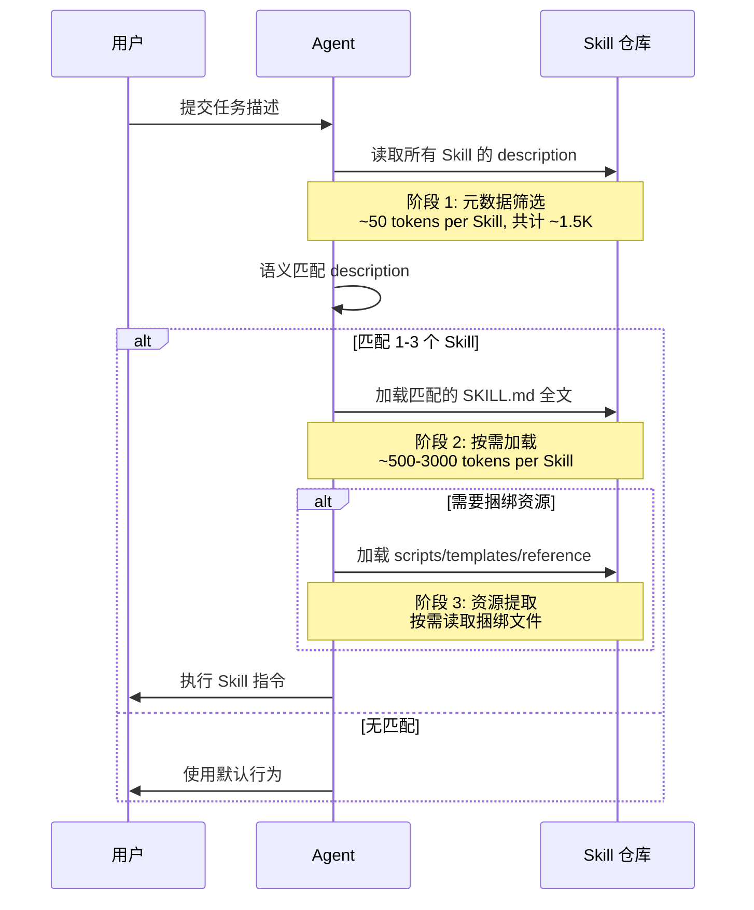
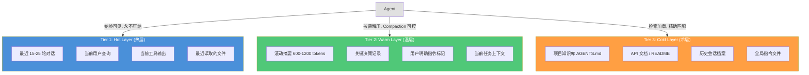
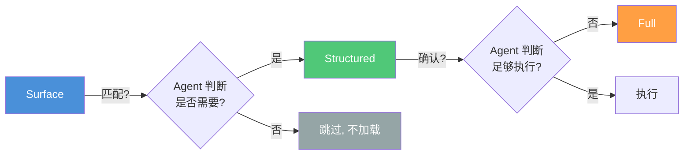
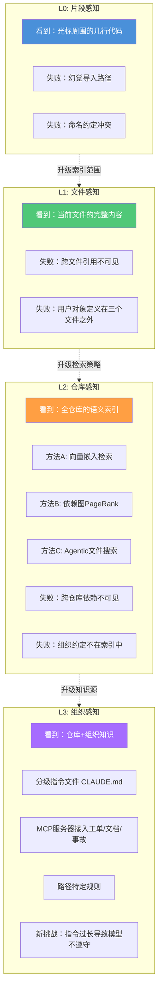

# 上下文注入与检索

> 上下文不是越多越好。选择性上下文注入教你在对的时机注入对的信息，AST感知分块让代码检索看到完整的函数和类。本文从注入策略到代码语义分块，覆盖"注入什么、怎么分块、如何检索"的完整链路。
> **适合读者**: 架构师 · 效率开发者 · **Skill（技能）** 作者

## 文章概述

在前几篇文章中，你已经了解了上下文压缩（压缩已有信息）、Token 预算（分配有限空间）和缓存机制（复用不变内容）。这些都是围绕"已有上下文怎么管"展开的。但有一个问题还没有回答：**上下文是怎么进入 Agent 的工作记忆的？**更进一步，当 Agent 需要在庞大的代码库中找到相关代码时，**怎么确保检索到的代码片段是完整的、可理解的？**

每次请求发出去，**Agent（智能体）** 看到一个巨大的上下文窗口。但这个窗口里的内容不是凭空出现的——它由多层来源组装而成：系统指令、AGENTS.md、工具定义、对话历史、文件内容、**MCP（模型上下文协议）** 返回数据。这些内容在什么时机、以什么顺序、按什么粒度注入到上下文中，直接决定了 Token 的利用效率和 Agent 的推理质量。

另一方面，代码不是散文。按字符数切割代码块，就像按页数拆掉一座桥——每个碎片都失去了结构意义。AST 感知分块让 Agent 在检索代码时看到的是完整的函数和类，而不是断成两半的片段。

本文覆盖"注入什么、怎么分块、如何检索"的完整链路。前半部分系统化三种核心注入模式：**Lazy Loading（延迟加载）**——按需加载，避免提前注入不必要的内容；**Pre-fetching（预取）**——预判下一步需求，提前加载即将使用的内容；**Hierarchical Context（分层上下文）**——按重要性和时效性分层管理，确保热数据始终可用。此外，我们还会介绍 Context Assembly Layer（CAL）的缓存感知架构、Progressive Disclosure（渐进式披露）三级设计模式，以及如何在 AGENTS.md 中设计上下文高效的指令结构。后半部分深入代码语义分块——从"为什么文本切割不适合代码"出发，分析 AST 感知分块的完整流水线，介绍 cAST 论文的定量数据，对比主流分块工具。最后引入 Context-RAG 四层频谱和 OpenCode 生态中的检索工具配置。

读完本文，你将能够系统化地设计上下文注入策略：何时延迟、何时预取、如何分层，让每一项注入的内容都有明确的理由和预期收益。同时理解代码语义分块的原理，为项目选择合适的分块工具，并配置检索层让 Agent 在代码库中找到最相关的上下文。

> **⏱ 时间有限？先读这些：** 三种注入模式对比 → 分层上下文架构 → Context Assembly Layer → Progressive Disclosure 三级设计 → AST 感知分块 → Context-RAG 频谱 → 检索工具配置

## 内容要点

1. **为什么需要选择性注入** — 全量注入的浪费测算，上下文不是越多越好，注入时机比注入内容更重要。
2. **Lazy Loading 延迟加载** — Skill 的渐进式加载机制（description 匹配 vs 完整内容加载），何时按需解压。
3. **Pre-fetching 预取** — 工作流感知的预加载策略，缓存预热模式，如何预判 Agent 下一步需要什么。
4. **Hierarchical Context 分层上下文** — 三层架构：热层(15-25 轮对话)、温层(600-1200 tokens 滚动摘要)、冷层(项目知识库)。每层的注入时机和生命周期管理。
5. **Context Assembly Layer 缓存感知架构** — 稳定前缀与动态块的分离，按来源字母序排序的确定性缓存策略。
6. **Progressive Disclosure 三级设计** — Surface/Structured/Full 三级披露模式，如何在 Skill 和 AGENTS.md 中落地。
7. **AGENTS.md 上下文效率设计** — 指令文件的层级结构如何影响注入效率，最佳实践和常见错误。
8. **代码语义分块** — 为什么文本切割不适合代码、AST 感知分块流水线、cAST 论文定量数据、工具生态对比。
9. **智能检索与 Context-RAG 频谱** — 四层频谱（片段感知到组织感知）、检索工具与 MCP 配置、完整检索管道搭建。

## 为什么需要选择性注入

### 全量注入的隐性成本

先看一组数据。在一个中等规模项目中（50+ 个 TypeScript 文件，约 30K 行代码），假设你有 30 个安装的 Skill，每个 Skill 的完整内容平均 800 tokens：

```text:terminal
全量注入的成本：
  系统指令 + 工具定义     4,000 tokens  （固定，不可避免）
  30 个 Skill 完整加载     24,000 tokens  （30 × 800，但实际只用了 1-2 个）
  AGENTS.md 全量指令       3,000 tokens  （包含当前 Sprint 不需要的旧规则）
  项目文档全量加载           8,000 tokens  （95% 在当前任务中用不上）
  ─────────────────────────────────
  浪费的 Token:              ~30,000+ tokens/请求
```

每次请求多消耗 30K Token，50 次请求就是 1.5M Token 的浪费。这不是技术限制，而是注入策略的缺失。

### 注入时机比注入内容更重要

上下文管理有三个维度：**压缩**（如何缩小已有内容）、**预算**（如何分配有限空间）、**注入**（如何决定什么内容进来）。前两个维度已经有专门的章节讨论，注入维度是第三个关键拼图。

注入的核心问题不是"放什么进去"，而是**什么时候放、放多少、以什么形式放**。同一个文件在不同时机注入，效果完全不同：

| 注入时机 | 效果 | Token 成本 |
|---------|------|-----------|
| 任务开始时全量注入 | Agent 知道全部信息，但推理空间压缩 | 高（全量加载） |
| Agent 需要时延迟注入 | 推理空间充裕，但需一次额外请求 | 中（按需加载） |
| 预判下一步需要预取 | 零等待，零浪费 | 低（精准加载） |

选择合适的注入模式，就是在准确性和效率之间找到最佳平衡点。

## 模式一：Lazy Loading（延迟加载）

Lazy Loading 是应用最广的注入模式。它的核心思想很简单：**不提前加载，等 Agent 真正需要的时候再从源加载**。这个模式在 OpenCode 中最典型的实现就是 Skill 的渐进式加载机制。

### Skill 的渐进式加载

回想一下 Skill 的加载过程。Agent 不会在每次请求时都把 30 个 Skill 的完整内容塞进上下文。它做了两阶段过滤：

**阶段 1：元数据筛选（约 50 tokens/Skill）**

Agent 只扫描每个 Skill 的 `description` 字段——一段几十到一百多字的描述。这就像浏览一本书的目录，而不是读完整本书。对于 30 个 Skill，这个阶段只消耗约 1500 tokens，而不是 24,000 tokens。

**阶段 2：按需加载（500-3000 tokens/匹配的 Skill）**

只有当 `description` 匹配当前任务时，Agent 才加载该 Skill 的完整 SKILL.md 内容。匹配上的 Skill 通常只有 1-3 个，所以第二阶段加载 500-3000 tokens，而不是 24,000 tokens。

这就是典型的 Lazy Loading——用两次请求换取 10 倍以上的 Token 节省。



### 其他场景中的 Lazy Loading

Lazy Loading 不只用于 Skill，它在上下文工程的多个层面都有体现：

| 场景 | 触发条件 | 注入内容 | Token 节省 |
|------|---------|---------|-----------|
| Skill 内容 | description 匹配 | SKILL.md 全文 | ~90% |
| 大文件内容 | Agent 调用 read 工具 | 文件指定部分/全文 | 按需 |
| MCP 查询结果 | Agent 显式调用 MCP 工具 | 工具返回数据 | ~100%（不预查询） |
| 对话历史 | Compaction 解压 | 被压缩的历史摘要 | ~60-70% |

**适用原则**：如果某个内容在当前任务中的命中概率低于 50%，就应该用 Lazy Loading。50% 的判断标准很简单——想象一下这个内容被实际引用的几率，如果不到一半，就不要提前加载。

## 模式二：Pre-fetching（预取）

Lazy Loading 解决的是"少加载"的问题，Pre-fetching 解决的是"等太久"的问题。当 Agent 可以预判下一步要做什么的时候，提前把需要的内容加载进来，让下一步的响应时间几乎为零。

### 工作流感知预取

Agent 的工作流通常有明确的阶段划分。比如 Ultrawork 模式包含 Planning → Execution → Review 三个阶段。在每个阶段结束时，系统可以预判下一阶段需要什么：

```text:terminal
Planning 阶段结束 → 预取 Execution 阶段所需：
  - 需要编辑的文件列表
  - 相关函数/模块的签名
  - 测试文件的结构

Execution 阶段结束 → 预取 Review 阶段所需：
  - 变更文件的 diff
  - lint 和 type-check 结果
  - 关联模块的接口定义
```

工作流感知预取的决策逻辑：

| 当前阶段 | 即将执行的阶段 | 预取内容 | 预估 Token 节省 |
|---------|--------------|---------|----------------|
| 需求分析 | 方案设计 | 相关模块的接口定义、数据模型 | 5-10K |
| 方案设计 | 代码实现 | 目标文件的当前内容、测试模板 | 10-30K |
| 代码实现 | 代码审查 | diff 输出、lint 配置、类型定义 | 3-8K |
| 单模块测试 | 集成测试 | 相关模块的接口契约、Mock 数据 | 5-15K |

### 缓存预热策略

Pre-fetching 的另一种常见形式是缓存预热。在 Session 启动时，系统主动加载高频使用的上下文片段，而不是等 Agent 请求时再加载：

```json:opencode.json
{
  "cache": {
    "warmup": {
      "enabled": true,
      "patterns": [
        "AGENTS.md",
        "README.md",
        ".opencode/rules/*.md"
      ],
      "maxWarmupTokens": 10000,
      "workflowAware": true,
      "predictNext": {
        "planning": ["docs/api/*.md", "src/**/*.d.ts"],
        "execution": ["src/**/current-task/**"],
        "review": ["tests/**/*.test.ts"]
      }
    }
  }
}
```

**预热 vs 预取**：预热发生在 Session 启动时，目标是建立初始上下文基线；预取发生在工作流切换时，目标是减少阶段转换的等待时间。两者本质相同——都是主动加载，但时机不同。

**何时使用 Pre-fetching**：当你能以 80% 以上的准确率预测 Agent 下一步需要的上下文时。准确率低于 80% 时，预取的浪费会超过收益。

## 模式三：Hierarchical Context（分层上下文）

Lazy Loading 和 Pre-fetching 解决的是"什么时候加载"，Hierarchical Context 解决的是"数据放在哪一层"——按重要性、时效性和访问频率将上下文分为三个层级，每层有不同的注入策略和生命周期。

### 三层架构



### Tier 1: Hot Layer（热层）

热层是 Agent 的"工作台"——Agent 随时需要访问的内容都在这里。

| 属性 | 值 |
|------|-----|
| 注入时机 | 每次请求自动注入 |
| 生命周期 | Session 生命周期 |
| 压缩策略 | 永不压缩 |
| 典型大小 | 15-40K tokens |
| 包含内容 | 最近 15-25 轮对话、当前查询、当前工具输出、最近读取的文件 |

热层的设计目标是 **零延迟访问**。Agent 在这个层里的内容就像程序员 IDE 里打开的文件标签页——随时可以切换到，不需要重新打开。

**关键配置**：热层的核心参数是"保留多少轮对话"。15 轮适用于大多数场景，复杂推理任务可提升到 25 轮。超过 25 轮后，额外的对话历史边际价值下降很快。

### Tier 2: Warm Layer（温层）

温层是 Agent 的"短期记忆"——已经从热层移出但仍有价值的内容经过摘要压缩后放在这里。

| 属性 | 值 |
|------|-----|
| 注入时机 | Compaction 触发时解压 |
| 生命周期 | 跨 Compaction 事件（通常 5-10 次触发） |
| 压缩策略 | 摘要压缩（保留结构、缩减细节） |
| 典型大小 | 600-1200 tokens |
| 包含内容 | 滚动摘要、关键决策、用户指令标记、当前任务上下文 |

温层的内容不是实时注入的。它作为一个"压缩层"——当热层满了（Token 超过 80% 阈值），Compaction Agent 将热层中的部分内容摘要压缩后放入温层。当 Agent 需要引用温层中的信息时，通过恢复机制解压到热层。

**温层与压缩的关系**：温层就是 Compaction 的输出缓存。Compaction 不是简单丢弃旧内容，而是把旧内容转化为温层摘要。这就是"信息不消失，只变小"的具体实现。

### Tier 3: Cold Layer（冷层）

冷层是 Agent 的"长期记忆"——项目知识库、指令文件、历史会话记录等不会随 Session 消失的内容。

| 属性 | 值 |
|------|-----|
| 注入时机 | 按需检索（Agent 调用工具读取） |
| 生命周期 | 项目生命周期 |
| 压缩策略 | 不主动压缩（内容已经稳定） |
| 典型大小 | 取决于项目规模 |
| 包含内容 | AGENTS.md、API 文档、README、全局指令、归档会话 |

冷层的内容不是"注入"给 Agent 的，而是 Agent "提取"的。Agent 通过 `@include`、`read` 等工具从冷层获取需要的内容。冷层的设计目标不是速度，而是**存储密度**——在有限的上下文之外存放尽可能多的信息。

### 三层协作的典型流程

```text:terminal
1. 用户提出新需求
   → 热层：注入用户查询，Agent 开始推理
   → 冷层：Agent 读取相关 AGENTS.md 和 API 文档
   → 热层：加载读取的文件内容

2. Agent 开始执行任务
   → 热层：记录对话和工具调用
   → 温层：较早的对话被 Compaction 摘要后放入温层

3. 用户回溯之前的决策
   → 热层：Agent 查询温层摘要
   → 温层：解压相关内容回到热层
   → 热层：Agent 基于完整信息继续推理

4. Session 结束
   → 温层：关键决策和指令被摘要归档
   → 冷层：归档内容写入项目记忆
```

## Context Assembly Layer（CAL）缓存感知架构

Context Assembly Layer 是 OpenCode 将多层上下文来源组装成最终请求内容的中间层。它解决的问题是：**不同来源的上下文片段，以什么顺序、什么格式组装到提示词中，才能最大化缓存命中率和推理质量？**

### 稳定前缀 + 动态块的分离

CAL 的核心设计是将上下文分为两个区域：

**稳定前缀（Stable Prefix）**：每次请求不变的内容，包括系统指令、工具定义、项目 AGENTS.md 基础规则。这些内容占据了请求的前半部分，且内容固定。稳定前缀是提示词缓存的最大受益者——只要前缀不变，模型就不需要重新计算 Attention 机制的 Key-Value 缓存，响应速度提升 2-3 倍。

**动态块（Dynamic Chunks）**：每次请求变化的内容，包括用户查询、工具输出、对话历史。这些内容放在稳定前缀之后，确保前缀的稳定性不受影响。

```text:terminal
┌──────────────────────────────────────────────────┐
│               Context Assembly                    │
├──────────────────────────────────────────────────┤
│                  稳定前缀                          │
│  ┌────────────────────────────────────────────┐   │
│  │ 系统指令 (固定)                             │   │   ← 100% 缓存命中
│  │ 工具定义 (固定)                             │   │   ← 100% 缓存命中
│  │ AGENTS.md 基础规则 (罕变)                   │   │   ← ~95% 缓存命中
│  └────────────────────────────────────────────┘   │
│                                                   │
│                  动态块 (按来源字母序)               │
│  ┌────────────────────────────────────────────┐   │
│  │ conversation.md: 最近对话历史                │   │   ← 逐次变化
│  │ current_query.md: 当前用户查询               │   │   ← 每次不同
│  │ mcp_outputs.md: MCP 返回数据                 │   │   ← 按需注入
│  └────────────────────────────────────────────┘   │
└──────────────────────────────────────────────────┘
```

### 按来源字母序排序

动态块按照内容来源的标识符进行**字母序排序**（alphabetical sorting）。这个设计看似简单，但对缓存命中率有微妙但重要的影响：

- **确定性**：相同的来源组合总是生成相同的拼接顺序，从而提高缓存命中概率
- **可预测性**：开发者可以预判 Context Assembly 的结果，更容易调试
- **增量更新**：新增一个来源时，只有该来源相关的块受影响，不影响其他块的缓存

**直觉类比**：就像 CSS 属性排序——按字母序排不一定是最"逻辑"的，但确定性带来的维护收益远大于微小的"组织成本"。

### CAL 的注入决策流程

```text:terminal
收到请求 → 识别请求类型 → 查询上下文组装策略 →
  1. 组装稳定前缀（检查 L1/L2/L3 缓存）
  2. 确定需要注入的动态块列表
  3. 对每个动态块，应用注入策略：
     - 是否在热层？→ 直接注入
     - 是否在温层？→ 检查是否需要解压
     - 是否在冷层？→ 检查是否需要检索
  4. 按字母序排序动态块
  5. 拼接稳定前缀 + 动态块
  6. 发送请求
```

## Progressive Disclosure 三级设计

Progressive Disclosure（渐进式披露）是一种信息分层策略——不是把所有信息一次性展示，而是按需逐层展示。这个理念在 UI 设计中已经非常成熟（"高级设置"默认折叠、工具提示延迟出现），在上下文注入中同样有效。

### Level 1: Surface（表层）

表层信息是所有注入模式的第一道防线。它只暴露实体的**存在和身份**，不暴露细节。

| 场景 | 表层内容 | Token 成本 |
|------|---------|-----------|
| Skill | description 字段（约 50 tokens） | 极低 |
| 文件 | 文件名 + 路径 + 文件大小 | < 10 tokens |
| 工具 | 工具名称 + 一句话描述 | 20-50 tokens |
| 指令 | 章节标题 + 一句话摘要 | 30-80 tokens |

表层信息的作用是让 Agent 知道"有什么可用"，而不是"具体是什么"。Agent 可以根据表层信息决定是否需要深入。

### Level 2: Structured（结构化层）

当 Agent 确认某个表层实体对当前任务有用时，它请求加载结构化层。结构化层提供实体的**核心骨架**，去掉具体实现细节。

| 场景 | 结构化层内容 | Token 成本 |
|------|------------|-----------|
| Skill | 工作流程步骤 + 输出规范 + 关键约束 | 200-500 tokens |
| 文件 | 函数签名列表 + 导出接口 + 类型定义 | 100-300 tokens |
| 工具 | 参数列表 + 返回值类型 + 使用约束 | 100-200 tokens |
| 指令 | 规则列表 + 配置示例 | 200-400 tokens |

结构化层是信息密度最高的层——它用较少的 Token 传递了实体的关键结构。

### Level 3: Full（完整层）

完整层提供实体的**全部细节**。只有当 Agent 需要执行具体操作时（修改代码、调用工具、参照完整文档），才加载完整层。

| 场景 | 完整层内容 | Token 成本 |
|------|-----------|-----------|
| Skill | 完整 SKILL.md + 捆绑资源 | 500-3000 tokens |
| 文件 | 完整源码 + 注释 | 500-10000+ tokens |
| 工具 | 完整 Schema + 示例 + 错误码 | 300-1000 tokens |
| 指令 | 完整指令文件 + 所有 @include 内容 | 1000-5000 tokens |

### 三级披露的协同机制

三级披露不是三个独立策略，而是一条**决策链**：



每个层级之间的跃迁都要求 Agent 做一次明确的判断——"我还需要更多信息吗？"。这种有意识的决策过程避免了"不管用不用先塞进来"的浪费模式。

### 实践案例：Skill 的三级加载

在一个实际项目中，一个名为 `backend-architect` 的完整 Skill 共 2800 tokens。使用三级披露后：

```text:terminal
Level 1 (Surface) — description, 45 tokens:
  "在创建 REST/GraphQL API 服务、设计数据库模式、实现微服务架构时使用"

Level 2 (Structured) — 流程步骤 + 输出规范, 320 tokens:
  "1. 需求分析 → 定义实体和接口
   2. 架构设计 → 分层结构和数据流
   3. 代码生成 → Repository + Service + Controller
   输出：OpenAPI 规范 + 数据库迁移脚本"

Level 3 (Full) — 完整 SKILL.md, 2800 tokens:
  [完整的角色定义、工作流程、输出规范、约束条件]

三级对比：
  只读 Surface:  45 tokens（知道有这么一个 Skill）
  读 Structured: 365 tokens（知道怎么用这个 Skill）
  读 Full:      2800 tokens（完整执行这个 Skill）
```

在大多数场景中，Agent 只需要 Structured 层就能理解如何工作。Full 层只在首次使用或遇到复杂边界情况时才需要。这就是 Progressive Disclosure 的核心价值——80% 的场景只需要 15% 的信息。

## AGENTS.md 中的上下文效率设计

AGENTS.md 是项目指令的载体，也是上下文注入模式的最佳实践场。用三层披露的思路设计 AGENTS.md，可以显著提高注入效率。

### 三区结构

```markdown:AGENTS.md
# 项目指令
@include .opencode/rules/project-basics.md

## 可执行流程（Surface — 总是注入）
- 任务入口：README.md 了解项目结构
- 编码前：检查 .opencode/rules/coding-standards.md
- 测试规则：遵循 .opencode/rules/testing.md
- 安全策略：参见 .opencode/rules/security.md

## 关键约束（Structured — 按需注入）
- 数据库：PostgreSQL，通过 Prisma 访问
- 前端：React 18 + Next.js 14
- API 风格：RESTful，统一 /api/v1 前缀

## 详细规范（Full — @include 加载）
@include .opencode/rules/coding-standards.md
@include .opencode/rules/security.md
@include .opencode/rules/api-design.md
```

这种设计的核心思路：**在 AGENTS.md 的可见部分只放必须的信息（Surface + Structured），把完整细节放到 `@include` 子文件中，按需加载。**

### 常见的反模式

| 反模式 | 问题 | 改进方案 |
|-------|------|---------|
| 把整个编码规范写在 AGENTS.md 中 | 每次请求浪费 2000+ tokens 读永远不会触发的规则 | 用 `@include` 拆分，按目录或按规则类型 |
| 在 description 里写完整流程 | 扫描 Skill 时浪费大量 Token | description 保持 50-100 字，完整流程在 SKILL.md 正文中 |
| 所有规则平铺不分级 | Agent 无法区分"必须遵守"和"仅供参考" | 用 <!-- priority: high --> 标注关键规则 |
| 同一份信息出现在多个注入点 | 重复注入，Token 浪费翻倍 | 单一权威源，其他地方用引用 |

### 上下文效率检查清单

设计 AGENTS.md 时，可以对照这个清单检查注入效率：

1. **可见指令**是否控制在一个屏幕以内（约 500-800 tokens）？如果是，很好。如果超过了，考虑把非关键指令移到 `@include` 子文件中。
2. **每条指令**是否都有明确的触发条件？如果一个规则只对特定子模块生效，应该放在子目录的 AGENTS.md 中，而不是项目根。
3. **`@include` 的深度**是否控制得当？3 级以内的嵌套是可以接受的，超过 5 级就过于复杂了。
4. **优先级标注**是否清晰？用 `<!-- priority: high/medium/low -->` 注释可以帮助 Assembly Layer 确定注入顺序。

## 综合配置示例

以下配置展示了如何将选择性注入模式整合到 OpenCode 的上下文中：

```json:opencode.json
{
  "compaction": {
    "auto": true,
    "reserved": 10000,
    "hierarchical": {
      "hotTurns": 20,
      "warmSummaryTokens": 1000,
      "coldRetrieval": true
    }
  },
  "cache": {
    "warmup": {
      "enabled": true,
      "patterns": ["AGENTS.md", "README.md"],
      "maxWarmupTokens": 10000,
      "workflowAware": true
    }
  },
  "contextAssembly": {
    "stablePrefix": ["system_instruction", "tool_definitions", "project_basics"],
    "dynamicChunks": {
      "sortOrder": "alphabetical",
      "injectOnDemand": true,
      "progressiveDisclosure": true
    }
  },
  "skillLoading": {
    "lazyLoad": true,
    "progressiveDisclosure": {
      "surface": "description_only",
      "structured": "on_match",
      "full": "on_execution"
    }
  }
}
```

这个配置组合了三种注入模式：

| 模式 | 配置项 | 效果 |
|------|-------|------|
| Lazy Loading | `skillLoading.lazyLoad: true` | Skill 内容按需加载 |
| Pre-fetching | `cache.warmup.workflowAware: true` | 工作流阶段的智能预取 |
| Hierarchical Context | `compaction.hierarchical` | 三层架构的 Token 管理 |
| Progressive Disclosure | `contextAssembly.progressiveDisclosure: true` | 三级披露的信息分层 |
| CAL | `contextAssembly.stablePrefix + dynamicChunks` | 缓存感知的上下文组装 |

## 选型指南

不同的项目场景需要不同的注入模式组合：

| 场景特征 | 推荐组合 | 理由 |
|---------|---------|------|
| 长 Session 复杂任务 | Hierarchical + Lazy Loading | 热层保证响应速度，温层保留关键信息，冷层按需检索 |
| 短 Session 高频任务 | Pre-fetching + CAL | 预热高频内容，稳定前缀最大化缓存命中 |
| Skill 密集型项目（50+ Skills） | Lazy Loading + Progressive Disclosure | 绝不可全量加载，必须三级过滤 |
| 团队协作项目 | Hierarchical + AGENTS.md 三区结构 | 项目知识分层管理，各司其职 |
| 成本敏感场景 | Lazy Loading + Pre-fetching | 减少不必要的注入，精准预判关键内容 |

## 代码语义分块

### 为什么文本切割不适合代码

#### 代码是树，不是流

大多数 **RAG（Retrieval-Augmented Generation，检索增强生成）** 系统处理代码的方式和处理新闻文章一样：按固定字符数或固定Token数切割，然后生成嵌入向量，存入向量数据库。

```text:terminal
源码 → 按字符数切割 → 生成嵌入 → 存入向量库
```

这种方式对散文有效——段落之间的语义边界是模糊的，丢失几个字的边界不会造成理解障碍。但代码的语义结构是刚性的：一个函数定义从 `def` 到 `return` 构成一个完整的语义单元，中间任何切分都会产生两个无法独立理解的碎片。

#### 四种破坏模式

**切半函数。** 一个150行的函数在500字符处被切成两段。第一段包含签名和前一半函数体，第二段只有后一半函数体。独立看第二段——不知道函数名、不知道参数名、不知道返回值。搜索"calculate total with tax"的嵌入向量完全无法匹配这个碎片。

```python:examples/bad-chunking.py
# 被切段1（前500字符）
def calculate_total(items):
    \"\"\"Calculate the total price of all items with tax.\"\"\"
    subtotal = 0
    for item in items:
        subtotal += item.price * item.qu

# 被切段2（500字符后）—— 没有签名，没有上下文
        subtotal += item.tax
    discount = apply_member_discount(subtotal)
    return discount * (1 - TAX_RATE)
```

段2中的 `items`、`TAX_RATE`、`apply_member_discount` 全都引用段1中定义的内容。嵌入模型拿段2做向量时，这些符号全是"悬空引用"。

**丢失文档注释。** Python的docstring和TypeScript的JSDoc紧跟在函数或类定义之后。如果切分点落在函数签名之后、docstring之前，就丢失了这段代码最重要的语义描述——而docstring恰恰是嵌入模型评估相关性时最依赖的信号。

**变量作用域中断。** 局部变量在段1中定义，段2中引用。段2的嵌入向量不包含那些变量声明，导致检索时上下文不完整。

**类方法脱离类上下文。** `def process_payment(self, amount)` 被从类 `PaymentService` 中分离出来。检索到的片段不知道它属于哪个类，不知道类级别的属性，也不知道它调用了哪些其他方法。

#### 核心矛盾

文本切割基于"相邻即相关"的假设。代码的语义结构是树状的——`class` 包含 `method`，`method` 包含 `block`，`block` 包含 `statement`。相邻行可能属于完全不同的作用域树；远隔50行的函数签名和函数体却属于同一个节点。文本切割不考虑这个结构，所以必然在结构边界上切碎代码。

### AST感知分块流水线

#### 一句话直觉

AST感知分块做的事很简单：把源码解析成一棵树，然后沿着树的分支找到自然边界（函数、类、方法、接口），只在边界处切割。每个生成的代码块都是一个完整的语义单元——不会把函数一分为二，不会把方法从类中剥离，不会把接口定义和它的实现注释分开。

#### 完整流水线

```mermaid
flowchart TB
    subgraph Input["输入"]
        A1["源码文件\n*.ts / *.py / *.go / ..."]
    end

    subgraph Parse["阶段1: tree-sitter解析"]
        B1["加载语言语法"]
        B2["解析为AST"]
        B3["标注节点类型\nfunction_declaration\nclass_body\nimport_statement"]
    end

    subgraph Extract["阶段2: 实体提取"]
        C1["遍历AST节点"]
        C2["提取语义实体"]
        C3["结构:\nname / type / signature\ndocstring / byteRange\nparent"]
    end

    subgraph Scope["阶段3: 作用域树"]
        D1["按字节范围排序"]
        D2["DFS扫描容器关系"]
        D3["构建嵌套作用域树\nclass > method\nfunction > closure"]
    end

    subgraph Window["阶段4: 贪婪窗口分配"]
        E1["从根节点开始"]
        E2["子节点未超上限 → 合并"]
        E3["子节点超出上限 → 递归拆分"]
        E4["相邻兄弟节点 → 合并打包"]
    end

    subgraph Context["阶段5: 上下文化"]
        F1["注入作用域链\nPaymentService > processPayment"]
        F2["注入导入表"]
        F3["注入兄弟实体签名"]
        F4["生成 contextualizedText"]
    end

    subgraph Output["输出"]
        G1["分块列表\n每块含:\ncode / contextualizedText\nscope / entities"]
    end

    Input --> Parse
    Parse --> Extract
    Extract --> Scope
    Scope --> Window
    Window --> Context
    Context --> Output

    style A1 fill:#4A90D9,color:#fff
    style B1 fill:#50C878,color:#fff
    style C1 fill:#FF9F43,color:#fff
    style D1 fill:#FF9F43,color:#fff
    style E1 fill:#FF9F43,color:#fff
    style F1 fill:#A66CFF,color:#fff
    style G1 fill:#4A90D9,color:#fff
```



#### 阶段详解

**阶段1: tree-sitter解析。** tree-sitter 是一个增量解析库，被 Neovim、Helix、Zed 等编辑器用于语法高亮。它支持几乎所有主流语言，解析结果是类型化的AST节点——每个节点有类型（`function_declaration`、`class_body`、`import_statement`）、字节范围和行号范围。

**阶段2: 实体提取。** 纯AST遍历还不够。需要从AST中提取语义实体——只关心那些"有意义"的节点：函数、方法、类、接口、类型别名、枚举、导入语句。对每个实体捕获：

- `name`：实体名称
- `type`：实体类型（function/method/class/interface/enum/import）
- `signature`：完整签名，如 `async getUser(id: string): Promise<User>`
- `docstring`：JSDoc/docstring 注释
- `byteRange` / `lineRange`：字节和行号范围
- `parent`：父实体引用（方法所属的类）

**阶段3: 作用域树构建。** 实体之间不是扁平的。方法在类内部，嵌套函数在外部函数内部。按字节范围排序后用DFS扫描，构建出作用域树的层次关系：

```text:terminal
ScopeTree: UserService > getUser
                     > createUser
                     > validateEmail
           AuthMiddleware > authenticate
                          > refreshToken
```

这个树状结构让分块时能够带上完整的"从哪里来"信息。

**阶段4: 贪婪窗口分配。** 这是cAST论文中的核心算法——从AST根节点开始，做自顶向下的递归处理：

1. 如果当前节点的子节点总大小未超过 `max_chunk_size`，合并为一个块
2. 如果子节点超过上限，递归拆分最大的子节点
3. 合并同一父节点下的相邻兄弟节点，打包成大小适中的块

拆分和合并都基于非空白字符数（non-whitespace characters）作为度量单位，比行号或Token数更稳定——不受缩进风格影响。

**阶段5: 上下文化。** 原始切片还不够。每个生成的块需要附加足够的元信息，让嵌入模型能理解它的"上下文身份"：

```text:terminal
--- 原始代码 ---
def process_payment(self, amount):

--- contextualizedText（带上下文） ---
// File: src/payments/service.py
// Scope: PaymentService.process_payment
// Imports: from db import transaction
// Sibling entities: validate_payment, refund, get_balance

def process_payment(self, amount):
```

使用 `contextualizedText` 而不是原始代码去生成嵌入向量，检索质量会显著提升。

### 定量数据：cAST 论文

CMU 研究团队在 2025 年 6 月发表的 cAST 论文（arXiv:2506.15655）是 AST感知分块的首个系统性研究。他们提出的 split-then-merge 算法在多个基准测试上取得了显著提升：

| 基准 | 指标 | 朴素分块（行数/字符） | cAST（AST分块） | 提升 |
|------|------|---------------------|-----------------|------|
| RepoEval | Recall@5 | 基线 | +4.3 百分点 | +8.7% |
| SWE-bench | Pass@1 | 基线 | +2.67 百分点 | — |
| CrossCodeEval | Recall@5 | 基线 | 一致提升 | — |

Supermemory 团队在 cAST 论文的基础上构建了 `code-chunk` 库，并采用更严格的评估方法（使用同仓库的500个干扰文件、IoU≥0.3阈值）重新测试：

| 分块策略 | Recall@5 | IoU@5 |
|----------|----------|-------|
| code-chunk（AST感知） | **70.1%** | **0.43** |
| chonkie-code（混合策略） | 49.0% | 0.38 |
| 固定大小基线 | 42.4% | 0.34 |

AST感知分块相比朴素的分块策略，Recall@5 从 49% 提升到 70.1%，相对提升 43%。IoU（Intersection over Union）从 0.38 提升到 0.43，意味着检索到的块不仅命中文件，而且命中了文件中真正相关的那部分代码。

此外，在一个 Agent 评测（SWE-bench Lite）中，引入语义搜索后的效果对比如下：

| 配置 | 耗时 | Token消耗 | 成本 | 工具调用 |
|------|------|-----------|------|----------|
| 仅 read/grep/glob | 2.0 min | 4.3K | $0.25 | 19 |
| 增加语义搜索 | 1.2 min | 2.4K | $0.20 | 12 |

引入语义分块检索后，耗时降低40%，Token消耗降低44%，工具调用减少37%。

### 工具生态对比

#### 三款分块工具

| 工具 | 语言 | Stars | 语言支持 | 特点 |
|------|------|-------|----------|------|
| code-chunk | TypeScript | 193+ | TS/JS/Python/Rust/Go/Java | 最成熟，作用域树+上下文化文本，流式处理 |
| astchunk（Nugine/astchunk） | Rust | — | 多语言(Rust原生) | 高性能，Rust实现，适合CI管道 |
| astchunk（yilinjz/astchunk） | Python | 163+ | Python/Java/C#/TS | cAST论文官方实现，pip安装 |
| omnichunk | Python | — | 15+语言 | 结构感知，同时支持代码/散文/标记文档 |

**code-chunk**（supermemoryai/code-chunk）是目前功能最完整的AST分块库。它提供了 `contextualizedText` 属性——在原始代码前加上作用域链、导入表和兄弟实体签名，生成适合嵌入模型处理的优化文本。支持批处理和流式处理，使用 tree-sitter 做底层解析。

```typescript:terminal
import { chunk } from 'code-chunk'

const chunks = await chunk('src/user.ts', sourceCode)

for (const c of chunks) {
  console.log(c.text)                // 原始代码
  console.log(c.contextualizedText)  // 带上下文的嵌入文本
  console.log(c.context.scope)       // [{ name: 'UserService', type: 'class' }]
  console.log(c.context.entities)    // [{ name: 'getUser', type: 'method', ... }]
}
```

**astchunk**（Nugine/astchunk）是用 Rust 重写的 AST 分块实现，适合集成到高性能管道中。对于已经在 Rust 生态中的工具链（如 `ripgrep`、`fd`），可以零额外依赖地纳入。

**astchunk**（yilinjz/astchunk）是 cAST 论文的官方 Python 实现，通过 `pip install astchunk` 安装。它实现了论文中的 split-then-merge 算法，支持配置 `max_chunk_size` 和语言选择。

**omnichunk**（oguzhankir/omnichunk）的特点是同时支持代码、散文和标记文档的分块。对代码使用 tree-sitter 解析，对散文使用语义边界检测，对 Markdown 使用标题结构分割。适合需要在一个管道中同时处理文档和代码的场景。

#### 选型建议

| 场景 | 推荐 |
|------|------|
| 前端/Node.js项目，需要快速集成 | code-chunk（npm install） |
| Python数据科学项目，需要论文级实现 | astchunk（pip install） |
| 高性能CI管道，处理超大规模代码库 | Nugine/astchunk（Rust） |
| 混合文档+代码，需要在同一管道处理 | omnichunk |

## 智能检索与 Context-RAG 频谱

### 四层频谱

代码检索的上下文能力可以分为四个层次，每层装备了不同的检索能力，解决了上一层的核心缺陷，同时暴露出新的局限性：



**L0 片段感知**是基线状态——模型只看到当前光标附近几十行代码。适用于自包含的简单任务（写一个斐波那契函数），但面对真实代码库时会频繁幻觉导入路径、使用不存在的模块、生成与项目命名约定冲突的代码。

**L1 文件感知**进阶到当前文件的完整内容。大部分 IDE 补全工具（如 Copilot 的 fill-in-the-middle）工作在这个层次。模型能看到当前文件的导入语句、局部命名约定和类型声明。但在文件边界处开始失败——引用了三个文件之外的 `User` 对象，但看不到它的定义。

**L2 仓库感知**是目前主流编码工具（Cursor、Claude Code、Copilot Agent模式）所处的层次。检索策略分为三种路线：

- **向量嵌入检索**：将代码库分块后生成嵌入向量，查询时做最近邻搜索。Cursor 的 `@Codebase` 是典型实现。
- **依赖图检索**：用 tree-sitter 解析代码库为符号图，运行 PageRank 选择最重要的符号。Aider 的 repo-map 是开源典范。
- **Agentic 搜索**：模型在运行时自主决定读哪些文件。Claude Code 和 Copilot Agent 模式采用此路线，代价是更高的延迟和 Token 消耗。

**L3 组织感知**是最高层次——模型不仅看到代码本身，还看到组织知识：哪些模式是官方推荐的、哪些路径已被废弃、哪个服务使用了事件溯源、谁拥有这个微服务。实现方式包括分级指令文件（CLAUDE.md 层级系统）和 MCP 服务器接入工单系统、内部文档和事故记录。

### 检索工具与MCP配置

在 OpenCode 生态中，可以通过 **MCP（Model Context Protocol，模型上下文协议）** 将代码检索能力注入 Agent 的工作流。以下是最值得关注的三个检索工具。

#### Sourcegraph MCP（SCIP符号索引）

Sourcegraph 的 **SCIP（Source Code Intelligence Protocol）** 是一种语言无关的代码索引格式，捕获每个符号的定义位置、引用关系和类型信息。Sourcegraph MCP 服务器将 SCIP 索引暴露给 Agent，支持跨仓库的精确符号搜索。

```json:opencode.json
{
  "mcpServers": {
    "sourcegraph": {
      "command": "uvx",
      "args": ["sourcegraph-mcp"],
      "env": {
        "SOURCEGRAPH_URL": "https://sourcegraph.com",
        "SOURCEGRAPH_TOKEN": "${SOURCEGRAPH_TOKEN}"
      }
    }
  }
}
```

安装后 Agent 可以通过 `search()` 工具做语义搜索，通过 `fetch_content()` 获取精确的代码块。与 naive grep 不同，SCIP 索引知道每个符号的唯一标识，能跨仓库解析定义引用关系。

#### vexp MCP（依赖图检索）

vexp 是一个本地优先的上下文引擎，为代码库构建依赖图（DAG）。它解析源代码中的导入/导出关系，生成谁依赖谁的结构图。在 Agent 查询时，vexp 只投递"相关子图"——当前任务涉及的几个文件和它们的依赖，而不是整个代码库。

```json:opencode.json
{
  "mcpServers": {
    "vexp": {
      "command": "vexp-mcp",
      "args": ["--port", "3001"],
      "env": {
        "VEXP_TOKEN_BUDGET": "8000"
      }
    }
  }
}
```

关键效果对比：

| 指标 | 传统 grep 方式 | vexp 依赖图方式 | 节省 |
|------|---------------|----------------|------|
| 读取文件数 | 40 个 | 5 个 | 87.5% |
| 输入 Token | 8,247 | 2,140 | 74% |
| 工具调用数 | 23 次 | 2 次 | 91% |

vexp 通过依赖图精准定位相关文件，避免了 Agent 盲目探索代码库带来的 Token 浪费。实测数据显示 65-70% 的 Token 缩减率。

#### opencode-context-manager（静态分析缓存）

opencode-context-manager 是一个 OpenCode 插件，工作原理是两阶段架构：**静态分析阶段**（零 AI Token）扫描代码库的结构（导入/导出关系、类型签名、JSDoc），生成项目结构快照；**选择性 AI 读取阶段**在文件变更时只读取改动部分，更新缓存。

```json:opencode.json
{
  "plugins": [
    {
      "name": "opencode-context-manager",
      "version": "2.0.0"
    }
  ]
}
```

其增量更新机制在每次文件变更时执行：

```text:terminal
═══════════════════════════════════════════════════════════
AFFECTED FILES: 4
  • src/components/Button.tsx    直接修改
  • src/utils/helpers.ts         直接修改（导出未变，导入方安全）
  • src/hooks/useDebounce.ts     新增文件
  • src/pages/Home.tsx           导入 Button.tsx（导出变更）

ACTIONS:
  1. 仅读取上述变更文件
  2. 更新分析缓存中的摘要
  3. 只更新上下文文件中受影响的部分
  4. 保留所有未变更内容

ESTIMATED TOKEN USAGE: ~10K tokens
SAVINGS vs full read: ~97%
═══════════════════════════════════════════════════════════
```

97-99% 的增量节省意味着：在一次典型的代码变更后，维持上下文缓存的 Token 成本不到完整重建的 1/30。

### 构建完整检索管道

分块不是终点。从源码到 Agent 可检索的代码知识，需要经过一条完整的管道：分块 → 嵌入 → 索引 → 检索。下面展示如何用 code-chunk 和向量数据库搭建端到端管线。

#### 分块阶段

```typescript:examples/chunking-pipeline.ts
import { chunk } from 'code-chunk'
import fs from 'fs'
import path from 'path'

async function chunkCodebase(repoPath: string) {
  const files = await glob('**/*.{ts,tsx,js,py,go,rs}', {
    cwd: repoPath,
    ignore: ['node_modules/**', 'dist/**', 'target/**']
  })

  const allChunks = []

  for (const file of files) {
    const source = fs.readFileSync(path.join(repoPath, file), 'utf-8')
    const chunks = await chunk(file, source)
    
    for (const c of chunks) {
      allChunks.push({
        id: `${file}@L${c.lineRange.start}`,
        file: file,
        code: c.text,
        embedding_text: c.contextualizedText,
        scope: c.context.scope,
        entities: c.context.entities,
        metadata: {
          language: detectLanguage(file),
          lines: c.lineRange.end - c.lineRange.start + 1,
          bytes: c.byteRange.end - c.byteRange.start
        }
      })
    }
  }

  return allChunks
}
```

每个块使用 `contextualizedText` 而非原始代码生成嵌入向量。这个文本已经包含了作用域链和导入信息，嵌入模型不需要从零推理"这段代码在哪个类里"。

#### 检索策略的选择

管道搭建完成后，检索策略的选择决定了 Agent 最终拿到的上下文质量：

**嵌入向量检索**适合"语义搜索"场景——问"订单支付流程"时能找到相关代码。缺点是会漏掉精确关键词。**BM25 关键词检索**正好互补——搜 `processPayment` 时精确命中函数定义。生产环境建议用混合检索（hybrid search），将两种分数加权合并。

**依赖图检索**适合"结构搜索"场景——问"谁调用了 `validatePayment`"时需要追踪调用链。vexp MCP 在这个场景下比嵌入向量检索更精确，因为它实际解析了导入/调用关系，而不是靠文本相似度推测。

#### 增量更新

代码库是动态的。每次文件变更都重新分块整个仓库是不现实的。实践中采用两种策略：

- **内容哈希缓存**：对每个文件计算内容哈希，仅重新分块哈希变化的文件。code-chunk 和 opencode-context-manager 都支持此机制。
- **监听文件变更**：通过文件系统事件（如 chokidar）监听 `*.ts` 文件的修改，触发增量分块。增量更新的延迟通常控制在 100ms 以内，对开发工作流无感知。

#### 选型对照

| 需求 | 推荐工具 |
|------|----------|
| 跨仓库符号精确检索 | Sourcegraph MCP（SCIP索引，编译级精度） |
| 降低Agent盲目探索Token消耗 | vexp MCP（依赖图，65-70%缩减） |
| 跨Session代码结构持久缓存 | opencode-context-manager（静态分析，97-99%增量节省） |
| 本地离线使用，无外部依赖 | opencode-context-manager + vexp MCP |
| 大型 monorepo 跨服务导航 | Sourcegraph MCP + vexp MCP 组合 |

## 关联章节

- ← [上下文压缩与Token 预算](../context-compression.md)（压缩与分层上下文的温层协作，检索块的质量直接影响压缩保真度）
- → [提示词缓存机制](prompt-caching.md)（CAL 稳定前缀是缓存受益者）
- → [记忆系统设计](../memory-system.md)（冷层与记忆系统的关系）
- → [AGENTS.md 约定系统](../agents-dot-md.md)（三区结构的 AGENTS.md 设计）
- → [MCP 服务器](../mcp-servers.md)（MCP协议基础，检索工具的运行环境）
- → [性能调优与成本管理](performance-tuning.md)（分块策略对 Token 消耗和检索延迟的影响）
- → [上下文工程核心](../../02-core-concepts/context-engineering-core.md)（上下文工程全景定位）
- → [创建 Skill](../../05-skills/creating-skills.md)（Skill 加载机制的基础）

## 验证标准

完成本文学习后，你应该能：

1. 实现延迟加载（lazy loading）注入策略，按需拉取上下文而非全量预加载
2. 配置三层上下文架构（热层/温层/冷层），并说明每层的刷新策略
3. 使用 AST 感知语义分块，根据代码结构（函数/类/模块）切分上下文块
4. 在实际项目中应用 Context Assembly Layer（CAL）模式，组装多源上下文并控制优先级
5. 配置 MCP 检索工具，实现基于语义相似度的上下文检索并验证召回率
