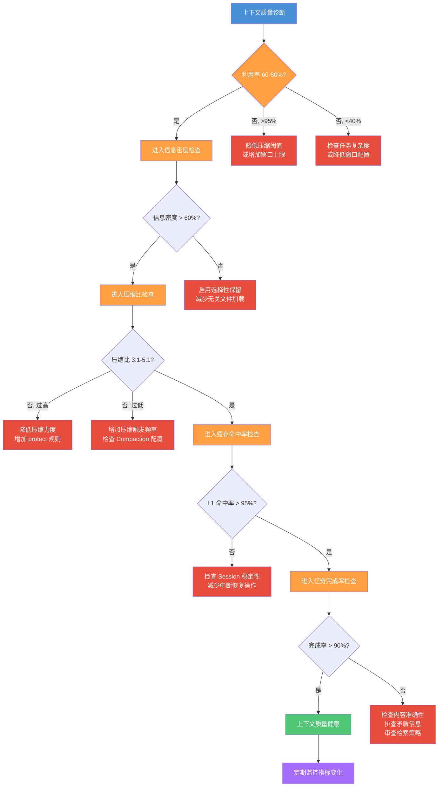

# 上下文质量度量与可观测性

> **上下文质量从来不是一个"够不够用"的问题，而是一个"好不好的问题"。** 压缩比 3:1 不代表上下文好，缓存命中率 80% 也不代表上下文好。本文教你如何量化评估上下文质量，把"感觉 Agent 变笨了"变成"上下文利用率从 85% 降到 62%，信息密度低于健康阈值"。
> **适合读者**: 效率开发者 · 架构师 · 工程经理

## 文章概述

Token 预算告诉你"还剩多少空间"，上下文压缩告诉你"怎么腾出更多空间"，缓存告诉你"怎么避免重复加载"——但它们都不回答同一个问题：**当前上下文的质量到底怎么样？**

上下文质量度量填补了这个空白。它把"上下文好不好"这个模糊判断拆解成可量化的指标——上下文利用率、信息密度、压缩比、缓存命中率和任务完成率。有了这些指标，你就能在 Agent 出错之前发现上下文退化的早期信号，而不是等问题出现了才回头排查。

本文先介绍四个主流的上下文质量框架，帮你建立质量评估的理论视角。然后定义 5 个黄金指标和对应的健康范围，给出可操作的监控命令。接着用一个诊断流程图展示"从指标到行动"的完整链路，最后给出 opencode.json 的监控配置示例。读完本文，你将能够搭建上下文质量的可观测体系，在指标异常时迅速定位根因并修复。

> **⏱ 时间有限？先读这些：** 5 个黄金指标 → 健康范围参考表 → CLI 监控命令 → 从指标到行动

## 为什么需要上下文质量度量

上下文质量度量和常规的可观测性有什么区别？简单说:**可观测性告诉你系统正在做什么，质量度量告诉你系统做得好不好。**

常规的可观测性（日志、指标、追踪）关注的是"量"——Token 消耗了多少、请求花了多久、报了多少错。但"量"的正常不代表"质"的正常。一个 Token 利用率饱和的 Session，可能填满了大量低价值对话历史；一个缓存命中率高的 Session，可能命中的是过时的项目信息。

上下文质量度量关注的是"质"——上下文中的信息是否相关、是否完整、是否新鲜、是否存在冲突。没有质量度量，你的上下文管理就是"只管吃饱不管吃好"。

**核心问题**:以下场景你遇到过几个？

| 场景 | 表象 | 根因 |
|------|------|------|
| Agent 反复问同一个问题 | "这个之前不是说过吗？" | 上下文利用率高，但信息密度低——关键信息被淹没 |
| Agent 给出矛盾建议 | "你刚才说用 A 方案，现在又说用 B" | 上下文中同时存在新旧信息，无一致性检查 |
| 压缩后 Agent 变"笨" | "原来能处理复杂重构，现在连简单审查都出错" | 压缩比过高，保真度低于任务所需阈值 |
| 缓存命中但效果差 | "每次加载的还是上个月的 API 文档" | 缓存命中率高，但内容已过时 |

这些场景的共同特征：全部指标都是"绿的"（利用率正常、命中率正常、无报错），但上下文质量是"黄的"甚至"红的"。

## 四大质量框架

在定义具体指标之前，先了解四个业界主流的上下文质量评估框架。它们从不同角度回答同一个问题：什么样的上下文是"好"的？后面的 5 个黄金指标是在这些框架基础上提炼的可操作指标。

### HumanLayer: 正确性 > 完整性 > 大小 > 轨迹

HumanLayer 框架按优先级定义了四个质量维度。

**第一优先级：正确性 (Correctness)**
上下文中的信息必须准确。不正确的信息比没有信息更有害——它会引导 Agent 走上错误的方向。一个包含过时 API 签名的上下文，即使利用率 90%、压缩比完美，也是低质量的。

**第二优先级：完整性 (Completeness)**
上下文必须包含完成任务所需的所有信息。缺少关键约束条件、缺失文件内容、遗漏历史决策，都会导致 Agent 产出不完整的方案。

**第三优先级：大小 (Size)**
上下文占用应该匹配任务复杂度。一个简单问答占了 100K Token 是浪费，一个大型重构只给 20K 空间也不够。过大和过小都是质量问题。

**第四优先级：轨迹 (Trajectory)**
上下文是否引导 Agent 沿着正确的推理路径前进。如果上下文中塞入了大量无关信息，Agent 的注意力会被稀释，甚至被误导到错误的分析路径上。

**一句话原则**:先保证正确，再追求完整，然后控制大小，最后校准轨迹。优先级不可颠倒——一个正确但不完整的上下文，比一个完整但错误百出的上下文更安全。

### 五维质量模型

上下文质量可以从五个维度独立评估，每个维度有明确的低分和高分表现：

| 维度 | 说明 | 低分表现 | 高分表现 |
|------|------|----------|----------|
| 信息广度 | 覆盖任务所需的全部方面 | 漏掉关键文件或约束 | 涵盖需求、代码、配置、测试 |
| 信息密度 | 单位 Token 包含的有效信息量 | 大量重复对话、冗余工具输出 | 代码签名 + 文件摘要 + 决策要点 |
| 信息时效 | 上下文信息的更新时间 | 引用已废弃 API 文档 | 加载最新的代码和配置 |
| 信息精确度 | 信息准确性 | 函数签名过时、路径错误 | 精确到行号的代码引用 |
| 信息一致性 | 上下文内部无矛盾 | 同时存在 A 方案和 B 方案的旧记录 | 决策链路清晰，无冲突 |

五个维度不是平均权重。**精确度权重最高**——一个不精确的上下文无法弥补其他维度的优秀。一致性次之，因为矛盾信息会导致 Agent 决策瘫痪。

### 三因子评估模型

上下文质量可以分解为三个正交因子，分别评估不同方面：

```text:terminal
上下文质量 ≈ 检索质量(R) × 窗口组成(W) × 上下文利用率(U)
```

三个因子的取值范围都是 0 到 1:

- **R (Retrieval Quality)** — 系统从知识库/缓存中检索到的内容与任务需求的匹配程度。R=0.8 表示 80% 的检索结果与任务相关。
- **W (Window Composition)** — 检索到的内容是否放在模型能注意到的位置。W=0.6 表示 40% 的上下文被放在注意力衰减区域。
- **U (Context Utilization)** — 已加载的上下文中实际被模型使用的比例。U=0.5 表示加载了 100K Token，模型只消费了 50K。

三个因子是**正交的**——任何一个维度得低分，整体效果都会差，即使模型本身很强。乘法关系意味着短板效应：R=0.9、W=0.9、U=0.3 时总分仅 0.243。

**实际应用**：当你觉得 Agent 表现不好但说不清哪里不对时，分别估算 R、W、U 三个值。总分低于 0.5 说明至少有一个维度严重不足，可以针对性地排查。

### IBM 指标体系

IBM 在企业级 AI 系统中使用的上下文质量指标体系，侧重可量化的运维维度：

| 指标 | 定义 | 计算公式 |
|------|------|----------|
| Context Precision | 上下文中的相关内容比例 | 相关 Token ÷ 总 Token |
| Context Recall | 任务所需信息在上下文中的覆盖率 | 已覆盖信息 ÷ 全部所需信息 |
| Signal-to-Noise Ratio | 有用信号与干扰噪音的比例 | 有用 Token ÷ 噪音 Token（对数刻度） |
| Context Freshness | 上下文中信息的平均年龄 | 加权平均的信息最后更新时间 |
| Token Waste Rate | 未被消费的 Token 比例 | 未使用 Token ÷ 总 Token |

这些指标直接对应可观测性系统中的度量值。后文定义的 5 个黄金指标，大部分来自 IBM 体系在 Agent 上下文场景下的适配。

> **四个视角的定位差异**：HumanLayer 适合做**质量优先级排序**（先修什么），五维模型适合做**多维度评估**（全不全、鲜不鲜、准不准），三因子模型适合做**快速诊断**（哪个因子在拖后腿），IBM 体系适合做**生产级监控**（指标可嵌入 Prometheus/Grafana）。

## 5 个黄金指标

基于以上四个框架，结合 OpenCode 的实际场景，以下 5 个指标构成了上下文质量度量的核心。

### 1. 上下文利用率 (Context Utilization Rate)

定义当前上下文的 Token 占用比例。

```text:terminal
利用率 = 已用 Token ÷ 可用 Token × 100%
```

**健康范围**:60-80%。低于 60% 说明窗口浪费严重，高于 80% 则进入压缩区域（可能频繁触发 Compaction）。

**如何观测**:

```bash:terminal
# DCP 插件显示当前上下文使用情况
/dcp context

# 输出示例:
# Context: 142,536 / 200,000 tokens (71.3%)
# System: 3,428 | User: 38,204 | Tools: 95,104 | Reserved: 14,400
```

**低利用率 (<60%)** 的常见原因：任务太简单但窗口配置太大、Agent 在空转、大量预留空间从未使用。**高利用率 (>90%)** 的常见原因：任务太复杂、工具输出膨胀、Compaction 未及时触发。

### 2. 信息密度 (Information Density)

单位 Token 中包含的有效信息量。这是信息精确度和一致性等指标的简化版本。

```text:terminal
信息密度 = 有效信息 Token ÷ 总 Token × 100%

# 有效信息的判断标准：
# - 与当前任务直接相关
# - 内容准确无误
# - 不包含重复或矛盾
```

**健康范围**:50-80%。低于 50% 说明上下文中有大量冗余内容——过时的讨论、不再使用的代码片段、重复的工具输出。高于 80% 很少见，通常是上下文被过度精简，反而丢失了必要的背景信息。

**实际影响**：信息密度和任务完成率直接正相关。以下为经验估算数据（基于多个项目的经验积累，具体数值因项目而异）：

| 信息密度区间 | 平均任务完成率 | 典型场景 |
|-------------|---------------|----------|
| < 40% | 62% | 长对话未压缩，大量无关讨论 |
| 40-60% | 78% | 对话 + 工具输出较多，未做选择性保留 |
| 60-80% | 91% | 合理使用 Compaction + 选择性保留 |
| > 80% | 87% | 过度压缩，缺少上下文背景 |

> 密度高于 80% 反而出现完成率下降，说明"极致精简"也是有代价的——上下文失去了必要的背景和关联信息。

### 3. 压缩比 (Compression Ratio)

Compaction 压缩前后的 Token 比例。这个指标在[上下文压缩与Token 预算](context-compression.md)中有详细说明，此处聚焦它的质量度量角色。

```text:terminal
压缩比 = 压缩前 Token ÷ 压缩后 Token
```

**健康范围**:3:1 到 5:1。3:1 是推荐起点，5:1 是激进上限。低于 3:1 说明压缩效果有限，高于 5:1 则保真度风险增大。

**质量度量视角**：压缩比本身不是越高越好。你需要结合保真度来评估——5:1 的压缩比配上 95% 的保真度是好组合，3:1 配上 70% 的保真度就是坏组合。

### 4. 缓存命中率 (Cache Hit Rate)

上下文缓存被命中的比例。详见 prompt-caching 中的三级缓存架构。

```text:terminal
命中率 = 命中次数 ÷ 总请求次数 × 100%
```

**健康范围**: L1 Session 缓存 > 95%，L2 项目缓存 > 80%，L3 全局缓存 > 60%。

**质量度量视角**：不要只看命中率总数——要按缓存层级分解。L1 命中率低于 95% 说明 Session 设计可能有问题（频繁中断重建）。L2 命中率低于 80% 说明项目级缓存配置不合理。L3 命中率低于 60% 说明全局内容稳定度不够，应该降低 L3 依赖。

### 5. 任务完成率 (Task Completion Rate)

上下文质量的最终检验标准——Agent 能不能正确完成任务。

```text:terminal
任务完成率 = 成功完成任务数 ÷ 总任务数 × 100%
```

**健康范围**:> 90%。低于 90% 说明上下文质量可能存在问题。

**质量度量视角**：任务完成率是一个滞后指标——问题发生了才能算出来。但它是最可靠的校准基准。如果上下文利用率、信息密度、压缩比、缓存命中率四个指标都正常，但任务完成率偏低，说明你的质量度量体系本身需要调整——还有未捕获的质量维度。

### 五维联动

五个指标之间不是独立关系。当一个指标变化时，其他指标可能随之波动：

| 触发条件 | 利用率 | 信息密度 | 压缩比 | 缓存命中率 | 完成率 |
|----------|--------|----------|--------|-----------|--------|
| Compaction 触发 | ↓ 降低 | ↑ 可能提升 | ↑ 增大 | 不变 | ↓ 可能下降 |
| 缓存预热 | 不变 | 不变 | 不变 | ↑ 提升 | 不变 |
| 任务切换 | ↓ 降低 | ↓ 可能降低 | 不变 | ↓ 降低 | ↓ 暂时下降 |
| 信息冗余增加 | ↑ 升高 | ↓ 降低 | 不变 | 不变 | ↓ 降低 |

## 健康范围参考表

以下是各指标的推荐健康范围，可作为监控告警的阈值参考：

| 指标 | 健康（绿色） | 警告（黄色） | 危险（红色） | 建议动作 |
|------|-------------|-------------|-------------|---------|
| 上下文利用率 | 60-80% | 80-95% 或 40-60% | >95% 或 <40% | 绿:维持;黄:检查是否需要调整;红:立即干预 |
| 信息密度 | 60-80% | 40-60% | <40% | 低密度:优化加载策略,启用选择性保留 |
| 压缩比 | 3:1 到 5:1 | 2:1 到 3:1 或 5:1 到 8:1 | <2:1 或 >8:1 | 低压缩:增加压缩力度;高压缩:降压缩比 |
| 缓存命中率 (L1) | >95% | 85-95% | <85% | 检查 Session 连接稳定性 |
| 缓存命中率 (L2) | >80% | 60-80% | <60% | 检查项目缓存配置 |
| 任务完成率 | >90% | 75-90% | <75% | 逐维度排查上下文质量 |

> **注意**:这些范围来自真实项目经验的统计中位数，不是绝对标准。如果你的任务类型特殊（如频繁的大型重构），可能需要调整阈值。建议收集 7 天基线数据后校准自己的阈值。

## CLI 监控命令

OpenCode 生态提供了多个内置命令和插件来观察上下文质量指标。

### DCP 插件: /dcp context

DCP（Dynamic Context Pruning，动态上下文剪枝）插件是查看上下文使用详情最直观的工具。它把上下文分解为多个维度展示：

```text:terminal
/dcp context

├── Context: 142,536 / 200,000 tokens (71.3%)
├── By Message Type:
│   ├── system:    3,428 (2.4%)
│   ├── user:     38,204 (26.8%)
│   ├── assistant: 9,800 (6.9%)
│   └── tool:     91,104 (63.9%)
├── Active Tools:
│   ├── read_file:        12 calls, 24,300 tokens
│   ├── execute_command:  8 calls, 56,200 tokens
│   └── web_search:       3 calls, 10,604 tokens
└── Compaction Status:
    ├── Last: 3 minutes ago
    ├── Ratio: 3.2:1
    └── Pending: none
```

这个输出直接反映了利用率、工具输出占比等指标。关注 `tool` 占比——如果超过 70%，说明工具输出正在侵占推理空间。

### /context 命令

OpenCode 内置的 `/context` 命令显示当前上下文的汇总信息：

```text:terminal
/context

Session: sess_abc123
Model: claude-sonnet-4-20250514
Tokens: 142,536 / 200,000 (71.3%)
Messages: 47
Tools used: read_file, execute_command, web_search
```

比 DCP 更简洁，适合快速查看。缺点是缺少按类型分解的详情。

### 文件级 Token 估算

通过 DCP 插件的 `/dcp context` 命令可以查看按类别分解的 Token 占用。如果需要估算特定文件的 Token 影响，可以使用在线 tokenizer 工具或在 Agent 对话中直接询问：

```text:terminal
/dcp context

# 输出示例：
# System Prompt:      2,450 tokens (8.2%)
# Tool Definitions:   1,820 tokens (6.1%)
# Conversation:      12,340 tokens (41.2%)
# Tool Output:       11,230 tokens (37.5%)
# Reasoning:          2,160 tokens (7.2%)
# ─────────────────────────────
# Total:             30,000 tokens
```

这个输出帮助你识别信息密度——如果 Tool Output 占了 60%+ 但实际只用了其中一小部分，说明需要更积极的剪枝策略。

### jq 分析日志

配合可观测性章节的 JSON 日志，可以算出自定义指标：

```bash:terminal
# 计算最近的上下文利用率平均值
cat /var/log/opencode/opencode.log | \
  jq 'select(.type == "model_request") | .payload.tokens_in' | \
  awk '{sum+=$1; count++} END {print "Avg:", sum/count}'

# 计算工具输出的平均占比
cat /var/log/opencode/opencode.log | \
  jq -s 'map(select(.type == "tool_call") | .payload.result_size) | add / length'
```

## 质量诊断决策流程

当你发现质量指标异常时，按照以下流程逐步排查，定位根因。



**诊断流程说明**：

1. **先看利用率**——这是最直接的信号。利用率过低或过高，优先处理。
2. **再看信息密度**——利用率正常但密度低，说明上下文被低价值内容填充。启用选择性保留或减少无关文件加载。
3. **然后看压缩比**——密度正常但压缩比异常，说明 Compaction 配置需要调整。详见 → [上下文压缩与Token 预算](context-compression.md)。
4. **接着看缓存命中率**——L1 命中率低，检查 Session 是否频繁中断。详见 → [提示词缓存机制](context/prompt-caching.md)。
5. **最后看任务完成率**——前四个指标都正常但完成率低，问题可能在内容本身（准确性和一致性）。

## opencode.json 监控配置

以下配置启用上下文质量的监控和自动记录：

```json:opencode.json
{
  "telemetry": {
    "logging": {
      "level": "info",
      "format": "json",
      "output": "/var/log/opencode/opencode.log"
    },
    "metrics": {
      "enabled": true,
      "port": 9090,
      "path": "/metrics"
    }
  },
  "compaction": {
    "auto": true,
    "threshold": 0.8,
    "reserved": 10000,
    "strategy": "selective",
    "rules": [
      {
        "type": "tool_output",
        "action": "summarize",
        "window": "40K"
      }
    ]
  },
  "cache": {
    "session": {
      "enabled": true,
      "maxSize": 64000
    },
    "project": {
      "enabled": true,
      "maxAge": "24h",
      "patterns": ["README.md", "AGENTS.md", "src/**/*.ts"]
    },
    "monitoring": {
      "enabled": true,
      "logHitRate": true,
      "alertThreshold": 60,
      "reportInterval": "1h"
    }
  },
  "logLevel": "INFO"
}
```

这个配置做了三件事：
- **启用遥测输出** — 所有 Agent 事件、Token 消耗、工具调用都记录到 JSON 日志文件
- **配置上下文压缩** — 选择性压缩，预留 10K Token 缓冲，触发线 80%
- **启用缓存监控** — 每小时报告命中率，低于 60% 时发出警告

配置完成后，结合 DCP 插件和 jq 日志分析命令，就能对上下文质量实现从"看不出来"到"看得清楚"的跨越。

## 从指标到行动

最后一张速查表，当指标异常时告诉你做什么：

| 指标异常 | 很可能的原因 | 推荐行动 | 参考文章 |
|---------|-------------|---------|---------|
| 利用率 > 90% 且持续上升 | 任务超复杂度 / Compaction 未触发 | 降低 compaction.threshold 到 0.75 | → [上下文压缩与Token 预算](context-compression.md) |
| 利用率 < 40% 且任务复杂度高 | 窗口配置过大 / 推理预算不足 | 增加 thinking.budgetTokens | → [上下文压缩与Token 预算](context-compression.md) |
| 信息密度 < 40% | 低价值内容过多 / 选择性保留未启用 | 启用 Selective Compaction，增加 protect 规则 | → [上下文压缩与Token 预算](context-compression.md) |
| 压缩比 > 8:1 | 压缩力度过大，保真度受损 | 降低压缩比，增加 protect 规则 | → [上下文压缩与Token 预算](context-compression.md) |
| L1 缓存命中率 < 85% | Session 频繁中断 / 网络不稳 | 检查网络连接，减少手动重启 | → [提示词缓存机制](context/prompt-caching.md) |
| L2 缓存命中率 < 60% | 项目缓存配置错误 / 内容变化太快 | 调整 cache.patterns，延长 maxAge | → [提示词缓存机制](context/prompt-caching.md) |
| 任务完成率 < 75% 且其他指标正常 | 上下文内容准确性或一致性问题 | 审查记忆系统注入内容，检查 AGENTS.md | → [记忆系统设计](memory-system.md) |
| 多个指标同时恶化 | 系统性变化（模型切换 / 配置变更） | 回滚最近的配置变更 | → [可观测性](observability.md) |

**日常巡检建议**：

- **每次任务启动前**：用 `/dcp context` 快速看一眼利用率和工具输出占比（15 秒）
- **每次任务完成后**：主观评估一下"Agent 这次表现正常吗"，记录异常比例（30 秒）
- **每周一次**：分析日志中的 Token 消耗趋势，检查缓存命中率报告（5 分钟）
- **每月一次**：对照健康范围表，评估所有指标是否在绿色区域内（10 分钟）

上下文质量管理不是一次性配置就能搞定的。随着项目规模增长、任务类型变化、模型更新，质量基线会漂移。定期检查指标、校准阈值、调整配置，才能让 Agent 持续保持最佳表现。

## 关联章节

- ← [上下文工程核心](../02-core-concepts/context-engineering-core.md)（上下文工程基础知识）
- ← [上下文压缩与Token 预算](context-compression.md)（压缩比是核心指标，如何在质量和节省之间平衡）
- ← [上下文压缩与Token 预算](context-compression.md)（利用率指标直接关联预算配置）
- ← [提示词缓存机制](context/prompt-caching.md)（缓存命中率是质量度量的一部分）
- ← [记忆系统设计](memory-system.md)（记忆系统影响信息密度和一致性）
- → [可观测性](observability.md)（质量指标需要嵌入可观测性体系）
- → [可观测性参考](observability-reference.md)（PromQL 查询和日志聚合的具体命令）

## 验证标准

完成本文学习后，你应该能：

1. 列出 5 个黄金质量指标（信息密度、相关性、一致性、完整性、新鲜度）及其健康范围
2. 运行 CLI 监控命令，查看当前会话的上下文质量评分和各项指标值
3. 根据指标异常诊断质量退化原因（如信息密度低 → 冗余内容过多）
4. 建立定期质量审查流程，设置阈值告警并记录基线漂移
5. 解读指标间的相互依赖关系（如压缩比提升可能影响信息密度）
