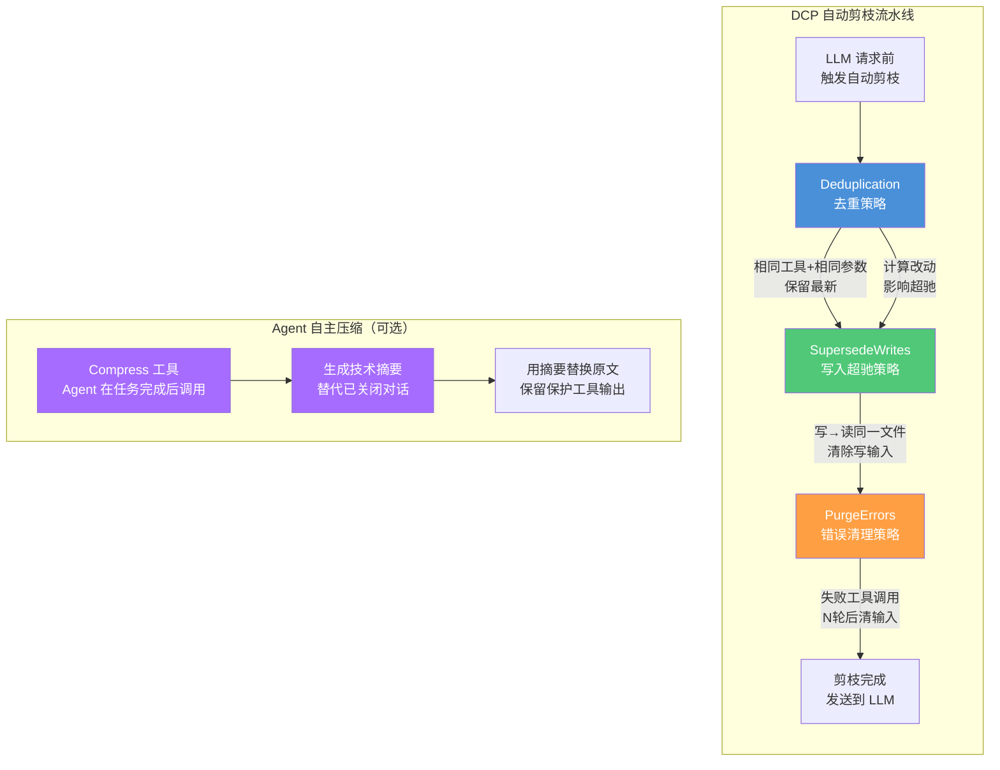
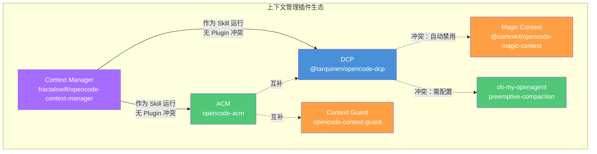
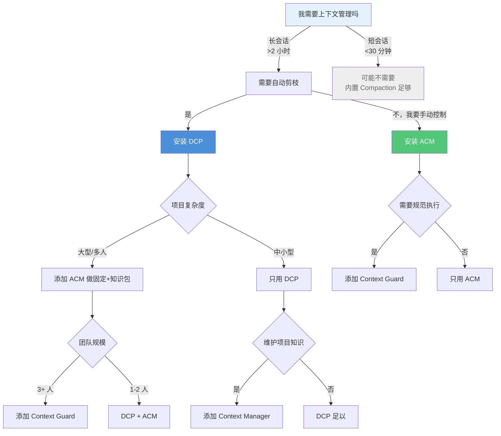

# DCP 与高级上下文管理插件实战

> Token 窗口不是无限的，但你的会话可以是。DCP、ACM、**Context（上下文）** Guard、Context Manager 四款插件从不同维度解决同一个问题——让 **Agent（智能体）** 在有限的上下文窗口内保持高效和准确。
> **适合读者**: 效率开发者 · 架构师 · 高级用户

## 文章概述

一个长会话运行几小时后，上下文从 10K 膨胀到 180K+ Token 是常态。OpenCode 内置的 Compaction 机制能缓解这个问题，但对于追求极致效率的团队来说，插件生态提供了更精细的控制手段——从自动剪枝到主动压缩，从运行时状态注入到模块化上下文生成，每款插件都有自己的用武之地。

本文覆盖四款生产级上下文管理插件，按功能深度排列：

1. **DCP（Dynamic Context Pruning）** — 自动去重、错误清理、写入超驰，6 个 `/dcp` 命令
2. **ACM（Active Context Management）** — 15+ 工具、7 类操作，精确控制活跃上下文的边界
3. **opencode-context-guard** — 运行时强化，解决"Agent 20 轮后忘记 AGENTS.md"的问题
4. **opencode-context-manager** — 静态分析先行、AI 补充的模块化上下文生成

读完本文，你将能根据项目阶段和团队规模选择合适的插件组合，并在多插件共存时避免冲突。

> **⏱ 时间有限？先读这些：** DCP 核心配置 → ACM 常用工作流 → Context Guard 安装 → 兼容性矩阵

## 内容要点

1. **DCP 插件** — 安装方式、三种自动剪枝策略（去重/写入超驰/错误清理）、6 个 `/dcp` 命令、配置文件层级合并，以及缓存命中率的权衡。

2. **ACM 插件** — 15+ 工具覆盖状态、固定、剪枝、加载、检查、压缩、运维 7 个类别。Pinning 机制、Knowledge Package、Swap 模式。

3. **Context Guard** — 运行时注入替代 AGENTS.md 的"自觉遵守"，200 Token 每轮的成本，三个工具（checkpoint/load/discover）与责任追踪。

4. **Context Manager** — 两阶段架构（零 AI Token 静态分析 + 选择性 AI 读取）、增量 git diff 更新、97-99% 重复运行节省。

5. **插件兼容性与选型** — DCP vs Magic Context 的自动禁用规则，DCP 与 OMO preemptive-compaction 的冲突处理。根据团队规模和项目复杂度做选型建议。

## 关联章节

- ← [上下文压缩与Token 预算](../context-compression.md)（Compaction 是 DCP/ACM 的基础）
- → [上下文注入](context-injection-patterns.md)（Context Manager 生成的上下文如何注入）
- ← [自定义 Agent 与 **Plugin（插件）**](../custom-agents.md)（Plugin 开发基础）
- ← [性能调优与成本管理](performance-tuning.md)（性能优化的另一面）

---

## DCP：动态上下文剪枝

DCP（Dynamic Context Pruning）是 @tarquinen/opencode-dcp 提供的上下文优化插件，也是目前 OpenCode 生态中最成熟、最流行的上下文管理方案。截至 2026 年中期，它在 GitHub 上拥有 3000+ Star，版本已迭代到 v3.x。

### 安装

```bash:terminal
opencode plugin @tarquinen/opencode-dcp@latest --global
```

这条命令安装插件并注册到全局 OpenCode 配置中。首次运行后，DCP 会自动在 `~/.config/opencode/dcp.jsonc` 生成配置文件。

### 核心原理：压缩机智能剪枝

DCP 有两层机制协同工作：

1. **Compress 工具** — 暴露给模型调用的压缩工具。Agent 在任务完成后自主决定何时压缩哪些对话内容。它与 OpenCode 内置 Compaction 的区别在于：内置 Compaction 是静态阈值触发的全局压缩，DCP Compress 是 Agent 选择性的精准压缩。Agent 只压缩"已经关闭、不再需要逐字保留"的对话段，并用高保真技术摘要替代原文。

2. **自动剪枝策略** — 在每次 LLM 请求前静默执行，零 AI 开销。三策略按固定顺序执行：

| 策略 | 默认 | 说明 |
|------|------|------|
| **Deduplication** | 启用 | 检测相同工具+相同参数的重复调用，只保留最新输出。在 compress 工具运行时重新计算，只在压缩时影响 **Prompt（提示词）** Cache |
| **SupersedeWrites** | 禁用 | 当同一个文件被写入后又被读取时，清除写入操作的输入（通常包含完整的文件内容），因为读取结果已经包含了文件当前状态 |
| **PurgeErrors** | 启用 | 出错工具调用经过 N 轮后（默认 4 轮），清除其输入参数（保留错误消息本身）。在 compress 工具运行时重新计算 |

SupersedeWrites 的典型场景：重构过程中频繁"写文件→读文件验证"，写入内容通常很大（完整文件内容），但读取结果已经包含了相同信息。启用此策略能在不损失信息的前提下节省大量 Token。



### 三种策略的详细配置

```jsonc:~/.config/opencode/dcp.jsonc
{
  "$schema": "https://raw.githubusercontent.com/Opencode-DCP/opencode-dynamic-context-pruning/master/dcp.schema.json",
  "enabled": true,
  "debug": false,
  "pruneNotification": "detailed",
  "commands": {
    "enabled": true,
    "protectedTools": []
  },
  "turnProtection": {
    "enabled": true,
    "turns": 4
  },
  "protectedFilePatterns": [
    "**/config/**/*.{ts,js,yaml}",
    "**/secrets/**",
    "*.md"
  ],
  "strategies": {
    "deduplication": {
      "enabled": true,
      "protectedTools": ["todowrite", "todoread"]
    },
    "supersedeWrites": {
      "enabled": true
    },
    "purgeErrors": {
      "enabled": true,
      "turns": 4,
      "protectedTools": ["task", "skill"]
    }
  },
  "compress": {
    "mode": "range",
    "permission": "allow",
    "summaryBuffer": true,
    "maxContextLimit": 100000,
    "minContextLimit": 50000,
    "modelMaxLimits": {
      "anthropic/claude-sonnet-4-20250514": "80%",
      "openai/gpt-4o": 100000
    },
    "modelMinLimits": {
      "anthropic/claude-sonnet-4-20250514": "25%",
      "openai/gpt-4o": 40000
    },
    "nudgeFrequency": 5,
    "nudgeForce": "soft",
    "protectedTools": ["task", "skill", "todowrite", "todoread"],
    "protectUserMessages": false
  }
}
```

### 配置文件层级合并

DCP 的配置文件搜索顺序是：

1. 全局：`~/.config/opencode/dcp.jsonc`（首次运行自动创建）
2. 自定义目录：`$OPENCODE_CONFIG_DIR/dcp.jsonc`（如果 `OPENCODE_CONFIG_DIR` 设置了）
3. 项目级：`.opencode/dcp.jsonc`（项目 `.opencode` 目录中）

**层级之间是合并关系，项目配置覆盖全局配置**。你可以在全局设置通用参数（如 `debug: false`、`nudgeFrequency: 5`），在项目级设置与项目相关的参数（如 `protectedFilePatterns`、`supersedeWrites` 开关）。

### Per-Model Overrides

DCP 支持为不同模型设置不同的压缩上限。如果你的工作流中混合使用大窗口模型（Claude 200K）和小窗口模型（GitHub Copilot 32K），这个功能非常实用：

```jsonc:dcp.jsonc
{
  "compress": {
    "modelMaxLimits": {
      "anthropic/claude-sonnet-4-20250514": "80%",
      "openai/gpt-4o": 100000,
      "openai/gpt-4o-mini": 28000
    },
    "modelMinLimits": {
      "anthropic/claude-sonnet-4-20250514": "25%",
      "openai/gpt-4o": 40000,
      "openai/gpt-4o-mini": 16000
    }
  }
}
```

`modelMaxLimits` 和 `modelMinLimits` 的值可以是数字（绝对 Token 数）或带百分号的字符串（模型上下文窗口的百分比）。当存在模型级配置时，它优先于顶层的 `maxContextLimit` / `minContextLimit`。

### /dcp 命令详解

DCP 提供 7 个子命令，覆盖监控、诊断和手动控制：

| 命令 | 功能 |
|------|------|
| `/dcp` | 显示所有可用命令 |
| `/dcp context` | 显示当前 Session 按类别（system/user/assistant/tools）的 Token 使用明细，以及剪枝节省的 Token |
| `/dcp stats` | 显示跨 Session 的累积剪枝统计 |
| `/dcp sweep [N]` | 剪枝自上次用户消息以来的所有工具调用。可选 N 指定最后 N 个工具。尊重 `commands.protectedTools` |
| `/dcp manual [on/off]` | 切换手动模式。开启后 AI 不再自主调用上下文管理工具 |
| `/dcp compress [focus]` | 触发一次 compress 工具执行。可选 focus 文本指定压缩重点 |
| `/dcp decompress [N]` | 按 ID 恢复某个活跃压缩。不加参数列举所有可恢复压缩 |
| `/dcp recompress [N]` | 重新压缩用户解压过的内容。不加参数列举可重新压缩的 ID |

### Prompt Cache 影响

这是一个重要的权衡。LLM 提供商基于精确前缀匹配缓存 Prompt。当 DCP 剪枝内容时，它会修改消息序列，从而从修改点开始使缓存前缀失效。

根据 DCP 官方测试数据，缓存命中率从无 DCP 时的约 90% 降至约 85%。这个 5% 的下降换来了长会话中显著的 Token 节省——在大多数场景中，Token 节省远大于缓存丢失的成本。

对于基于请求计费的提供商（如 GitHub Copilot）或统一 Token 定价提供商（如 Cerebras），缓存命中率不受影响。

### 安装验证

安装后执行以下步骤验证：

```bash:terminal
# 1. 确认配置文件已创建
ls ~/.config/opencode/dcp.jsonc

# 2. 在 OpenCode 中运行
/dcp context

# 3. 查看统计
/dcp stats
```

---

## ACM：主动上下文管理

ACM（Active Context Management）由 Rick Ross 开发，定位与 DCP 形成互补。DCP 擅长自动化的后台剪枝，ACM 擅长让用户和 Agent **主动决策**什么内容应该保留、什么应该压缩。

### 安装

```json:~/.config/opencode/opencode.json
{
  "plugin": ["opencode-acm"]
}
```

重启 OpenCode 后，Agent 就可以直接调用 ACM 暴露的 15+ 工具。

### 15+ 工具七大类

ACM 的工具按用途分为 7 个类别：

| 类别 | 工具 | 用途 |
|------|------|------|
| **Status** | `acm_info` | 显示 ACM 版本、会话、模型、Token 使用和运行时遥测状态 |
| **Pinning** | `acm_pin`, `acm_unpin`, `acm_mark` | 标记消息为重要，管理固定状态 |
| **Pruning** | `acm_scan`, `acm_prune` | 查找大消息，精确压缩特定消息 |
| **Loading** | `acm_load`, `acm_unload` | 加载和卸载命名知识包 |
| **Inspection** | `acm_map`, `acm_scan`, `acm_search`, `acm_fetch` | 了解上下文使用情况，查找特定消息 |
| **Compaction** | `acm_compact` | 向前移动活跃上下文边界 |
| **Housekeeping** | `acm_snapshot`, `acm_diagnose`, `acm_repair` | 捕获状态、检查损坏、修复损坏的会话 |

### 核心工作流

**固定重要内容**：

```text:terminal
# 固定当前消息
acm_pin

# 按 ID 固定特定消息
acm_pin with message_id=abc123
```

**查找和移除膨胀**：

```text:terminal
# 扫描上下文，找大消息
acm_scan

# 按目标剪枝
acm_prune with targets=[abc123, def456]
```

**加载知识包**：

```text:terminal
# 从文件加载
acm_load with name="API Docs" file="~/project/openapi.json"

# 卸载
acm_unload with name="API Docs"
```

**了解上下文使用**：

```text:terminal
acm_info
acm_map
acm_scan with show_compacted=true
```

### Swap 模式

ACM 支持一个简单的手动 Swap 模式，适合需要在较小上下文窗口中工作但保留参考材料的场景：

1. `acm_load` 将重要文件或笔记加载为命名知识包
2. `acm_compact` 向前移动活跃边界
3. 在更精简的活跃窗口中工作
4. 根据任务变化 `acm_unload` 和 `acm_load` 知识包

### 运行时遥测

ACM 每轮会向最后一条用户消息注入一个 `<runtime-telemetry>` 块，让 Agent 感知时间和上下文使用情况：

```xml:terminal
<runtime-telemetry>
  <time>Mon, Jun 14, 2026 at 03:45 PM CST</time>
  <context-status tokens="121,822" percent="44%" limit="275,000" />
</runtime-telemetry>
```

可以通过插件选项禁用：

```json:opencode.json
{
  "plugin": {
    "opencode-acm@latest": {
      "runtimeTelemetry": false
    }
  }
}
```

### 实现细节

ACM 注册了 4 个 Hook：

- `tool` — 注册所有 ACM 工具
- `experimental.chat.messages.transform` — 在模型看到消息前用占位符替换已压缩内容
- `experimental.chat.system.transform` — 清除过期的提醒，缓存模型限制用于提醒注入
- `event` — 监听 `session.updated`，在 `acm_load` 后最终确定知识包固定

ACM 状态存储在独立的 `acm.db` 中（在 OpenCode 的数据库目录旁），不需要修改 OpenCode 自身的 Schema。压缩边界使用 OpenCode 原生格式：一条包含 `compaction` 部分的用户消息加上摘要性的助手消息。

---

## Context Guard：运行时上下文强化

opencode-context-guard 由 keefetang 开发，解决一个特定问题：**Agent 在 20 轮对话后忘记了 AGENTS.md 里的指令**。

### 问题本质

AGENTS.md 只在 Session 开始时被读取一次。Agent 在后续的 20+ 轮对话中，注意力完全集中在代码编辑和工具调用上。当你期望 Agent "维护 STATE.md"、"每次结束前做 checkpoint"时，它要么根本没记住，要么记得但不执行。

Context Guard 不是替换 AGENTS.md——它把 AGENTS.md 中那 50 行机械性提醒变成运行时强制执行，让 AGENTS.md 继续承载 260 行的协作原则和架构哲学。

### 对比 AGENTS.md

| 维度 | AGENTS.md | Context Guard |
|------|-----------|---------------|
| **Agent 看到时机** | Session 开始时一次 | 每轮每 Agent 都注入 |
| **执行方式** | 自觉遵守 | 注入到 System Prompt，无法跳过 |
| **状态感知** | "记得读 STATE.md" | STATE.md 内容已可见 |
| **子 Agent 上下文** | "在委派中传递上下文" | 自动——每个子 Agent 都看到项目状态 |
| **Checkpoint 提醒** | "在结束前更新 STATE.md" | 义务："上次更新后有文件变更" |
| **Git 感知** | Agent 手动运行 `git status` | 分支、未提交文件、领先/落后——每轮可见 |
| **跨 Session 连续性** | "恢复时读 artifacts" | 显示 artifacts 状态，过期状态告警 |

### 三个工具

Context Guard 只提供 3 个工具，接口设计极其精简：

| 工具 | 功能 | 说明 |
|------|------|------|
| `context_checkpoint` | 更新项目状态 | 6 个结构化字段，无叙述 |
| `context_load` | 加载任务的所有规划 artifacts | 一次调用摘要所有规划文档 |
| `context_discover` | 追加发现或决策 | 写入 STATE.md 的 log 或 decisions 段 |

### 三大强化机制

**System Prompt 注入（~200 Token/轮）**：
项目状态在每轮每个 Agent 的 System Prompt 中可见——焦点、阶段、阻塞项、下一步、Git 状态、义务。这些不是"提醒"，而是 Agent 做决策时必须考虑的事实。

**Compaction 保护**：
在压缩前，完整的项目状态会注入到压缩 Prompt 中，确保压缩后摘要不会丢失状态信息。

**责任追踪**：
Context Guard 追踪三类义务——"STATE.md 需要 checkpoint"、"N 个未提交文件"、"N 个未推送的 commit"——以事实（而非唠叨）的形式呈现在 Agent 面前。

### 安装

```json:opencode.json
{
  "plugin": ["opencode-context-guard"]
}
```

---

## Context Manager：模块化上下文生成

opencode-context-manager 由 fractalswift 开发，定位与前两者完全不同——它不是优化已有上下文的插件，而是**从代码仓库生成模块化上下文文件**的工具。它更像一个 **Skill（技能）** 而非 Plugin，通过 `/context-update` 命令暴露功能。

### 两阶段架构

Context Manager v2.0 引入了两阶段设计，显著降低 AI Token 消耗：

```text:terminal
Phase 1: 静态分析（零 AI Token）
  ├── TypeScript Compiler API → imports, exports, signatures, JSDoc
  ├── 依赖图 → 文件关系、重要性评分
  ├── 自动摘要 → 为文档完善的简单文件生成描述
  └── 能力检测 → 数据库、认证、集成等

Phase 2: AI Agent（最少 Token）
  ├── 读取预分析摘要（代码库地图）
  ├── 只读取重要或缺乏文档的文件
  ├── 从样本检测跨文件模式
  └── 从摘要+文件读取生成上下文
```

### 增量更新

Context Manager 的核心创新是 git diff 驱动的增量更新。第一次运行是全量扫描，后续运行按以下路径：

1. Git diff 识别变更文件
2. 依赖图查找受影响文件（imports/exports 追踪）
3. AI 只重新读取受影响文件并更新对应上下文段
4. 未变更内容完整保留

### Token 节省效果

| 场景 | 消耗 | 对比全量读取 |
|------|------|-------------|
| **首次运行** | ~150-200K Tokens | 省 40-55% |
| **全量扫描（缓存）** | ~15-20K Tokens | 省 94% |
| **增量（5 文件变更）** | ~8-12K Tokens | **省 97%** |
| **增量（1 文件变更）** | ~3-5K Tokens | **省 99%** |
| **无变更** | ~0 Tokens | 省 100% |

### 输出结构

生成的上下文文件放在 `.opencode/context/` 中：

```text:terminal
.opencode/context/
├── repo-structure.md      # 始终创建
├── frontend/              # 前端较重时
│   ├── components.md      # 3+ 可复用组件
│   └── hooks.md           # 3+ 自定义 hooks
├── backend/               # 后端较重时
│   ├── api.md             # 显著 API 端点
│   └── services.md        # 3+ 服务模块
└── shared/                # 共享代码较多时
    ├── types.md
    └── utilities.md
```

### 安装与使用

```bash:terminal
npx opencode-context-manager init
```

然后在 OpenCode 中运行：

```text:terminal
/context-update
```

---

## 插件兼容性矩阵

多插件共存时，需要了解潜在的兼容性问题。



### DCP vs Magic Context

Magic Context（@cortexkit/opencode-magic-context）是功能重叠度最高的竞品。两者都提供自动化的上下文压缩和跨 Session 记忆。当检测到 DCP 已安装时，Magic Context 会自动禁用自身的上下文管理功能，避免双重压缩导致的信息丢失。

### DCP vs OMO Preemptive-Compaction

oh-my-openagent 的 preemptive-compaction Hook 与 DCP 的 Compress 工具功能重叠。如果同时启用，可能出现"OMO 压缩了 DCP 刚评估完的上下文"的冲突。建议方案：

- 如果使用 DCP，在 OMO 配置中禁用 preemptive-compaction Hook
- 如果使用 OMO 的完整工作流体系，考虑只启用 OMO 的压缩，不安装 DCP

### 推荐组合

> **成熟度说明**：DCP（~2900★）是社区最成熟的上下文管理插件。ACM（7★）、Context Guard（0★）、Context Manager（1★）处于早期阶段，功能设计合理但社区验证较少，建议关注维护状态。

| 团队规模 | 推荐组合 | 理由 |
|----------|---------|------|
| 单人 | DCP + Context Manager | DCP 处理运行时剪枝，Context Manager 维护项目知识 |
| 小团队（2-5 人） | DCP + ACM + Context Guard | ACM 的 Pinning 适合团队协作场景，Context Guard 确保规范执行 |
| 中大型团队 | ACM + Context Guard + Context Manager | DCP 的自动策略在大团队中可能误伤，ACM 的手动控制更安全 |
| OMO 用户 | ACM + Context Guard | 由 OMO 的工作流体系接管压缩，避免冲突 |

---

## 选型决策树

如果还是不确定怎么选，按以下顺序判断：



---

## 常见反模式

### 插件装得越多越好

**现象**：同时安装 DCP、ACM、Context Guard、Context Manager 四款插件，期望它们自动协作、各司其职。

**原因**：认为"每款插件解决一个问题，装全了就能解决所有问题"。

**对策**：多款插件同时运行可能导致上下文管理策略冲突。DCP 的自动剪枝和 ACM 的固定策略相互矛盾——一个在自动丢弃，一个在强制保留。建议以一款插件为主力（推荐 DCP），根据具体需求选择性添加第二款。

### 自动策略完全放任

**现象**：DCP 采用默认配置运行，从不检查自动剪枝的效果，也不调整剪枝阈值和保留规则。

**原因**：认为"既然是自动的，应该足够智能"。

**对策**：默认配置适合上手，但生产环境需要调整。至少需要配置 protect 规则保护关键内容，根据任务类型调整压缩阈值。每周检查一次剪枝日志，确认没有误删重要信息。

### 插件冲突视而不见

**现象**：DCP 和 OMO 的 preemptive-compaction 同时启用，导致同一份上下文被压缩两次。

**原因**：没有意识到不同插件的压缩功能可能重叠。

**对策**：启用任何新插件前，先检查其功能是否与现有插件重叠。如果使用 DCP，在 OMO 中禁用 preemptive-compaction Hook。插件组合不是越多越好，功能重叠时保留一个即可。

## 常见错误与陷阱

### DCP 自动剪枝误删关键上下文

**场景**：DCP 在长会话中自动剪枝，将 Agent 之前做出的一个重要架构决策标记为低优先级并丢弃。

**后果**：Agent 后续需要重新做出相同的架构决策，或者因为缺少上下文而做出不一致的决定，浪费了更多 Token。

**预防**：在 DCP 配置中使用 `protect` 规则保护关键信息类型（架构决策记录、API 接口定义、测试计划）。对不熟悉的项目，先手动确认几次 DCP 的剪枝效果后再完全信任自动策略。

### ACM 知识包过期

**场景**：团队成员创建了一组 ACM 知识包（架构规范、编码约定），但项目演进后这些知识包没有同步更新。

**后果**：Agent 加载的是过时的知识包，新加入的成员基于错误的知识工作，老成员发出"Agent 怎么还在用旧规范"的抱怨。

**预防**：将 ACM 知识包的更新纳入代码评审流程——修改知识包像修改代码一样需要评审。在 AGENTS.md 中标注知识包的版本号和最后更新日期。

### Context Guard 规则过于严格导致 Agent 僵化

**场景**：Context Guard 配置了"每轮必须输出任务分解"，Agent 在每一步都输出分解结果，即使只是执行一个简单的文件读取。

**后果**：多轮对话中充斥着不必要的规范性输出，浪费大量 Token。

**预防**：Context Guard 的规则应当与任务类型匹配——复杂任务需要完整规范输出，简单操作则不需要。使用条件规则而非全局规则。

## 适用场景与限制

### 上下文管理插件的最佳场景

- 长会话（> 2 小时）中 Agent 的上下文窗口频繁达到上限
- 多人协作项目中需要保持上下文的团队一致性
- 项目快速迭代，需要持续更新 Agent 对代码库的理解

### 上下文管理插件的局限性

- **自动策略不适用于所有任务**：某些任务需要完整的上下文线索链，自动剪枝可能打断这个链
- **插件之间存在功能重叠**：多款插件同时使用时，需要手动协调它们的职责边界
- **插件本身有学习成本**：DCP 的 5 个命令、ACM 的知识包管理、Context Guard 的规则语法——每个插件都需要投入学习时间

### 什么情况下不需要上下文管理插件

短会话（< 30 分钟）和单人项目中，OpenCode 内置的 Compaction 功能已经足够。插件的价值在长会话和团队协作场景中才真正体现。

## 总结

四款插件从不同维度解决了上下文管理的问题，各有侧重：

| 插件 | 核心能力 | Token 开销 | 适合场景 |
|------|---------|-----------|---------|
| **DCP** | 自动剪枝 + Agent 自主压缩 | 运行时零开销 | 所有长会话场景 |
| **ACM** | 主动固定的知识包管理 | 运行时零开销（仅状态读取） | 需要精确控制上下文的场景 |
| **Context Guard** | 运行时状态注入 + 责任追踪 | ~200 Token/轮 | 团队规范执行、跨 Session 持续 |
| **Context Manager** | 模块化上下文文件生成 | 首次 150-200K，后续 3-12K | 项目初始化和重大变更后的上下文维护 |

你的第一个插件应该从 DCP 开始——它安装最快、配置最少、收益最直接。当遇到 DCP 的自动策略无法满足的精确控制需求时，添加 ACM。当团队成员经常"忘记规范"时，添加 Context Guard。当项目快速演进、需要持续更新 Agent 对代码库的理解时，用 Context Manager。

没有银弹。但有了这四款插件，你的 Agent 可以在有限的上下文窗口内保持更长时间的高效和准确。

## 验证标准

完成本文学习后，你应该能：

1. 配置并启用 DCP 插件，说明其自动剪枝和 Agent 自主压缩的工作原理
2. 对比 ACM 与 DCP 的适用场景，解释何时应选择 ACM 的主动知识包管理模式
3. 为团队项目配置 Context Guard 规则，实现运行时规范注入和责任追踪
4. 使用 Context Manager 为项目生成模块化的上下文文件，验证生成内容的完整性
5. 构建一个包含多款插件的上下文管理流水线，并说明各插件的协作方式
