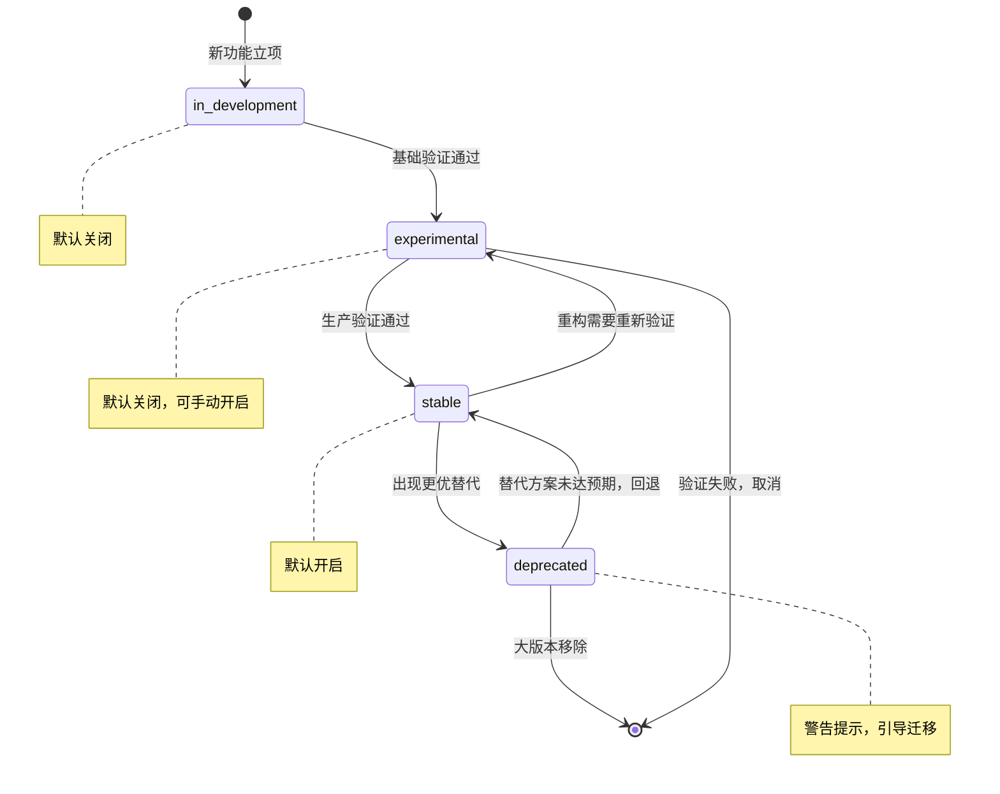
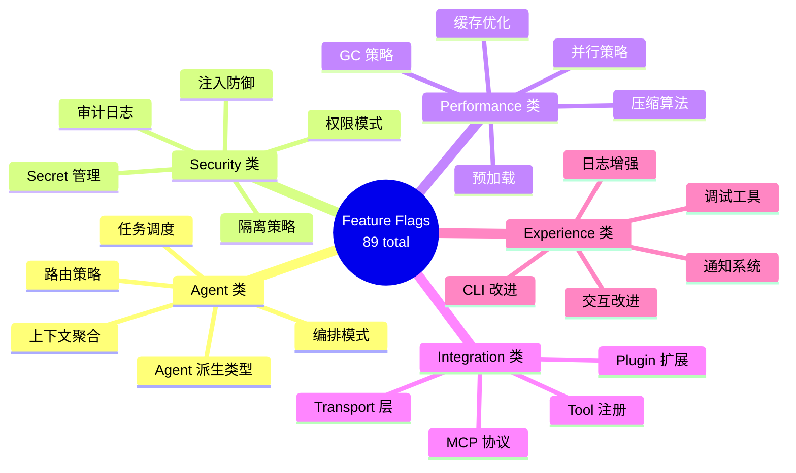
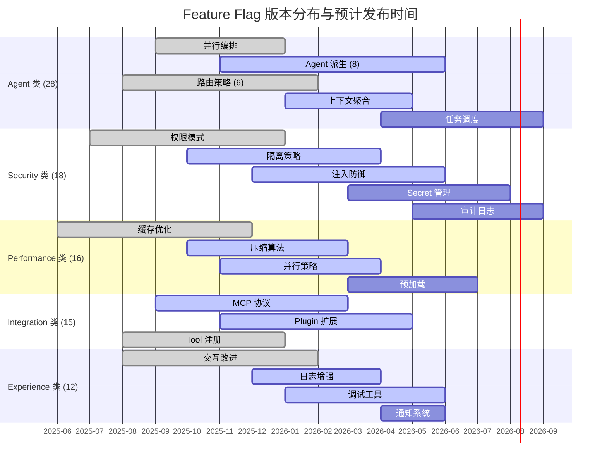

# Feature Flags 路线图

> **OMO 扩展说明**：本文描述的 Feature Flags 系统（89 个 Flags、`opencode flags list` 命令、`feature_flags` 配置字段）是 **oh-my-openagent (OMO)** 对 OpenCode 的扩展增强。原生 OpenCode 不包含 Feature Flags 系统。OMO 版本 v4.13.x，OpenCode 版本 v1.17.x。
>
> OMO 89 个 Feature Flag 不是随机的功能列表，它是产品迭代的仪表盘——告诉你哪些能力已经就绪、哪些正在开发、哪些即将到来。
> **适合读者**: 技术负责人 · 架构师

## 文章概述

Feature Flag（功能开关 / Feature Toggle）是一种渐进式交付机制。新功能以 Flag 形式隐藏在代码中，按需开启或关闭，而不是等到全部开发完成才一次发布。OMO（oh-my-openagent）拥有 89 个 Feature Flag，覆盖 **Agent（智能体）** 能力、安全策略、性能优化、集成生态和用户体验五大领域。理解这些 Flags 的当前状态和演进方向，就是读懂产品的迭代路线图。

本文首先介绍 Feature Flag 机制的工作原理——什么是 Feature Flag，为什么 OMO 需要 89 个 Flags（模块化设计 + 渐进式发布 + A/B 测试），以及 Flag 的完整生命周期。然后按领域分类讲解 Flags 的路线图：Agent 类、安全类、性能类、集成类、体验类。接着介绍如何查看当前 Flags 的状态、如何配置 Flags 的开启和关闭，以及如何参与社区讨论影响 Flags 的优先级。最后通过一个完整的 Flag 启用流程示例，帮助读者理解从发现到启用的实操步骤，并说明 Flag 的版本演进和废弃机制。读完本文，你将能够理解 OMO 的 89 个 Feature Flag 布局、按需启用新功能并参与社区影响产品迭代方向。

> **⏱ 时间有限？先读这些：** Flag 机制 → 路线图概览 → 按领域分类 → 配置方法

## 内容要点

1. **Feature Flag 机制** — 什么是 Feature Flag（功能开关），OMO 为什么需要 89 个 Flag（模块化架构 + 渐进式发布 + 灰度实验），Flag 的生命周期（开发中、实验性、稳定版、废弃）。

2. **路线图概览** — 按领域分类展示 Flags 的当前状态：已实现（可直接使用）、开发中（即将发布）、计划中（路线图规划）。Flag 的版本分布和预期发布时间线。

3. **按领域分类** — 五大领域 Flags 的详细介绍：Agent 类（新的编排模式、Agent 派生类型、路由策略）、安全类（新增权限模式、隔离策略、注入防御）、性能类（缓存优化、压缩算法、并行策略）、集成类（新 MCP 协议支持、**Plugin（插件）** 扩展点）、体验类（交互改进、日志增强、调试工具）。

4. **如何跟进** — 查看当前 Flags 的方法（命令行或配置查看），配置 Flags（按项目或全局启用/禁用），A/B 测试策略（不同团队使用不同 Flag 配置），参与社区决策（Issue 讨论、投票影响优先级）。包含一个完整的 Flag 从发现到启用的操作流程。说明 Flag 的版本演进和废弃机制（标记为废弃到最终移除的周期）。

## Feature Flag 机制

### 什么是 Feature Flag

Feature Flag 是一个条件开关，控制特定功能是否在运行时生效。最简单的实现是一个布尔值：

```json:opencode.json
{
  "feature_flags": {
    "agent_parallel_orchestration": true,
    "sandbox_enhanced_isolation": false
  }
}
```

当 `agent_parallel_orchestration` 为 `true` 时，Agent 调度器使用新的并行编排模式；否则回退到默认的串行模式。Flag 的改变不需要重新部署，修改配置后下次会话生效。

### 为什么需要 89 个 Flag

你可能觉得 89 个 Flag 太多。但这不是随意堆出来的数字，而是三个需求共同作用的结果。

**模块化架构**。OpenCode 的功能模块是高度解耦的——Agent 引擎、安全沙箱、缓存层、**MCP（模型上下文协议）** 集成、日志系统……每个模块都有自己的演进节奏。给每个独立能力配一个专属 Flag，意味着团队可以独立测试和发布各个模块的改进，而不需要等所有模块同步就绪。

**渐进式发布**。新功能不应该是"一把梭"式的发布。先在小范围验证，确认稳定后再逐步开放。Flag 让这个过程可控制、可回滚。一个高风险新功能可能在 v0.5 就进入代码库，但被 Flag 关闭着，直到 v0.8 才默认开启。

**A/B 测试**。同一个功能可能有多个实现方案。比如 Agent 的路由策略，可以用最短路径优先，也可以用历史成功率加权。通过 Flag 配置，不同团队可以使用不同的策略，实际对比效果后再决定哪个方案胜出。

这三个需求叠加，89 个 Flag 不是太多，而是刚刚好。

### Flag 的生命周期

每个 Feature Flag 都经历四个阶段：

**in-development（开发中）**。功能正在实现，Flag 默认关闭。只有开发者自己和参与测试的早期用户会开启它。这个阶段的 Flag 可能随时改动，不保证稳定性。

**experimental（实验性）**。功能基本可用，Flag 默认关闭，但可以通过配置手动开启。这个阶段的 Flag 已经通过了基本的单元测试和集成测试，但在真实场景中的表现还需要更多验证。文档可能还不完整。

**stable（稳定版）**。功能经过充分验证，Flag 默认开启。生产环境推荐使用。这个阶段的 Flag 有完善的文档、测试覆盖和错误处理。除非发现严重问题，否则行为不会变化。

**deprecated（废弃）**。功能有了更好的替代方案，Flag 被标记为废弃。默认值可能保持不变，但在后续的某个大版本中会被移除。配置工具会在检测到废弃 Flag 时给出警告，引导用户迁移到替代方案。



这个状态机中有两条重要的回退路径。`stable → experimental` 说明即使是稳定功能，如果引入了重大重构，也会降级回实验阶段重新验证。`deprecated → stable` 说明如果替代方案没达到预期，废弃的 Flag 可以被救回。版本不是单向的陡坡，一切以实际效果为准。

## 按领域分类

89 个 Feature Flag 分布在五个领域。以下是完整的分类关系：



每个领域的 Flags 数量和成熟度不同，反映了产品在不同阶段的侧重点。

### Agent 类（28 Flags）

| 子类 | Flags（数量） | 关键说明 |
|------|--------------|---------|
| 编排模式 | `agent_parallel_orchestration` 等（6） | 并行编排已 experimental，可缩短 40%-60% 耗时 |
| Agent 派生 | `agent_tester`, `agent_reviewer` 等（8） | tester 已 stable，reviewer experimental，其余 in-development |
| 路由策略 | `route_shortest_queue`, `route_success_rate` 等（6） | success_rate 成功率比 shortest_queue 高 12%，但响应慢 8% |
| 上下文聚合 | `context_multi_source_merge` 等（4） | 控制多源（会话/文件/MCP/记忆）聚合策略 |
| 任务调度 | `schedule_preemptive` 等（4） | 抢占式/公平队列/优先级继承/动态限流 |

### Security 类（18 Flags）

| 子类 | Flags（数量） | 关键说明 |
|------|--------------|---------|
| 权限模式 | `perm_least_privilege` 等（5） | least_privilege 已 stable 默认开启 |
| 隔离策略 | `isolate_process`, `isolate_container` 等（5） | 与沙箱系统的隔离机制配合 |
| 注入防御 | `defense_input_filter` 等（4） | 提示注入防御，含上下文物化检测 |
| Secret 管理 | `secret_external_store`, `secret_auto_rotation`（2） | 外部 Secret Store 集成与自动轮换 |
| 审计日志 | `audit_full_logging`, `audit_sensitive_tracking`（2） | 全量日志 + 敏感操作追踪 |

### Performance 类（16 Flags）

| 子类 | Flags（数量） | 关键说明 |
|------|--------------|---------|
| 缓存优化 | `cache_multi_level` 等（5） | 多级缓存已 stable，命中率 65%-80% |
| 压缩算法 | `compress_summary` 等（4） | 与上下文压缩技术的策略一一对应 |
| 并行策略 | `parallel_task_level` 等（4） | 从任务级到跨 Session 的并行粒度 |
| 预加载 | `preload_model`, `preload_context`（2） | 模型和上下文预加载 |
| GC 策略 | `gc_aggressive`（1） | 更积极地释放上下文 Token |

### Integration 类（15 Flags）

| 子类 | Flags（数量） | 关键说明 |
|------|--------------|---------|
| MCP 协议 | `mcp_streamable_http` 等（6） | MCP Streamable HTTP、鉴权、代理等新特性 |
| Plugin 扩展 | `plugin_dynamic_loading` 等（5） | 动态加载、沙箱、热更新、市场 API |
| Tool 注册 | `tool_dynamic_discovery` 等（2） | 动态发现 + 第三方注册 |
| Transport 层 | `transport_websocket`, `transport_sse`（2） | WebSocket 和 SSE |

### Experience 类（12 Flags）

| 子类 | Flags（数量） | 关键说明 |
|------|--------------|---------|
| 交互改进 | `ux_streaming_optimization` 等（4） | Streaming 优化、Markdown 渲染、差异对比 |
| 日志增强 | `log_structured_step` 等（3） | 结构化工步、耗时明细、错误上下文 |
| 调试工具 | `debug_execution_replay` 等（3） | Agent 回放、**Prompt（提示词）** 预览、Tool 监控 |
| 通知系统 | `notify_task_completion`（1） | 任务完成桌面通知 |
| CLI 改进 | `cli_autocomplete_enhanced`（1） | 增强命令行自动补全 |

## 路线图概览

### 版本分布

Feature Flags 随 OpenCode 版本迭代逐步开放。以下是在各版本中的分布概览：



### 当前状态一览

<!-- 历史版本快照，版本号保留用于变更追溯 -->
截至 `OMO v4.5.0`，89 个 Feature Flag 的状态分布：

| 状态 | 数量 | 占比 |
|------|------|------|
| stable（已实现，默认开启） | 24 | 27% |
| experimental（默认关闭，可启用） | 31 | 35% |
| in-development（开发中）| 28 | 31% |
| planned（已规划，未开始） | 6 | 7% |

**已实现**的 Flags 可以直接在生产环境中使用。**实验性**的 Flags 适合想尝鲜的团队——风险可控，功能基本可用，但文档和边界情况处理可能不够完善。**开发中**的 Flags 你可以参与讨论，你的反馈会影响它们的最终设计。**已规划**的 Flags 是下一阶段的重点，社区投票会决定它们的优先级。

### 预期发布时间线

所有时间线都基于当前规划的版本节奏估算。OpenCode 采用滚动发布模式，大约每 6-8 周一个版本：

<!-- 以下为版本演进时间线，历史版本号保留用于变更追溯 -->
- **`OMO v4.5.x`**（已发布）：31 个 experimental Flags 可用，24 个 stable
- **`OMO v4.6.x`**（已发布）：新增约 8 个 Flags，3 个 experimental 升级为 stable
- **OMO v4.13.x**（当前）：新增约 10 个 Flags，5 个 experimental 升级为 stable
- **OMO v5.0**（预计 Q4 2026）：规划中 Flags 基本完成，首个大版本

## 如何跟进

Feature Flags 的意义不在于"我知道有这个功能"，而在于"我知道怎么用、什么时候用、怎么参与它的演进"。

### 查看当前 Flags

**方式一：命令行**

```bash:terminal
opencode flags list
```

输出示例（简化）：

```text:terminal
  AGENT (28)               SECURITY (18)           PERFORMANCE (16)
  ✔ agent_parallel_...     ✔ perm_least_priv...    ✔ cache_multi_level
  ✔ agent_tester           ✗ perm_approval_...     ✗ compress_token_...
  ✗ agent_documenter       ✗ defense_context_...   ✔ parallel_agent_...
```

支持过滤：`opencode flags list --domain security`（按领域）、`--status experimental`（按状态）、`--since OMO v4.5.x`（按版本）。详细信息用 `opencode flags show --name <flag>` 查看，输出包含 Domain/Status/Introduced/Description/Deprecates/ReplacedBy 和对应的 GitHub Issue 链接。

### 配置 Flags

通过 `opencode.json` 配置（全局）或 `.opencode/config.json`（项目级覆盖），也支持环境变量 `OPENCODE_FEATURE_FLAGS` 临时覆盖（优先级最高）。例如：

```json:opencode.json
// opencode.json 全局开启
{ "feature_flags": { "agent_parallel_orchestration": true } }
```

```bash:terminal
# 环境变量临时覆盖
OPENCODE_FEATURE_FLAGS='{"agent_parallel_orchestration":true}' opencode run
```

### A/B 测试策略

对比不同 Flag 组合的效果：在配置中定义实验组（control/treatment），观察一周后对比平均响应时间、成功率和 Token 消耗。例如路由策略 A/B 测试——A 组用 `route_shortest_queue`，B 组用 `route_success_rate`。

```json:opencode.json
// 完整 experiments 配置示例见 opencode.json experiments 字段
```

### 参与社区决策

每个 Flag 有对应的 GitHub Issue（标签 `flag/[domain]/[flag-name]`）。用 +1 投票影响优先级——每季度前 5 名自动进入下一开发周期。`design-discussion` 阶段公开征求意见，是影响 Flag 行为的最佳时机。如需新 Flag，用模板 `flag-proposal` 提交 Issue。

### 完整操作流程

以启用 `agent_parallel_orchestration` 为例：

1. **确认状态**：`opencode flags show --name agent_parallel_orchestration` → experimental，`OMO v4.5.x+`
2. **了解限制**：见 Issue #892——不支持嵌套并行，默认并发数 4，依赖外部服务的工具不适合并行
3. **本地启用**：在配置中添加 `"agent_parallel_orchestration": true`
4. **验证效果**：对比开启前后 `opencode run --task ... --duration --measure` 的结果
5. **观察回退**：异常时关闭 Flag 即可，无需重新部署
6. **参与反馈**：在 Issue 中回复使用体验，直接影响何时进入 stable

### 废弃机制

Flag 标记 deprecated 后的生命周期：运行时警告（3 个版本）→ 默认值变更（2 个版本）→ 代码移除（1 个版本）→ 配置解析器不再识别。整个过程约 6-9 个月。`opencode flags list --status deprecated` 查看废弃 Flags，配置工具会提示替代方案和迁移指引。

## 关联章节

- ← [性能调优与成本管理](context/performance-tuning.md)（性能优化相关的 Flags 详解）
- ← [沙箱与 Hook 系统](sandbox-hooks.md)（安全类 Flags 的执行机制）
- ← [上下文压缩与Token 预算](context-compression.md)（压缩算法 Flags 的技术背景）
- → [全书](../)

## 验证标准

完成本文学习后，你应该能：

1. 解释 OpenCode 的三种 Flag 类型（stable/beta/experimental）及其风险等级差异
2. 在配置中启用或禁用一个 Feature Flag，并说明其对应的行为变化
3. 描述 Flag 从实验阶段到废弃的完整生命周期（deprecated → 默认值变更 → 代码移除）
4. 使用 `opencode flags list` 命令按领域或状态筛选 Flag
5. 设计一个分阶段灰度发布策略，利用 Flag 控制新功能的逐步放量
