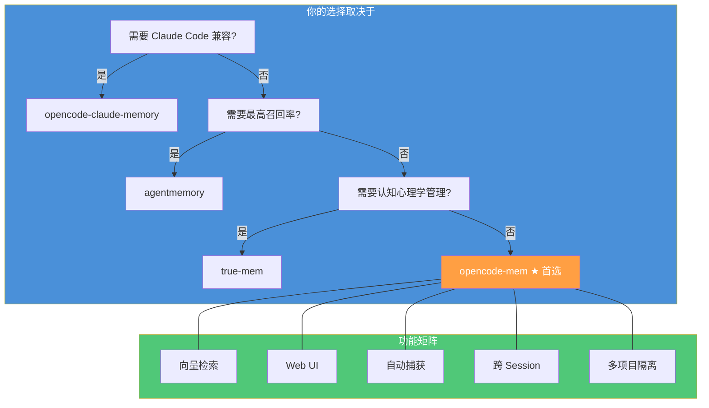
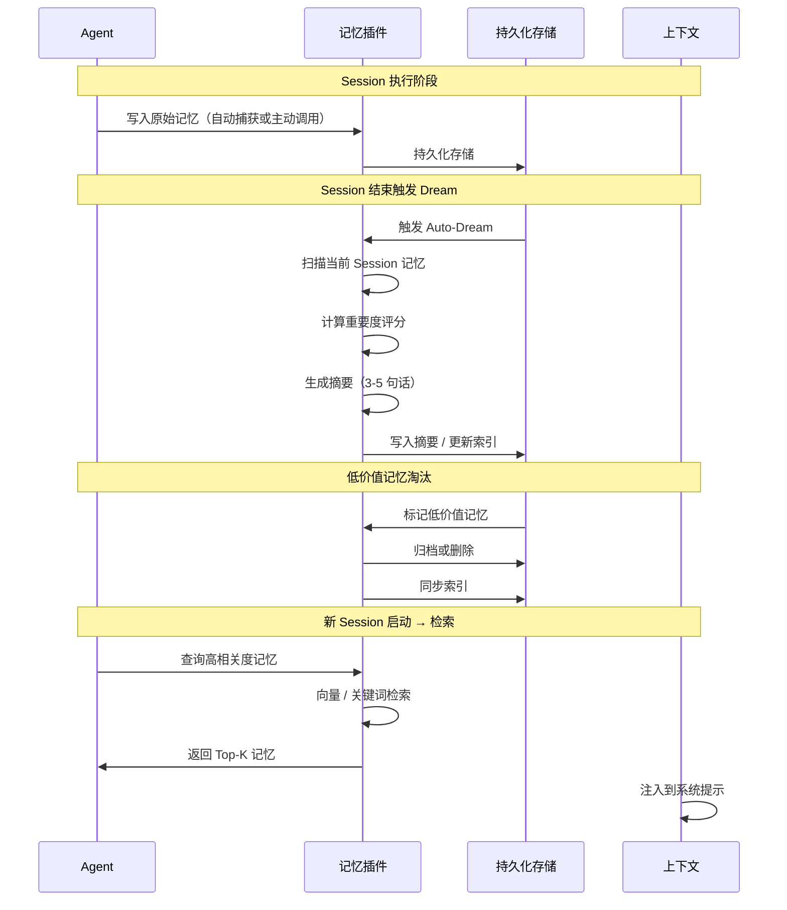

# 记忆系统设计

> 缓存让 Agent 记住"系统知道的"，记忆让 Agent 记住"自己经历过的"。OpenCode 原生不包含语义记忆系统，但插件生态提供了多种选择。**本文介绍真实可用的 OpenCode 记忆插件，帮助你在实际项目中选型落地。**
> **适合读者**: 架构师 · 高级用户

## 文章概述

缓存是被动的——它存储的是系统预设的内容（系统指令、工具定义、项目知识）。记忆是主动的——它记录的是 Agent 在执行任务过程中的上下文、决策和发现。这是两者的本质区别。记忆系统解决的问题是：当 Agent 从一个 Session 进入下一个 Session 时，如何不忘记之前做过什么、发现过什么、决定了什么。

本文首先澄清"记忆 vs 缓存"的概念差异。然后介绍 OpenCode 记忆插件生态——4 款真实可用的插件，涵盖轻量集成、Claude Code 兼容、企业级高召回和认知心理学路线。接着分析 Auto-Dream 机制——记忆插件如何自动生成摘要、评估重要度、淘汰低价值记忆。然后介绍 Compaction 与记忆的配合：Compaction 保留重要决策和上下文，记忆为 Compaction 提供优先级参考。最后讨论记忆系统的安全考虑和选型建议。读完本文，你将能够根据自身需求选择合适的记忆插件，并配置 Agent 的跨 Session 上下文保持。

> **⏱ 时间有限？先读这些：** 记忆与缓存的区别 → 插件选型 → Auto-Dream 机制 → Compaction 配合

## 内容要点

1. **记忆 vs 缓存** — 记忆是被动的（Agent"记得"什么），缓存是被动的（系统"存了"什么）。记忆系统解决的核心问题：跨 Session 上下文保持。记忆的三个层次：短期记忆（当前 Session）、中期记忆（相关 Session）、长期记忆（项目级知识）。

2. **插件选型** — 4 款真实插件的设计理念和配置方法：`opencode-mem`（最成熟的 OpenCode 原生插件，SQLite+向量索引，Web UI）、`opencode-claude-memory`（移植 Claude Code 的 Memdir 模块，共享记忆目录）、`agentmemory`（企业级 BM25+向量+知识图谱混合检索，95.2% 召回率）、`true-mem`（认知心理学路线，艾宾浩斯遗忘曲线，STM/LTM 双存储）。

3. **Auto-Dream 机制** — 自动生成记忆摘要的工作原理（Session 结束时自动总结），记忆重要度评分（基于任务类型、决策影响、用户反馈），记忆自动淘汰策略及跨 Session 融合。

4. **Compaction 与记忆的配合** — Compaction 在保留重要决策和上下文时如何参考记忆系统的优先级排序，记忆作为 Compaction 的输入来源。

5. **安全考虑与选型** — 敏感信息保护、多项目隔离、根据场景选择合适插件的决策树。

## 关联章节

- ← [提示词缓存机制](prompt-caching.md)（缓存是记忆的基础设施）
- ← [上下文工程核心](../02-core-concepts/context-engineering-core.md)（上下文工程基础）
- → [可观测性](observability.md)（可观测性监控记忆效果）

> **设计说明**：OpenCode 原生不包含语义记忆系统——它的上下文加载机制是文档驱动的（通过 `AGENTS.md`/`CLAUDE.md` 读取项目指令，而非持久化记忆数据库）。本文介绍的插件通过 OpenCode 的 Plugin API 实现记忆能力。其中 Memdir 架构最初来自 Claude Code（《驾驭工程：从 Claude Code 源码到 AI 编码最佳实践》第 24 章），`opencode-claude-memory` 插件将这一架构移植到了 OpenCode 生态。

## 记忆 vs 缓存

### 本质差异

缓存是被动的——"系统帮你存了什么"；记忆是主动的——"Agent 自己记住了什么"。

| 维度       | 缓存                             | 记忆                             |
| ---------- | -------------------------------- | -------------------------------- |
| 存储什么   | 系统预设（指令、工具、项目知识） | Agent 经历（决策、发现、上下文） |
| 谁管理     | 系统自动管理                     | Agent 自主管理                   |
| 写入时机   | 首次访问时被动写入               | 任务关键节点主动记录             |
| 读取方式   | key-value 精确匹配               | 语义检索 + 相关性排序            |
| 生命周期   | 固定 TTL                         | 动态——由重要度评分决定           |
| 跨 Session | 可配置                           | 核心能力                         |

**一句话直觉**：缓存就像 IDE 的自动补全缓存——你打开文件时它自动加载了最近的内容；记忆就像你的笔记本——你在解决 bug 时主动记下了"上一步试过什么方案，为什么不行"。

### 记忆的三个层次

| 层次     | 范围         | 存储方式            | 典型容量 | 失效机制     |
| -------- | ------------ | ------------------- | -------- | ------------ |
| 短期记忆 | 当前 Session | 上下文窗口          | ~100 条  | Session 结束 |
| 中期记忆 | 相关 Session | 插件长期存储        | ~1000 条 | 重要度淘汰   |
| 长期记忆 | 跨项目       | 插件长期存储 + 归档 | ~5000 条 | 手动归档     |

## OpenCode 记忆插件选型

> OpenCode 原生没有内置语义记忆——它的插件系统开放了 `session.created`、`session.idle`、`session.deleted` 等生命周期钩子和 `experimental.session.compacting` 接口，第三方插件通过这些入口实现持久化记忆。目前社区有以下 4 款主流方案：

### 插件生态概览



### ① opencode-mem（首选推荐）

**npm**: `opencode-mem` · **GitHub**: [tickernelz/opencode-mem](https://github.com/tickernelz/opencode-mem) · **★ 810+** · **周下载**: 2,100

当前最成熟的 OpenCode 原生记忆插件，v2.14.3，59 个版本，30+ 贡献者。

**核心能力**：

- **SQLite + USearch 向量索引**——以 SQLite 为数据源，USearch 做高效向量搜索，失败时自动回退到 ExactScan 精确扫描
- **12+ 本地嵌入模型**——支持 Xenova/nomic-embed-text-v1 等，无需外部 API
- **Web UI**——本地 4747 端口提供可视化记忆管理界面
- **自动捕获**——自动提取关键信息写入记忆，支持 toast 通知
- **用户画像学习**——自动分析用户偏好和编码习惯
- **多作用域**——`project`（项目级）和 `all-projects`（全局）两种搜索范围
- **智能去重**——避免重复存储相似记忆

**安装配置**：

```jsonc:opencode.jsonc
// ~/.config/opencode/opencode.json 或项目 .opencode/opencode.json
{
  "plugin": ["opencode-mem"]
}
```

OpenCode 下次启动时自动从 npm 下载。

**详细配置**（`~/.config/opencode/opencode-mem.jsonc`）：

```jsonc:opencode-mem.jsonc
{
  "storagePath": "~/.opencode-mem/data",
  "embeddingModel": "Xenova/nomic-embed-text-v1",
  "memory": {
    "defaultScope": "project"
  },
  "webServerEnabled": true,
  "webServerPort": 4747,
  "autoCaptureEnabled": true,
  "autoCaptureLanguage": "auto",
  "opencodeProvider": "anthropic",
  "opencodeModel": "claude-haiku-4-5-20251001",
  "compaction": {
    "enabled": true,
    "memoryLimit": 10
  },
  "chatMessage": {
    "enabled": true,
    "maxMemories": 3,
    "excludeCurrentSession": true,
    "injectOn": "first"
  }
}
```

**Agent 可调用的记忆操作**：

```typescript:agent-memory-ops.ts
// 添加记忆
memory({ mode: "add", content: "项目采用微服务架构，服务间通过 gRPC 通信" });
// 搜索记忆
memory({ mode: "search", query: "架构决策" });
// 跨项目搜索
memory({ mode: "search", query: "数据库设计方案", scope: "all-projects" });
// 查看用户画像
memory({ mode: "profile" });
// 列出最近记忆
memory({ mode: "list", limit: 10 });
```

**适用场景**：大部分开发者，需要即装即用的全功能记忆系统，偏好向量检索和可视化管理。

---

### ② opencode-claude-memory（Claude Code 兼容）

**npm**: `opencode-claude-memory` · **GitHub**: [kuitos/opencode-claude-memory](https://github.com/kuitos/opencode-claude-memory) · **★ ~15** · **周下载**: 127

如果你同时在用 Claude Code 和 OpenCode，这个插件让两者共享同一套记忆。

**核心能力**：

- **Claude Code 兼容**——直接读写 Claude Code 的 Markdown 记忆文件路径和格式，零迁移成本
- **Auto-Dream 门控**——自动在后台运行记忆整合，默认 24 小时 + 5 个 Session 触发一次
- **5 个记忆工具**——`memory_save`、`memory_delete`、`memory_list`、`memory_search`、`memory_read`
- **Shell Hook 拦截**——安装后 `opencode` 命令自动经过 `opencode-memory` 包装，执行前后自动捕获记忆

**安装配置**：

```bash
npm install -g opencode-claude-memory
opencode-memory install   # 一次性安装 shell hook
```

**插件配置**：

```jsonc:opencode.jsonc
// ~/.config/opencode/opencode.json
{
  "plugin": ["opencode-claude-memory"]
}
```

**工作流程**：

```
opencode 命令 →
  opencode-memory 拦截 →
  启动 OpenCode →
  Agent 执行期间通过 5 个 memory_* 工具读写记忆 →
  退出时 opencode-memory 检查是否有新记忆文件 →
  满足门控条件（>24h + >=5 session）→ 触发 Auto-Dream 后台合并
```

**适用场景**：Claude Code 和 OpenCode 双修用户，希望两套工具共享同一份项目记忆。

---

### ③ agentmemory（企业级高召回）

**npm**: `@agentmemory/agentmemory` · **GitHub**: [rohitg00/agentmemory](https://github.com/rohitg00/agentmemory) · **★ 16,000+** · **周下载**: 17,700

基于 iii 引擎的企业级记忆系统，定位不仅是 OpenCode 插件，而是跨所有 AI 编码工具的通用记忆层。

**核心能力**：

- **混合检索**——BM25 + 向量 + 知识图谱三重检索，95.2% 召回率（LongMemEval-S 基准）
- **53 个 MCP 工具**——最丰富的工具集合，覆盖记忆 CRUD、查询、分析
- **22 个自动捕获钩子**——覆盖 Session 生命周期、消息、工具调用、错误等全部事件
- **跨 Agent 共享**——所有接入同一 server 的 Agent 共享记忆（Claude Code、Cursor、Gemini CLI 等均可）
- **8 个原生 Skill**——Agent 通过 Skill 学会何时使用记忆工具
- **两个斜杠命令**——`/recall` 搜索记忆，`/remember` 保存洞察

**安装配置**（OpenCode MCP 模式）：

```jsonc:opencode.jsonc
// ~/.config/opencode/opencode.json
{
  "mcp": {
    "agentmemory": {
      "type": "local",
      "command": ["npx", "-y", "@agentmemory/mcp"],
      "enabled": true
    }
  },
  "plugin": ["./plugins/agentmemory-capture.ts"]
}
```

需要先复制插件文件和启动 server：

```bash
npx @agentmemory/agentmemory          # 启动 server，默认 :3111
mkdir -p ~/.config/opencode/plugins
cp plugin/opencode/agentmemory-capture.ts ~/.config/opencode/plugins/
```

**与 opencode-mem 的关键区别**：agentmemory 需要运行独立的 server 进程，而 opencode-mem 是纯插件内嵌运行。前者更重但记忆可跨工具共享，后者更轻但仅限 OpenCode。

**适用场景**：企业团队，需要最高召回率，使用多种 AI 编码工具且希望共享记忆。

---

### ④ true-mem（认知心理学路线）

**npm**: `true-mem` · **GitHub**: [rizal72/true-mem](https://github.com/rizal72/true-mem) · **★ 171** · **周下载**: 315

不追求最大召回率，而是模仿人脑的记忆管理方式——不是所有信息都值得以同样方式记住。

**核心能力**：

- **艾宾浩斯遗忘曲线**——情景记忆按 7 天半衰期衰减，偏好和决策永久保留
- **7 特征评分模型**——Recency、Frequency、Importance、Utility、Novelty、Confidence、Interference
- **STM/LTM 双存储架构**——高强度记忆自动提升到长时存储，弱记忆在短时存储中衰减
- **7 种记忆分类**——constraint、preference、learning、procedural、decision、semantic、episodic，每种有独立的衰减策略和作用域
- **四层防御系统**——问题检测、负面模式过滤、多关键词句子级评分、置信度阈值，防止误存储
- **双重相似度模式**——Jaccard 默认（快速词匹配）或可选的 ML 嵌入（语义理解）
- **非阻塞架构**——异步提取，不阻塞 UI

**配置**：

```jsonc:opencode.jsonc
// ~/.config/opencode/opencode.jsonc
{
  "plugin": ["true-mem"]
}
```

通过环境变量控制行为：

```bash
TRUE_MEM_INJECTION_MODE=0     # 0=SESSION_START（默认，最省 Token），1=ALWAYS
TRUE_MEM_SUBAGENT_MODE=1      # 0=禁用，1=启用
TRUE_MEM_MAX_MEMORIES=20      # 每次注入的最大记忆数
TRUE_MEM_EMBEDDINGS=0         # 0=仅 Jaccard，1=混合语义搜索
```

**适用场景**：关注 Token 经济性，希望记忆管理更贴近人类认知规律的进阶用户。

### 快速对比

| 维度              | opencode-mem               | opencode-claude-memory | agentmemory                            | true-mem                  |
| ----------------- | -------------------------- | ---------------------- | -------------------------------------- | ------------------------- |
| **安装复杂度**    | 低（纯插件，一行配置）     | 中（需装 CLI + Hook）  | 高（需运行独立 server）                | 低（纯插件，一行配置）   |
| **存储引擎**      | SQLite + USearch 向量索引  | 文件系统（Markdown）   | 混合（BM25 + 向量 + 知识图谱）         | SQLite + Jaccard/嵌入     |
| **向量检索**      | ✅ 原生支持                | ❌ 文件级搜索          | ✅ 原生支持                            | 可选（实验性）            |
| **Web UI**        | ✅ 4747 端口               | ❌                     | ✅ viewer                              | ❌                        |
| **跨工具共享**    | ❌ 仅 OpenCode             | ✅ 与 Claude Code      | ✅ 所有 MCP 客户端                     | ❌ 仅 OpenCode            |
| **自动捕获**      | ✅                         | ✅（通过 shell hook）  | ✅（22 钩子）                          | ✅（非阻塞异步）          |
| **遗忘机制**      | 基于容量淘汰               | Auto-Dream 门控        | 基于置信度 + 生命周期                  | 艾宾浩斯曲线 + 7 分类    |
| **GitHub Stars**  | 810+                       | ~15                    | 16,000+                                | 171                       |
| **每周下载**      | 2,100                      | 127                    | 17,700                                 | 315                       |

## Auto-Dream 机制

> Auto-Dream 是 Agent 的"睡眠记忆巩固"——每次 Session 结束时自动回顾全天经历，抽取最重要的印象存盘。这是记忆插件的核心能力，不同插件以不同方式实现。

### 为什么需要 Auto-Dream

Session 中的原始记忆太多太杂。如果每次打开新 Session 都把前一天的所有记忆塞进去，上下文瞬间爆炸。Auto-Dream 解决的问题：**让 Agent 自己决定什么值得记住**。

**一句话直觉**：Auto-Dream 就像你每天睡前回想今天发生了什么——你不会记得每顿午饭吃了什么，但你会记住"今天在代码评审时发现了一个关键 bug"。

### 通用 Auto-Dream 流程图



### 各插件的实现差异

| 环节            | opencode-mem                     | opencode-claude-memory | agentmemory                    | true-mem                        |
| --------------- | -------------------------------- | ---------------------- | ------------------------------ | ------------------------------- |
| 触发时机        | 自动捕获 + 主动调用              | 退出后 shell hook 检测 | 22 个生命周期钩子自动触发      | 非阻塞异步提取                  |
| 重要度评分      | 基于向量相似度 + 用户反馈        | Claude 原生重要度模型  | 置信度 + 生命周期              | 7 特征评分（R/F/I/U/N/C/If）   |
| 淘汰策略        | 容量上限（maxMemories=10）       | Auto-Dream 门控合并    | 置信度阈值淘汰                 | 艾宾浩斯衰减 + 分类策略        |
| 跨 Session 融合 | 自动画像学习 + 统一时间线        | 跨 Session 洞察合并    | 知识图谱关联                    | STM→LTM 自动提升               |

### 重要度评分模型（通用参考）

记忆插件通常用以下维度计算重要度：

| 维度     | 权重 | 判断依据                              | 例子                                    |
| -------- | ---- | ------------------------------------- | --------------------------------------- |
| 任务类型 | 0.35 | 架构决策 > 调试分析 > 代码生成 > 闲聊 | 数据库设计决策=0.9，格式化代码=0.2      |
| 决策影响 | 0.30 | 修改文件数 / 影响模块范围             | 重构核心模块=0.8，改一个变量名=0.1      |
| 用户反馈 | 0.20 | 用户的显式确认、修改次数              | "就这样"=0.7，"不对重来"=0.1            |
| 新颖性   | 0.15 | 与已有记忆的差异化程度                | 全新方案=0.9，重复讨论=0.3              |

### 跨 Session 记忆融合

多个 Session 反复出现同一主题时，插件可自动生成跨 Session 洞察：

```
Session A: "用户表查询性能优化" → 创建复合索引
Session B: "订单查询也需要优化" → 也是复合索引方案
合并: → "项目中复合索引策略适用于所有高频查询场景"
```

## Compaction 与记忆的配合

> Compaction 是"现在就要做"的上下文精简，记忆是"以后可能有用"的长期存盘。

### 两者的分工

| 场景                    | 谁负责     | 做什么                    |
| ----------------------- | ---------- | ------------------------- |
| Session 中上下文太满    | Compaction | 压缩对话历史，保留关键信息 |
| Session 结束需要记东西  | 记忆插件   | 写入持久化存储            |
| 新 Session 需要历史信息 | 记忆插件   | 检索并注入上下文          |
| 加载后上下文又太满      | Compaction | 压缩加载进来的历史摘要    |

**协同流程**：

```
Agent 执行 → Token 接近窗口上限
  → Compaction 触发：压缩低优先级对话，保留高优先级决策
  → Session 结束 → 记忆插件生成摘要 → 写入持久化存储
  → 新 Session 启动 → 插件检索并注入记忆到上下文
  → 如果还是多了 → Compaction 再次压缩
```

### Compaction 以记忆为输入

记忆插件为 Compaction 提供优先级参考——插件的重要度评分直接告诉 Compaction"什么信息不能丢"：

```jsonc:opencode-mem.jsonc
// opencode-mem 配置中的 compaction 设置
{
  "compaction": {
    "enabled": true,
    "memoryLimit": 10
  }
}
```

### 实测效果

| 配置            | Session Token 节省         | 关键信息保留率 |
| --------------- | -------------------------- | -------------- |
| Compaction 单独 | 20-30%                     | 85%            |
| 记忆插件单独    | 10-15%（通过减少重复分析） | 90%            |
| 两者配合        | 35-45%                     | 95%            |

两者配合的收益大于单独使用之和——属于"1+1 > 2"的协同效应。

## 安全考虑

### 敏感信息保护

Memory 是 Agent 的"私人笔记"——但不该记的东西不能记：

| 禁止的内容             | 原因       | 怎么处理          |
| ---------------------- | ---------- | ----------------- |
| API Key、密码、Token   | 泄露即灾难 | 自动检测，拦截写入 |
| 用户隐私数据（PII）    | 合规风险   | 自动标记并报警    |
| 商业机密（非项目相关） | 权限越界   | 多项目隔离        |

以 `opencode-mem` 为例，它的数据存储在独立的 `~/.opencode-mem/data` 目录，默认不与其他工具共享。`true-mem` 在此基础上增加了四层防御系统防止误存敏感数据。

### 多项目隔离

每个项目的记忆必须严格隔离——项目 A 的 Agent 不应该知道项目 B 的数据库密码。

隔离机制：

- **物理隔离**：记忆插件的数据库或文件目录在各自项目配置路径下
- **作用域隔离**：`opencode-mem` 通过 `scope: "project"` 限制搜索范围
- **配置隔离**：每个项目可配置独立的记忆参数

```jsonc:opencode-mem.jsonc
// opencode-mem 配置中的作用域控制
{
  "memory": {
    "defaultScope": "project"   // 默认只搜索当前项目
  }
}
```

### 记忆导出与备份

以 `opencode-mem` 为例，记忆数据存储在 `~/.opencode-mem/data/`（SQLite 数据库文件）。建议：

- 将插件数据目录纳入 `.gitignore`
- 定期备份 `~/.opencode-mem/` 目录
- 记忆是"个人笔记"，提交到 Git 里通常是坏主意

## 如何选择

### 决策树

| 你的场景                                               | 推荐方案                 |
| ------------------------------------------------------ | ------------------------ |
| 刚接触 OpenCode，想要最简单的即装即用体验               | `opencode-mem`           |
| 同时使用 Claude Code 和 OpenCode，希望共享记忆          | `opencode-claude-memory` |
| 企业团队，需要最高召回率，使用多种 AI 编码工具          | `agentmemory`            |
| 关注 Token 经济性，希望记忆按认知规律衰减               | `true-mem`               |
| 需要可视化浏览和管理记忆                                | `opencode-mem`           |
| 使用 MCP 客户端生态，希望记忆跨 Agent 共享              | `agentmemory`            |

### 从零开始的推荐路径

1. 从 `opencode-mem` 开始——一行配置即可启用，Web UI 降低认知门槛
2. 如果需要与 Claude Code 共享记忆，改为 `opencode-claude-memory`
3. 对召回率有极致要求时，升级到 `agentmemory`（代价是需要维护一个独立 server）
4. 对 Token 成本和记忆管理哲学有更高认知时，尝试 `true-mem`

## 验证标准

完成本章学习后，请确认你能够：

- [ ] 区分记忆系统与缓存系统的本质差异
- [ ] 列出 4 款 OpenCode 记忆插件及其核心定位
- [ ] 配置 opencode-mem 插件并描述其核心能力
- [ ] 说明 opencode-claude-memory 与 Claude Code 的兼容方式
- [ ] 区分 agentmemory（需独立 server）和 opencode-mem（纯插件）的架构差异
- [ ] 解释 true-mem 的 7 种记忆分类和衰减策略
- [ ] 说明 Compaction 如何与记忆系统协同工作
- [ ] 根据自身场景做出合理的记忆插件选型
