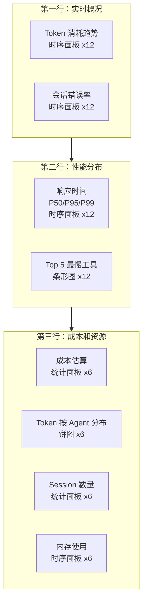

# 可观测性参考

> 本文为 [可观测性](./observability.md) 的配套参考文件，包含详细的 PromQL 查询、日志聚合配置、Grafana 仪表板配置和 Shell 聚合命令。阅读主文后按需查阅。

## Prometheus 指标与 PromQL 查询

### 暴露的关键指标

```bash
# HELP opencode_sessions_total Total number of sessions
# TYPE opencode_sessions_total counter
opencode_sessions_total{status="success"} 1247
opencode_sessions_total{status="error"} 23

# HELP opencode_tokens_used_total Total tokens consumed
# TYPE opencode_tokens_used_total counter
opencode_tokens_used_total{model="claude-sonnet-4-20250514",type="input"} 2847000
opencode_tokens_used_total{model="claude-sonnet-4-20250514",type="output"} 512000

# HELP opencode_request_duration_seconds Request latency distribution
# TYPE opencode_request_duration_seconds histogram
opencode_request_duration_seconds_bucket{agent="build",le="1"} 845
opencode_request_duration_seconds_bucket{agent="build",le="5"} 1123
opencode_request_duration_seconds_bucket{agent="build",le="10"} 1198
opencode_request_duration_seconds_bucket{agent="build",le="+Inf"} 1247
opencode_request_duration_seconds_count{agent="build"} 1247

# HELP opencode_errors_total Total errors by type
# TYPE opencode_errors_total counter
opencode_errors_total{type="tool_error"} 15
opencode_errors_total{type="api_error"} 8
opencode_errors_total{type="permission_denied"} 3

# HELP opencode_tool_call_duration_seconds Tool call duration
# TYPE opencode_tool_call_duration_seconds histogram
opencode_tool_call_duration_seconds_bucket{tool="read_file",le="0.05"} 892
opencode_tool_call_duration_seconds_bucket{tool="read_file",le="0.1"} 945
opencode_tool_call_duration_seconds_bucket{tool="read_file",le="+Inf"} 1002
```

指标按 `agent`、`model`、`tool` 等标签区分维度。

### 常用 PromQL 查询

```promql
# Token 消耗速率（每分钟）
rate(opencode_tokens_used_total[1m])

# 按模型分组的 Token 消耗
sum by (model) (rate(opencode_tokens_used_total[5m]))

# 错误率（过去 5 分钟）
rate(opencode_errors_total[5m]) / rate(opencode_sessions_total[5m]) * 100

# P95 响应时间
histogram_quantile(0.95, sum(rate(opencode_request_duration_seconds_bucket[5m])) by (le))
```

### 趋势预测查询

```promql
# 预测未来 1 小时的 Token 消耗
predict_linear(rate(opencode_tokens_used_total[1h])[1h], 3600)

# 检测同比异常（与 24 小时前对比）
rate(opencode_errors_total[1h]) / rate(opencode_errors_total[1h] offset 24h)
```

### 成本分析查询

```promql
# 按 Agent 分组的 Token 消耗占比
sum by (agentId) (rate(opencode_tokens_used_total[7d])) / ignoring(agentId) sum(rate(opencode_tokens_used_total[7d])) * 100

# 输入 vs 输出 Token 比例
sum by (type) (rate(opencode_tokens_used_total[7d]))
```

## 日志聚合配置

### Loki + Promtail

```yaml:/etc/opencode/promtail-config.yaml
clients:
  - url: http://loki:3100/loki/api/v1/push
    labels:
      app: opencode
      environment: production

scrape_configs:
  - job_name: opencode
    static_configs:
      - targets: [localhost]
        labels:
          job: opencode
          __path__: /var/log/opencode/*.log
    pipeline_stages:
      - json:
          expressions:
            level: level
            type: type
            agentId: agentId
            sessionId: sessionId
      - labels:
          level:
          type:
          agentId:
```

这条配置让 Loki 将 `level`、`type`、`agentId` 作为索引标签。在 Grafana 中可以用 `{agentId="build"} |= "error"` 快速过滤。

### ELK Stack

Filebeat -> Elasticsearch -> Kibana 的组合适合需要全文搜索和复杂聚合的场景。

**Filebeat 采集配置**：

```yaml:/etc/filebeat/filebeat.yml
filebeat.inputs:
  - type: log
    enabled: true
    paths:
      - /var/log/opencode/*.log
    json.keys_under_root: true
    json.add_error_key: true

output.elasticsearch:
  hosts: ["http://elasticsearch:9200"]
  index: "opencode-logs-%{+yyyy.MM.dd}"

setup.kibana:
  host: "http://kibana:5601"
```

**Elasticsearch 映射模板**确保 `payload` 字段被正确索引为 `object` 类型：

```json:elasticsearch-mapping.json
{
  "index_patterns": ["opencode-logs-*"],
  "template": {
    "mappings": {
      "properties": {
        "timestamp": { "type": "date" },
        "level": { "type": "keyword" },
        "type": { "type": "keyword" },
        "sessionId": { "type": "keyword" },
        "agentId": { "type": "keyword" },
        "traceId": { "type": "keyword" },
        "payload": { "type": "object", "enabled": true }
      }
    }
  }
}
```

## Grafana 仪表板

推荐监控面板布局：

```json:/etc/opencode/grafana-dashboard.json
{
  "dashboard": {
    "title": "OpenCode 生产监控",
    "panels": [
      {
        "id": 1,
        "title": "Token 消耗趋势",
        "type": "timeseries",
        "gridPos": { "h": 8, "w": 12, "x": 0, "y": 0 },
        "targets": [{
          "expr": "sum(rate(opencode_tokens_used_total[5m])) by (model)",
          "legendFormat": "{{model}}"
        }]
      },
      {
        "id": 2,
        "title": "会话错误率",
        "type": "timeseries",
        "gridPos": { "h": 8, "w": 12, "x": 12, "y": 0 },
        "targets": [{
          "expr": "rate(opencode_errors_total[5m]) / rate(opencode_sessions_total[5m]) * 100",
          "legendFormat": "error_rate"
        }]
      },
      {
        "id": 3,
        "title": "响应时间 P50 / P95 / P99",
        "type": "timeseries",
        "gridPos": { "h": 8, "w": 12, "x": 0, "y": 8 },
        "targets": [
          {
            "expr": "histogram_quantile(0.50, sum(rate(opencode_request_duration_seconds_bucket[5m])) by (le))",
            "legendFormat": "P50"
          },
          {
            "expr": "histogram_quantile(0.95, sum(rate(opencode_request_duration_seconds_bucket[5m])) by (le))",
            "legendFormat": "P95"
          },
          {
            "expr": "histogram_quantile(0.99, sum(rate(opencode_request_duration_seconds_bucket[5m])) by (le))",
            "legendFormat": "P99"
          }
        ]
      },
      {
        "id": 4,
        "title": "Top 5 最慢工具",
        "type": "bargauge",
        "gridPos": { "h": 8, "w": 12, "x": 12, "y": 8 },
        "targets": [{
          "expr": "topk(5, sum by (tool) (rate(opencode_tool_call_duration_seconds_sum[5m]) / rate(opencode_tool_call_duration_seconds_count[5m])))",
          "legendFormat": "{{tool}}"
        }]
      }
    ]
  }
}
```

### 仪表板布局



## logEvent 详细配置

### 过滤配置

```json:opencode.json
{
  "telemetry": {
    "logging": {
      "level": "info",
      "filters": {
        "includeTypes": [
          "tool_call",
          "model_request",
          "session_start",
          "session_end",
          "error"
        ],
        "excludeTypes": ["system_cpu", "system_memory", "debug"],
        "minDurationMs": 100,
        "sampleRates": {
          "tool_call": 0.5,
          "network_request": 0.1
        }
      }
    }
  }
}
```

### 输出方式配置

```json:opencode.json
{
  "telemetry": {
    "logging": {
      "level": "info",
      "format": "json",
      "outputs": {
        "console": {
          "enabled": true,
          "colorized": true
        },
        "file": {
          "enabled": true,
          "path": "/var/log/opencode/opencode.log",
          "rotation": {
            "maxSize": "100MB",
            "maxAge": 30,
            "maxBackups": 10
          }
        },
        "forward": {
          "enabled": true,
          "type": "elasticsearch",
          "url": "http://elasticsearch:9200",
          "index": "opencode-logs",
          "batchSize": 100,
          "flushInterval": 5
        }
      }
    }
  }
}
```

## Shell 聚合命令

### 按时间范围和类型统计

```bash
# 统计过去一小时的错误事件
cat /var/log/opencode/opencode.log | \
  jq 'select(.level == "error" and .timestamp > "2026-06-04T09:00:00Z")' | \
  jq -s 'group_by(.type) | map({type: .[0].type, count: length})'

# 按 Agent 聚合 Token 消耗
cat /var/log/opencode/opencode.log | \
  jq 'select(.type == "model_request")' | \
  jq -s 'group_by(.agentId) | map({agent: .[0].agentId, tokens: map(.payload.tokens_in + .payload.tokens_out) | add})'
```

### 性能瓶颈分析

```bash
# 找到平均耗时最高的工具
cat /var/log/opencode/opencode.log | \
  jq 'select(.type == "tool_result")' | \
  jq -s 'group_by(.payload.tool) | map({tool: .[0].payload.tool, avg_duration: (map(.payload.duration_ms) | add / length), count: length}) | sort_by(.avg_duration) | reverse[:5]'
```
