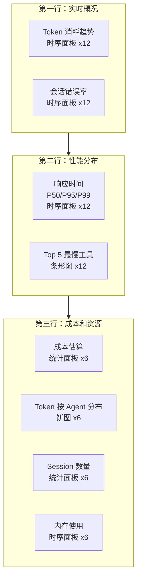

# 可观测性参考

> 本文为 [可观测性](./observability.md) 的配套参考文件，包含详细的 PromQL 查询、日志聚合配置、Grafana 仪表板配置和 Shell 聚合命令。阅读主文后按需查阅。

> **⏱ 时间有限？先读这些：** Prometheus 指标 → PromQL 查询 → 日志配置 → Grafana 仪表板 → Shell 命令

## Prometheus 指标与 PromQL 查询

### 暴露的关键指标

```bash:terminal
# HELP opencode_sessions_total Total number of sessions
# TYPE opencode_sessions_total counter
opencode_sessions_total{status="success"} 1247
opencode_sessions_total{status="error"} 23

# HELP opencode_tokens_used_total Total tokens consumed
# TYPE opencode_tokens_used_total counter
opencode_tokens_used_total{model="claude-sonnet-4-20250514",type="input"} 2847000
opencode_tokens_used_total{model="claude-sonnet-4-20250514",type="output"} 512000

# HELP opencode_request_duration_seconds Request latency distribution
# TYPE opencode_request_duration_seconds histogram
opencode_request_duration_seconds_bucket{agent="build",le="1"} 845
opencode_request_duration_seconds_bucket{agent="build",le="5"} 1123
opencode_request_duration_seconds_bucket{agent="build",le="10"} 1198
opencode_request_duration_seconds_bucket{agent="build",le="+Inf"} 1247
opencode_request_duration_seconds_count{agent="build"} 1247

# HELP opencode_errors_total Total errors by type
# TYPE opencode_errors_total counter
opencode_errors_total{type="tool_error"} 15
opencode_errors_total{type="api_error"} 8
opencode_errors_total{type="permission_denied"} 3

# HELP opencode_tool_call_duration_seconds Tool call duration
# TYPE opencode_tool_call_duration_seconds histogram
opencode_tool_call_duration_seconds_bucket{tool="read_file",le="0.05"} 892
opencode_tool_call_duration_seconds_bucket{tool="read_file",le="0.1"} 945
opencode_tool_call_duration_seconds_bucket{tool="read_file",le="+Inf"} 1002
```

指标按 `agent`、`model`、`tool` 等标签区分维度。

### 常用 PromQL 查询

```promql:terminal
# Token 消耗速率（每分钟）
rate(opencode_tokens_used_total[1m])

# 按模型分组的 Token 消耗
sum by (model) (rate(opencode_tokens_used_total[5m]))

# 错误率（过去 5 分钟）
rate(opencode_errors_total[5m]) / rate(opencode_sessions_total[5m]) * 100

# P95 响应时间
histogram_quantile(0.95, sum(rate(opencode_request_duration_seconds_bucket[5m])) by (le))
```

### 趋势预测查询

```promql:terminal
# 预测未来 1 小时的 Token 消耗
predict_linear(rate(opencode_tokens_used_total[1h])[1h], 3600)

# 检测同比异常（与 24 小时前对比）
rate(opencode_errors_total[1h]) / rate(opencode_errors_total[1h] offset 24h)
```

### 成本分析查询

```promql:terminal
# 按 Agent 分组的 Token 消耗占比
sum by (agentId) (rate(opencode_tokens_used_total[7d])) / ignoring(agentId) sum(rate(opencode_tokens_used_total[7d])) * 100

# 输入 vs 输出 Token 比例
sum by (type) (rate(opencode_tokens_used_total[7d]))
```

### OTel 语义约定指标查询

OpenCode 指标遵循 OpenTelemetry 语义约定（Semantic Conventions），以下查询将 `opencode_*` 指标与规范中的 `gen_ai.*` 命名空间对齐：

```promql:terminal
# gen_ai.client.token.usage 等价查询（OTel 语义对齐）
sum by (gen_ai.model.id) (
  rate(opencode_tokens_used_total[5m])
)

# gen_ai.server.request.duration 等价查询
histogram_quantile(0.95,
  sum(rate(opencode_request_duration_seconds_bucket[5m])) by (le, agent)
)

# 按 OTel 规范标记的模型调用统计
sum by (gen_ai.request.model) (
  rate(opencode_tokens_used_total{model=~"gpt.*"}[5m])
)
```

gen_ai.* 命名空间与 opencode_* 命名空间的完整映射见文末 [OTel 语义约定速查表](#otel-语义约定速查表)。

### 成本估算查询

```promql:terminal
# 每次会话的预估成本（假设 $3/M input tokens, $15/M output tokens）
sum by (sessionId) (
  opencode_tokens_used_total{type="input"} * 0.000003
  + opencode_tokens_used_total{type="output"} * 0.000015
)

# 按 Agent 分组的周成本
sum by (agentId) (
  rate(opencode_tokens_used_total{type="input"}[7d]) * 0.000003
  + rate(opencode_tokens_used_total{type="output"}[7d]) * 0.000015
)

# 按任务类型估算成本（需日志中有 task_type 标签）
sum by (task_type) (
  rate(opencode_tokens_used_total[30d])
) * 0.000006  -- 平均混合单价
```

### 流式指标查询

```promql:terminal
# time_to_first_token（TTFT）分布
histogram_quantile(0.50,
  sum(rate(opencode_ttft_seconds_bucket[5m])) by (le)
)

# tokens_per_second（TPS）吞吐量
avg by (model) (
  rate(opencode_tps_sum[5m]) / rate(opencode_tps_count[5m])
)

# 结合 Session 粒度的流式指标
sum by (sessionId) (
  opencode_tokens_used_total{type="output"}
) / sum by (sessionId) (
  opencode_request_duration_seconds_sum
)
```

### Token 使用效率查询

```promql:terminal
# 输入 / 输出 Token 比例
sum by (agentId) (
  rate(opencode_tokens_used_total{type="input"}[1h])
) / sum by (agentId) (
  rate(opencode_tokens_used_total{type="output"}[1h])
)

# 输入占比（超过 80% 说明 Prompt 膨胀）
sum(rate(opencode_tokens_used_total{type="input"}[1h]))
/ (
  sum(rate(opencode_tokens_used_total{type="input"}[1h]))
  + sum(rate(opencode_tokens_used_total{type="output"}[1h]))
) * 100

# 浪费 Token 检测：同一工具反复调用且耗时递增
sum by (tool) (
  rate(opencode_tokens_used_total{type="input"}[5m])
  and
  rate(opencode_tool_call_duration_seconds_count{tool="read_file"}[5m]) > 10
)
```

## 日志聚合配置

### Loki + Promtail

```yaml:/etc/opencode/promtail-config.yaml
clients:
  - url: http://loki:3100/loki/api/v1/push
    labels:
      app: opencode
      environment: production

scrape_configs:
  - job_name: opencode
    static_configs:
      - targets: [localhost]
        labels:
          job: opencode
          __path__: /var/log/opencode/*.log
    pipeline_stages:
      - json:
          expressions:
            level: level
            type: type
            agentId: agentId
            sessionId: sessionId
      - labels:
          level:
          type:
          agentId:
```

这条配置让 Loki 将 `level`、`type`、`agentId` 作为索引标签。在 Grafana 中可以用 `{agentId="build"} |= "error"` 快速过滤。

### ELK Stack

Filebeat -> Elasticsearch -> Kibana 的组合适合需要全文搜索和复杂聚合的场景。

**Filebeat 采集配置**：

```yaml:/etc/filebeat/filebeat.yml
filebeat.inputs:
  - type: log
    enabled: true
    paths:
      - /var/log/opencode/*.log
    json.keys_under_root: true
    json.add_error_key: true

output.elasticsearch:
  hosts: ["http://elasticsearch:9200"]
  index: "opencode-logs-%{+yyyy.MM.dd}"

setup.kibana:
  host: "http://kibana:5601"
```

**Elasticsearch 映射模板**确保 `payload` 字段被正确索引为 `object` 类型：

```json:elasticsearch-mapping.json
{
  "index_patterns": ["opencode-logs-*"],
  "template": {
    "mappings": {
      "properties": {
        "timestamp": { "type": "date" },
        "level": { "type": "keyword" },
        "type": { "type": "keyword" },
        "sessionId": { "type": "keyword" },
        "agentId": { "type": "keyword" },
        "traceId": { "type": "keyword" },
        "payload": { "type": "object", "enabled": true }
      }
    }
  }
}
```

### **MCP（模型上下文协议）** 链路传播配置

OpenCode 的追踪系统支持 W3C Trace **Context（上下文）** 标准，允许在 MCP 服务器之间传递追踪上下文：

```yaml:/etc/opencode/opencode-tracing.yaml
tracing:
  propagators:
    - tracecontext      # W3C Trace Context（推荐）
    - baggage           # W3C Baggage（可选）
  headers:
    traceparent: "00-{trace_id}-{span_id}-01"
    tracestate: "opencode={agent_id}"
```

**MCP 请求中的 Trace Context 示例**：

```text:terminal
# MCP 工具调用请求头
X-MCP-Traceparent: 00-0af7651916cd43dd8448eb211c80319c-b7ad6b7169203331-01
X-MCP-Tracestate: opencode=build,es=s:0.1
X-MCP-Baggage: sessionId=sess_abc123,agentId=build
```

在 MCP 服务器端接收追踪上下文后，将当前 Span 设为传入 Span 的子 Span，即可串联完整调用链。

### 内容捕获模式配置

logEvent 支持三种内容捕获模式，控制 `payload` 中是否包含请求/响应的详细内容：

```json:opencode.json
{
  "telemetry": {
    "logging": {
      "contentCapture": {
        "mode": "span",
        "spanOptions": {
          "maxInputBytes": 4096,
          "maxOutputBytes": 4096,
          "truncationSuffix": "... [truncated]"
        },
        "externalStorage": {
          "type": "s3",
          "bucket": "opencode-traces",
          "prefix": "captures/{sessionId}/"
        }
      }
    }
  }
}
```

| 模式 | 说明 | payload 内容 | 适用场景 |
|------|------|------------|----------|
| `no-capture` | 不捕获内容 | 仅元数据（大小、类型） | 生产环境，隐私敏感 |
| `span` | 内联捕获 | 截断后的内容片段 | 开发调试，问题排查 |
| `external` | 外置存储 | 存储路径引用 | 合规审计，离线分析 |

**no-capture 模式**（生产推荐）：

```json:opencode.json
{
  "telemetry": {
    "logging": {
      "contentCapture": {
        "mode": "no-capture",
        "sanitizeFields": ["api_key", "token", "password"]
      }
    }
  }
}
```

**external 模式**（合规审计场景）：

```json:opencode.json
{
  "telemetry": {
    "logging": {
      "contentCapture": {
        "mode": "external",
        "externalStorage": {
          "type": "local",
          "path": "/var/log/opencode/captures/",
          "retention": "90d"
        }
      }
    }
  }
}
```

### 评估事件配置

评估（Evaluation）事件通过 `logEvent` 的扩展字段输出，与标准事件共用同一管道：

```json:/var/log/opencode/opencode.log
{"timestamp":"2026-06-04T10:30:00.123Z","level":"info","type":"eval_result","sessionId":"sess_abc123","agentId":"build","payload":{"evalId":"eval_001","metric":"accuracy","score":0.92,"threshold":0.85,"passed":true,"tags":["code-review","typescript"]}}
```

```json:opencode.json
{
  "telemetry": {
    "logging": {
      "evalEvents": {
        "enabled": true,
        "includePayload": true,
        "types": ["eval_result", "eval_feedback", "eval_baseline"],
        "aggregation": {
          "window": "1h",
          "metrics": ["accuracy", "completion_rate", "user_satisfaction"]
        }
      }
    }
  }
}
```

**评估事件类型**：

| 事件类型 | 触发时机 | payload 关键字段 |
|----------|----------|-----------------|
| `eval_result` | 每次评估完成 | `metric`, `score`, `threshold`, `passed` |
| `eval_feedback` | 用户/系统反馈提交 | `rating`, `comment`, `dimension` |
| `eval_baseline` | 基线更新 | `baselineId`, `metrics`, `version` |

评估事件与标准日志事件共享过滤和输出配置，无需单独配置输出管道。

## Grafana 仪表板

推荐监控面板布局：

```json:/etc/opencode/grafana-dashboard.json
{
  "dashboard": {
    "title": "OpenCode 生产监控",
    "panels": [
      {
        "id": 1,
        "title": "Token 消耗趋势",
        "type": "timeseries",
        "gridPos": { "h": 8, "w": 12, "x": 0, "y": 0 },
        "targets": [{
          "expr": "sum(rate(opencode_tokens_used_total[5m])) by (model)",
          "legendFormat": "{{model}}"
        }]
      },
      {
        "id": 2,
        "title": "会话错误率",
        "type": "timeseries",
        "gridPos": { "h": 8, "w": 12, "x": 12, "y": 0 },
        "targets": [{
          "expr": "rate(opencode_errors_total[5m]) / rate(opencode_sessions_total[5m]) * 100",
          "legendFormat": "error_rate"
        }]
      },
      {
        "id": 3,
        "title": "响应时间 P50 / P95 / P99",
        "type": "timeseries",
        "gridPos": { "h": 8, "w": 12, "x": 0, "y": 8 },
        "targets": [
          {
            "expr": "histogram_quantile(0.50, sum(rate(opencode_request_duration_seconds_bucket[5m])) by (le))",
            "legendFormat": "P50"
          },
          {
            "expr": "histogram_quantile(0.95, sum(rate(opencode_request_duration_seconds_bucket[5m])) by (le))",
            "legendFormat": "P95"
          },
          {
            "expr": "histogram_quantile(0.99, sum(rate(opencode_request_duration_seconds_bucket[5m])) by (le))",
            "legendFormat": "P99"
          }
        ]
      },
      {
        "id": 4,
        "title": "Top 5 最慢工具",
        "type": "bargauge",
        "gridPos": { "h": 8, "w": 12, "x": 12, "y": 8 },
        "targets": [{
          "expr": "topk(5, sum by (tool) (rate(opencode_tool_call_duration_seconds_sum[5m]) / rate(opencode_tool_call_duration_seconds_count[5m])))",
          "legendFormat": "{{tool}}"
        }]
      }
    ]
  }
}
```

### 仪表板布局



### 仪表板分类

根据运维场景将监控面板划分为四个独立仪表板：

#### Dashboard A: 实时诊断（Real-time Diagnostics）

```json:/etc/opencode/grafana-dashboard-realtime.json
{
  "dashboard": {
    "title": "OpenCode 实时诊断",
    "panels": [
      {
        "id": 1,
        "title": "Token 突发检测",
        "type": "timeseries",
        "gridPos": { "h": 8, "w": 12, "x": 0, "y": 0 },
        "targets": [{
          "expr": "rate(opencode_tokens_used_total[1m])",
          "legendFormat": "burst"
        }],
        "thresholds": [
          { "value": 50000, "color": "yellow" },
          { "value": 100000, "color": "red" }
        ]
      },
      {
        "id": 2,
        "title": "错误率实时面板",
        "type": "stat",
        "gridPos": { "h": 8, "w": 6, "x": 12, "y": 0 },
        "targets": [{
          "expr": "rate(opencode_errors_total[5m]) / rate(opencode_sessions_total[5m]) * 100"
        }],
        "unit": "percent",
        "colorMode": "background"
      },
      {
        "id": 3,
        "title": "活跃 Session 数",
        "type": "gauge",
        "gridPos": { "h": 8, "w": 6, "x": 18, "y": 0 },
        "targets": [{
          "expr": "sum(opencode_sessions_total) - sum(opencode_sessions_total{status=\"completed\"})"
        }]
      },
      {
        "id": 4,
        "title": "TTFT 实时监控",
        "type": "timeseries",
        "gridPos": { "h": 8, "w": 12, "x": 0, "y": 8 },
        "targets": [{
          "expr": "histogram_quantile(0.95, sum(rate(opencode_ttft_seconds_bucket[5m])) by (le))",
          "legendFormat": "TTFT P95"
        }]
      },
      {
        "id": 5,
        "title": "TPS 吞吐量",
        "type": "timeseries",
        "gridPos": { "h": 8, "w": 12, "x": 12, "y": 8 },
        "targets": [{
          "expr": "sum(rate(opencode_tps_sum[5m])) / sum(rate(opencode_tps_count[5m]))",
          "legendFormat": "TPS"
        }]
      }
    ]
  }
}
```

#### Dashboard B: 容量规划（Capacity Planning）

```json:/etc/opencode/grafana-dashboard-capacity.json
{
  "dashboard": {
    "title": "OpenCode 容量规划",
    "panels": [
      {
        "id": 1,
        "title": "周 Token 消耗趋势",
        "type": "timeseries",
        "gridPos": { "h": 8, "w": 24, "x": 0, "y": 0 },
        "targets": [{
          "expr": "sum(rate(opencode_tokens_used_total[1w]))",
          "legendFormat": "weekly_tokens"
        }]
      },
      {
        "id": 2,
        "title": "模型使用分布",
        "type": "piechart",
        "gridPos": { "h": 8, "w": 12, "x": 0, "y": 8 },
        "targets": [{
          "expr": "sum by (model) (rate(opencode_tokens_used_total[7d]))",
          "legendFormat": "{{model}}"
        }]
      },
      {
        "id": 3,
        "title": "Agent 负载分布",
        "type": "bargauge",
        "gridPos": { "h": 8, "w": 12, "x": 12, "y": 8 },
        "targets": [{
          "expr": "topk(10, sum by (agentId) (rate(opencode_request_duration_seconds_count[7d])))",
          "legendFormat": "{{agentId}}"
        }]
      },
      {
        "id": 4,
        "title": "月度增长预测",
        "type": "timeseries",
        "gridPos": { "h": 8, "w": 24, "x": 0, "y": 16 },
        "targets": [
          {
            "expr": "sum(rate(opencode_tokens_used_total[30d]))",
            "legendFormat": "actual"
          },
          {
            "expr": "predict_linear(sum(rate(opencode_tokens_used_total[30d]))[30d:1d], 2592000)",
            "legendFormat": "forecast_30d"
          }
        ]
      }
    ]
  }
}
```

#### Dashboard C: 成本分析（Cost Analysis）

```json:/etc/opencode/grafana-dashboard-cost.json
{
  "dashboard": {
    "title": "OpenCode 成本分析",
    "panels": [
      {
        "id": 1,
        "title": "按 Agent 成本分布",
        "type": "bargauge",
        "gridPos": { "h": 8, "w": 12, "x": 0, "y": 0 },
        "targets": [{
          "expr": "sum by (agentId) (rate(opencode_tokens_used_total{type=\"input\"}[7d]) * 0.000003 + rate(opencode_tokens_used_total{type=\"output\"}[7d]) * 0.000015)",
          "legendFormat": "{{agentId}}"
        }],
        "unit": "USD"
      },
      {
        "id": 2,
        "title": "按模型成本对比",
        "type": "timeseries",
        "gridPos": { "h": 8, "w": 12, "x": 12, "y": 0 },
        "targets": [{
          "expr": "sum by (model) (rate(opencode_tokens_used_total[7d]) * 0.000006)",
          "legendFormat": "{{model}}"
        }],
        "unit": "USD"
      },
      {
        "id": 3,
        "title": "每日成本累计",
        "type": "stat",
        "gridPos": { "h": 4, "w": 8, "x": 0, "y": 8 },
        "targets": [{
          "expr": "sum(rate(opencode_tokens_used_total[1d])) * 0.000006"
        }],
        "unit": "USD"
      },
      {
        "id": 4,
        "title": "每 Session 平均成本",
        "type": "stat",
        "gridPos": { "h": 4, "w": 8, "x": 8, "y": 8 },
        "targets": [{
          "expr": "sum(rate(opencode_tokens_used_total[1d])) / sum(rate(opencode_sessions_total[1d])) * 0.000006"
        }],
        "unit": "USD"
      },
      {
        "id": 5,
        "title": "成本效率比",
        "type": "timeseries",
        "gridPos": { "h": 8, "w": 8, "x": 16, "y": 8 },
        "targets": [{
          "expr": "sum(rate(opencode_tokens_used_total[1h])) / sum(rate(opencode_sessions_total{status=\"success\"}[1h])) * 0.000006",
          "legendFormat": "cost_per_task"
        }],
        "unit": "USD"
      }
    ]
  }
}
```

#### Dashboard D: SLA 合规（SLA Compliance）

```json:/etc/opencode/grafana-dashboard-sla.json
{
  "dashboard": {
    "title": "OpenCode SLA 合规",
    "panels": [
      {
        "id": 1,
        "title": "Error Budget 消耗",
        "type": "timeseries",
        "gridPos": { "h": 8, "w": 12, "x": 0, "y": 0 },
        "targets": [{
          "expr": "sum(rate(opencode_errors_total[30d])) / (sum(rate(opencode_sessions_total[30d])) * 0.05) * 100",
          "legendFormat": "error_budget_used"
        }],
        "unit": "percent",
        "thresholds": [
          { "value": 80, "color": "yellow" },
          { "value": 100, "color": "red" }
        ]
      },
      {
        "id": 2,
        "title": "系统可用性（SLA）",
        "type": "stat",
        "gridPos": { "h": 8, "w": 6, "x": 12, "y": 0 },
        "targets": [{
          "expr": "(1 - sum(rate(opencode_errors_total[30d])) / sum(rate(opencode_sessions_total[30d]))) * 100"
        }],
        "unit": "percent"
      },
      {
        "id": 3,
        "title": "响应时间 SLA 达标率",
        "type": "timeseries",
        "gridPos": { "h": 8, "w": 6, "x": 18, "y": 0 },
        "targets": [{
          "expr": "sum(rate(opencode_request_duration_seconds_bucket{le=\"15\"}[1h])) / sum(rate(opencode_request_duration_seconds_count[1h])) * 100",
          "legendFormat": "sla_compliance"
        }],
        "unit": "percent"
      },
      {
        "id": 4,
        "title": "MTTR（平均恢复时间）",
        "type": "stat",
        "gridPos": { "h": 8, "w": 12, "x": 0, "y": 8 },
        "targets": [{
          "expr": "avg(opencode_session_duration_seconds_sum{status=\"error\"}) / avg(opencode_session_duration_seconds_count{status=\"error\"})"
        }],
        "unit": "s"
      },
      {
        "id": 5,
        "title": "SLA 事件日志",
        "type": "logs",
        "gridPos": { "h": 8, "w": 12, "x": 12, "y": 8 },
        "targets": [{
          "expr": "{agentId=~\".+\"} |= \"sla_breach\""
        }]
      }
    ]
  }
}
```

## logEvent 详细配置

### 过滤配置

```json:opencode.json
{
  "telemetry": {
    "logging": {
      "level": "info",
      "filters": {
        "includeTypes": [
          "tool_call",
          "model_request",
          "session_start",
          "session_end",
          "error"
        ],
        "excludeTypes": ["system_cpu", "system_memory", "debug"],
        "minDurationMs": 100,
        "sampleRates": {
          "tool_call": 0.5,
          "network_request": 0.1
        }
      }
    }
  }
}
```

### 输出方式配置

```json:opencode.json
{
  "telemetry": {
    "logging": {
      "level": "info",
      "format": "json",
      "outputs": {
        "console": {
          "enabled": true,
          "colorized": true
        },
        "file": {
          "enabled": true,
          "path": "/var/log/opencode/opencode.log",
          "rotation": {
            "maxSize": "100MB",
            "maxAge": 30,
            "maxBackups": 10
          }
        },
        "forward": {
          "enabled": true,
          "type": "elasticsearch",
          "url": "http://elasticsearch:9200",
          "index": "opencode-logs",
          "batchSize": 100,
          "flushInterval": 5
        }
      }
    }
  }
}
```

## Shell 聚合命令

### 按时间范围和类型统计

```bash:terminal
# 统计过去一小时的错误事件
cat /var/log/opencode/opencode.log | \
  jq 'select(.level == "error" and .timestamp > "2026-06-04T09:00:00Z")' | \
  jq -s 'group_by(.type) | map({type: .[0].type, count: length})'

# 按 Agent 聚合 Token 消耗
cat /var/log/opencode/opencode.log | \
  jq 'select(.type == "model_request")' | \
  jq -s 'group_by(.agentId) | map({agent: .[0].agentId, tokens: map(.payload.tokens_in + .payload.tokens_out) | add})'
```

### 性能瓶颈分析

```bash:terminal
# 找到平均耗时最高的工具
cat /var/log/opencode/opencode.log | \
  jq 'select(.type == "tool_result")' | \
  jq -s 'group_by(.payload.tool) | map({tool: .[0].payload.tool, avg_duration: (map(.payload.duration_ms) | add / length), count: length}) | sort_by(.avg_duration) | reverse[:5]'

### 内容捕获模式分析

```bash:terminal
# 查看当前各模式使用分布
cat /var/log/opencode/opencode.log | \
  jq -r 'select(.type == "tool_call" or .type == "model_request") | .payload.contentCapture.mode // "no-capture"' | \
  sort | uniq -c | sort -rn

# 按 Session 统计内容捕获量
cat /var/log/opencode/opencode.log | \
  jq 'select(.type == "tool_call" and .payload.contentCapture.mode == "span")' | \
  jq -s 'group_by(.sessionId) | map({session: .[0].sessionId, captured_bytes: (map(.payload.contentCapture.capturedBytes) | add)}) | sort_by(.captured_bytes) | reverse[:5]'
```

### 评估事件提取

```bash:terminal
# 提取评估结果并计算平均分
cat /var/log/opencode/opencode.log | \
  jq 'select(.type == "eval_result")' | \
  jq -s 'group_by(.payload.metric) | map({metric: .[0].payload.metric, avg_score: (map(.payload.score) | add / length), count: length})'

# 查看未通过评估的详细记录
cat /var/log/opencode/opencode.log | \
  jq 'select(.type == "eval_result" and .payload.passed == false)' | \
  jq -s 'group_by(.payload.evalId) | map({eval: .[0].payload.evalId, score: .[0].payload.score, threshold: .[0].payload.threshold, tags: .[0].payload.tags})'
```

### 遥测管道健康检查

```bash:terminal
# 事件丢弃率概览
echo "=== Telemetry Health ===" && \
cat /var/log/opencode/opencode.log | \
  jq -s '{total_events: length, errors: map(select(.level == "error")) | length, drop_rate: ((map(select(.level == "error")) | length) / length * 100 | floor)}'

# 队列深度趋势（取最后 10 条健康事件）
cat /var/log/opencode/opencode.log | \
  jq 'select(.type == "telemetry_health") | {timestamp, queue_depth: .payload.queue_depth, drop_rate: .payload.drop_rate}' | tail -10

# 检查事件处理延迟
cat /var/log/opencode/opencode.log | \
  jq 'select(.type == "telemetry_health")' | \
  jq -s '{avg_processing_ms: (map(.payload.processing_ms) | add / length | floor), max_queue_depth: (map(.payload.queue_depth) | max)}'
```

### 流式质量指标提取

```bash:terminal
# 计算平均 TTFT 和 TPS
cat /var/log/opencode/opencode.log | \
  jq 'select(.type == "stream_metrics")' | \
  jq -s '{avg_ttft_ms: (map(.payload.time_to_first_token_ms) | add / length | floor), avg_tps: (map(.payload.tokens_per_second) | add / length | floor), total_streams: length}'

# 按模型比较流式性能
cat /var/log/opencode/opencode.log | \
  jq 'select(.type == "stream_metrics")' | \
  jq -s 'group_by(.payload.model) | map({model: .[0].payload.model, avg_ttft_ms: (map(.payload.time_to_first_token_ms) | add / length | floor), avg_tps: (map(.payload.tokens_per_second) | add / length | floor), count: length})'
```

### 遥测数据成本估算

```bash:terminal
# 从日志估算 Token 消耗成本
cat /var/log/opencode/opencode.log | \
  jq 'select(.type == "model_request")' | \
  jq -s '{total_input_tokens: map(.payload.tokens_in) | add, total_output_tokens: map(.payload.tokens_out) | add, estimated_cost_usd: ((map(.payload.tokens_in) | add) * 0.000003 + (map(.payload.tokens_out) | add) * 0.000015)}'

# 按 **Agent（智能体）** 估算成本占比
cat /var/log/opencode/opencode.log | \
  jq 'select(.type == "model_request")' | \
  jq -s 'group_by(.agentId) | map({agent: .[0].agentId, cost_usd: ((map(.payload.tokens_in) | add) * 0.000003 + (map(.payload.tokens_out) | add) * 0.000015)}) | sort_by(.cost_usd) | reverse'
```

## 验证标准

完成本文学习后，你应该能：

1. 使用 PromQL 查询指定时间窗口内各 Agent 的 Token 消耗总量
2. 基于 session 级指标计算单次会话的成本（Token 单价 × 总消耗）
3. 在 Grafana 中构建包含 Token 趋势、工具耗时分布的监控仪表盘
4. 从工具调用日志中识别延迟最高的工具并定位慢调用原因
5. 用 bash 脚本组合 jq 查询，构建一个简易的监控 TUI 界面

## OTel 语义约定速查表

### opencode_* 与 gen_ai.* 指标映射

| opencode_* 指标 | gen_ai.* 等价指标 | 差异说明 |
|----------------|-------------------|----------|
| `opencode_sessions_total` | 无标准等价项 | OpenCode 专有，会话级别计数器 |
| `opencode_tokens_used_total` | `gen_ai.client.token.usage` | 标签名不同：`model` -> `gen_ai.model.id`，`type` -> `gen_ai.token.type` |
| `opencode_request_duration_seconds` | `gen_ai.server.request.duration` | 增加 `agent` 标签，无标准等价项 |
| `opencode_errors_total` | 无标准等价项 | OpenCode 专有，可按 `error.type` 对齐 OTel 规范 |
| `opencode_tool_call_duration_seconds` | 无标准等价项 | 工具调用为 OpenCode 特有概念 |
| `opencode_session_duration_seconds` | 无标准等价项 | 会话级指标，超出 gen_ai 范围 |
| `opencode_ttft_seconds` | `gen_ai.server.time_to_first_token` | 完全对齐 |
| `opencode_tps` | `gen_ai.server.tokens_per_second` | 完全对齐 |

### Agent Span 类型名称

| Span 名称 | 对应 OTel Span 类型 | 说明 |
|-----------|-------------------|------|
| `session:start` | `gen_ai.client.request` | 会话开始 |
| `session:end` | `gen_ai.client.response` | 会话结束 |
| `model:request` | `gen_ai.server.request` | 模型调用请求 |
| `model:response` | `gen_ai.server.response` | 模型调用响应 |
| `tool:call` | `internal` | 工具调用 |
| `tool:result` | `internal` | 工具执行结果 |
| `tool:error` | `internal.error` | 工具执行错误 |
| `agent:switch` | `internal` | Agent 切换 |
| `network:request` | `http.client.request` | 网络请求 |
| `system:monitor` | `internal` | 系统资源监控 |

### MCP 属性参考

以下属性在 MCP 追踪上下文中使用，遵循 W3C Trace Context 规范：

| 属性 | 格式 | 示例 | 必填 |
|------|------|------|------|
| `traceparent` | `00-{trace_id}-{span_id}-{trace_flags}` | `00-0af7651916cd43dd8448eb211c80319c-b7ad6b7169203331-01` | 是 |
| `tracestate` | 键值对列表 | `opencode=build,es=s:0.1` | 否 |
| `baggage` | URL 编码键值对 | `sessionId=sess_abc123,agentId=build` | 否 |
| `X-MCP-Traceparent` | 同 `traceparent` | -- | MCP 传输时必填 |
| `X-MCP-Tracestate` | 同 `tracestate` | -- | MCP 传输时可选 |

**传播规则**：OpenCode 收到 MCP 请求时，如果请求头包含 `X-MCP-Traceparent`，自动将当前 Span 设为其子 Span，并继承 `trace_id`。
