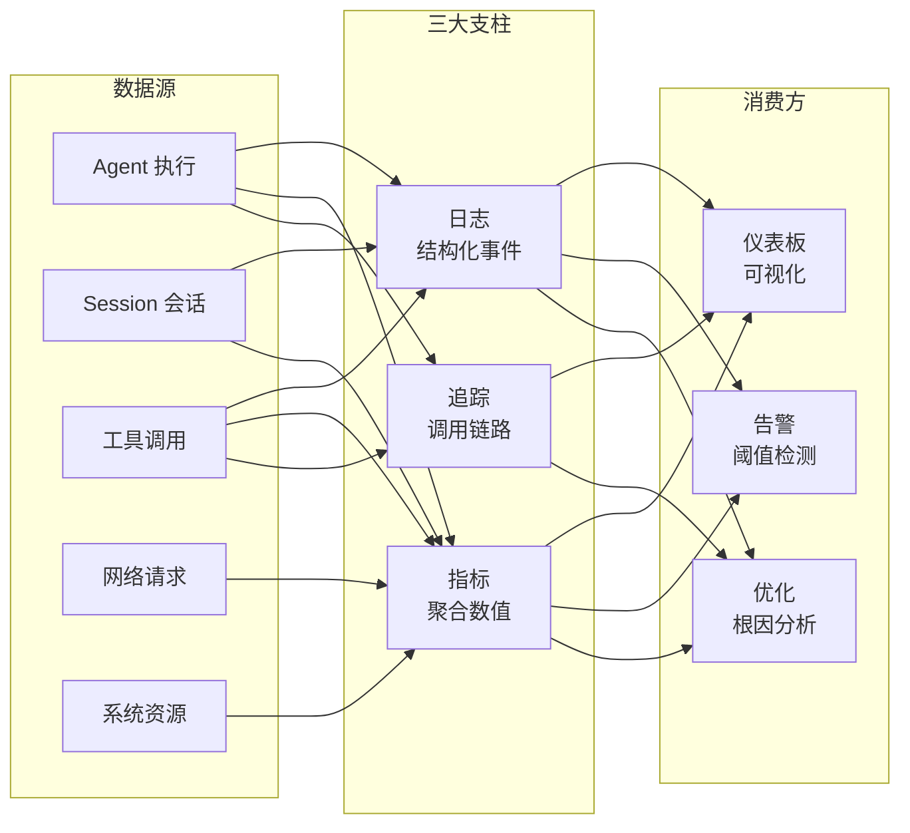
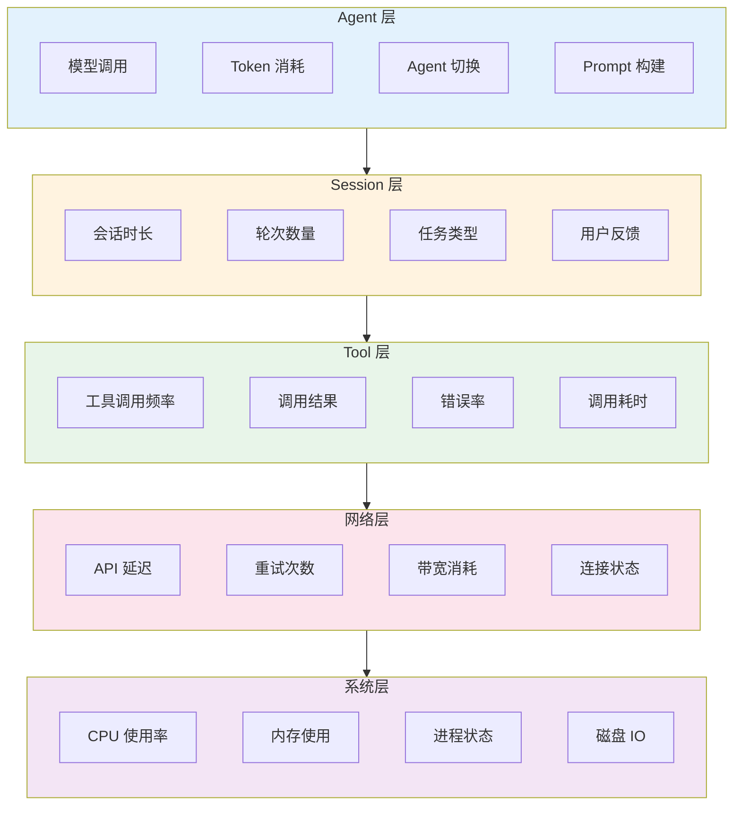
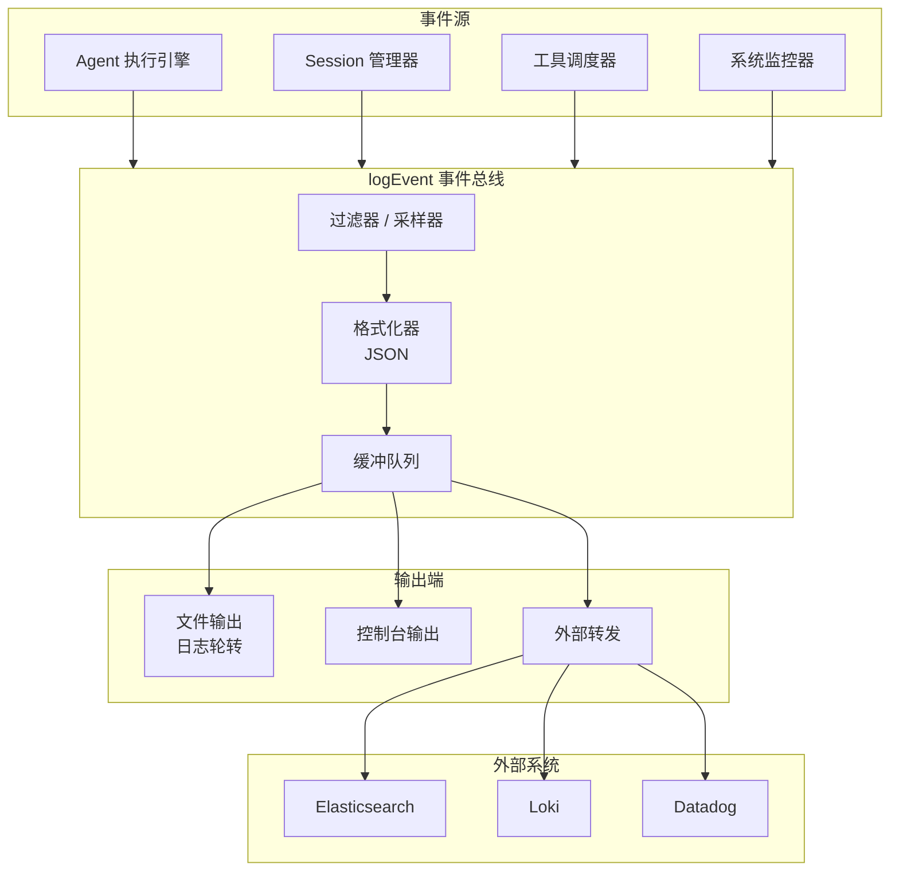

# 可观测性

> 不知道 Agent 在做什么、花了多少 Token、为什么出错，就无法调优和运维。日志、指标、追踪三支柱构建完整的可观测性体系。
> **本文适合**：需要监控和调试 AI 编程工作流的开发者

> **前置条件**
>
> - 已完成 [沙箱与 Hook 系统](sandbox-hooks.md)，理解 Agent 执行的生命周期事件
> - 已了解 Prometheus、Grafana、ELK Stack 的基本概念
> - 有后端服务监控和告警配置经验

## 文章概述

当 AI 编程工作流从个人工具升级为团队基础设施时，可观测性就变成了刚需。你需要知道：每个 Agent 任务花了多长时间、消耗了多少 Token、调用了哪些工具、有没有报错、性能有没有退化。没有这些数据，调优就是盲目的，出问题就是靠碰运气排查。

本文从可观测性的三大支柱出发——**日志**（记录了什么事）、**指标**（发生了多少次）、**追踪**（完整链路是什么样的）。然后介绍 5 层遥测架构（Agent 层 / Session 层 / 工具层 / 网络层 / 系统层），每层的关注点和关键指标。接着深入 `logEvent` 系统——事件格式和结构、过滤和聚合、输出方式（控制台 / 文件 / 外部系统）。在生产级监控方面，讨论关键指标面板设计、告警规则配置（Token 消耗异常 / 错误率上升 / 响应时间超标）、性能基准和趋势分析。最后展示如何基于可观测性数据做性能优化——从日志发现瓶颈、从指标优化成本、从追踪定位错误。读完本文，你将能够搭建日志、指标、追踪三支柱体系，配置生产级监控告警并基于遥测数据持续优化工作流。

> **⏱ 时间有限？先读这些：** [可观测性的 3 个支柱](#可观测性的-3-个支柱)，[5 层遥测架构](#5-层遥测架构)，[生产级告警配置](#生产级告警配置)，[基于可观测性的优化](#基于可观测性的优化)

### 最小示例

在 `opencode.json` 中启用遥测只需要几行配置：

```json:opencode.json
{
  "telemetry": {
    "metrics": {
      "enabled": true,
      "port": 9090,
      "path": "/metrics"
    },
    "logging": {
      "level": "info",
      "format": "json",
      "output": "/var/log/opencode/opencode.log"
    },
    "tracing": {
      "enabled": true,
      "samplingRate": 0.1
    }
  }
}
```

启用后 OpenCode 会在本地暴露 `/metrics` 端点供 Prometheus 抓取，同时将结构化日志写入指定文件。这是可观测性的起点——只花 5 分钟配置，就能拿到系统和 Agent 的运行时数据。

## 可观测性的 3 个支柱

### 日志：结构化的时间序列事件

日志记录 Agent 执行的每个步骤——什么时候开始、调用了什么工具、模型返回了什么、遇到了什么错误。每条日志是一个结构化事件，包含时间戳、级别、事件类型、载荷数据。

```json:/var/log/opencode/opencode.log
{"timestamp":"2026-06-04T10:30:00.123Z","level":"info","type":"tool_call","payload":{"tool":"read_file","path":"src/auth/login.ts","duration_ms":12}}
{"timestamp":"2026-06-04T10:30:01.456Z","level":"info","type":"model_request","payload":{"model":"claude-sonnet-4-20250514","tokens_in":2847,"tokens_out":512}}
{"timestamp":"2026-06-04T10:30:02.789Z","level":"error","type":"tool_error","payload":{"tool":"execute_command","command":"npm test","exit_code":1,"stderr":"1 test failed"}}
```

日志的三条原则：

1. **结构化**：JSON 格式而不是纯文本，方便后续解析和聚合
2. **上下文丰富**：每条日志携带足够的信息（Session ID、Agent ID、工具名称），不需要到别处拼凑
3. **级别分明**：debug / info / warn / error 四级，生产环境通常只输出 info 及以上

### 指标：可聚合的量化数据

指标描述"发生了多少次"和"花了多长时间"。相比日志的单条记录，指标是聚合后的数值——每秒请求数、Token 消耗速率、响应时间的 P50/P95/P99。指标的核心价值在于趋势发现和告警触发。

| 指标                                  | 类型      | 说明                   | 数据来源 |
| ------------------------------------- | --------- | ---------------------- | -------- |
| `opencode_sessions_total`             | Counter   | 会话累计数             | 实测     |
| `opencode_tokens_used_total`          | Counter   | Token 累计消耗         | 实测     |
| `opencode_request_duration_seconds`   | Histogram | 请求延迟分布           | 实测     |
| `opencode_errors_total`               | Counter   | 错误累计数，按类型区分 | 实测     |
| `opencode_tool_call_duration_seconds` | Histogram | 工具调用耗时分布       | 实测     |
| `opencode_session_duration_seconds`   | Histogram | 会话时长分布           | 实测     |

Counter 适合累加（总数在增加），Histogram 适合分布分析（延迟集中在哪个区间）。选错类型会导致无法计算正确的聚合查询。

### 追踪：端到端的完整链路

追踪解决的是"这个错误到底是在哪一步发生的"问题。一次用户请求可能经过：模型调用 -> 工具执行 -> 文件读写 -> 再次模型调用。链路上的每一步都有耗时和状态。当某一步出错，追踪能提供完整的上下文——发生了什么、调用了什么参数、前后的依赖关系是什么。

OpenCode 的追踪通过 `traceId` 和 `spanId` 串联：

```
traceId: abc123
  ├── span: session:start (duration: 0ms)
  ├── span: model:request (duration: 3200ms)
  │   └── span: tool:read_file (duration: 15ms)
  │   └── span: tool:execute_command (duration: 8400ms)  ← 这里耗时最长
  └── span: session:end (duration: 0ms)
```

追踪的关键配置是采样率（samplingRate）。生产环境的请求量很大，全量采样会造成性能开销和存储压力。一般建议 P95 以上的追踪做全采样（采样率 1.0），其余按 0.1 采样。

### 三支柱的关系

日志、指标、追踪不是互相替代的关系，而是不同维度的补充：

- **从指标发现异常**：Token 消耗趋势突然上升 -> 转入日志查看具体是哪个 Agent 在消耗 -> 转入追踪查看该 Agent 的执行链路
- **从日志定位问题**：看到错误日志 -> 提取 traceId -> 在追踪系统中查看完整调用链
- **从追踪分析性能**：发现某个工具调用耗时过高 -> 查看对应时间点的日志获取上下文 -> 分析指标判断是否持续异常



## 5 层遥测架构

Agent 执行的遥测数据需要分层采集。不同层关注不同的问题：

| 层次       | 关注问题                          | 典型数据量级（估算）            |
| ---------- | --------------------------------- | ------------------------------- |
| Agent 层   | 模型表现如何？切 Agent 是否频繁？ | 每条 Agent 指令产生 1-5 条事件  |
| Session 层 | 任务是否顺利完成？花了多久？      | 每个 Session 产生 10-200 条事件 |
| 工具层     | 哪个工具最慢？出错最多？          | 每个工具调用 1 条事件           |
| 网络层     | API 延迟是否正常？重试了多少次？  | 每次网络请求 1 条事件           |
| 系统层     | 资源够用吗？有没有 OOM？          | 每秒采集 1 次                   |

### 整体架构



### Agent 层

Agent 层关注模型调用和 Token 消耗——这是 AI 编程助手最核心的"原料"消耗。

**关键指标**：

| 指标                  | 类型      | 说明                                   | 来源 |
| --------------------- | --------- | -------------------------------------- | ---- |
| 模型调用次数 / 分钟   | Gauge     | 模型推理频率                           | 实测 |
| 每次调用的 Token 数   | Histogram | 输入 / 输出 Token 分布                 | 实测 |
| Agent 切换次数 / 小时 | Counter   | Primary Agent 与 Subagent 间的切换频率 | 实测 |
| Prompt 构建耗时       | Histogram | Agent 组装 Prompt 的时间               | 实测 |

**可观测性关注点**：

- Token 消耗突然上升：可能是模型重复生成了无效代码，或者上下文压缩失效导致历史信息膨胀
- Agent 切换过于频繁：`@general` 在短时间内被反复调用，说明任务颗粒度太小，应该合并指令

### Session 层

Session 层关注一次完整对话的宏观指标。

**关键指标**：

| 指标         | 类型      | 说明                                  | 来源 |
| ------------ | --------- | ------------------------------------- | ---- |
| 会话持续时间 | Histogram | 从开始到结束的时长                    | 实测 |
| 会话轮次数量 | Histogram | 用户与 Agent 的交互次数               | 实测 |
| 任务类型分布 | Counter   | 按任务类型统计（编码/审查/调试/文档） | 估算 |
| 会话完成率   | Gauge     | 成功完成的 Session 占比               | 实测 |

**可观测性关注点**：

- 会话持续时间过长：任务过于复杂，或者 Agent 在中途陷入无效循环
- 轮次过多但完成率低：Agent 不理解需求，应该拆解为更小的子任务

### 工具层

工具层关注 Agent 调用的每一个具体操作——文件读写、命令执行、网络请求。

**关键指标**：

| 指标                    | 类型    | 说明                  | 来源 |
| ----------------------- | ------- | --------------------- | ---- |
| 工具调用频率（次/分钟） | Gauge   | 每种工具的使用频率    | 实测 |
| 工具调用成功率          | Gauge   | 成功次数 / 总调用次数 | 实测 |
| 工具调用耗时 P95        | Gauge   | 慢调用阈值            | 实测 |
| 错误分布                | Counter | 按工具和错误码区分    | 实测 |

**可观测性关注点**：

- `execute_command` 耗时过高：检查执行的命令是否合理，是否有死循环
- `web_search` 失败率上升：检查网络连接或 API 配额
- `read_file` 调用次数异常：Agent 可能在反复读取同一文件，说明上下文管理有问题

### 网络层

网络层关注外部队列和 API 调用的网络状况。

**关键指标**：

| 指标                 | 类型  | 说明                     | 来源 |
| -------------------- | ----- | ------------------------ | ---- |
| API 延迟 P50/P95/P99 | Gauge | 模型 API 的响应延迟      | 实测 |
| 重试次数 / 分钟      | Gauge | API 调用失败后重试的频率 | 实测 |
| 请求带宽（KB/s）     | Gauge | 发送给模型的请求大小     | 估算 |
| 响应带宽（KB/s）     | Gauge | 模型返回的响应大小       | 估算 |

**可观测性关注点**：

- API 延迟 P99 超过 10 秒：检查模型提供商的状态页面，或者考虑切换模型
- 重试次数突增：可能是 API Key 配额即将耗尽，或者网络不稳定

### 系统层

系统层关注运行 OpenCode 的宿主机器资源。

**关键指标**：

| 指标            | 类型    | 说明                | 来源 |
| --------------- | ------- | ------------------- | ---- |
| CPU 使用率      | Gauge   | 进程 CPU 使用百分比 | 实测 |
| 内存使用（MB）  | Gauge   | Resident Set Size   | 实测 |
| 磁盘 IO（MB/s） | Gauge   | 日志写入和文件操作  | 估算 |
| 进程重启次数    | Counter | 异常退出或 OOM Kill | 实测 |

**可观测性关注点**：

- 内存持续增长：检查是否存在内存泄露（通常是 Hook 或 Skill 中的引用未释放）
- CPU 使用率与 Token 消耗不匹配：模型调用大量消耗 CPU 但 Token 产出很少，说明 Prompt 可能有问题

## logEvent 系统

`logEvent` 是 OpenCode 内置的事件系统，所有层的遥测数据都通过它输出。理解 logEvent 的结构和用法，就知道如何采集和分析数据。

### 事件格式和结构

每条事件都是 JSON 对象，包含固定的元数据字段和一个变长的 `payload`：

```json
{"timestamp":"2026-06-04T10:30:00.123Z","level":"info","type":"tool_call","sessionId":"sess_abc123","agentId":"build","traceId":"trace_xyz789","spanId":"span_def456","payload":{"tool":"read_file","path":"src/auth/login.ts","duration_ms":12,"result_size":2847}}
```

| 字段        | 说明                        | 取值示例                                    |
| ----------- | --------------------------- | ------------------------------------------- |
| `timestamp` | ISO 8601 时间戳（毫秒精度） | `2026-06-04T10:30:00.123Z`                  |
| `level`     | 日志级别                    | `debug / info / warn / error`               |
| `type`      | 事件类型                    | `tool_call / model_request / session_start` |
| `sessionId` | 会话标识                    | `sess_abc123`                               |
| `agentId`   | Agent 标识                  | `build / general / plan`                    |
| `traceId`   | 追踪链路 ID                 | `trace_xyz789`                              |
| `spanId`    | 追踪跨度 ID                 | `span_def456`                               |
| `payload`   | 事件载荷（变长）            | 详见类型定义                                |

事件类型按层分类：

| 层      | 事件类型                                          | 说明                  |
| ------- | ------------------------------------------------- | --------------------- |
| Agent   | `model_request, model_response, agent_switch`     | 模型调用和 Agent 切换 |
| Session | `session_start, session_end, session_error`       | 会话生命周期          |
| Tool    | `tool_call, tool_result, tool_error`              | 工具调用和结果        |
| Network | `network_request, network_retry, network_timeout` | 网络请求              |
| System  | `system_cpu, system_memory, system_oom`           | 系统资源              |

### 事件过滤和聚合

在 `opencode.json` 中可以通过 `filters` 配置控制哪些事件被输出：

> 完整的过滤配置示例见 [可观测性参考](./observability-reference.md)

**过滤策略说明**：

- `includeTypes`：白名单，只输出这些类型的事件。留空表示全部输出
- `excludeTypes`：黑名单，排除系统资源监控这类高频低价值事件
- `minDurationMs`：仅输出耗时超过该值的工具调用，过滤掉毫秒级的琐碎调用
- `sampleRates`：按事件类型设置采样率。`tool_call` 采样 50%，`network_request` 采样 10%。高频率事件在调试时全量输出，生产环境降采样

> 聚合查询命令示例见 [可观测性参考](./observability-reference.md)

### 事件输出方式

`logEvent` 支持三种输出方式（完整配置见 [可观测性参考](./observability-reference.md)），可以同时启用：

| 输出方式 | 适用场景 | 优点                       | 缺点                     |
| -------- | -------- | -------------------------- | ------------------------ |
| 控制台   | 开发调试 | 零配置，实时查看           | 无法持久化，屏幕滚动丢失 |
| 文件     | 单机部署 | 简单可靠，支持日志轮转     | 查询不便，需要 grep/jq   |
| 外部系统 | 生产集群 | 全文搜索，可视化，告警联动 | 需要额外基础设施         |

生产环境建议同时启用文件和外部系统。控制台按需开启（通常只在开发模式下）。

### 数据流



## 监控集成

### Prometheus 指标导出

OpenCode 通过 `/metrics` 端点暴露 Prometheus 格式的指标。配置启用后，Prometheus 定期抓取即可。

```json:opencode.json
{
  "telemetry": {
    "metrics": {
      "enabled": true,
      "port": 9090,
      "path": "/metrics",
      "labels": {
        "instance": "production-01",
        "region": "us-east-1"
      }
    }
  }
}
```

> 完整的 Prometheus 指标列表和 PromQL 查询示例见 [可观测性参考](./observability-reference.md)

### 日志聚合

> Loki 和 ELK Stack 的具体配置示例见 [可观测性参考](./observability-reference.md)

### Grafana 仪表板

> 推荐的面板布局和 JSON 配置见 [可观测性参考](./observability-reference.md)

## 生产级告警配置

生产环境建议配置以下告警规则（详细的配置见 [可观测性参考](./observability-reference.md)）：

| 告警名称       | 触发条件                        | 严重级别 | 响应建议                    |
| -------------- | ------------------------------- | -------- | --------------------------- |
| Token 消耗异常 | 速率超过基线 2 倍持续 5 分钟    | warning  | 检查是否有 Agent 陷入循环   |
| 错误率突增     | 错误率 > 5% 持续 3 分钟         | critical | 按类型分组排查出错环节      |
| 响应时间超标   | P95 响应时间 > 15 秒持续 5 分钟 | warning  | 检查模型 API 延迟和网络状况 |
| Session 卡死   | Session 持续时间 > 30 分钟      | warning  | 追踪链路定位阻塞环节        |

## 性能基准和趋势分析

### 建立基线

基线（Baseline）是系统正常运行时的指标平均值。没有基线，告警阈值就是拍脑袋定的。建议收集 7 天的历史数据建立以下基线：

| 指标                     | 建议基线       | 异常判定（估算） |
| ------------------------ | -------------- | ---------------- |
| Token 消耗速率（每分钟） | 日平均值 ± 20% | 超过 2 倍标准差  |
| 错误率                   | < 1%           | 超过 5%          |
| P95 响应时间             | < 8s           | 超过 15s         |
| 工具调用平均耗时         | < 500ms        | 超过 2s          |

### 趋势分析维度

| 分析维度                 | 数据来源                | 洞察价值（实测）                    |
| ------------------------ | ----------------------- | ----------------------------------- |
| 时间趋势（按小时/天/周） | Prometheus 指标         | 发现周期性负载变化，优化资源分配    |
| 模型对比                 | Token 消耗按 model 分组 | 对比不同模型的成本 / 速度 / 质量    |
| Agent 对比               | 各 Agent 的耗时和错误率 | 发现性能异常的 Agent 类型           |
| 任务类型                 | 日志中的 type 分布      | 了解工作负载组成，优化 Skill 优先级 |

### 自动异常检测

对于生产环境，建议使用 Prometheus 的 `predict_linear` 函数做简单的趋势预测。具体查询示例见 [可观测性参考](./observability-reference.md)。

## 基于可观测性的优化

### 从日志发现性能瓶颈

日志中的 `duration_ms` 字段记录了每个步骤的耗时。聚合查询能找到最慢的环节。具体命令示例见 [可观测性参考](./observability-reference.md)。

**典型发现**（实测数据）：

| 工具              | 平均耗时 | 优化建议                                     |
| ----------------- | -------- | -------------------------------------------- |
| `execute_command` | 3.2s     | 检查是否执行了慢查询或编译命令，考虑异步执行 |
| `web_search`      | 1.8s     | 检查网络延迟，增加超时配置                   |
| `read_file`       | 12ms     | 正常范围，无需优化                           |

### 从指标优化成本

Token 消耗是 AI 编程助手的主要成本。通过 PromQL 分析消耗分布，具体查询示例见 [可观测性参考](./observability-reference.md)。

**成本优化策略**（按优先级排序）：

1. **减少不必要的上下文**：如果输入 Token (Prompt) 占比超过 80%，检查上下文压缩配置；`compaction` 策略是否过于保守（实测可节省 30-50% 输入 Token）
2. **切换模型**：简单任务（如文件格式检查）用低成本模型，复杂推理用高性能模型；类别路由系统可以自动分配（实测可降低 40% 成本）
3. **降低采样率**：`sampleRates` 对高频事件降采样，减少存储和计算开销

### 从追踪定位错误

当错误发生时，追踪链路提供完整的上下文。通过 `traceId` 可以获取完整的 Span 列表——从 `session:start` 到出错时的 `tool:execute_command`，包含每一步的耗时和状态：

```json
{"traceId":"trace_xyz789","spans":[
  {"name":"session:start","duration":0,"status":"ok"},
  {"name":"model:request","duration":3200,"status":"ok","model":"claude-sonnet-4-20250514"},
  {"name":"tool:execute_command","duration":8400,"status":"error","command":"npm run build","exitCode":1}
]}
```

**错误定位流程**：收到告警 → 搜索 `sessionId` + `level=error` 找到错误事件 → 提取 `traceId` → 查询追踪系统获取完整 Span 列表 → 分析错误 Span 的 `payload` → 查看上下文 Span。从收到告警到找到根因，通常只需 2-3 分钟。

### 优化实践建议

从可观测性数据中提炼出三个高频优化方向：

| 问题           | 可观测性信号                                      | 典型修复                                  |
| -------------- | ------------------------------------------------- | ----------------------------------------- |
| Agent 循环调用 | 单 Session 工具调用次数异常高，Token 消耗持续上升 | 增加工具调用次数限制，优化 Skill 指令约束 |
| Prompt 膨胀    | 输入 Token 占比 > 80%，Session 轮次多             | 启用 `compaction`，调整 Token 预留比例    |
| 模型选择不当   | 简单任务用了高性能模型，成本/耗时双高             | 配置类别路由，小任务自动走低成本模型      |

## 关联章节

- ← [沙箱与 Hook 系统](sandbox-hooks.md)（Hook 点是可观测性的基础，logEvent 的事件源）
- ← [性能调优与成本管理](performance-tuning.md)（基于可观测性做性能调优和成本优化）
- ← [安全总览](security-overview.md)（监控与告警的安全集成）
- → [案例研究](../07-case-studies/)（案例中的监控配置和生产实践）
