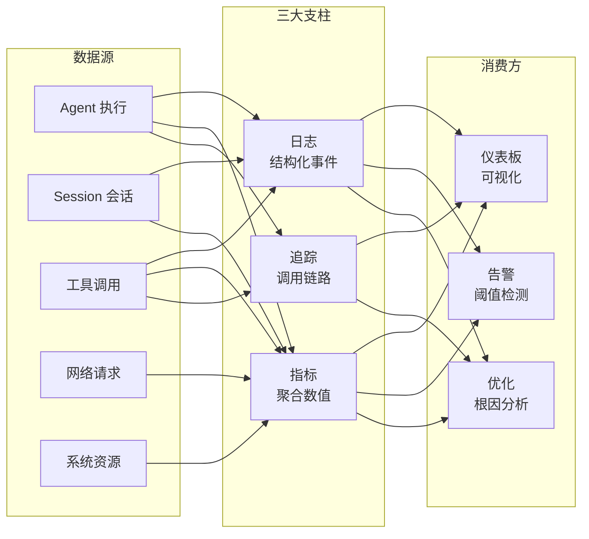
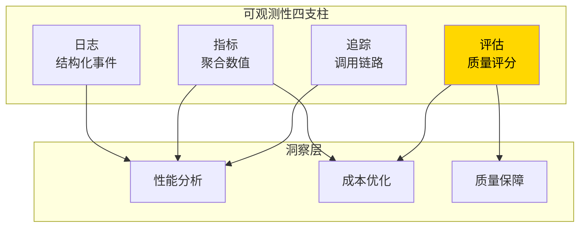
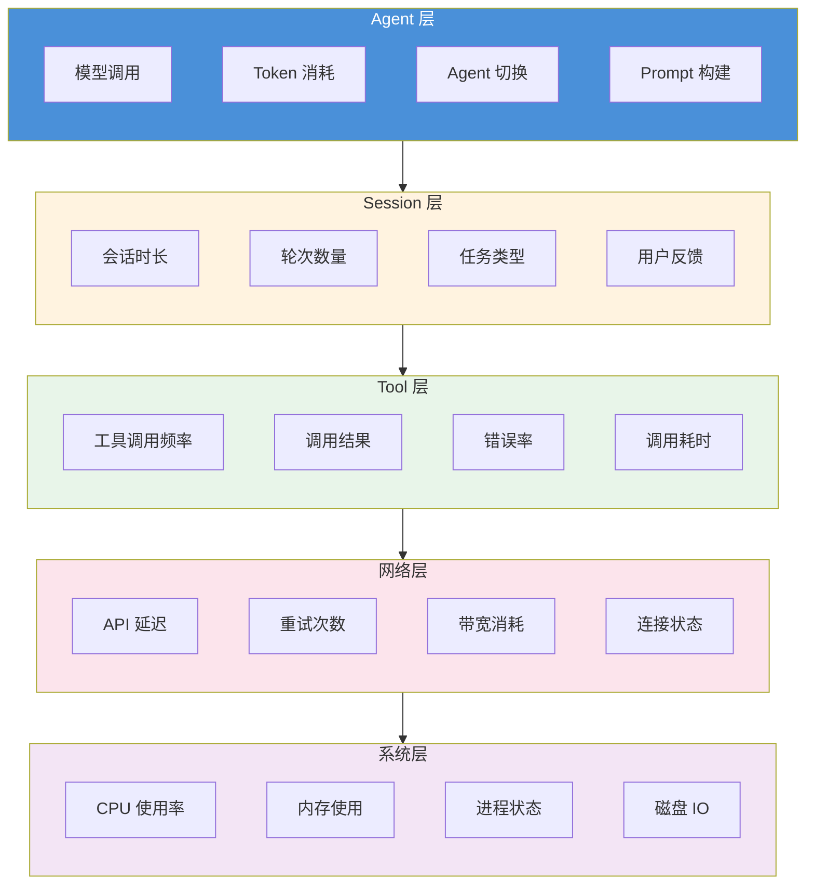
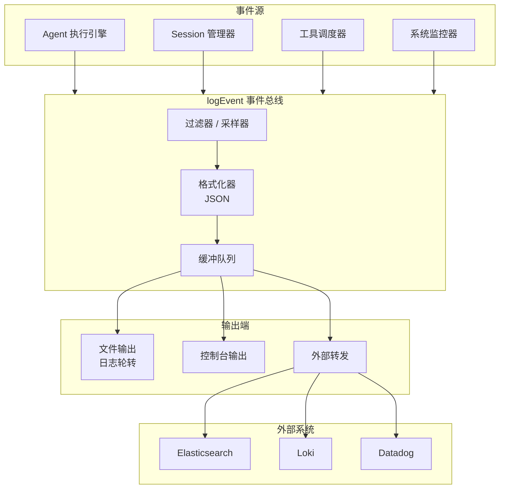

# 可观测性

> 不知道 **Agent（智能体）** 在做什么、花了多少 Token、为什么出错，就无法调优和运维。日志、指标、追踪三支柱构建完整的可观测性体系。
> **本文适合**：需要监控和调试 AI 编程工作流的开发者

> **前置条件**
>
> - 已完成 [沙箱与 Hook 系统](sandbox-hooks.md)，理解 Agent 执行的生命周期事件
> - 已了解 Prometheus、Grafana、ELK Stack 的基本概念
> - 有后端服务监控和告警配置经验

## 文章概述

当 AI 编程工作流从个人工具升级为团队基础设施时，可观测性就变成了刚需。你需要知道：每个 Agent 任务花了多长时间、消耗了多少 Token、调用了哪些工具、有没有报错、性能有没有退化。没有这些数据，调优就是盲目的，出问题就是靠碰运气排查。

本文从可观测性的三大支柱出发——**日志**（记录了什么事）、**指标**（发生了多少次）、**追踪**（完整链路是什么样的）。然后介绍 5 层遥测架构（Agent 层 / Session 层 / 工具层 / 网络层 / 系统层），每层的关注点和关键指标。接着深入 `logEvent` 系统——事件格式和结构、过滤和聚合、输出方式（控制台 / 文件 / 外部系统）。在生产级监控方面，讨论关键指标面板设计、告警规则配置（Token 消耗异常 / 错误率上升 / 响应时间超标）、性能基准和趋势分析。最后展示如何基于可观测性数据做性能优化——从日志发现瓶颈、从指标优化成本、从追踪定位错误。读完本文，你将能够搭建日志、指标、追踪三支柱体系，配置生产级监控告警并基于遥测数据持续优化工作流。

> **⏱ 时间有限？先读这些：** [可观测性的 3 个支柱](#可观测性的-3-个支柱)，[5 层遥测架构](#5-层遥测架构)，[生产级告警配置](#生产级告警配置)，[基于可观测性的优化](#基于可观测性的优化)

### 最小示例

在 `opencode.json` 中启用遥测只需要几行配置：

```json:opencode.json
{
  "telemetry": {
    "metrics": {
      "enabled": true,
      "port": 9090,
      "path": "/metrics"
    },
    "logging": {
      "level": "info",
      "format": "json",
      "output": "/var/log/opencode/opencode.log"
    },
    "tracing": {
      "enabled": true,
      "samplingRate": 0.1
    }
  }
}
```

启用后 OpenCode 会在本地暴露 `/metrics` 端点供 Prometheus 抓取，同时将结构化日志写入指定文件。这是可观测性的起点——只花 5 分钟配置，就能拿到系统和 Agent 的运行时数据。

## 可观测性的 3 个支柱

### 日志：结构化的时间序列事件

日志记录 Agent 执行的每个步骤——什么时候开始、调用了什么工具、模型返回了什么、遇到了什么错误。每条日志是一个结构化事件，包含时间戳、级别、事件类型、载荷数据。

```json:/var/log/opencode/opencode.log
{"timestamp":"2026-06-04T10:30:00.123Z","level":"info","type":"tool_call","payload":{"tool":"read_file","path":"src/auth/login.ts","duration_ms":12}}
{"timestamp":"2026-06-04T10:30:01.456Z","level":"info","type":"model_request","payload":{"model":"claude-sonnet-4-20250514","tokens_in":2847,"tokens_out":512}}
{"timestamp":"2026-06-04T10:30:02.789Z","level":"error","type":"tool_error","payload":{"tool":"execute_command","command":"npm test","exit_code":1,"stderr":"1 test failed"}}
```

日志的三条原则：

1. **结构化**：JSON 格式而不是纯文本，方便后续解析和聚合
2. **上下文丰富**：每条日志携带足够的信息（Session ID、Agent ID、工具名称），不需要到别处拼凑
3. **级别分明**：debug / info / warn / error 四级，生产环境通常只输出 info 及以上

### 指标：可聚合的量化数据

指标描述"发生了多少次"和"花了多长时间"。相比日志的单条记录，指标是聚合后的数值——每秒请求数、Token 消耗速率、响应时间的 P50/P95/P99。指标的核心价值在于趋势发现和告警触发。

| 指标                                  | 类型      | 说明                   | 数据来源 |
| ------------------------------------- | --------- | ---------------------- | -------- |
| `opencode_sessions_total`             | Counter   | 会话累计数             | 实测     |
| `opencode_tokens_used_total`          | Counter   | Token 累计消耗         | 实测     |
| `opencode_request_duration_seconds`   | Histogram | 请求延迟分布           | 实测     |
| `opencode_errors_total`               | Counter   | 错误累计数，按类型区分 | 实测     |
| `opencode_tool_call_duration_seconds` | Histogram | 工具调用耗时分布       | 实测     |
| `opencode_session_duration_seconds`   | Histogram | 会话时长分布           | 实测     |

Counter 适合累加（总数在增加），Histogram 适合分布分析（延迟集中在哪个区间）。选错类型会导致无法计算正确的聚合查询。

#### 流式指标

流式传输是 LLM 推理的核心模式。除常规聚合指标外，还应追踪流式传输的健康状况：

| 指标 | 类型 | 说明 |
| ---- | ---- | ---- |
| `gen_ai.streaming.time_to_first_token` | Histogram | 从请求发出到收到第一个 Token 的延迟 |
| `gen_ai.streaming.time_between_tokens` | Histogram | 相邻 Token 到达的时间间隔 |
| `gen_ai.streaming.total_duration` | Histogram | 完整流式会话的总耗时 |

`time_to_first_token` 反映模型推理的首包延迟（受 **Prompt（提示词）** 长度和模型负载影响），`time_between_tokens` 反映生成阶段的吞吐量。两个指标结合可以诊断是"模型加载慢"还是"生成卡顿"。

### 追踪：端到端的完整链路

追踪解决的是"这个错误到底是在哪一步发生的"问题。一次用户请求可能经过：模型调用 -> 工具执行 -> 文件读写 -> 再次模型调用。链路上的每一步都有耗时和状态。当某一步出错，追踪能提供完整的上下文——发生了什么、调用了什么参数、前后的依赖关系是什么。

OpenCode 的追踪通过 `traceId` 和 `spanId` 串联：

```text:terminal
traceId: abc123
  ├── span: session:start (duration: 0ms)
  ├── span: model:request (duration: 3200ms)
  │   └── span: tool:read_file (duration: 15ms)
  │   └── span: tool:execute_command (duration: 8400ms)  ← 这里耗时最长
  └── span: session:end (duration: 0ms)
```

追踪的关键配置是采样率（samplingRate）。生产环境的请求量很大，全量采样会造成性能开销和存储压力。一般建议 P95 以上的追踪做全采样（采样率 1.0），其余按 0.1 采样。

#### 跨链路追踪

现代 AI 编程工作流的调用链往往跨越多个进程和网络边界：Agent 调用 **MCP（模型上下文协议）** Server，MCP Server 调用外部 API，外部 API 再回调 Webhook。W3C Trace **Context（上下文）** 标准通过 `traceparent` 和 `tracestate` 头在这些跳转之间传播上下文。

```text:terminal
Span 层级示例（多跳调用）：
traceId: hop_trace_001
  ├── span: gen_ai.invoke_agent (duration: 12500ms)
  │   ├── span: gen_ai.execute_tool (tool: "mcp:github-mcp", duration: 5000ms)
  │   │   ├── span: mcp:request (method: "tools/call", duration: 4980ms)
  │   │   │   └── span: http:post (url: "http://github-mcp:8080/mcp/v1", duration: 4970ms)
  │   │   │       └── span: mcp:handle_request (duration: 4950ms)
  │   │   │           └── span: tool:search_issues (duration: 4000ms)
  │   │   │               └── span: http:get (url: "https://api.github.com/...", duration: 3800ms)
  │   │   └── span: mcp:response (duration: 2ms)
  │   └── span: gen_ai.execute_tool (tool: "read_file", duration: 10ms)
```

启用跨链路追踪后，即使调用链跨越 3 个以上进程，也可以通过 `traceId` 串联全部 Span：

```json:opencode.json
{
  "telemetry": {
    "tracing": {
      "propagation": "w3c-tracecontext",
      "baggage": ["agentId", "sessionId"]
    }
  }
}
```

`baggage` 配置可以将 Agent 上下文作为 W3C Baggage 头传递，让下游服务无需额外查询就能获取调用来源。

#### 采样策略

生产环境的全量追踪会产生海量数据。Head-based 采样在 Span 创建时即决定是否采样，相比 tail-based 采样更节省存储和计算资源。以下是四种常用策略：

| 策略 | 说明 | 适用场景 |
| ---- | ---- | -------- |
| Trace ID 采样 | 基于 `traceId` 的哈希值取模 | 简单均匀降采样 |
| User ID 采样 | 对特定用户的请求全量采样 | 调试与测试、VIP 用户监控 |
| Session ID 采样 | 对异常或超长 Session 全量采样 | 问题排查 |
| 自适应采样 | 根据系统负载动态调整采样率 | 资源受限的生产环境 |

自适应采样是推荐的默认策略，采样率随错误率和延迟波动：

```text:terminal
采样率调整逻辑：
  if error_rate > 5% → 采样率 = 1.0
  elif p95_latency > 10s → 采样率 = 0.5
  elif cpu_usage > 80% → 采样率 = 0.05
  else → 采样率 = 0.1
```

采样决策记录在每个 Span 的 `sampling.decision` 属性中，方便排查请求为何未被采样。

### 三支柱的关系

日志、指标、追踪不是互相替代的关系，而是不同维度的补充：

- **从指标发现异常**：Token 消耗趋势突然上升 -> 转入日志查看具体是哪个 Agent 在消耗 -> 转入追踪查看该 Agent 的执行链路
- **从日志定位问题**：看到错误日志 -> 提取 traceId -> 在追踪系统中查看完整调用链
- **从追踪分析性能**：发现某个工具调用耗时过高 -> 查看对应时间点的日志获取上下文 -> 分析指标判断是否持续异常



## 评估（Evaluation）：AI 可观测性的第四支柱

OTel GenAI Semantic Conventions v1.41 将评估（Evaluation）定义为可观测性的第四支柱，与日志、指标、追踪并列。AI 编程场景的特殊性在于，传统三支柱只回答"系统是否正常运行"，不回答"Agent 的输出质量如何"。评估支柱填补了这个缺口。

### 评估的三种模式

| 模式 | 说明 | 适用场景 |
| ---- | ---- | -------- |
| LLM-as-judge 评估 | 用高性能模型（如 GPT-4、Claude）评判 Agent 的输出质量 | 代码生成质量、是否满足需求 |
| 离线评估（Offline Evaluation） | 用预标注数据集批量评测 Agent 的行为 | 发布前回归测试、**Skill（技能）** 效果验证 |
| 在线黄金信号评估（Online Golden Signals） | 从生产环境的隐式反馈中提取质量信号 | 用户是否采纳生成代码、修改率 |

### LLM-as-judge 评估

LLM-as-judge 是最直接的评估方式：将 Agent 的输出和评估标准一起送入评估模型，获得结构化评分。

```json:terminal
{"timestamp":"2026-06-04T10:30:05.000Z","level":"info","type":"eval_judge","sessionId":"sess_abc123","payload":{"judge_model":"gpt-4o","criteria":["correctness","completeness","efficiency"],"scores":{"correctness":0.92,"completeness":0.85,"efficiency":0.78},"verdict":"pass"}}
```

### 评估事件与 logEvent 集成

评估事件通过 logEvent 系统的 `eval_*` 事件类型输出，与常规遥测数据统一存储：

| 事件类型 | 说明 | 触发时机 |
| -------- | ---- | -------- |
| `eval_judge` | LLM-as-judge 评分结果 | Agent 每次输出后 |
| `eval_offline_run` | 离线评估批次执行 | 定时或发布触发 |
| `eval_offline_result` | 离线评估单项结果 | 每条测试用例 |
| `eval_golden_signal` | 在线黄金信号采集 | 用户交互后 |

### 四支柱关系图



纳入评估支柱后，可观测性从"系统是否健康"扩展到"Agent 的工作质量是否可靠"。

## MCP 链路追踪标准

MCP（Model Context Protocol）调用是 AI 编程工作流中的关键路径。OTel GenAI Semantic Conventions v1.41 定义了 MCP 调用的标准语义属性，确保跨 MCP Server 的追踪链路可互操作。

### MCP 语义属性

| OTel 属性 | 类型 | 说明 | 示例 |
| --------- | ---- | ---- | ---- |
| `mcp.request.method` | string | MCP 请求方法 | `tools/call`, `resources/read` |
| `mcp.response.status` | int | MCP 响应状态码 | 0（成功）, -1（错误） |
| `mcp.server.address` | string | MCP Server 标识 | `filesystem-server`, `github-mcp` |
| `mcp.request.id` | string | 请求标识 | `req_abc123` |

### 端到端 MCP Trace 传播

MCP 调用链跨越 Agent 和 MCP Server 两个进程。W3C Trace Context 通过 MCP 请求头传播：

```text:terminal
Agent 进程                          MCP Server 进程
   │                                    │
   │─── tools/call ──────────────────→   │
   │    traceparent: 00-abc...-def...-01 │
   │    tracestate: opencode=xyz789      │
   │                                    │─── span: mcp.handle_request
   │                                    │─── span: tool.execute
   │←── response ─────────────────────   │
   │    traceparent: 00-abc...-ghi...-01 │
```

### Span 层级示例

一次完整的 MCP 调用在 Agent 侧生成以下 Span 层级：

```text:terminal
traceId: mcp_trace_001
  ├── span: mcp:request (method: tools/call, duration: 450ms)
  │   ├── span: mcp:serialize (duration: 5ms)
  │   ├── span: mcp:transport (duration: 420ms)
  │   │   └── span: http:post (url: /mcp/v1, duration: 418ms)
  │   └── span: mcp:deserialize (duration: 3ms)
  └── span: mcp:response (status: 0, duration: 2ms)
```

配置 MCP 追踪需要在 `opencode.json` 中启用 W3C Trace Context 传播：

```json:opencode.json
{
  "telemetry": {
    "tracing": {
      "enabled": true,
      "propagation": "w3c-tracecontext",
      "mcp": {
        "propagateContext": true,
        "capturePayload": true
      }
    }
  }
}
```

启用后，所有 MCP 调用会自动携带父 Span 的 Trace Context，形成端到端链路。

## Agent Span 类型与 OTel 对齐

OTel GenAI Semantic Conventions v1.41 为 AI Agent 定义了标准的 Span 类型和属性。将现有 5 层遥测架构中的追踪 Span 与 OTel 约定对齐，可以提升与生态工具的互操作性。

### OTel Agent Span 类型

| OTel Span 类型 | 说明 | 对应 5 层架构 |
| -------------- | ---- | ------------- |
| `gen_ai.invoke_agent` | Agent 调用（一次完整的 Agent 推理） | Agent 层 / Session 层 |
| `gen_ai.execute_tool` | Agent 执行工具调用 | 工具层 |
| `gen_ai.retrieve_context` | Agent 检索上下文信息 | 工具层（read_file、web_search 等） |

### Span 属性约定

每种 Span 类型有对应的标准属性：

```json:terminal
{"name":"gen_ai.invoke_agent","attributes":{
  "gen_ai.agent.name":"build",
  "gen_ai.agent.type":"primary",
  "gen_ai.system":"opencode",
  "gen_ai.request.model":"claude-sonnet-4-20250514",
  "gen_ai.response.tool_calls":3
}}

{"name":"gen_ai.execute_tool","attributes":{
  "gen_ai.tool.name":"execute_command",
  "gen_ai.tool.type":"system",
  "gen_ai.tool.result.status":"error",
  "gen_ai.tool.result.duration_ms":8400
}}

{"name":"gen_ai.retrieve_context","attributes":{
  "gen_ai.context.source":"file_system",
  "gen_ai.context.target":"src/auth/login.ts",
  "gen_ai.context.size_bytes":2847
}}
```

### 映射关系

5 层遥测架构中的 Span 可以通过以下映射转换到 OTel 标准：

| 现有 Span 名称 | OTel Span 类型 | 额外属性 |
| -------------- | -------------- | -------- |
| `session:start` → `session:end` | `gen_ai.invoke_agent` | `gen_ai.agent.session_id` |
| `model:request` → `model:response` | `gen_ai.invoke_agent` | `gen_ai.request.model` |
| `tool:read_file` / `tool:execute_command` | `gen_ai.execute_tool` | `gen_ai.tool.name` |
| `network:request` | `gen_ai.execute_tool` | `gen_ai.tool.type=network` |

这种映射不是强制替换——现有 Span 命名继续工作，但增加 OTel 兼容属性可以无缝接入 Datadog、Grafana Tempo 等支持 GenAI 语义的追踪后端。

## 5 层遥测架构

Agent 执行的遥测数据需要分层采集。不同层关注不同的问题：

| 层次       | 关注问题                          | 典型数据量级（估算）            |
| ---------- | --------------------------------- | ------------------------------- |
| Agent 层   | 模型表现如何？切 Agent 是否频繁？ | 每条 Agent 指令产生 1-5 条事件  |
| Session 层 | 任务是否顺利完成？花了多久？      | 每个 Session 产生 10-200 条事件 |
| 工具层     | 哪个工具最慢？出错最多？          | 每个工具调用 1 条事件           |
| 网络层     | API 延迟是否正常？重试了多少次？  | 每次网络请求 1 条事件           |
| 系统层     | 资源够用吗？有没有 OOM？          | 每秒采集 1 次                   |

### 整体架构



### Agent 层

Agent 层关注模型调用和 Token 消耗——这是 AI 编程助手最核心的"原料"消耗。

**关键指标**：

| 指标                  | 类型      | 说明                                   | 来源 |
| --------------------- | --------- | -------------------------------------- | ---- |
| 模型调用次数 / 分钟   | Gauge     | 模型推理频率                           | 实测 |
| 每次调用的 Token 数   | Histogram | 输入 / 输出 Token 分布                 | 实测 |
| Agent 切换次数 / 小时 | Counter   | Primary Agent 与 Subagent 间的切换频率 | 实测 |
| Prompt 构建耗时       | Histogram | Agent 组装 Prompt 的时间               | 实测 |

**可观测性关注点**：

- Token 消耗突然上升：可能是模型重复生成了无效代码，或者上下文压缩失效导致历史信息膨胀
- Agent 切换过于频繁：`@general` 在短时间内被反复调用，说明任务颗粒度太小，应该合并指令

### Session 层

Session 层关注一次完整对话的宏观指标。

**关键指标**：

| 指标         | 类型      | 说明                                  | 来源 |
| ------------ | --------- | ------------------------------------- | ---- |
| 会话持续时间 | Histogram | 从开始到结束的时长                    | 实测 |
| 会话轮次数量 | Histogram | 用户与 Agent 的交互次数               | 实测 |
| 任务类型分布 | Counter   | 按任务类型统计（编码/审查/调试/文档） | 估算 |
| 会话完成率   | Gauge     | 成功完成的 Session 占比               | 实测 |

**可观测性关注点**：

- 会话持续时间过长：任务过于复杂，或者 Agent 在中途陷入无效循环
- 轮次过多但完成率低：Agent 不理解需求，应该拆解为更小的子任务

### 工具层

工具层关注 Agent 调用的每一个具体操作——文件读写、命令执行、网络请求。

**关键指标**：

| 指标                    | 类型    | 说明                  | 来源 |
| ----------------------- | ------- | --------------------- | ---- |
| 工具调用频率（次/分钟） | Gauge   | 每种工具的使用频率    | 实测 |
| 工具调用成功率          | Gauge   | 成功次数 / 总调用次数 | 实测 |
| 工具调用耗时 P95        | Gauge   | 慢调用阈值            | 实测 |
| 错误分布                | Counter | 按工具和错误码区分    | 实测 |

**可观测性关注点**：

- `execute_command` 耗时过高：检查执行的命令是否合理，是否有死循环
- `web_search` 失败率上升：检查网络连接或 API 配额
- `read_file` 调用次数异常：Agent 可能在反复读取同一文件，说明上下文管理有问题

### 网络层

网络层关注外部队列和 API 调用的网络状况。

**关键指标**：

| 指标                 | 类型  | 说明                     | 来源 |
| -------------------- | ----- | ------------------------ | ---- |
| API 延迟 P50/P95/P99 | Gauge | 模型 API 的响应延迟      | 实测 |
| 重试次数 / 分钟      | Gauge | API 调用失败后重试的频率 | 实测 |
| 请求带宽（KB/s）     | Gauge | 发送给模型的请求大小     | 估算 |
| 响应带宽（KB/s）     | Gauge | 模型返回的响应大小       | 估算 |

**可观测性关注点**：

- API 延迟 P99 超过 10 秒：检查模型提供商的状态页面，或者考虑切换模型
- 重试次数突增：可能是 API Key 配额即将耗尽，或者网络不稳定

### 系统层

系统层关注运行 OpenCode 的宿主机器资源。

**关键指标**：

| 指标            | 类型    | 说明                | 来源 |
| --------------- | ------- | ------------------- | ---- |
| CPU 使用率      | Gauge   | 进程 CPU 使用百分比 | 实测 |
| 内存使用（MB）  | Gauge   | Resident Set Size   | 实测 |
| 磁盘 IO（MB/s） | Gauge   | 日志写入和文件操作  | 估算 |
| 进程重启次数    | Counter | 异常退出或 OOM Kill | 实测 |

**可观测性关注点**：

- 内存持续增长：检查是否存在内存泄露（通常是 Hook 或 Skill 中的引用未释放）
- CPU 使用率与 Token 消耗不匹配：模型调用大量消耗 CPU 但 Token 产出很少，说明 Prompt 可能有问题

## logEvent 系统

`logEvent` 是 OpenCode 内置的事件系统，所有层的遥测数据都通过它输出。理解 logEvent 的结构和用法，就知道如何采集和分析数据。

### 事件格式和结构

每条事件都是 JSON 对象，包含固定的元数据字段和一个变长的 `payload`：

```json:terminal
{"timestamp":"2026-06-04T10:30:00.123Z","level":"info","type":"tool_call","sessionId":"sess_abc123","agentId":"build","traceId":"trace_xyz789","spanId":"span_def456","payload":{"tool":"read_file","path":"src/auth/login.ts","duration_ms":12,"result_size":2847}}
```

| 字段        | 说明                        | 取值示例                                    |
| ----------- | --------------------------- | ------------------------------------------- |
| `timestamp` | ISO 8601 时间戳（毫秒精度） | `2026-06-04T10:30:00.123Z`                  |
| `level`     | 日志级别                    | `debug / info / warn / error`               |
| `type`      | 事件类型                    | `tool_call / model_request / session_start` |
| `sessionId` | 会话标识                    | `sess_abc123`                               |
| `agentId`   | Agent 标识                  | `build / general / plan`                    |
| `traceId`   | 追踪链路 ID                 | `trace_xyz789`                              |
| `spanId`    | 追踪跨度 ID                 | `span_def456`                               |
| `payload`   | 事件载荷（变长）            | 详见类型定义                                |

事件类型按层分类：

| 层      | 事件类型                                          | 说明                  |
| ------- | ------------------------------------------------- | --------------------- |
| Agent   | `model_request, model_response, agent_switch`     | 模型调用和 Agent 切换 |
| Session | `session_start, session_end, session_error`       | 会话生命周期          |
| Tool    | `tool_call, tool_result, tool_error`              | 工具调用和结果        |
| Network | `network_request, network_retry, network_timeout` | 网络请求              |
| System  | `system_cpu, system_memory, system_oom`           | 系统资源              |

### 事件过滤和聚合

在 `opencode.json` 中可以通过 `filters` 配置控制哪些事件被输出：

> 完整的过滤配置示例见 [可观测性参考](./observability-reference.md)

**过滤策略说明**：

- `includeTypes`：白名单，只输出这些类型的事件。留空表示全部输出
- `excludeTypes`：黑名单，排除系统资源监控这类高频低价值事件
- `minDurationMs`：仅输出耗时超过该值的工具调用，过滤掉毫秒级的琐碎调用
- `sampleRates`：按事件类型设置采样率。`tool_call` 采样 50%，`network_request` 采样 10%。高频率事件在调试时全量输出，生产环境降采样

> 聚合查询命令示例见 [可观测性参考](./observability-reference.md)

### 事件输出方式

`logEvent` 支持三种输出方式（完整配置见 [可观测性参考](./observability-reference.md)），可以同时启用：

| 输出方式 | 适用场景 | 优点                       | 缺点                     |
| -------- | -------- | -------------------------- | ------------------------ |
| 控制台   | 开发调试 | 零配置，实时查看           | 无法持久化，屏幕滚动丢失 |
| 文件     | 单机部署 | 简单可靠，支持日志轮转     | 查询不便，需要 grep/jq   |
| 外部系统 | 生产集群 | 全文搜索，可视化，告警联动 | 需要额外基础设施         |

生产环境建议同时启用文件和外部系统。控制台按需开启（通常只在开发模式下）。

#### 日志持久化策略

日志存储是持续性成本，需要制定合理的保留策略：

| 日志类型 | 保留期 | 存储策略 | 成本控制措施 |
| -------- | ------ | -------- | ------------ |
| 核心事件（session/tool/model） | 90 天 | 热存储（SSD）后转冷存储 | 按时间分区，自动归档 |
| 调试日志（debug） | 7 天 | 仅热存储 | 限制单 Agent 日志量，采样 10% |
| 系统资源事件（cpu/memory） | 30 天 | 冷存储（S3/GCS） | 聚合为 1 分钟间隔存储，丢弃原始事件 |
| 评估事件（eval_*） | 180 天 | 热存储 | 独立索引，按模型/时间分区 |

日志轮转配置在 `opencode.json` 中：

```json:opencode.json
{
  "telemetry": {
    "logging": {
      "outputs": {
        "file": {
          "rotation": {
            "maxSize": "100MB",
            "maxAge": 30,
            "maxBackups": 10
          }
        },
        "forward": {
          "retention": {
            "hotDays": 30,
            "coldDays": 60,
            "archiveDays": 90
          }
        }
      }
    }
  }
}
```

轮转配置确保单个日志文件不超过 100MB，保留最近 10 个文件，30 天以上的文件自动删除。外部转发的三个温度层控制 Elasticsearch 的 ILM（Index Lifecycle Management）策略。

### 数据流



### 内容捕获模式（Content Capture Modes）

OTel GenAI Semantic Conventions v1.41 定义了三种内容捕获模式，控制 logEvent 事件中 `payload` 字段的详细程度。不同模式在可观测性与隐私保护之间做出取舍。

| 模式 | 说明 | payload 包含 | 隐私风险 |
| ---- | ---- | ------------ | -------- |
| `no-capture` | 不捕获任何事件载荷 | 空 payload（仅元数据） | 最低 |
| `span`（元数据模式） | 捕获请求元数据，不保留原始内容 | Token 数、工具名称、耗时、状态码 | 中等 |
| `external`（外部存储模式） | 将完整载荷写入外部存储，事件中仅保留引用链接 | 内容引用（如 S3 URI 或 ES ID） | 较高但可控 |

配置映射：

```json:opencode.json
{
  "telemetry": {
    "logging": {
      "captureMode": "span",
      "externalStorage": {
        "type": "s3",
        "bucket": "opencode-payloads",
        "region": "us-east-1"
      },
      "privacy": {
        "redactFields": ["apiKey", "password"],
        "maskPatterns": ["--token\\s+\\w+"]
      }
    }
  }
}
```

推荐生产环境使用 `span` 模式作为默认，在调试时临时切换到 `external` 模式获取完整载荷。`no-capture` 适用于安全敏感或合规严格的场景。

## 监控集成

### Prometheus 指标导出

OpenCode 通过 `/metrics` 端点暴露 Prometheus 格式的指标。配置启用后，Prometheus 定期抓取即可。

```json:opencode.json
{
  "telemetry": {
    "metrics": {
      "enabled": true,
      "port": 9090,
      "path": "/metrics",
      "labels": {
        "instance": "production-01",
        "region": "us-east-1"
      }
    }
  }
}
```

> 完整的 Prometheus 指标列表和 PromQL 查询示例见 [可观测性参考](./observability-reference.md)

### 日志聚合

> Loki 和 ELK Stack 的具体配置示例见 [可观测性参考](./observability-reference.md)

### Grafana 仪表板

> 推荐的面板布局和 JSON 配置见 [可观测性参考](./observability-reference.md)

### 仪表板分类体系

生产环境通常需要多张仪表板服务不同的角色。推荐的分类方案：

| 仪表板类型 | 目标用户 | 刷新频率 | 关键面板 |
| ---------- | -------- | -------- | -------- |
| 实时诊断（Real-time Diagnostics） | SRE / 运维 | 15 秒 | Token 速率、错误率、响应时间 P95 |
| 容量规划（Capacity Planning） | 平台团队 | 1 小时 | Token 消耗趋势、Session 量预测、资源使用率 |
| SLA 合规（SLA Compliance） | 管理团队 | 1 天 | 完成率、错误率 SLA、P99 响应时间 |
| 成本仪表板（Cost Dashboard） | FinOps / 工程经理 | 1 天 | 成本按 Agent/模型/团队分组、环比趋势 |

四类仪表板共享底层数据源但聚合粒度不同。实时诊断用 1 分钟窗口，容量规划用 1 天窗口，SLA 和成本用 7 天窗口。分类后每张仪表板保持在 6-8 个面板，避免"万能仪表板"的信息过载问题。

## LLM 调用专有指标

OTel GenAI Semantic Conventions v1.41 为 LLM 调用定义了标准化的计费指标，精确到模型级别的 Token 核算：

| 指标 | OTel 名称 | 类型 | 说明 |
| ---- | --------- | ---- | ---- |
| Prompt Token 数 | `gen_ai.usage.prompt_tokens` | Counter | 每次请求的输入 Token 数 |
| 补全 Token 数 | `gen_ai.usage.completion_tokens` | Counter | 每次请求的输出 Token 数 |
| 模型标识 | `gen_ai.request.model` | Label | 使用的模型名称 |
| Token 类型 | `gen_ai.usage.token_type` | Label | `prompt` / `completion` |

### 与现有指标的映射

现有 `opencode_tokens_used_total` 指标可以通过标签对齐到 OTel 标准：

```promql:terminal
# 现有指标 → OTel 兼容视图
sum by (model, type) (opencode_tokens_used_total)

# 按模型分组的 Token 计费统计
sum by (model) (
  opencode_tokens_used_total{type="input"} * on(model) group_left price_info
)
```

Per-model Token 核算的关键价值在于成本归属——你可以精确知道"claude-sonnet-4"花了多少钱，"gpt-4o"又花了多少。

## OTel 语义约定对齐

目前 OpenCode 的自定义指标使用 `opencode_*` 前缀命名空间。OTel GenAI Semantic Conventions v1.41 定义的 `gen_ai.*` 命名空间是行业标准，逐步对齐可以提升与生态工具的兼容性。

### 命名空间对比

| 当前命名 | OTel 标准 | 说明 |
| -------- | --------- | ---- |
| `opencode_tokens_used_total` | `gen_ai.usage.prompt_tokens` / `gen_ai.usage.completion_tokens` | 按 Token 类型拆分 |
| `opencode_request_duration_seconds` | `gen_ai.request.duration` | 命名规范化 |
| `opencode_errors_total` | `gen_ai.response.error` | 按错误类型拓展标签 |
| `opencode_tool_call_duration_seconds` | `gen_ai.execute_tool.duration` | OTel Agent Span 命名 |

### 适配层方案

不强制迁移——两套命名可以共存。推荐通过 Prometheus 的 `metric_relabel_configs` 在抓取时做转换：

```yaml:prometheus.yml
metric_relabel_configs:
  - source_labels: [__name__]
    regex: 'opencode_tokens_used_total'
    replacement: 'gen_ai.usage.$1'
    target_label: __name__
```

或者在 Grafana 面板中用 PromQL 的 `label_replace` 函数做运行时映射：

```promql:terminal
# 运行时映射到 OTel 命名
label_replace(
  opencode_tokens_used_total,
  "__name__", "gen_ai.usage.$1",
  "__name__", "opencode_(.+)"
)
```

这种适配层模式降低迁移风险——兼容新生态的同时不破坏现有告警和仪表板。

## 生产级告警配置

生产环境建议配置以下告警规则（详细的配置见 [可观测性参考](./observability-reference.md)）：

| 告警名称       | 触发条件                        | 严重级别 | 响应建议                    |
| -------------- | ------------------------------- | -------- | --------------------------- |
| Token 消耗异常 | 速率超过基线 2 倍持续 5 分钟    | warning  | 检查是否有 Agent 陷入循环   |
| 错误率突增     | 错误率 > 5% 持续 3 分钟         | critical | 按类型分组排查出错环节      |
| 响应时间超标   | P95 响应时间 > 15 秒持续 5 分钟 | warning  | 检查模型 API 延迟和网络状况 |
| Session 卡死   | Session 持续时间 > 30 分钟      | warning  | 追踪链路定位阻塞环节        |

## 性能基准和趋势分析

### 建立基线

基线（Baseline）是系统正常运行时的指标平均值。没有基线，告警阈值就是拍脑袋定的。建议收集 7 天的历史数据建立以下基线：

| 指标                     | 建议基线       | 异常判定（估算） |
| ------------------------ | -------------- | ---------------- |
| Token 消耗速率（每分钟） | 日平均值 ± 20% | 超过 2 倍标准差  |
| 错误率                   | < 1%           | 超过 5%          |
| P95 响应时间             | < 8s           | 超过 15s         |
| 工具调用平均耗时         | < 500ms        | 超过 2s          |

### 趋势分析维度

| 分析维度                 | 数据来源                | 洞察价值（实测）                    |
| ------------------------ | ----------------------- | ----------------------------------- |
| 时间趋势（按小时/天/周） | Prometheus 指标         | 发现周期性负载变化，优化资源分配    |
| 模型对比                 | Token 消耗按 model 分组 | 对比不同模型的成本 / 速度 / 质量    |
| Agent 对比               | 各 Agent 的耗时和错误率 | 发现性能异常的 Agent 类型           |
| 任务类型                 | 日志中的 type 分布      | 了解工作负载组成，优化 Skill 优先级 |

### 自动异常检测

对于生产环境，建议使用 Prometheus 的 `predict_linear` 函数做简单的趋势预测。具体查询示例见 [可观测性参考](./observability-reference.md)。

## 基于可观测性的优化

### 从日志发现性能瓶颈

日志中的 `duration_ms` 字段记录了每个步骤的耗时。聚合查询能找到最慢的环节。具体命令示例见 [可观测性参考](./observability-reference.md)。

**典型发现**（实测数据）：

| 工具              | 平均耗时 | 优化建议                                     |
| ----------------- | -------- | -------------------------------------------- |
| `execute_command` | 3.2s     | 检查是否执行了慢查询或编译命令，考虑异步执行 |
| `web_search`      | 1.8s     | 检查网络延迟，增加超时配置                   |
| `read_file`       | 12ms     | 正常范围，无需优化                           |

### 从指标优化成本

Token 消耗是 AI 编程助手的主要成本。通过 PromQL 分析消耗分布，具体查询示例见 [可观测性参考](./observability-reference.md)。

**成本优化策略**（按优先级排序）：

1. **减少不必要的上下文**：如果输入 Token (Prompt) 占比超过 80%，检查上下文压缩配置；`compaction` 策略是否过于保守（实测可节省 30-50% 输入 Token）
2. **切换模型**：简单任务（如文件格式检查）用低成本模型，复杂推理用高性能模型；类别路由系统可以自动分配（实测可降低 40% 成本）
3. **降低采样率**：`sampleRates` 对高频事件降采样，减少存储和计算开销

### 成本估算模型

通过 Token 消耗数据和模型定价，可以在实时仪表板中查看成本分布。成本估算公式：

```text:terminal
单次调用成本 = prompt_tokens × input_price + completion_tokens × output_price
```

基于 OTel `gen_ai.usage.prompt_tokens` 和 `gen_ai.usage.completion_tokens` 指标，结合 PromQL 实现实时成本统计：

```promql:terminal
# 按 Agent 分组的实时成本（使用示例定价）
sum by (agentId) (
  rate(opencode_tokens_used_total{type="input"}[5m]) * 0.000003
  +
  rate(opencode_tokens_used_total{type="output"}[5m]) * 0.000015
)

# 按任务类型分组的成本占比
sum by (taskType) (
  rate(opencode_tokens_used_total[7d])
) / ignoring(taskType) sum(rate(opencode_tokens_used_total[7d])) * 100
```

**成本拆解维度**：

| 维度 | 查询标签 | 优化切入点 |
| ---- | -------- | ---------- |
| 按 Agent 分组 | `agentId` | 识别成本最高的 Agent |
| 按 Session 分组 | `sessionId` | 识别异常高消耗会话 |
| 按任务类型分组 | `taskType` | 判断哪些任务值得切换模型 |
| 按模型分组 | `model` | 对比各模型的实际成本效益 |

配合 Grafana 的统计面板（Stat panel），可以将每日预估成本作为 KPI 展示。当某个 Agent 的成本占比超过预期阈值时，自动触发检查——是 Prompt 膨胀还是陷入了无效循环。

### 从追踪定位错误

当错误发生时，追踪链路提供完整的上下文。通过 `traceId` 可以获取完整的 Span 列表——从 `session:start` 到出错时的 `tool:execute_command`，包含每一步的耗时和状态：

```json:terminal
{"traceId":"trace_xyz789","spans":[
  {"name":"session:start","duration":0,"status":"ok"},
  {"name":"model:request","duration":3200,"status":"ok","model":"claude-sonnet-4-20250514"},
  {"name":"tool:execute_command","duration":8400,"status":"error","command":"npm run build","exitCode":1}
]}
```

**错误定位流程**：收到告警 → 搜索 `sessionId` + `level=error` 找到错误事件 → 提取 `traceId` → 查询追踪系统获取完整 Span 列表 → 分析错误 Span 的 `payload` → 查看上下文 Span。从收到告警到找到根因，通常只需 2-3 分钟。

### 优化实践建议

从可观测性数据中提炼出三个高频优化方向：

| 问题           | 可观测性信号                                      | 典型修复                                  |
| -------------- | ------------------------------------------------- | ----------------------------------------- |
| Agent 循环调用 | 单 Session 工具调用次数异常高，Token 消耗持续上升 | 增加工具调用次数限制，优化 Skill 指令约束 |
| Prompt 膨胀    | 输入 Token 占比 > 80%，Session 轮次多             | 启用 `compaction`，调整 Token 预留比例    |
| 模型选择不当   | 简单任务用了高性能模型，成本/耗时双高             | 配置类别路由，小任务自动走低成本模型      |

## 遥测管道健康自检

可观测性系统本身也需要被监控。如果遥测管道出现背压（backpressure）、事件丢弃或队列饱和，你会得到"一切正常"的假象。当排查问题时发现数据缺失，先问：是 Agent 没产生数据，还是管道丢了数据？

### 关键自检指标

| 指标 | 说明 | 告警阈值 |
| ---- | ---- | -------- |
| `opencode_telemetry_events_dropped_total` | 因队列满丢弃的事件总数 | > 0 持续 1 分钟 |
| `opencode_telemetry_queue_saturation` | 事件缓冲队列饱和度（0-1） | > 0.8 持续 30 秒 |
| `opencode_telemetry_forward_latency_seconds` | 转发到外部系统的延迟 | > 5s |
| `opencode_telemetry_buffer_backlog` | 缓冲队列积压事件数 | > 10000 |
| `opencode_telemetry_flush_error_total` | 刷出到外部系统失败次数 | > 5 次/分钟 |

### 管道健康度自检配置

在 `opencode.json` 中启用遥测自检：

```json:opencode.json
{
  "telemetry": {
    "selfMonitoring": {
      "enabled": true,
      "exposeMetrics": true,
      "healthCheckInterval": 30,
      "alerts": {
        "onDrop": true,
        "onBackpressure": true,
        "onHighLatency": true
      }
    }
  }
}
```

### 事件丢失排查流程

当发现自检指标异常时，按以下顺序排查：

1. **检查队列饱和度**：`opencode_telemetry_queue_saturation > 0.8` 说明缓冲队列即将溢出，需要增大 `bufferSize` 或提升消费速度
2. **检查转发延迟**：`opencode_telemetry_forward_latency_seconds` 突增说明外部系统（Elasticsearch / Loki）写入变慢，检查存储集群负载
3. **检查丢弃事件**：`opencode_telemetry_events_dropped_total` 大于 0 说明生产速度持续超过消费能力，需要降采样或扩容

自检指标也通过 `/metrics` 端点暴露，可以和业务指标在同一张 Grafana 面板上展示。建议在告警配置中为遥测管道设置独立告警通道，避免自检告警被业务告警淹没。

## 现有监控栈集成

理论配置之外，实际接入生产监控栈需要处理具体的集成细节。本节覆盖 Prometheus、Grafana、Datadog 和阿里云 ARMS 四种主流监控平台的接入方式。

### Prometheus 指标导出配置

OpenCode 的 `/metrics` 端点直接兼容 Prometheus 格式。在 `prometheus.yml` 中添加抓取目标：

```yaml:src/06-advanced/observability.md
# prometheus.yml
scrape_configs:
  - job_name: "opencode"
    scrape_interval: 15s
    metrics_path: /metrics
    static_configs:
      - targets: ["opencode-host:9090"]
        labels:
          env: "production"
          team: "platform"
```

对应的 `opencode.json` 遥测配置：

```json:src/06-advanced/observability.md
{
  "telemetry": {
    "metrics": {
      "enabled": true,
      "port": 9090,
      "path": "/metrics",
      "labels": {
        "instance": "prod-01",
        "region": "ap-east-1"
      }
    }
  }
}
```

### Grafana Dashboard

导入以下 JSON 片段到 Grafana（Dashboards → Import → Paste JSON），快速获得 OpenCode 监控面板：

```json:src/06-advanced/observability.md
{
  "title": "OpenCode Pipeline Overview",
  "panels": [
    {
      "title": "Token 消耗速率",
      "type": "graph",
      "targets": [{
        "expr": "rate(opencode_tokens_used_total[5m])",
        "legendFormat": "{{model}}"
      }]
    },
    {
      "title": "请求延迟 P95",
      "type": "stat",
      "targets": [{
        "expr": "histogram_quantile(0.95, rate(opencode_request_duration_seconds_bucket[5m]))"
      }]
    },
    {
      "title": "错误率",
      "type": "graph",
      "targets": [{
        "expr": "rate(opencode_errors_total[5m]) / rate(opencode_sessions_total[5m]) * 100"
      }]
    }
  ],
  "refresh": "30s"
}
```

完整 Dashboard JSON 可从 Grafana 社区仓库下载，搜索 "OpenCode Observability" 即可获取。

### Datadog Agent 集成

在已有 Datadog 的团队中，通过 OpenTelemetry Collector 桥接 OpenCode 指标到 Datadog：

```yaml:src/06-advanced/observability.md
# otel-collector-config.yaml
receivers:
  prometheus:
    config:
      scrape_configs:
        - job_name: opencode
          static_configs:
            - targets: ["opencode-host:9090"]

exporters:
  datadog:
    api:
      key: ${DD_API_KEY}
      site: datadoghq.com
    logs:
      enabled: true
      service: opencode

service:
  pipelines:
    metrics:
      receivers: [prometheus]
      exporters: [datadog]
```

### 阿里云 ARMS OpenTelemetry

如果使用阿里云作为基础设施，通过 ARMS Agent 接入 OpenCode 遥测数据：

```yaml:src/06-advanced/observability.md
# arms-otel-config.yaml
receivers:
  otlp:
    protocols:
      grpc:
        endpoint: 0.0.0.0:4317
      http:
        endpoint: 0.0.0.0:4318

exporters:
  otlp:
    endpoint: cn-hangzhou.arms.aliyuncs.com:4317
    headers:
      x-arms-app-id: ${ARMS_APP_ID}
      x-arms-license-key: ${ARMS_LICENSE_KEY}

service:
  pipelines:
    traces:
      receivers: [otlp]
      exporters: [otlp]
    metrics:
      receivers: [otlp]
      exporters: [otlp]
```

启动 ARMS Agent 后，OpenCode 的指标和追踪数据会自动出现在 ARMS 控制台中。

### 告警规则示例

以下是两个关键场景的 Prometheus AlertManager 告警规则：

```yaml:src/06-advanced/observability.md
# alertmanager-rules.yaml
groups:
  - name: opencode-alerts
    rules:
      - alert: OpenCodeHighLatency
        expr: histogram_quantile(0.95, rate(opencode_request_duration_seconds_bucket[5m])) > 30
        for: 5m
        labels:
          severity: warning
        annotations:
          summary: "OpenCode 请求延迟过高"
          description: "P95 延迟超过 30 秒，持续 5 分钟"

      - alert: OpenCodeTokenSpike
        expr: rate(opencode_tokens_used_total[5m]) > 2 * avg_over_time(rate(opencode_tokens_used_total[5m])[1h:5m] offset 1d)
        for: 3m
        labels:
          severity: warning
        annotations:
          summary: "Token 消耗突增 200%"
          description: "当前 Token 消耗速率是昨日同期的 2 倍以上，可能有 Agent 陷入循环"
```

第一条规则监控响应延迟，当 P95 延迟超过 30 秒持续 5 分钟时触发告警。第二条规则监控 Token 消耗异常，通过与昨日同期对比检测突增，3 分钟持续触发以排除短暂波动。

## 关联章节

- ← [沙箱与 Hook 系统](sandbox-hooks.md)（Hook 点是可观测性的基础，logEvent 的事件源）
- ← [性能调优与成本管理](context/performance-tuning.md)（基于可观测性做性能调优和成本优化）
- ← [安全总览](security-overview.md)（监控与告警的安全集成）
- → [案例研究](../07-case-studies/)（案例中的监控配置和生产实践）
- → [全流程自动化案例](../07-case-studies/case-full-pipeline.md)（可观测性数据驱动的工作流优化实例，展示 Token 趋势分析如何指导路由策略调整）

## 验证标准

完成本文学习后，你应该能：

1. 配置 logEvent 系统的输出格式和目标（文件/标准输出/远端服务）
2. 描述可观测性五层遥测架构（日志 → 指标 → 追踪 → 事件 → 洞察）各层职责
3. 为关键路径（工具调用超时、Token 消耗激增）设置告警规则并验证触发
4. 从生产日志中识别性能瓶颈（工具延迟异常、Agent 循环、Prompt 膨胀）
5. 使用 PromQL 编写基础查询，分析 Token 消耗与会话成本的关联
