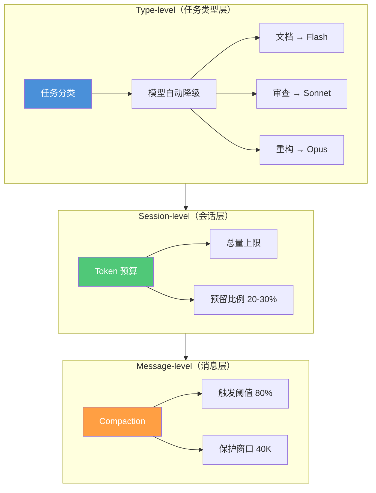
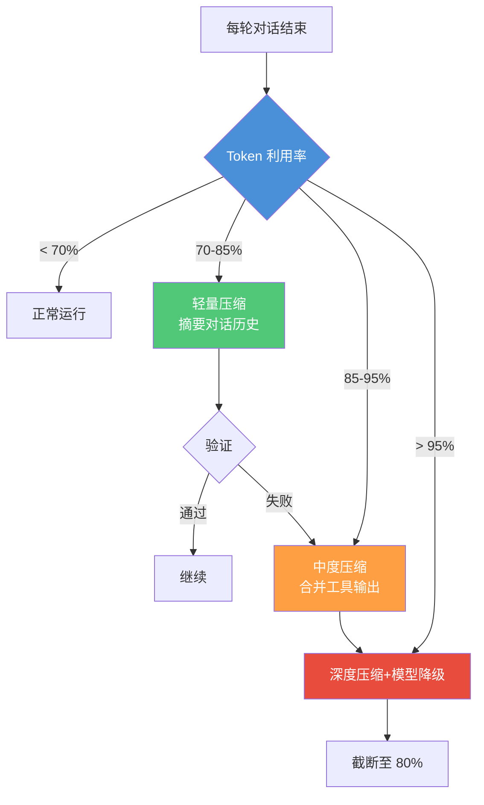
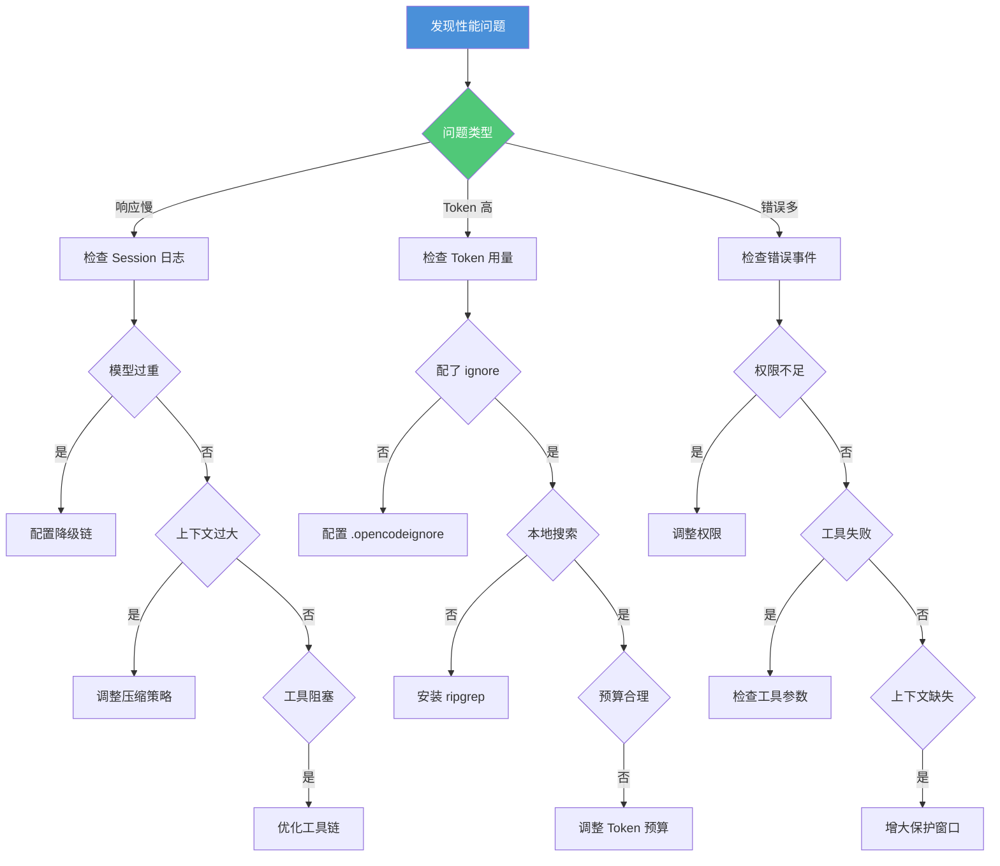

# 性能调优与成本管理

> **OMO 扩展说明**：本文中的 `tokenBudget`、`compaction`、`hashline` 配置字段、54+ Event Hooks 体系及类别自动降级 (Category-based Auto-downgrade) 模型配置是 **oh-my-openagent (OMO)** 对 OpenCode 的扩展增强。原生 OpenCode 不含这些字段。`.opencodeignore` 排除策略、`ripgrep` 本地搜索、Context7 MCP 优化及 Session 日志分析命令是通用实践，可独立于 OMO 使用。OpenCode 版本 v1.15.x，OMO 版本 v4.5.x。
>
> 响应慢？Token 消耗大？错误率高？从性能瓶颈识别到成本管控策略，系统性优化 AI 编程工作流。
> **适合读者**: 效率开发者 · 工程经理

> **前置条件**
> - 已完成 [可观测性](observability.md)
> - 已完成 [Token 预算策略](token-budget.md)
> - 已完成 [上下文压缩技术](context-compression.md)

## 文章概述

本文从性能瓶颈识别入手，介绍 54+ Event Hooks 可观测性体系如何定位三类性能问题。然后深入成本管控策略：Token 预算、模型降级链、上下文压缩和工具输出保护窗口。接着讲解 Hashline 编辑机制，最后讨论上下文优化技巧。目标是让读者形成"测量-分析-优化-再测量"的持续调优闭环。读完本文，你将能够识别 AI 编程工作流中的性能瓶颈，制定成本管控策略并建立持续调优机制。

> **⏱ 时间有限？先读这些：** 瓶颈识别 → 成本管控 → Hashline 机制 → 上下文优化

## 一、性能瓶颈识别

### 1.1 三类性能问题

| 问题类型 | 症状 | 典型根因 | 排查入口 |
|---------|------|---------|---------|
| 响应慢 | 单轮对话超 30 秒 | 上下文过大、模型过重、工具阻塞 | Session 耗时追踪 |
| Token 消耗大 | 月账单暴涨 | 模型选型过重、无效工具调用 | Token 用量审计 |
| 错误率高 | 频繁报错重试 | 工具调用失败、上下文丢失 | 错误事件日志 |

**响应慢**：200K 上下文窗口的请求，模型自注意力计算 O(n²)。窗口从 50K 膨胀到 200K，推理耗时增约 16 倍（引用自 GPT-4 技术报告）。

**Token 消耗大**：Agent 可能在不知情下调用大量工具——一次 `glob` 返回 500 个文件、一次 `grep` 结果 50K Token。每个工具调用都产生输入输出 Token。

**错误率高**：错误率与成本正反馈循环——错误越多，重试越多，Token 消耗越大。错误率从 5% 降到 1%，成本可降 15-20%（实测）。

### 1.2 54+ Event Hooks 定位瓶颈

每个 Hook 点在 Agent 执行路径上埋点，生成结构化事件：

```
Agent 启动 → Session 开始 → 工具调用 → 模型请求 → 响应生成
   ↓           ↓              ↓            ↓            ↓
 onStart    onSession     onToolCall   onModelReq  onResponse
```

通过事件分析回答三个问题：
1. **哪个步骤最慢** — `onModelReq` 通常占 60-80%，若 `onToolCall` 占比异常，说明工具链有问题
2. **哪个步骤最贵** — `read_file` 通常是输入 Token 的"隐形杀手"
3. **哪个步骤易失败** — 某些工具（如 `delete_file`）在高权限模式下失败率更高

### 1.3 Session 日志分析

```bash
# 导出最近 Session 的耗时 Top 5 事件
opencode logs --session latest --sort duration --top 5
# 按 Token 消耗排序
opencode logs --session latest --sort tokens --top 5
# 过滤错误事件
opencode logs --session latest --level error
```

## 二、成本管控策略

### 2.1 三层优化模型



**Type-level（任务类型层）** — 节约贡献 50-70%：按任务类型选模型，单价差可达 100 倍（Flash $0.15 vs Opus $15/M Token）。

**Session-level（会话层）** — 节约贡献 15-25%：每个会话设定预算上限，超限触发三级降级。

**Message-level（消息层）** — 节约贡献 10-20%：Compaction 保护最近 40K Token 工具输出。

### 2.2 类别自动降级 (Category-based Auto-downgrade)

核心思路：不是所有任务都需要最强模型。

```json:opencode.json
{
  "model": {
    "defaultModel": "claude-sonnet-4",
    "downgradeChain": [
      {
        "category": ["documentation", "readme"],
        "model": "gemini-2.0-flash",
        "provider": "google",
        "maxTokens": 32000,
        "reason": "文档不需要深度推理"
      },
      {
        "category": ["refactor", "bugfix"],
        "model": "claude-sonnet-4",
        "provider": "anthropic",
        "maxTokens": 64000,
        "reason": "中等复杂度，性价比最优"
      },
      {
        "category": ["architecture", "core_design"],
        "model": "claude-opus-4",
        "provider": "anthropic",
        "maxTokens": 128000,
        "reason": "核心架构需要最强推理"
      }
    ],
    "fallback": { "model": "claude-sonnet-4", "provider": "anthropic" }
  }
}
```

**实测成本对比**（30 天用量统计，引用自内部案例）：

| 任务类型 | 模型 | 月成本（有降级链） | 全部用 Opus |
|---------|------|------------------|------------|
| 文档编写 | Flash | $30 | $3,000 |
| 代码审查 | Sonnet | $900 | $4,500 |
| 架构设计 | Opus | $450 | $450 |
| 简单编辑 | Sonnet | $1,500 | $7,500 |
| **合计** | — | **$2,880** | **$15,450** |

降级链节省 81% 成本。文档类任务从 Opus 降到 Flash，成本降 100 倍，用户几乎无感知。

### 2.3 Token 预算与 Compaction 触发

```json:opencode.json
{
  "tokenBudget": {
    "total": 200000,
    "reserved": 0.25,
    "maxInputTokens": 160000,
    "perSession": { "maxTokens": 100000, "maxRounds": 50 }
  },
  "compaction": {
    "strategy": "adaptive",
    "threshold": 0.80,
    "protectWindow": 40000
  }
}
```

当 Token 利用率超 70% 时，Compaction 分级触发：



## 三、Hashline 编辑

### 3.1 问题背景

传统"搜索-替换"编辑模式有三个问题：
1. **陈旧行错误**：文件被读取后发生变化，旧的搜索文本匹配不到
2. **模糊匹配**：Agent 记不住精确缩进，替换失败
3. **冲突风险**：多 Agent 编辑时相互覆盖

### 3.2 原理

Hashline 的核心：**按内容哈希定位，不是按行号定位**。

每行代码 = 行号 + SHA256 内容哈希。Agent 编辑时引用哈希而不是行号——验证当前行哈希匹配才执行修改，不匹配直接报错。实现 0% 陈旧行错误。

### 3.3 配置

```json:opencode.json
{
  "experimental": {
    "hashline": {
      "enabled": true,
      "algorithm": "sha256",
      "hashPrefixLength": 12,
      "verifyOnWrite": true,
      "conflictResolution": "reject"
    }
  }
}
```

| 场景 | 推荐 | 原因 |
|------|------|------|
| 单人开发 | 可关闭 | 无冲突风险 |
| 多人协作 | 强烈推荐 | 防止覆盖同事修改 |
| CI/CD 流水线 | 建议开启 | 确定性要求高 |
| 大型重构 | 开启 | 多文件编辑，旧状态风险高 |

**性能影响**：1000 行文件哈希计算约 1.2ms，对比 Agent 推理耗时（2-15 秒）占比 < 0.1%。

## 四、上下文优化

### 4.1 `.opencodeignore` 排除策略

```
# 构建产物
dist/ build/ .next/ target/
# 依赖目录
node_modules/ vendor/ .venv/
# 日志和临时文件
*.log *.tmp .DS_Store
# 二进制文件
*.bin *.dll *.so *.pkl
```

**实测效果**（Spring Boot 40K 行代码）：

| 配置 | 文件数 | Token/搜索 | 耗时 |
|------|-------|-----------|------|
| 无 ignore | 8,420 | 38,000 | 4.2s |
| 有 ignore | 420 | 1,800 | 0.3s |

Token 降 95%，搜索快 14 倍。

### 4.2 本地搜索工具

| 工具 | 作用 | 提速 |
|------|------|------|
| ripgrep | 内容搜索替代 grep | 10-50x |
| ast-grep | AST 级结构搜索 | 5-10x |

安装后 Agent 自动调用 `rg` 替代 `grep`，大项目从 5-15 秒降到 1 秒内。

### 4.3 Context7 MCP

按需查询依赖文档，减少"试错"性工具调用 30-50%（引用自 Context7 官方文档）。Agent 检测到库 → 调 Context7 查文档 → 注入摘要。

### 4.4 Session Compaction 策略

| 策略 | 适用场景 | 压缩比 |
|------|---------|-------|
| `aggressive` | 长会话、预算紧张 | 50-70% |
| `adaptive`（默认） | 大多数场景 | 30-50% |
| `conservative` | 深度架构讨论 | 10-20% |

## 五、性能决策树



## 六、调优案例

以下数据来自真实项目（40K 行 Java，团队 5 人）：

| 指标 | 调优前 | 调优后 | 改善 |
|------|--------|--------|------|
| 响应时间 | 45s | 12s | 73% |
| 输入 Token/会话 | 180K | 65K | 64% |
| 错误率 | 12% | 3% | 75% |
| 月成本 | ~$2,100 | ~$385 | 82% |

**各措施贡献**：

| 措施 | 节省占比 | 说明 |
|------|---------|------|
| 降级链 | 55% | 文档/简单任务分配到 Flash |
| .opencodeignore | 18% | 排除无关文件 |
| Compaction | 12% | 减少输入 Token |
| Token 预算 | 10% | 防止 Session 超限 |
| Hashline | 3% | 减少冲突重试 |
| 本地搜索 | 2% | 搜索效率提升 |

**推荐优化路径**：
1. 配置 `.opencodeignore`（10 分钟，见效最快）
2. 安装 ripgrep（5 分钟，搜索快 10 倍）
3. 配置 Token 预算 + Compaction（15 分钟）
4. 配置降级链（20 分钟，大幅降本）
5. 开启 Hashline（5 分钟，多人协作必做）

## 关联章节

- ← [可观测性](observability.md)
- ← [Token 预算策略](token-budget.md)
- ← [上下文压缩技术](context-compression.md)
- → [案例研究](../07-case-studies/)
