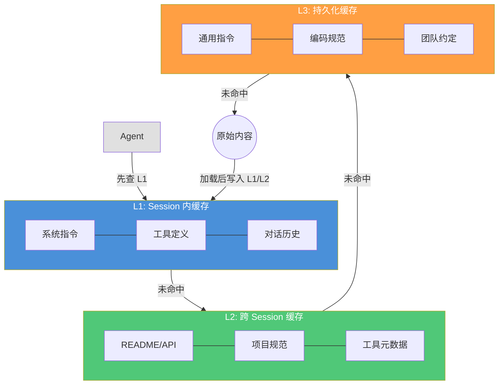
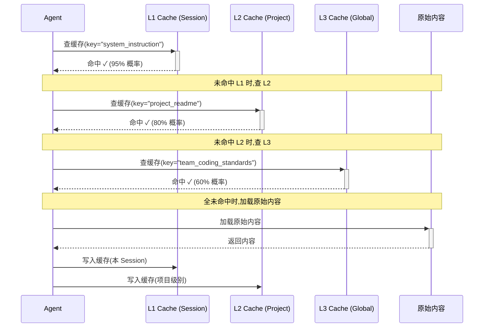

# 提示词缓存机制

> 系统指令、项目知识、工具输出——大量重复内容在每次请求中来回传输。三级缓存架构让这些内容只传一次，大幅降低 Token 消耗和响应延迟。
> **适合读者**: 架构师 · 效率开发者

## 文章概述

在 AI 编程工作流中，大量 Token 被浪费在重复内容上。每次 Agent 请求都携带系统指令、项目上下文和工具定义，而这些内容在同一个 Session 甚至跨 Session 中几乎不变。提示词缓存就是为了消除这些重复传输而设计的策略体系——它不是简单的"存一份"，而是一套包含缓存断点、中断检测和多种优化模式的完整机制。

本文从缓存的价值出发，对比缓存与压缩的互补关系（缓存消除重复、压缩精简必要内容）。然后深入三级缓存架构：Session 内缓存（同一会话中的临时复用）、跨 Session 缓存（项目级持久化）、持久化缓存（跨项目的全局知识）。接着介绍缓存断点机制——用户定义的可复用上下文片段，以及中断检测与断点续传功能。最后，总结 7+ 种缓存优化模式和命中率优化技巧，帮助读者在配置中充分发挥缓存的价值。读完本文，你将能够设计三级缓存架构、设置缓存断点并利用多种优化模式大幅降低 Token 消耗。

> **⏱ 时间有限？先读这些：** 三级缓存 → 缓存断点 → 中断检测 → 优化模式

## 内容要点

1. **缓存的战略价值** — 重复内容的 Token 浪费有多大（典型场景下可节省 30-50% Token）。缓存 vs 压缩：缓存是消除重复传输，压缩是精简必要内容，两者互补协同。

2. **三级缓存架构** — 第一级 Session 内缓存（对话级，自动管理，生命周期 = Session 生命周期）、第二级跨 Session 缓存（项目级，需配置，生命周期 = 项目持续期）、第三级持久化缓存（全局级，手动管理，生命周期 = 用户指定）。各级缓存的失效策略和缓存命中流程时序。

3. **缓存断点** — 什么是断点（用户定义的可复用上下文片段），断点设置策略（什么时候设置断点、断点的粒度选择），断点的完整生命周期（创建、引用、更新、失效）。

4. **中断检测** — 会话中断的自动检测机制（网络断开、超时、进程重启），断点续传如何恢复中断的会话，中断后的恢复策略（完整恢复 vs 部分恢复）。

5. **7+ 缓存优化模式** — 覆盖常见场景：系统指令固化（一次发送永久缓存）、项目知识缓存（README、API 文档）、工具输出缓存（MCP 查询结果）、往返模式缓存（用户编辑历史）等。每种模式的配置方法和适用场景。

6. **缓存命中率优化** — 缓存预热策略、缓存粒度调整、缓存淘汰策略选择（LRU vs LFU vs TTL）。

## 关联章节

- ← [Token 预算策略](token-budget.md)（缓存是预算策略的一部分）
- ← [上下文工程核心](../02-core-concepts/context-engineering-core.md)（上下文工程基础）
- → [记忆系统设计](memory-system.md)（记忆系统与缓存的关系）

## 缓存的战略价值

### Token 浪费的真实账本

每次 Agent 请求都携带大量重复内容。解剖一次典型请求：

| 内容类型 | 典型大小 | 重复频率 | 浪费比例 |
|---------|---------|---------|---------|
| 系统指令 | 2-4K Token | 每次请求 | 100% |
| 工具定义（MCP Schema） | 1-3K Token | 每次请求 | 100% |
| 项目知识（README/API 文档） | 5-10K Token | 跨 Session | 80-100% |
| 对话历史前缀 | 5-20K Token | 每次请求 | 逐次递增 |

没有缓存时，一次 5 轮交互的 Session 可能消耗 150K Token，其中 60-70% 是被反复传输的重复内容。缓存的目标就是消除这 60-70%——不是通过"少发"，而是通过"发一次，记住"。

### 缓存 ≠ 压缩

两者经常被混淆，但本质不同：

| | 缓存 | 压缩（Compaction） |
|---|---|---|
| 做什么 | 消除重复传输 | 精简必要内容 |
| 副作用 | 零 | 有损（信息被摘要） |
| 适用场景 | 不变的内容 | 变化的内容 |
| Token 节省 | 30-50% | 20-40% |
| 叠加效果 | — | 在缓存基础上进一步节省 |

**一句话直觉**：缓存是"不重复付邮费"，压缩是"把包裹压扁再寄"。两者互补，先命缓存，再不中的内容才考虑压缩。

## 三级缓存架构

缓存像 CPU 的多级缓存——离 Agent 越近的层级速度越快、容量越小，离 Agent 越远的层级速度越慢、容量越大。

### L1：Session 内缓存

- **范围**：当前对话会话
- **命中率**：~95%
- **生命周期**：Session 开始到结束
- **管理方式**：自动，无需配置
- **存储内容**：系统指令、工具定义、最近对话前缀

L1 是最高效的缓存——所有内容已经在模型的 KV Cache 中。代价是 Session 结束后全部失效。

### L2：跨 Session 缓存（项目级）

- **范围**：同一项目的多个 Session
- **命中率**：~80%
- **生命周期**：项目持续期（由 `maxAge` 控制）
- **管理方式**：需配置，自动存储和检索
- **存储内容**：README、API 文档、项目规范、常用工具元数据

L2 让新 Session 不用重新加载项目知识。它类似于"项目的 README 缓存"——你换了台电脑打开浏览器，上次的 Tab 没了，但书签还在。

### L3：持久化缓存（全局级）

- **范围**：跨项目的全局知识
- **命中率**：~60%
- **生命周期**：用户指定（直到主动清理）
- **管理方式**：手动管理，显式缓存和清除
- **存储内容**：通用系统指令、常用编码规范、团队约定

L3 是"你的个人 cheat sheet"——无论在哪个项目，这些知识都已经在那里等着了。

### 三级缓存架构图



### 缓存命中流程时序



### 各级缓存配置示例

```json:opencode.json
{
  "cache": {
    "session": {
      "enabled": true,
      "maxSize": 64000
    },
    "project": {
      "enabled": true,
      "maxAge": "24h",
      "maxSize": 128000,
      "patterns": ["README.md", "docs/**/*.md", "*.spec.ts"]
    },
    "global": {
      "enabled": false,
      "maxAge": "7d",
      "maxSize": 256000
    }
  }
}
```

**配置要点**：
- `session` 缓存建议始终启用——零成本、高收益
- `project` 的 `patterns` 控制哪些文件进入缓存——只缓存真正不会变的内容
- `global` 默认关闭——需要你确定哪些知识是真正的"全局不变"的

## 缓存断点

> 像书签一样标记可复用的上下文片段，让 Agent 在复杂对话中快速跳转到关键位置。

### 什么是断点

缓存断点是你手动标记的"上下文快照"——一个定义好的片段，可以在当前 Session 或跨 Session 中重复引用。它解决的场景是**中间状态的复用**：你花 10 轮对话定位了一个 bug 的根因，下一轮讨论修复方案时，不需要重新让 Agent 理解这个根因——直接引用断点即可。

断点跟缓存的关系：

| | 普通缓存 | 断点 |
|---|---|---|
| 创建 | 自动 | 手动 |
| 粒度 | 整段内容 | 精确片段 |
| 命名 | 无（key-value） | 有（用户命名） |
| 用途 | 被动命中 | 主动引用 |

### 断点设置策略

**什么时候设置断点**：
- 完成一次复杂分析后（如"数据库索引设计分析完毕"）
- 达成关键决策时（如"确认使用 DDD 架构"）
- 发现重要信息时（如"找到性能瓶颈的根因在 N+1 查询"）

**断点粒度选择**：

| 粒度 | 适用场景 | 例子 |
|------|---------|------|
| 粗粒度（整段对话） | 复杂分析完成后 | "索引设计讨论的全过程" |
| 中粒度（摘要+结论） | 关键决策 | "DDD 架构选型的理由和结论" |
| 细粒度（一句话/一段代码） | 精确信息 | "N+1 查询的根因分析" |

### 断点的生命周期

```json:opencode.json
{
  "cache": {
    "breakpoints": {
      "analysis_db_indexing": {
        "content": "索引设计分析结论：复合索引(user_id, status)覆盖 90% 查询",
        "created": "2025-01-15T10:30:00Z",
        "ttl": "1h",
        "tags": ["database", "performance"]
      }
    }
  }
}
```

1. **创建**：手动在对话中标记（如使用 `/breakpoint` 命令或配置触发条件）
2. **引用**：在新问题中通过名称引用（`@breakpoint:analysis_db_indexing`）
3. **更新**：在断点上追加新信息（自动合并或手动覆盖）
4. **失效**：TTL 到期、主动删除、或依赖内容发生变化时自动标记为 stale

### 实用场景

```
用户：记得我们上次分析的那个数据库索引问题吗？直接用那个结论来设计新的查询。
Agent：好的，引用断点「analysis_db_indexing」，结论是复合索引 (user_id, status)。
基于这个结论，你新增的查询建议改为：
```

## 中断检测

> Session 断了的感受很糟糕。中断检测让 Agent 知道"你回来了"并帮你接上。

### 会话中断的自动检测

中断检测就像一个"心跳监视器"——Agent 持续感知会话的健康状态：

| 中断类型 | 检测方式 | 恢复成本 |
|---------|---------|---------|
| 网络断开 | 连接超时检测 | 低——恢复后重新加载 L1 缓存 |
| 超时 | 无活动超期 | 中——需判断是否重新加载上下文 |
| 进程重启 | PID 变更检测 | 高——需重建整个上下文 |

### 断点续传机制

中断恢复的核心是**判断需要恢复什么**：

```json:opencode.json
{
  "cache": {
    "interrupt": {
      "resumeStrategy": "partial",
      "fullResumeThreshold": "5min",
      "partialResumeThreshold": "30min",
      "fallback": "summary"
    }
  }
}
```

三种恢复策略：

| 策略 | 条件 | 行为 |
|------|------|------|
| 快速恢复 | 中断 < 5min | 直接恢复 L1 缓存，几乎无感知 |
| 部分恢复 | 5min < 中断 < 30min | 恢复 L2 + 断点，丢弃 L1 |
| 摘要恢复 | 中断 > 30min | 仅恢复断点和最近摘要，重新构建上下文 |

**一句话直觉**：中断检测就像你在 IDE 里写代码时——离开 5 分钟回来直接继续，离开 1 小时回来得看看自己写到哪行。

### 恢复策略选择逻辑

```
中断发生 → 检测中断时长 → 查配置阈值 →
  <5min  → 完整恢复（L1 + L2 + 断点）
  5-30min → 部分恢复（L2 + 断点,重建 L1）
  >30min → 摘要恢复（仅断点 + Compaction 摘要,重新开始）
```

## 缓存优化模式

### 模式 1：静态内容前缀固化

**问题**：系统指令、角色定义、安全约束在每次请求中都一模一样。

**方案**：将这些内容标记为"只读前缀",首次加载后永久缓存。

```json:opencode.json
{
  "cache": {
    "prefix": true,
    "prefixContent": ["system_instruction", "role_definition", "security_constraints"]
  }
}
```

**使用场景**：任何使用 OpenCode 的项目——系统指令是 100% 不变的，没有理由每次重新发送。

**Token 节省**：2-4K Token/请求。

### 模式 2：动态内容后缀化

**问题**：工具输出（MCP 查询结果、文件读取内容）每次都可能不同，但许多在短时间内重复。

**方案**：将动态内容放在请求末尾，使用 TTL 短的缓存，避免影响 L1 的静态缓存命中率。

```json:opencode.json
{
  "cache": {
    "suffixTTL": {
      "mcp_query_result": "30s",
      "file_read_result": "60s",
      "command_output": "10s"
    }
  }
}
```

**使用场景**：频繁查询相同 API、反复读取同一个配置文件。

**Token 节省**：依工具输出大小而定，典型场景 1-10K Token/次。

### 模式 3：断点标记

详见前文"缓存断点"章节。这是手动控制与自动缓存的结合点，也是命中率提升空间最大的模式。

**使用场景**：复杂项目切换、跨 Session 协作、长序列分析。

**Token 节省**：每引用一个断点减少 2-5K Token 的上下文重建。

### 模式 4：分段缓存

**问题**：长文档缓存整个文件浪费空间，且局部修改导致整段失效。

**方案**：按章节/函数/逻辑块分段缓存，每段独立失效。

```json:opencode.json
{
  "cache": {
    "segmented": {
      "enabled": true,
      "delimiter": "## |^#{1,3} |^def |^function ",
      "minSegmentSize": 200
    }
  }
}
```

**使用场景**：缓存大型 README、API 文档、代码库结构描述。

**Token 节省**：每段修改不会引起其他段失效，长期可节省 30-50% 的重加载量。

### 模式 5：缓存预热

**问题**：新 Session 首次请求的 L2/L3 缓存全部未命中，性能反而差。

**方案**：在 Session 启动时主动加载高频缓存项。

```json:opencode.json
{
  "cache": {
    "warmup": {
      "enabled": true,
      "patterns": ["README.md", "CONTRIBUTING.md", ".opencode/**"],
      "maxWarmupTokens": 10000
    }
  }
}
```

**使用场景**：项目启动、新开发者加入、CI/CD 自动化 Agent。

**Token 节省**：预热本身消耗一次 Token,但避免后续多次未命中——净收益在 5+ 轮交互后体现。

### 模式 6：缓存失效策略

缓存失效是缓存工程里最难的问题。以下策略按推荐度排序：

| 策略 | 原理 | 适用场景 |
|------|------|---------|
| TTL（Time-To-Live） | 固定时间后自动过期 | 文件内容、工具输出 |
| LRU（Least Recently Used） | 淘汰最久未使用的 | 对话历史、临时分析 |
| LFU（Least Frequently Used） | 淘汰使用次数最少的 | 项目知识、工具定义 |
| Event-Driven | 文件变更时主动失效 | 正在编辑的代码 |

```json:opencode.json
{
  "cache": {
    "eviction": {
      "defaultStrategy": "ttl",
      "strategies": {
        "project_files": "event-driven",
        "tool_outputs": "ttl",
        "conversation_history": "lru"
      },
      "eventDrivenWatch": ["src/**/*.ts", "*.md"]
    }
  }
}
```

**使用场景**：大型项目中"文件修改后缓存未更新"是最常见的问题——Event-Driven 策略直接解决它。

### 模式 7：命中率监控

> 无法衡量的缓存是无法优化的。

```json:opencode.json
{
  "cache": {
    "monitoring": {
      "enabled": true,
      "logHitRate": true,
      "alertThreshold": 60,
      "reportInterval": "1h"
    }
  }
}
```

命中率 < 60% 说明缓存配置很可能有问题——大多数内容是动态的，或者 TTL 太短。

**一句话直觉**：监控命中率就像看你的网站 CDN 命中率——低于 60% 说明要么配置错了，要么业务不合适。

## 缓存命中率优化

### 命中率影响因素

| 因素 | 影响方向 | 调优手段 |
|------|---------|---------|
| 内容稳定度 | 越稳定的内容命中率越高 | 将静态/动态内容分开缓存 |
| 缓存粒度 | 粒度过大→频繁失效 | 分段缓存（模式 4） |
| TTL 设置 | TTL 过短→命中率低 | 适当延长 TTL+主动失效 |
| 预热策略 | 预热不足→首次未命中 | 配置预热模式（模式 5） |
| 断点使用 | 断点越多→重建越少 | 鼓励关键节点打断点 |

### 优化 Checklist

按优先级排序：

1. **打开命中率监控**（没有数据就没有优化方向）
2. **静态内容独立缓存**（系统指令、工具定义——这些必须命中）
3. **分段缓存长文档**（防止一个修改导致整段缓存失效）
4. **配置 TTL 策略映射**（不同类型内容用不同的 TTL）
5. **添加预热规则**（特别是新项目首次启动）
6. **培养断点习惯**（复杂分析/关键决策后打断点）
7. **定期检查命中率报告**（低于 60% 时检查配置）

## 验证标准

完成本章学习后，请确认你能够：

- [ ] 解释三级缓存架构（L1/L2/L3）的层级关系和命中率特征
- [ ] 配置项目的缓存参数（session/project/global 三层）
- [ ] 定义缓存断点并在对话中引用
- [ ] 配置中断检测和恢复策略（快速恢复/部分恢复/摘要恢复）
- [ ] 说出至少 5 种缓存优化模式及其适用场景
- [ ] 配置分段缓存和缓存预热
- [ ] 解释缓存与压缩的互补关系
- [ ] 根据命中率监控报告调优缓存配置
