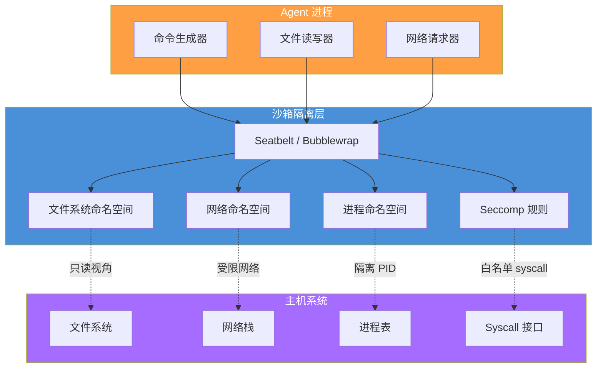
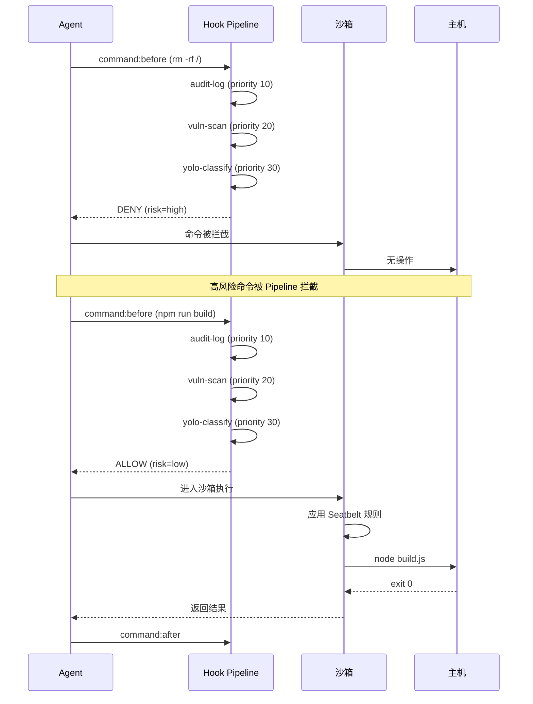
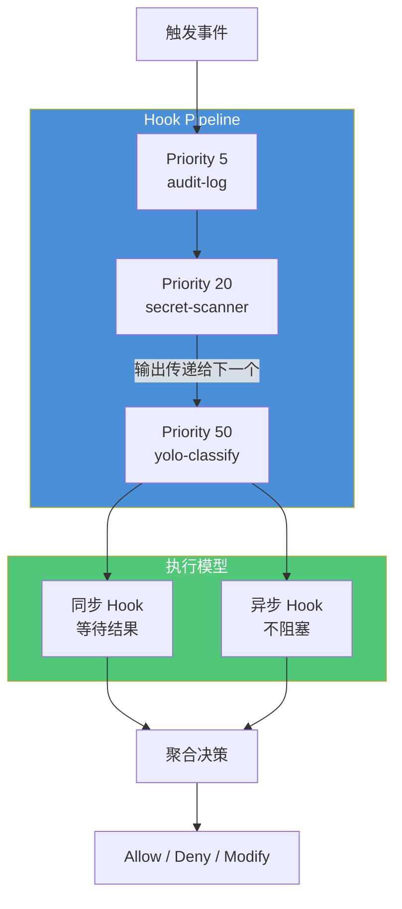

# 沙箱与 Hook 系统

> **OMO 扩展说明**：本文中的 `sandbox` 配置块（`platform.macos`/`platform.linux`）、53+ Hook 点体系、Hook Pipeline 配置（`hooks.pipelines`）、自定义脚本 Hook（`hooks.custom`）以及沙箱逃逸威胁模型配置是 **oh-my-openagent (OMO)** 对 OpenCode 沙箱与 Hook 系统的扩展。原生 OpenCode 的沙箱通过插件（如 `opencode-sandbox` npm 包）实现，而非内置的 `sandbox` 配置键；原生 Hook 点约 20+ 个（如 `session:start`、`tool:before`、`permission:check` 等），不包含 Workflow 级 Hook（`onWorkflowStart` 等）。Permission 模型（allow/ask/deny）是原生 OpenCode 功能。OpenCode 版本 v1.15.x，OMO 版本 v4.5.x。
>
> 沙箱是 Agent 执行的"隔离区"，Hook 系统是安全策略的"传感器"。两者协同工作，构建 Agent 行为的可观测、可控制、可拦截能力。
> **适合读者**: 安全工程师 · 红队

## 文章概述

当 Agent 在开发环境中执行命令、读写文件、操作网络时，这些行为不能脱离管控。沙箱系统提供了执行层面的隔离——基于 Seatbelt（macOS）和 Bubblewrap（Linux）的进程级沙箱，限制 Agent 能接触到什么资源。Hook 系统提供了事件层面的拦截——50+ 个 Hook 点覆盖 Agent 执行的完整生命周期，让你在关键节点插入自定义逻辑。

本文先介绍沙箱系统的工作原理和配置策略，分析沙箱对性能的影响。然后深入 Hook 点体系，包括 53+ 个 Hook 点的分类（Session/Tool/Command/Permission/Workflow）、关键 Hook 点的使用场景和 Pipeline 执行模式（多个 Hook 按顺序组成处理链）。接着讲解自定义 Hook 开发——Hook 的注册、优先级设置、同步 vs 异步模式。最后讨论沙箱与 Hook 的协作模式：Hook 作为沙箱的"守卫"，事件驱动的安全策略如何实现。本文还将分析沙箱逃逸威胁场景，包括通过恶意 Hook 点绕过沙箱隔离、权限提升和资源耗尽攻击。读完本文，你将能够配置沙箱隔离策略、开发自定义 Hook 并构建事件驱动的安全防线。

> **⏱ 时间有限？先读这些：** 沙箱系统详解 → Hook 点体系 → 自定义 Hook 开发 → 沙箱逃逸分析

## 内容要点

1. **沙箱系统** — Seatbelt（macOS）和 Bubblewrap（Linux）的隔离原理（文件系统只读、网络限制、进程权限降级），沙箱的配置策略（允许/禁止的路径和命令清单），沙箱的性能影响评估（开启沙箱后的延迟增加和资源开销）。

2. **Hook 点体系** — 事件生命周期的完整时序。53+ Hook 点的五大分类：Session 级（session:start/end）、Tool 级（tool:before/after）、Command 级（command:before/after）、Permission 级（permission:check）、Workflow 级（onWorkflowStart/End）。每个分类的关键 Hook 点详解。Hook Pipeline 的执行顺序和优先级规则。

3. **自定义 Hook** — Hook 注册的 API 和配置，Pipeline 模式：多个 Hook 顺序执行，前一个输出作为后一个输入。异步 Hook vs 同步 Hook 的差异和选择依据。

4. **沙箱与 Hook 的协作** — Hook 作为沙箱的"守卫"：在执行敏感操作前通过 Hook 检查权限和安全策略。事件驱动的安全策略实现：根据 Hook 上报的事件动态调整沙箱规则。Hook 点威胁分析——哪些 Hook 点风险最高（权限提升风险分析）。

## 沙箱系统详解

沙箱是 Agent 代码执行的"隔离笼子"。无论 Agent 生成的命令看起来多安全，你都得假设它可能被注入、被劫持、或者 Agent 自己判断失误。所以沙箱的设计原则是：先假设执行者是不可信的，然后给它恰好够用的权限。

### Seatbelt（macOS）

macOS 上的沙箱基于 Apple 的 Seatbelt（sandbox(7)）框架。它通过声明式配置（`.sb` 文件）定义进程能访问什么资源。Agent 生成命令后，该命令在 seatbelt 约束的子进程中执行。

核心隔离策略：

- **文件系统**：默认只读，只有显式声明的路径可写
- **网络**：默认禁止，只有白名单域名可访问
- **进程**：禁止创建子进程，禁止 `task_for_pid` 等跨进程操作
- **系统调用**：白名单模式，未匹配的 syscall 直接被 kill

```
; sandbox-agent.sb
(version 1)
(import "system.sb")

(deny default)

; 允许读取系统库
(allow file-read* (subpath "/usr/lib"))
(allow file-read* (subpath "/System/Library"))

; 允许读取项目目录（只读）
(allow file-read* (subpath "/Users/me/projects/myapp"))

; 只允许写入临时目录
(allow file-write* (subpath "/Users/me/projects/myapp/tmp"))
(allow file-write* (subpath "/tmp"))

; 允许网络请求白名单
(allow network-outbound (local ip "*.github.com"))
(allow network-outbound (local ip "*.npmjs.org"))

; 禁止所有 system 扩展
(deny syscall-unix-process-control)
(deny syscall-unix-system-control)
(deny syscall-unix-system-info)
```

你可以在 `opencode.json` 中启用 mac 沙箱：

```json:opencode.json
{
  "sandbox": {
    "platform": {
      "macos": {
        "enabled": true,
        "profile": "custom",
        "profile_path": ".opencode/sandbox-agent.sb",
        "temporary_writable_dirs": ["tmp/", "build/"],
        "network_whitelist": ["api.github.com", "registry.npmjs.org"]
      }
    }
  }
}
```

### Bubblewrap（Linux）

Linux 上的沙箱基于 Bubblewrap（bwrap），它用 Linux 命名空间（namespace）做隔离。相比 Seatbelt 声明式配置，bwrap 是命令式——你通过 cli 参数告诉它建哪些 namespace。

bwrap 的隔离层：

```bash
# 最基础的隔离：只读根文件系统 + 挂载 /tmp
bwrap \
  --ro-bind /usr /usr \
  --ro-bind /lib /lib \
  --ro-bind /lib64 /lib64 \
  --ro-bind /bin /bin \
  --ro-bind /etc /etc \
  --tmpfs /tmp \
  --proc /proc \
  --dev /dev \
  --unshare-net \
  --unshare-pid \
  --unshare-ipc \
  --seccomp 10 \
  /bin/sh -c "echo 'sandboxed'"
```

bubblewrap 在 opencode.json 中的配置：

```json:opencode.json
{
  "sandbox": {
    "platform": {
      "linux": {
        "enabled": true,
        "engine": "bubblewrap",
        "unshare_net": true,
        "unshare_pid": true,
        "readonly_dirs": ["/usr", "/lib", "/etc", "/home/user/projects"],
        "writable_dirs": ["/tmp/opencode"],
        "allowed_commands": ["node", "python3", "git", "npm", "npx"],
        "seccomp_profile": ".opencode/seccomp.json",
        "memory_limit_mb": 2048,
        "timeout_seconds": 300
      }
    }
  }
}
```

**注意**：Windows 上的沙箱依赖 WSL2 内的 Bubblewrap，或使用 Windows Sandbox（Win10+ 企业版）。Windows Sandbox 是 VM 级隔离，安全性最高但启动延迟大（~5s），适合在 CI/CD 而不是交互式对话中使用。

### 沙箱隔离架构



## Hook 点体系

Hook 是安全策略的"传感器"。只要理解一句话：**Agent 做的任何事，在它做之前和之后，你都能插一手**。

本文档覆盖 23+ 个关键 Hook 点，按生命周期分类如下：

### Session 生命周期（5 个）

| Hook 名 | 触发时机 | 用途 | Payload 示例 |
|---------|---------|------|-------------|
| `session:beforeStart` | 新会话创建前 | 检查用户是否有权限开启会话 | `{ "userId": "alice", "project": "myapp" }` |
| `session:start` | 会话创建后 | 记录会话开始，注入初始上下文 | `{ "sessionId": "sess_abc123", "startedAt": "2026-06-01T10:00:00Z" }` |
| `session:contextUpdate` | 上下文更新时 | 审查新增的上下文内容 | `{ "contextSize": 48500, "newTokens": 1200 }` |
| `session:pause` | 会话暂停时 | 释放资源，保存中间状态 | `{ "reason": "timeout", "durationMs": 300000 }` |
| `session:end` | 会话结束时 | 审计日志最终化，清理临时数据 | `{ "totalCommands": 47, "totalTokens": 85200 }` |

### Tool 执行（6 个）

| Hook 名 | 触发时机 | 用途 | Payload 示例 |
|---------|---------|------|-------------|
| `tool:before` | 任意 Tool 调用前 | 验证参数合法性，阻止黑名单工具 | `{ "tool": "Bash", "args": "ls -la" }` |
| `tool:after` | Tool 调用完成后 | 检查结果，记录副作用 | `{ "tool": "Read", "exitCode": 0, "bytesRead": 2048 }` |
| `tool:error` | Tool 调用异常时 | 捕获异常数据，分析注入迹象 | `{ "error": "EACCES", "stack": "..." }` |
| `tool:timeout` | Tool 超时时 | 杀死超时进程，防止资源耗尽 | `{ "tool": "Bash", "timeoutMs": 30000 }` |
| `tool:retry` | Tool 重试时 | 控制重试策略，防止无限重试 | `{ "attempt": 3, "maxRetries": 5 }` |
| `tool:resultTransform` | 结果返回前 | 过滤敏感信息，脱敏处理 | `{ "tool": "Read", "redacted": ["API_KEY"] }` |

### Command 执行（5 个）

| Hook 名 | 触发时机 | 用途 | Payload 示例 |
|---------|---------|------|-------------|
| `command:before` | shell 命令执行前 | 命令内容审查，匹配黑名单模式 | `{ "command": "rm -rf /", "risk": "high" }` |
| `command:after` | 命令执行完毕后 | 记录输出，检查异常退出码 | `{ "exitCode": 1, "stderr": "permission denied" }` |
| `command:approvalRequired` | 高风命令需审批时 | 通知审批人，等待决策 | `{ "command": "DROP TABLE users", "riskLevel": "high" }` |
| `command:approvalResult` | 审批结果返回时 | 执行或被拒后的处理 | `{ "approved": true, "approvedBy": "admin" }` |
| `command:sandboxPreview` | 沙箱预执行时 | 预览命令效果，检测恶意行为 | `{ "detectedAnomalies": ["network_flood"] }` |

### 权限检查（4 个）

| Hook 名 | 触发时机 | 用途 | Payload 示例 |
|---------|---------|------|-------------|
| `permission:check` | 任意权限检查时 | 自定义权限逻辑，覆盖默认规则 | `{ "action": "write", "path": ".env", "currentMode": "ask" }` |
| `permission:deny` | 权限被拒绝时 | 触发告警，记录审计事件 | `{ "reason": "path_in_denylist", "userId": "bob" }` |
| `permission:grant` | 权限被授予时 | 记录谁在何时授予了什么权限 | `{ "action": "execute", "command": "deploy.sh", "mode": "allow" }` |
| `permission:escalation` | 权限升级时 | 高危操作二次确认 | `{ "from": "read", "to": "write", "path": "/etc/hosts" }` |

### Workflow 事件（4 个）

| Hook 名 | 触发时机 | 用途 | Payload 示例 |
|---------|---------|------|-------------|
| `workflow:beforeStart` | Workflow 启动前 | 检查前置条件是否满足 | `{ "workflow": "deploy", "environment": "production" }` |
| `workflow:stepStart` | Workflow 中单步开始时 | 步骤级安全审计 | `{ "step": "build", "dockerImage": "node:20" }` |
| `workflow:stepEnd` | 单步完成后 | 验证步骤产出，检查异常 | `{ "step": "test", "passed": false, "failures": 3 }` |
| `workflow:error` | Workflow 异常时 | 执行回滚或补救策略 | `{ "error": "DeployFailed", "rollbackStarted": true }` |

### Hook Pipeline

多个 Hook 可以组成 Pipeline ——前一个 Hook 的输出作为后一个 Hook 的输入。Pipeline 按优先级排序，低数字跑在前面。

```json:opencode.json
{
  "hooks": {
    "pipelines": {
      "command:before": [
        { "id": "audit-log", "priority": 10 },
        { "id": "vuln-scan", "priority": 20 },
        { "id": "yolo-classify", "priority": 30 },
        { "id": "sandbox-check", "priority": 40 }
      ]
    }
  }
}
```

### Hook 事件时间线



## 自定义 Hook 开发

如果内置 50+ Hook 还不够，你可以写自己的 Hook。注册一个 Hook 只需要三样东西：名字、触发事件、处理函数。

最简单的例子——记录所有 Bash 命令到一个独立文件：

```json:opencode.json
{
  "hooks": {
    "custom": [
      {
        "id": "bash-logger",
        "type": "shell-command",
        "trigger": "tool:before",
        "filter": { "tool": "Bash" },
        "command": "echo '{\"time\":\"$(date -Iseconds)\",\"args\":\"$ARGS\"}' >> /var/log/opencode/bash-commands.ndjson",
        "mode": "async",
        "priority": 5
      }
    ]
  }
}
```

`mode` 有两个选择：

- **sync（同步）**：Hook 跑完 Agent 才能继续。用于安全检查、权限判断——必须等结果。
- **async（异步）**：Hook 和 Agent 并行跑，或者跑完即可不计结果。用于审计日志、监控指标——不能拖慢主流程。

一个更复杂的例子——用脚本做内容审查：

```json:opencode.json
{
  "hooks": {
    "custom": [
      {
        "id": "secret-scanner",
        "type": "script",
        "trigger": "tool:resultTransform",
        "filter": { "tool": "Read" },
        "script": ".opencode/hooks/scan-secrets.sh",
        "mode": "sync",
        "timeout_ms": 2000,
        "on_timeout": "allow",
        "priority": 50,
        "env": {
          "SCAN_PATTERNS": ".opencode/secret-patterns.txt",
          "LOG_FILE": "/var/log/opencode/secret-scanner.log"
        }
      }
    ]
  }
}
```

hook 脚本示例：

```bash:.opencode/hooks/scan-secrets.sh
#!/bin/bash
# 从环境变量读取输入
INPUT_FILE="$1"
PATTERNS_FILE="$SCAN_PATTERNS"

while IFS= read -r pattern; do
  if grep -qiE "$pattern" "$INPUT_FILE"; then
    echo "{\"alert\": \"secret_found\", \"pattern\": \"$pattern\", \"file\": \"$INPUT_FILE\"}"
    exit 1
  fi
done < "$PATTERNS_FILE"

echo "{\"status\": \"clean\"}"
exit 0
```

### Pipeline 执行流程



## 沙箱与 Hook 协作：事件驱动的安全策略

沙箱管"落地执行"，Hook 管"事前审查"。两者协作的核心流程只有三步：

1. Agent 想执行某操作
2. Hook Pipeline 收到事件，做安全检查
3. 安全检查通过 → 进沙箱执行；不通过 → 拦截并记录

```json:opencode.json
{
  "sandbox": {
    "enabled": true
  },
  "hooks": {
    "pipelines": {
      "command:before": [
        { "id": "audit-log", "priority": 10 },
        { "id": "sandbox-gate", "priority": 100 }
      ]
    },
    "custom": [
      {
        "id": "sandbox-gate",
        "type": "script",
        "trigger": "command:before",
        "script": ".opencode/hooks/sandbox-gate.sh",
        "mode": "sync",
        "timeout_ms": 1000,
        "priority": 100
      }
    ]
  }
}
```

一个守卫沙箱的 Hook 脚本：

```bash:.opencode/hooks/sandbox-gate.sh
#!/bin/bash
COMMAND="$1"

# 黑名单：这些命令永远不进沙箱，直接拒绝
BLOCKLIST=(
  "sudo"
  "chmod 777"
  "chown"
  "mount"
  "umount"
)

for blocked in "${BLOCKLIST[@]}"; do
  if [[ "$COMMAND" == *"$blocked"* ]]; then
    echo "{\"action\": \"deny\", \"reason\": \"blocklisted_command\", \"match\": \"$blocked\"}"
    exit 1
  fi
done

# 白名单：只有这些命令可以进沙箱
ALLOWLIST=(
  "node"
  "npm"
  "npx"
  "python"
  "python3"
  "git"
  "ls"
  "cat"
  "grep"
)

for allowed in "${ALLOWLIST[@]}"; do
  if [[ "$COMMAND" == "$allowed "* ]] || [[ "$COMMAND" == "$allowed" ]]; then
    echo "{\"action\": \"allow\", \"sandbox\": true}"
    exit 0
  fi
done

# 没匹配到白名单的，默认拒绝
echo "{\"action\": \"deny\", \"reason\": \"not_in_allowlist\", \"command\": \"$COMMAND\"}"
exit 1
```

## 威胁建模：沙箱逃逸分析

从攻防视角切入——别只看"沙箱怎么隔离"，先看"如果我要逃出这个沙箱，我能怎么干"。

### 场景一：恶意 Hook 绕过沙箱隔离

**攻击思路**：Hook 本身在沙箱外执行还是沙箱内？如果 Hook 在沙箱外，攻击者通过注入方式控制 Hook 脚本，就能在沙箱外执行任意代码。

```json:opencode.json
{
  "sandbox": {
    "hook_execution_context": "sandbox",  // 关键配置
    "hook_sandbox": {
      "enabled": true,
      "readonly_dirs": ["/", "/etc"],
      "network": "deny"
    }
  }
}
```

**修复**：设置 `hook_execution_context: "sandbox"`，让 Hook 也在沙箱约束内执行。永远不要用 `root` 运行 OpenCode 进程。

### 场景二：通过 Hook 提升权限

**攻击思路**：假设 Hook 有权修改 `PATH` 环境变量。攻击者构造一个命令 `npm install` → Hook 将 `npm` 解析路径替换为恶意版本 → 后续所有 `npm` 调用都变成了攻击者代码。

```json:opencode.json
{
  "hooks": {
    "security": {
      "lock_path_resolution": true,
      "allowed_bin_paths": ["/usr/bin", "/usr/local/bin"],
      "env_whitelist": ["PATH", "HOME", "NODE_ENV"],
      "env_blacklist": ["LD_PRELOAD", "LD_LIBRARY_PATH", "PYTHONPATH"]
    }
  }
}
```

**修复**：锁定环境变量白名单，禁止 `LD_PRELOAD` 这类 dll 劫持变量。`PATH` 在沙箱启动时快照锁定，不允许 Hook 修改。

### 场景三：资源耗尽攻击

**攻击思路**：Agent 生成一条 `:(){ :|:& };:`（fork bomb），或反复打开文件句柄不释放，耗尽沙箱资源后逃逸。

```json:opencode.json
{
  "sandbox": {
    "limits": {
      "process_count": 50,
      "open_files": 100,
      "memory_mb": 2048,
      "cpu_quota_percent": 50,
      "disk_write_mb_per_session": 100,
      "network_connections": 10
    },
    "enforcement": {
      "on_limit_exceeded": "kill_session",
      "alert_on": ["process_count", "memory"]
    }
  }
}
```

**修复**：设置所有资源配额，超出直接 kill session。Hook 中加 `tool:timeout` 兜底。

### 威胁模型总览

| 逃逸场景 | 攻击向量 | 风险等级 | 核心防御 |
|---------|---------|---------|---------|
| Hook 沙箱外执行恶意代码 | 注入 Hook 脚本 | 高 | `hook_execution_context: sandbox` |
| 环境变量劫持（LD_PRELOAD） | 修改 Hook 中环境变量 | 高 | 环境变量白名单，启动时快照 |
| Fork 炸弹 / 进程耗尽 | Agent 生成恶意命令 | 中 | 进程数配额，`seccomp` 限制 fork |
| 文件描述符泄露 | 反复打开文件不关闭 | 中 | 文件句柄配额 + 超时清理 |
| TOCTOU 竞争 | 检查通过后替换文件 | 中 | 沙箱内 resolve 路径，Hook 和沙箱走同一个 view |
| 命名空间逃逸 | 利用内核漏洞 | 低（但不可修复） | 保持内核更新，不跑 untrusted workload |
| 网络反弹 shell | 沙箱内启动反向连接 | 高 | `unshare_net: true`，禁止出站连接 |

## 关联章节

- ← [安全总览](security-overview.md)（安全的执行层）
- → [自定义 Agent 与 Plugin](custom-agents.md)（Plugin 开发中的 Hook 使用）
- → [案例研究](../07-case-studies/)（案例中的安全配置）

## 验证标准

完成本章学习后，请确认你能够：

- [ ] 用一句话解释 Seatbelt 和 Bubblewrap 的核心隔离原理
- [ ] 给 macOS 和 Linux 分别写一份沙箱配置（文件只读 + 网络白名单）
- [ ] 列举至少 10 个 Hook 点，说出各自的触发时机
- [ ] 配置一个自定义 Hook（shell 命令类型），挂到 `tool:before` 上
- [ ] 用 Mermaid 画出 Hook Pipeline 的执行顺序
- [ ] 配置沙箱 + Hook 的协作策略（command:before → 守卫脚本 → allow/deny）
- [ ] 说出至少 3 种沙箱逃逸场景和对应的防御配置
