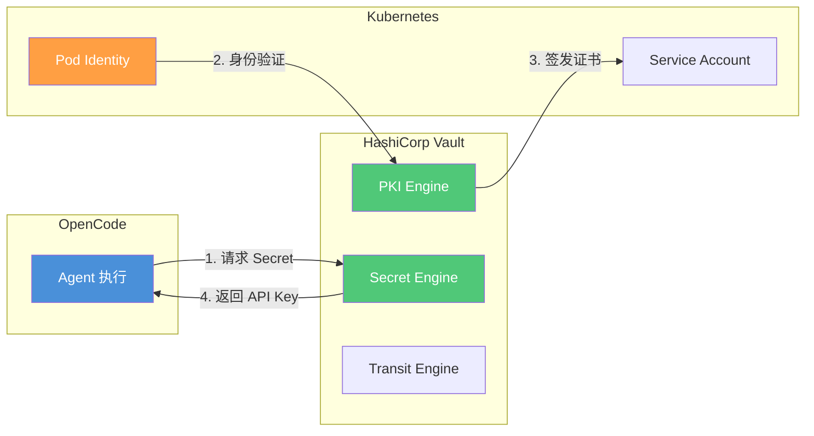

# 安全总览

> AI 编程流水线的安全不是事后补丁，而是架构设计的固有部分。从权限模型到提示注入防御，系统化构筑安全防线。

## 文章概述

当 Agent 能够读写文件、执行命令、调用 API 时，安全就不再是"等出了问题再处理"的事情。OpenCode 的安全模型覆盖四个层面：**权限控制**（谁可以做什么）、**风险分类**（当前操作有多危险）、**执行隔离**（操作在哪里执行）、**注入防御**（恶意指令怎么被识别）。这四个维度共同构成了纵深防御体系。

本文从安全的整体架构出发，首先展示四层安全模型——权限、分类、隔离、防御。然后详细讲解 6 种权限模式（全局/项目/会话/工具 + 允许/询问/禁止三级策略）和自定义规则的优先级机制。接着深入 YOLO 分类器——它能根据历史数据判断当前操作的风险等级（高/中/低），并支持自定义分类规则。针对最常见的威胁——提示注入，分析攻击类型和防御策略。最后介绍权限审计功能，包括审计日志配置和合规映射（NIST/SOC2/等保）。本文还将使用 STRIDE 方法在 Agent 编排全过程中系统性地分析威胁面。

## 内容要点

1. **安全架构总览** — 四层安全模型：权限层（能否执行）、分类层（风险多高）、隔离层（在哪执行）、防御层（如何阻断）。Agent 编排全过程的攻击面分析（使用 STRIDE 方法）。

2. **6 种权限模式** — 三种作用域：全局模式（影响所有项目）、项目模式（影响单个项目）、会话模式（影响当前对话）、工具模式（影响单个工具）。三种策略级别：允许（Always Allow）、询问（Ask Each Time）、禁止（Always Deny）。自定义规则的优先级计算和冲突解决。

3. **YOLO 分类器** — 高/中/低风险的分类依据（文件修改、命令执行、API 调用各有不同的风险基线），YOLO 分类的训练方法（基于历史决策学习用户的偏好）、自定义分类规则的编写。

4. **提示注入防御** — 注入攻击的类型（直接注入、间接注入、编码绕过），防御策略（检测已知模式、隔离外部内容、限制指令执行权限），注入检测和记录。

5. **权限审计** — 审计日志的配置和查看（谁在何时做了什么操作、使用了什么权限），合规映射（NIST/SOC2/等保标准对照），定期审查策略和自动化审计报告。

## STRIDE 威胁建模

基于 STRIDE 模型分析 OpenCode 面临的安全威胁及防护措施：

| 威胁类型 | 描述 | OpenCode 防护措施 | 配置示例 |
|----------|------|-------------------|----------|
| **S**poofing（欺骗） | 冒充合法用户或系统 | API Key 验证、环境变量注入、托管配置强制 | `{ "provider": { "anthropic": { "options": { "apiKey": "{env:ANTHROPIC_API_KEY}" } } } }` |
| **T**ampering（篡改） | 修改数据或代码 | 权限规则、文件保护、Git 集成审计 | `{ "permission": { "edit": { ".env": "deny", "**/secrets/**": "deny" } } }` |
| **R**epudiation（否认） | 否认操作行为 | 审计日志、Hook 事件记录、Snapshot 快照 | `{ "snapshot": true, "audit": { "enabled": true, "log_file": "/var/log/opencode/audit.log" } }` |
| **I**nformation Disclosure（信息泄露） | 敏感数据暴露 | .opencodeignore、Secret 管理、沙箱隔离 | `.opencodeignore` 排除敏感文件 |
| **D**enial of Service（拒绝服务） | 资源耗尽攻击 | Token 预算、速率限制、容器资源限制 | `{ "limit": { "output": 32768 }, "sandbox": { "memory": "2g" } }` |
| **E**levation of Privilege（特权提升） | 获取未授权权限 | 沙箱隔离、权限分层、最小权限原则 | Bash 白名单 + Seatbelt/Bubblewrap |

### 合规映射

> 注意：合规认证需要审计机构认可，此处仅为配置辅助参考，不构成认证保证。

| 合规框架 | 相关控制 | OpenCode 配置映射 |
|----------|----------|-------------------|
| **NIST CSF** | PR.AC-4 访问控制 | Permission Rule 引擎 |
| **NIST CSF** | PR.DS-5 数据保护 | .opencodeignore + 沙箱隔离 |
| **NIST CSF** | DE.CM-1 恶意代码检测 | 审计日志 + Hook 事件 |
| **SOC 2** | CC6.1 逻辑访问 | 权限分层 + Secret Store |
| **SOC 2** | CC6.6 安全传输 | 环境变量注入 + TLS |
| **等保 2.0** | 身份鉴别 | API Key 验证 + MDM 托管 |
| **等保 2.0** | 访问控制 | Permission Rule + Agent 权限覆盖 |

## Secret Store 集成

企业环境推荐集成专业 Secret 管理服务，避免在配置文件中硬编码敏感信息。

### HashiCorp Vault

```json
{
  "secrets": {
    "backend": "vault",
    "vault": {
      "address": "https://vault.example.com",
      "path": "secret/data/opencode",
      "role": "opencode-agent"
    }
  }
}
```

**Vault 集成架构**：



**详细配置**：

```json
{
  "secrets": {
    "backend": "vault",
    "vault": {
      "address": "https://vault.example.com",
      "auth": {
        "method": "kubernetes",
        "role": "opencode-agent"
      },
      "secrets": [
        {
          "path": "secret/data/anthropic",
          "key": "api_key",
          "env": "ANTHROPIC_API_KEY"
        }
      ]
    }
  }
}
```

### AWS Secrets Manager

```json
{
  "secrets": {
    "backend": "aws-secrets-manager",
    "aws": {
      "region": "us-east-1",
      "secrets": [
        {
          "secret_id": "opencode/anthropic-api-key",
          "env": "ANTHROPIC_API_KEY"
        },
        {
          "secret_id": "opencode/database-url",
          "env": "DATABASE_URL"
        }
      ]
    }
  }
}
```

## 关联章节

- ← [约束系统解析](../02-core-concepts/constraints-system.md)（约束系统基础）
- ← [OpenCode 配置详解](../03-setup/opencode-config.md)（配置中的安全设置）
- → [沙箱与 Hook 系统](sandbox-hooks.md)（沙箱是安全隔离的执行层）
- → [可观测性](observability.md)（监控指标与告警）
- → [环境搭建：多环境部署方案](../03-setup/multi-env-setup.md)（Secret 管理在环境部署中的应用）
