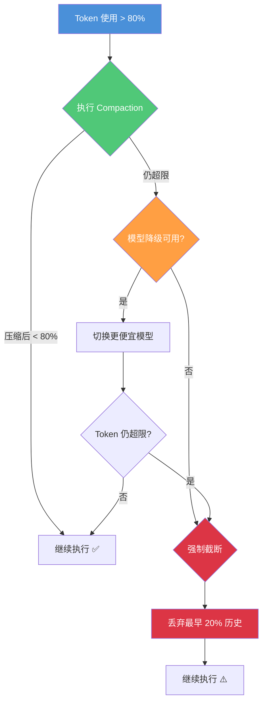

# Token 预算策略

> Token 就是 AI 编程的"算力货币"。学会预算分配、消耗估算和超限处理，让每一分算力都花在刀刃上。
> **适合读者**: 效率开发者 · 工程经理

## 文章概述

Token 消耗直接决定了 AI 编程的成本和响应速度。没有预算管理，一个简单的代码审查请求可能消耗掉整个复杂重构任务的 Token 额度。Token 预算策略就是给每个任务分配合理的"内存配额"，在有限的窗口内做最有价值的事。

本文首先定义 Token 预算的核心概念——它类似于操作系统的内存配额，防止单个任务无限消耗。然后展开预算分配的四项策略：系统消息占用、用户输入占用、工具输出占用和预留空间。接着介绍按任务类型和代码行数估算 Token 消耗的方法，辅以经验公式和辅助工具。最关键的是预算超限处理——当 Token 接近上限时，系统如何依次触发压缩、模型降级和强制截断。最后总结一套可落地的最佳实践，让 Token 预算从约束变成能力。读完本文，你将能够为不同任务类型制定 Token 预算、估算消耗量并在超限时自动触发降级策略。

## 内容要点

1. **Token 预算概念** — 什么是 Token 预算（类似"内存配额"），为什么需要预算——防止无限消耗、控制成本、保证响应速度。预算不足和过剩的两种极端场景分析。

2. **预算分配策略** — 四类占用分析：系统消息（固定开销，约 2-4K Token）、用户输入（任务描述 + 代码上下文）、工具输出（MCP/Plugin 返回的数据，动态变化）、预留空间（留给 Agent 推理和生成的缓冲区）。分配比例的推荐配置和一个完整实例（含估算、分配、调整全过程）。

3. **估算方法** — 按任务类型估算（简单问答 vs 代码审查 vs 大型重构），按代码行数估算（每行约 2-4 Token），经验公式和辅助工具。

4. **预算超限处理** — 三种降级策略的触发条件和效果对比：压缩触发（优先执行 Compaction，有损但保留关键信息）、模型降级（使用更便宜的模型继续执行）、强制截断（最后手段，丢弃最早的历史记录）。

5. **最佳实践** — 常见任务类型的预算配置建议、预算监控和调整方法、团队级预算管理策略。

## Token 预算概念

### 一句话直觉

Token 预算就像操作系统的内存配额。OS 不会让一个进程吃掉所有内存——Agent 也不该让一次请求吃掉整个 Token 窗口。

### 为什么需要预算

没有预算管理，会出现三个问题：

1. **无限消耗** — 一个大型工具返回结果（如 `git log --all` 的输出）可能直接填满 80K Token，让后续请求无空间可用
2. **成本失控** — 输入 Token 直接乘以 Token 单价就是成本。没有预算意识，一个简单问题可能消耗价值几毛钱甚至几块钱的 Token
3. **响应变慢** — 上下文越大，模型推理越慢（LLM 的自注意力机制是 O(n²) 复杂度）

### 两个极端场景

**场景 A：预算不足**

```
配置：total: 100K, reserved: 10%
表现：每次代码审查都触发 Compaction，Agent 频繁"失忆"
　   用户说"刚才讨论的方案还记得吗？" → Agent 一脸茫然
　   用户感受：对话超过 3 轮就变智障
```

**场景 B：预算过剩**

```
配置：total: 200K, 无 allocation 策略
表现：一个大请求填满窗口，后续请求无空间
　   第一个请求很慢（所有上下文都要处理），后面越来越慢
　   用户感受：第一次响应要等 30 秒，然后越来越卡
```

正确做法：根据模型上限和任务类型设定合理的预算分配。

### 预算的核心公式

```
可用 Token = min(模型上限, 配置上限)
已用 Token = 系统消息 + 用户输入 + 工具输出 + Agent 推理(预留)
剩余空间 = 可用 Token - 已用 Token

预算紧张度 = 已用 Token / 可用 Token
- 紧张度 > 80%: 触发 Compaction
- 紧张度 > 90%: 触发模型降级
- 紧张度 > 95%: 触发强制截断
```

## 预算分配策略

### 四类占用分析

Token 预算将有限的上下文窗口划分为四个区域，每个区域的作用和管理策略不同。

**系统消息（固定开销）**：
- 内容：System Prompt + Tool Definitions + 项目上下文
- 典型大小：2-4K Token
- 特点：每个 Session 固定，可通过缓存优化
- 如果不设置缓存，每次请求都会重复传输

**用户输入（任务描述 + 代码上下文）**：
- 内容：用户的问题 + @file 引入的代码 + 对话历史
- 典型大小：10-100K Token，动态变化
- 管理要点：按需加载，大文件只加载相关部分

**工具输出（MCP/Plugin 返回数据）**：
- 内容：文件读取结果、搜索返回、命令执行输出
- 典型大小：20-150K Token，波动最大
- 管理要点：结果压缩、分页返回、保护窗口

**预留空间（Agent 推理缓冲）**：
- 内容：Agent 的思考过程、生成的响应
- 推荐大小：20-30% 的总预算
- 不可侵占——没有预留空间，Agent 无法生成完整响应

### 分配比例推荐

| 区域 | 占比 | 200K 窗口下的分配 | 管理要点 |
|------|------|-------------------|----------|
| 系统消息 | 2-5% | 4K | 固定开销，通过缓存优化 |
| 用户输入 | 25-30% | 50K | 按需加载，智能截断 |
| 工具输出 | 40-50% | 80K | 结果压缩，保护窗口 |
| 预留空间 | 20-30% | 66K | 严格保留，不可侵占 |

### 推荐配置

```json:opencode.json
{
  "tokenBudget": {
    "total": 200000,
    "allocation": {
      "system": 4000,
      "user": 50000,
      "tools": 80000,
      "reserved": 66000
    },
    "enforcement": "strict"
  }
}
```

这个配置的含义：
- `total 200K` 是模型上限（Claude 模型）
- `system 4K` 固定开销，放系统指令
- `user 50K` 给用户输入和历史对话
- `tools 80K` 给 MCP 工具返回数据
- `reserved 66K`（33%）留给 Agent 推理和生成响应
- `enforcement: "strict"` 严格模式，不允许超限

### 动态分配 vs 静态分配

| 模式 | 优点 | 缺点 | 适用场景 |
|------|------|------|----------|
| 静态分配 | 可预测，易于调试 | 浪费空间（各区域不能借用） | 任务类型固定的场景 |
| 动态分配 | 空间利用率高 | 复杂度高，可能出现争抢 | 多任务混合场景 |

如果需要动态分配，使用 `enforcement: "flexible"`——允许各区域在空闲时互相借用空间，但在总预算超过 80% 时触发 Compaction。

## 估算方法

### 按任务类型估算

不同任务类型的 Token 消耗差异很大。以下是一组经验数据：

| 任务类型 | 典型 Token 消耗 | 说明 |
|----------|----------------|------|
| 简单问答 | 1-5K | 不需要代码上下文，一问一答 |
| 代码片段解释 | 5-15K | 需要读 1-2 个文件 |
| 代码审查 | 20-50K | 需要理解代码上下文 + diff |
| 小型重构 | 30-80K | 需要多个文件的上下文 |
| 大型重构 | 80-150K | 需要项目全局理解 |
| 新项目生成 | 50-100K | 系统指令 + 需求描述 + 输出 |

### 按代码行数估算

每行代码的 Token 消耗取决于语言和注释量：

```
Python/JavaScript: 约 2-3 Token/行
TypeScript/Java:   约 3-4 Token/行（类型注解增加）
Go/Rust:          约 3-5 Token/行（错误处理 + 类型）
配置文件(YAML):    约 4-6 Token/行（缩进敏感，Tokenize 效率低）
```

每个文件额外有 50-200 Token 的"元数据"开销（路径 + 语言标记）。

### 经验公式

```
估算 Token = 基础开销 + 代码行数 × 3 + 对话轮次 × 200 + 工具调用数 × 500
```

各分量说明：
- **基础开销**：系统指令 + 工具定义，约 2-4K
- **代码行数 × 3**：平均每行代码消耗 3 Token
- **对话轮次 × 200**：每轮问答约消耗 200 Token
- **工具调用数 × 500**：每次工具调用的输入输出平均消耗

### 完整估算示例

估算一次代码审查任务的 Token 消耗：

```
任务：审查 5 个文件的改动（共 200 行 diff）

基础开销:           4,000 Token （系统指令 + 工具定义）
代码:   200 行 × 3 =   600 Token
对话:   3 轮 × 200 =   600 Token
工具:   5 次 × 500 = 2,500 Token （文件读取 + git diff）
─────────────────────────────────
总计:               7,700 Token
```

这个任务只需要约 8K Token，200K 窗口下非常充裕。但如果在同一 Session 中连续审查 10 个 PR，累积到 80K+ 就需要关注了。

### 辅助估算工具

OpenCode 提供内置的 Token 估算命令：

```bash
# 估算单个文件的 Token 数
opencode estimate-tokens src/app.ts

# 估算一组文件的 Token 数
opencode estimate-tokens src/**/*.ts

# 返回格式：
# File: src/app.ts
# Tokens: 1,234
# Lines: 45
# Tokens/Line: 27.4
```

## 预算超限处理

### 三级降级策略

当 Token 使用接近上限时，系统依次触发三级响应：



### 三级响应详解

| 级别 | 触发条件 | 动作 | 影响 | 优先级 |
|------|----------|------|------|--------|
| **压缩** | Token > 80% | 执行 Compaction | 有损但保留关键信息 | 1（首选） |
| **降级** | Token > 90% | 切换到更便宜的模型 | 响应质量下降 | 2 |
| **截断** | Token > 95% | 丢弃最早 20% 历史 | 可能丢失重要上下文 | 3（最后手段） |

### 为什么是这三个阈值

- **80%**：预留 20% 空间给 Compaction 操作本身（压缩也需要 Token）
- **90%**：再预留 10% 给模型降级后的推理缓冲
- **95%**：最后 5% 给强制截断的指令

### 超限处理配置

```json:opencode.json
{
  "tokenBudget": {
    "overrunHandling": {
      "compression": {
        "enabled": true,
        "threshold": 0.8,
        "priority": 1
      },
      "modelDowngrade": {
        "enabled": true,
        "threshold": 0.9,
        "fallbackModel": "claude-haiku",
        "priority": 2
      },
      "truncation": {
        "enabled": true,
        "threshold": 0.95,
        "strategy": "fifo",
        "priority": 3
      }
    }
  }
}
```

### 关于模型降级的注意事项

模型降级是把双刃剑：
- 优点：立竿见影地减少 Token 消耗（Haiku 的上下文处理比 Sonnet 便宜约 5 倍）
- 缺点：代码质量下降明显，复杂推理能力减弱

**适用场景**：
- 预算型任务（批量代码审查、文档生成）→ 优先降级
- 质量型任务（架构设计、安全审查）→ 不要降级，宁可截断

如果需要禁用模型降级：

```json:opencode.json
{
  "tokenBudget": {
    "overrunHandling": {
      "modelDowngrade": {
        "enabled": false
      }
    }
  }
}
```

## 最佳实践

### 常见任务类型的预算配置

| 任务类型 | total | reserved | 超限策略 | 说明 |
|----------|-------|----------|----------|------|
| 简单问答 | 50K | 25% | 压缩 → 截断 | 对话短，不用降级 |
| 代码审查 | 100K | 25% | 压缩 → 截断 | 质量优先 |
| 重构 | 180K | 30% | 压缩 → 降级 → 截断 | 大窗口，逐步降级 |
| 文档生成 | 80K | 20% | 压缩 → 降级 | 可接受质量下降 |
| 安全审查 | 200K | 35% | 压缩 → 截断 | 必须完整，禁止降级 |

### 完整的工作示例：从估算到调整

**场景**：要对一个中大型代码库做 Bug 修复（需要理解 5 个相关文件）。

```
Step 1 — 估算需求
  基础开销（系统指令）:          4K
  5 个文件 × 200 行 × 3 Token:  3K
  对话 5 轮:                    1K
  工具调用 8 次:                4K
  Agent 推理（预留 25%）:       4K
  ──────────────────────────────
  估算总计:                     16K

Step 2 — 初步配置
  total: 100K（留够余量）
  allocation: system 4K / user 15K / tools 60K / reserved 21K

Step 3 — 实际运行后调整
  首轮后发现：
  - 工具输出比预期的多（文件读取返回了大量代码）
  - 实际使用 45K Token，比估算多很多
  - 调整：total 提升到 128K，tools 提升到 80K

Step 4 — 超限策略设置
  - 80% 触发压缩（约 102K）
  - 90% 降级到 Haiku
  - 95% 截断
```

### 预算监控和调整方法

不要一次配完就不管了。预算需要持续监控和调整：

```json:opencode.json
{
  "observability": {
    "tokenBudget": {
      "metrics": ["usage_pct", "compression_count", "downgrade_count", "truncation_count"],
      "alerts": {
        "compression_frequent": {
          "condition": "compression_count > 5 per hour",
          "action": "suggest_increase_budget"
        },
        "downgrade_triggered": {
          "condition": "downgrade_count > 0",
          "action": "warn_user"
        }
      }
    }
  }
}
```

**调整原则**：
1. 如果频繁触发压缩（每小时 > 5 次）→ 增加 total 或调低 threshold
2. 如果从不触发压缩（24 小时 0 次）→ 减少 total，避免浪费
3. 如果频繁触发降级 → 检查 tools 分配是否不足，或任务需要更大窗口
4. 如果频繁截断 → 总预算严重不足，立即增加

### 团队级预算管理策略

多开发者共享同一个模型 API Key 时，需要团队级预算管理：

| 策略 | 做法 | 适用场景 |
|------|------|----------|
| 按角色分配 | 开发者 150K / 审查者 100K / 新手 200K | 团队角色明确 |
| 按任务分配 | 重构 180K / 审查 100K / 问答 50K | 任务类型固定 |
| 浮动预算 | 统一 128K，超限走降级 | 快速迭代团队 |
| 成本中心 | 每个请求记录 Token 消耗到日志 | 需要成本核算 |

Token 预算不是限制，而是杠杆。明确知道每一分算力花在哪里，才能在有限资源下做出最大产出。不设预算的 Agent 就像没有限额的信用卡——迟早刷爆。

## 关联章节

- ← [上下文压缩技术](context-compression.md)（压缩在预算超限时触发）
- → [性能调优与成本管理](performance-tuning.md)（配置中的预算参数）
- → [提示词缓存机制](prompt-caching.md)（缓存可以节省 Token 预算）
