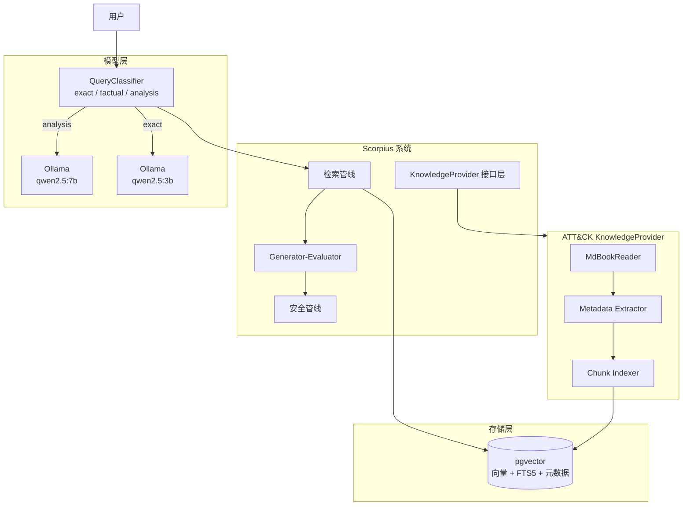
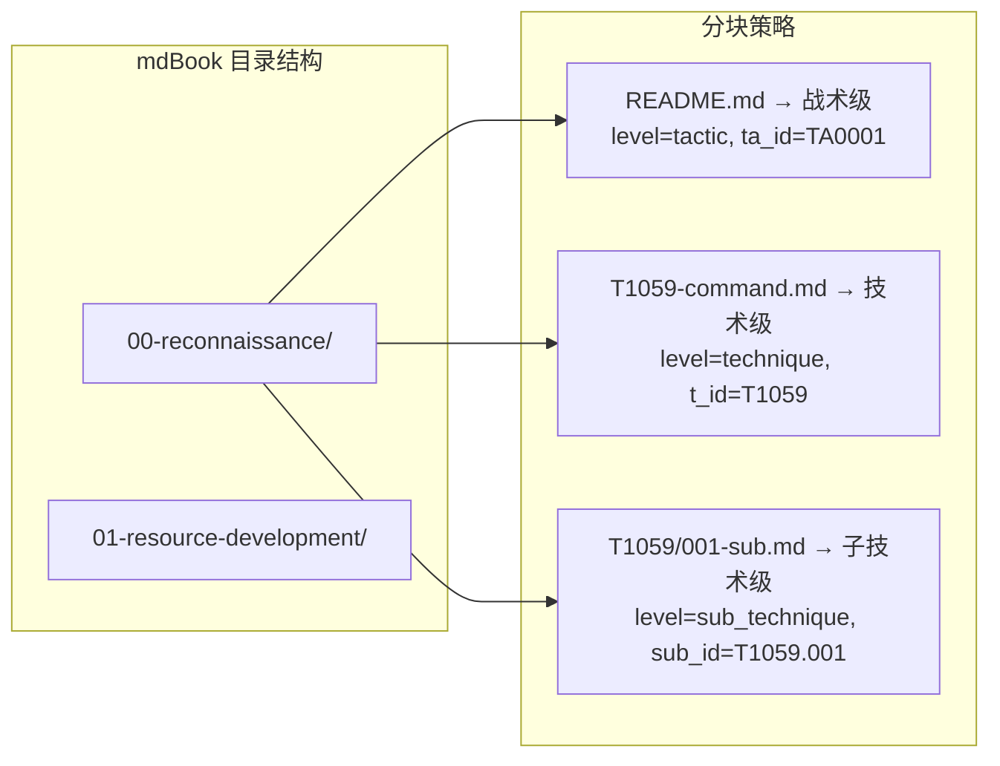
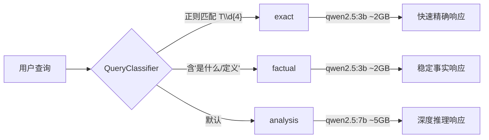
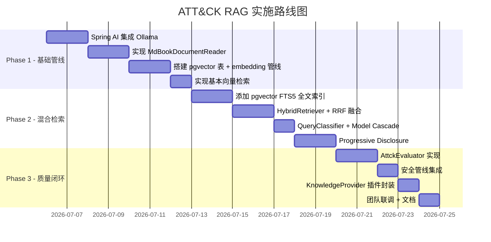

# 案例：本地 RAG 知识库构建

> 从多轮 AI 对话到多角色敏捷评审，再到生产级 Spring AI 集成——记录一个 MITRE ATT&CK 中文知识库 RAG 系统的完整决策过程。关键洞察：Python 快速验证思路，Spring 生态承载生产，而 mdBook 的结构化数据最适合"混合检索 + 渐进披露"。

## 案例概述

本案例记录了一个 MITRE ATT&CK 中文知识库（约 274 篇 Markdown 文档，覆盖 15 大战术、254 项技术、910+ 子技术）的本地 RAG 系统构建全过程。这不是一个从零开始的技术实现教程，而是一个**关于"如何做技术决策"的案例**——展示了在多个方案之间如何通过多轮分析、多角色评审、多维度对比来收敛到最优解。

案例的核心冲突是 **Python 快速原型 vs Java 生产集成**：元宝（Tencent Yuanbao）推荐了一套完整的 Python + LlamaIndex + sqlite-vec 方案，代码量小、落地快；但最终方案选择了将检索能力作为 Scorpius 项目的一个 KnowledgeProvider 插件，使用 Spring AI + pgvector 实现。这个决策背后的权衡过程——从数据特征分析、技术栈适配、团队长期成本到安全合规考量——是本案例最有价值的部分。

读完本文，你将理解如何为一个结构化的 Markdown 知识库设计 RAG 方案，如何在 Python 原型和 Java 生产实现之间做取舍，以及如何将"上下文工程"的思路应用到检索系统的设计中。

> **⏱ 时间有限？先读这些：** 项目背景 → 方案探索 → 架构设计 → 核心组件

## 1. 项目背景

### 1.1 数据源特征

attck-knowledge 是一个 MITRE ATT&CK 中文翻译与解读项目，使用 mdBook 构建。数据特征决定了技术选型的方向：

```json:src/07-case-studies/case-local-rag-knowledge.md
{
  "data_source": {
    "name": "attck-knowledge",
    "format": "mdBook (Markdown + SUMMARY.md 导航)",
    "scale": "274 篇文档，约 3000-5000 chunk（按 ## 小节切分）",
    "structure": "src/{NN}-{TacticName}/README.md（战术概览）+ T{NNNN}-{Name}.md（技术）+ T{NNNN}/ 子目录（子技术）",
    "query_patterns": [
      "精确 TID 查询: 'T1059 是什么'",
      "战术聚合: '侦察阶段有哪些技术'",
      "语义搜索: 'DLL 侧加载怎么检测'",
      "交叉关联: '哪些技术能检测进程注入'"
    ]
  }
}
```

关键洞察：这份数据**结构极强**（TA/T/Sub-tech 三级 ID 体系 + 固定小节格式），用户查询**混合精确 ID 命中与语义展开**两种模式。纯向量检索会浪费其结构化优势，**混合检索（Hybrid Search）** 是刚需。

### 1.2 硬件约束

```json:src/07-case-studies/case-local-rag-knowledge.md
{
  "hardware": {
    "ram": "16 GB",
    "gpu": "无独显",
    "os": "Windows 11",
    "disk": "SSD 充足"
  }
}
```

16GB 无独显意味着：LLM 推理全走 CPU（8-12 tok/s），embedding 模型必须轻量（bge-small-zh-v1.5 约 2GB 推理峰值），reranker 初期不上。

### 1.3 需求清单

| 需求 | 优先级 | 说明 |
|------|--------|------|
| 本地运行，数据不出机 | P0 | 知识库敏感，必须纯本地 |
| 混合关键字检索 | P0 | TID 精确命中 + 语义搜索双路 |
| 团队可共享 | P1 | 多成员需能方便使用 |
| 支持数据更新 | P1 | ATT&CK 版本升级时重建索引 |
| 可扩展为 API | P2 | 后续可能集成到其他系统 |

## 2. 方案探索（多轮迭代）

本案例最特别的地方在于：方案不是一次性设计出来的，而是经历了**3 轮与元宝的对话 + 1 轮多角色敏捷评审**的迭代。

### 2.1 第一轮：FAISS 是不是最优？

初始问题是"FAISS 文件索引是不是最优方案"。元宝的分析给出关键纠偏：

> FAISS 不是 RAG 完整方案，它是检索引擎，只覆盖 RAG pipeline 里"向量搜索"那一段。RAG 需要的切片管理、元数据过滤、持久化、标量混合检索——FAISS 全得自己补。

同档替代方案对比：

| 方案 | 定位 | 内置 embedding | metadata 过滤 | 持久化 |
|------|------|:---:|:---:|:---:|
| FAISS | 检索引擎库 | ❌ | ❌ | 手动 save/load |
| Chroma | 轻量向量库 | ✅ | ✅ | 自动 SQLite |
| LanceDB | 文件式向量库 | ❌ | ✅ SQL 式 | 自动 Lance 列式 |
| sqlite-vec | SQLite 扩展 | ❌ | ✅ SQL 原生 | 自动 SQLite |

**结论**：FAISS 单用不够，**sqlite-vec + FTS5**（同一 SQLite 文件，原生支持混合检索）最适合这份结构化数据。

### 2.2 第二轮：结合本书的上下文工程理念

将本书的上下文工程理念注入 RAG 设计，提出四级优化：

| 级别 | 优化 | 来源 |
|------|------|------|
| P0 | **按 mdBook 目录结构做语义分块**（非简单 ## 切割） | 本书 AST 感知分块 |
| P1 | **模型降级链**（精确查询→3B，分析查询→7B） | 本书上下文工程性能调优 |
| P2 | **渐进式披露**（按查询类型控制上下文深度）+ **质量度量** | 本书上下文质量度量 |
| P3 | **封装为 Skill**（SKILL.md + reference 体系） | 本书 Skill 系统 |

P3 的 Skill 化设计是最具 OpenCode 特色的部分：不把 RAG 系统做成一个黑盒服务，而是拆分为**两个 Skill**——一个管索引构建、一个管查询问答。每个 Skill 都附带独立的 `SKILL.md` 说明文件和 `references/` 参考目录，智能体通过自然语言就能触发对应技能。

| Skill | 职责 | 触发词 |
|-------|------|--------|
| `attck-index-builder` | 构建/更新 ATT&CK 知识库索引 | "帮我重建索引"、"更新知识库" |
| `attck-rag-query` | 执行 RAG 查询并生成回答 | "T1059 是什么"、"侦察阶段有哪些技术" |

这种设计的好处是**解耦**——索引构建是一次性操作，查询是高频操作，两者不需要共享同一个进程。Python 原型天然适合 Skill 化：`index_builder.py` 和 `query.py` 本身就是自包含的 CLI 入口，Skill 的 `references/` 目录只需指向 `attck-rag/config/` 下的配置文件即可。

元宝确认了 P0（nav 分块）和 P1（模型降级）的设计方向，建议 P2 分阶段实施，并认可 P3 的 Skill 化思路是"长期维护成本最低的方案"。

### 2.3 第三轮：团队可共享的完整方案

元宝给出完整的 `attck-rag/` 独立项目，包含：

```text
attck-rag/
├── app/
│   ├── main.py              # FastAPI 服务
│   ├── index_builder.py     # mdBook 解析 + 索引构建
│   ├── retriever.py         # 混合检索 + RRF 融合 + 模型降级
│   ├── config.py            # 配置
│   └── requirements.txt     # 依赖
├── scripts/
│   ├── build_and_start.ps1  # Windows 一键启动
│   └── build_and_start.sh   # Linux/macOS 一键启动
├── Dockerfile & docker-compose.yml
└── README.md
```

核心代码用 200+ 行 Python 实现了完整链路：

```python:examples/attck-rag/python/index_builder.py
def parse_attck_chunks(src_dir):
    """按 mdBook 目录层级解析，nav 结构感知的分块"""
    chunks = []
    for tactic_dir in sorted(os.listdir(src_dir)):
        # 00-reconnaissance/ → TA0001
        readme_path = os.path.join(tactic_dir, "README.md")
        if os.path.exists(readme_path):
            # 提取 TA_ID 作为 metadata
            ta_id = extract_ta_id(readme_path)
            chunks.append({"text": content, "metadata": {"level": "tactic", "ta_id": ta_id}})
        
        for fname in sorted(os.listdir(tactic_path)):
            # T1059-command-and-scripting-interpreter.md
            t_id = fname.split("-")[0]
            chunks.append({"text": content, "metadata": {"level": "technique", "t_id": t_id}})
            
            # T1059/ 子目录下的子技术
            for sub_fname in sorted(os.listdir(sub_dir)):
                sub_id = sub_fname.split("-")[0]
                chunks.append({"text": content, "metadata": {"level": "sub_technique", "sub_id": sub_id}})
    
    return chunks
```

### 2.4 多角色敏捷评审

作为敏捷教练，组织了 5 个角色的并行评审：

| 角色 | 发现 | 裁决 |
|------|------|------|
| 📋 需求分析师 | 需求覆盖率 100% | ✅ 通过 |
| 🏗 架构顾问 | sqlite-vec 选型合理，评分 8/10 | ✅ 通过 |
| 🛠 后端架构师 | 发现 4 个 bug（Docker 过度设计、t_id 作用域错误、索引路径不匹配、版本过新） | ⚠️ 需修复 |
| 🧪 QA 工程师 | 测试方案完备，需构造 20-30 问题覆盖四类场景 | ✅ 通过 |
| 🤖 智能体工程师 | 长期维护路径清晰 | ✅ 通过 |

4 个 bug 被元宝全部采纳修复，方案从"Python 独立项目"演变为"纯本地 venv 默认，Docker 可选"。

### 2.5 与 Scorpius 项目的鸿沟分析

当尝试将 Python 方案集成到 Scorpius（一个 Spring Boot + Spring AI 的 AI 筹划系统）时，发现存在根本性差距：

```json:src/07-case-studies/case-local-rag-knowledge.md
{
  "gap_analysis": {
    "query_model": {"python": "Q&A 问答", "scorpius": "资产特征→技战法推荐"},
    "tech_stack": {"python": "Python + LlamaIndex", "scorpius": "Java + Spring AI"},
    "security": {"python": "无安全层", "scorpius": "PromptSanitizer + OutputValidator"},
    "architecture": {"python": "单体 FastAPI", "scorpius": "Generator-Evaluator 分离"},
    "data_isolation": {"python": "全局数据", "scorpius": "目标级数据隔离"},
    "overall_score": {"python": "4/10", "scorpius": "需要原生方案"}
  }
}
```

**Python 方案的 4/10 分揭示了一个核心矛盾**：原型验证的价值与生产集成的成本。最终决策不是"谁的代码好"，而是"哪个方向长期维护成本低"。

## 3. 架构设计

### 3.1 方案对比决策

| 维度 | 权重 | Python 独立 | Spring 集成 | 混合架构 |
|------|:---:|:---:|:---:|:---:|
| 落地合理性 | 40% | 5 | **8** | 6 |
| 落地难度 | 30% | **6** | 5 | 3 |
| 后续扩展 | 30% | 4 | **9** | 5 |
| **加权总分** | 100% | **5.0** | **7.3** | 4.8 |

**最终决策**：Spring AI 集成到 Scorpius，吸取 Python 原型的 4 个设计精华。

### 3.2 系统架构



### 3.3 关键技术决策

| 决策点 | 选择 | 理由 |
|--------|------|------|
| 向量存储 | **pgvector** | Scorpius 已有 PostgreSQL，零新依赖 |
| 检索融合 | **RRF（Reciprocal Rank Fusion）** | 无需手动调权，初版省调参 |
| 文档解析 | **自研 MdBookReader** | mdBook 结构规整，200 行 Java 实现 |
| Embedding | **bge-small-zh-v1.5** | 已验证，96MB 轻量，中文够用 |
| LLM 推理 | **Ollama + qwen2.5** | Scorpius 已有集成 |
| 安全控制 | **沿用 Scorpius 管线** | PromptSanitizer / OutputValidator 不改动 |
| 反馈闭环 | **Generator-Evaluator** | Scorpius 原生模式 |

## 4. 核心组件设计

### 4.1 MdBookReader（文档解析器）

从 Python 原型提取的核心设计——按 mdBook 的目录导航结构做语义分块，而非简单按 `##` 切割：



关键元数据字段设计：

```json:examples/attck-rag/mdbook-parser.json
{
  "metadata_schema": {
    "level": "tactic | technique | sub_technique",
    "ta_id": "TA0001~TA0043",
    "ta_name": "侦察 | 资源开发 | ...",
    "t_id": "T1059",
    "t_name": "命令和脚本解释器",
    "sub_id": "T1059.001",
    "difficulty": "⭐⭐⭐",
    "section": "攻击流程 | 检测建议 | Sigma 规则"
  }
}
```

### 4.2 HybridRetriever（混合检索）

使用 pgvector 同时承载向量搜索和 FTS5 全文搜索：

```sql:examples/attck-rag/schema.sql
-- 向量 + 全文 + 元数据 三合一表
CREATE TABLE attck_chunks (
    id UUID PRIMARY KEY,
    chunk_text TEXT NOT NULL,
    embedding vector(768),           -- bge-small-zh
    metadata JSONB,                  -- ta_id, t_id, level, ...
    created_at TIMESTAMPTZ DEFAULT NOW()
);

-- 向量索引（IVFFlat）
CREATE INDEX idx_attck_embedding ON attck_chunks 
    USING ivfflat (embedding vector_cosine_ops) WITH (lists = 100);

-- 全文检索索引
CREATE INDEX idx_attck_fts ON attck_chunks 
    USING GIN (to_tsvector('simple', chunk_text));

-- 元数据过滤索引
CREATE INDEX idx_attck_metadata ON attck_chunks USING GIN (metadata);
```

RRF 融合算法——5 行核心逻辑：

```java:examples/attck-rag/HybridRetriever.java
public List<ScoredNode> retrieve(String query, int topK) {
    // 向量检索得分
    List<ScoredNode> vecResults = vectorStore.similaritySearch(query, topK * 2);
    // 全文检索得分
    List<ScoredNode> ftsResults = fullTextSearch(query, topK * 2);
    // RRF 融合：sum(1 / (60 + rank))
    Map<String, Double> rrfScores = new HashMap<>();
    for (int i = 0; i < vecResults.size(); i++)
        rrfScores.merge(vecResults.get(i).id(), 1.0 / (60 + i), Double::sum);
    for (int i = 0; i < ftsResults.size(); i++)
        rrfScores.merge(ftsResults.get(i).id(), 1.0 / (60 + i), Double::sum);
    
    return rrfScores.entrySet().stream()
        .sorted(Map.Entry.<String, Double>comparingByValue().reversed())
        .limit(topK)
        .map(e -> /* 回填节点内容 */)
        .toList();
}
```

### 4.3 Progressive Disclosure（渐进披露）

从本书上下文工程理念中提取的核心模式——不是把所有信息一次性塞给 LLM，而是按需披露：

| 查询类型 | 披露深度 | 上下文范围 | 示例 |
|----------|----------|------------|------|
| exact（TID 精确） | level 1 | 单篇文档正文 | "T1059 是什么？" |
| factual（事实查询） | level 2 | 同战术下所有技术摘要 | "侦察阶段有哪些技术？" |
| analysis（分析查询） | level 3 | 全库 Top-5 + 元数据聚合 | "哪些技术能检测 DLL 注入？" |

```json:examples/attck-rag/progressive-disclosure.json
{
  "progressive_disclosure": {
    "exact": {
      "depth": "level_1",
      "disclosure_filter": "WHERE metadata->>'t_id' = '{tid}' OR metadata->>'sub_id' = '{tid}'",
      "prompt_depth": "只包含目标文档的完整内容",
      "model": "qwen2.5:3b"
    },
    "analysis": {
      "depth": "level_3",
      "disclosure_filter": "无过滤，全库检索",
      "prompt_depth": "包含 Top-5 结果 + 战术聚合摘要 + 关联检测建议",
      "model": "qwen2.5:7b"
    }
  }
}
```

### 4.4 Model Cascade（模型降级链）

按查询复杂度路由到不同的模型，在保证质量的同时控制资源：



### 4.5 Quality Evaluator（质量审计）

从本书上下文质量度量（5 个黄金指标）延伸出 ATT&CK 专用评估维度：

| 指标 | 测量方法 | 目标 |
|------|----------|------|
| TID_HitRate | 答案中 TID 的准确率 | ≥ 90% |
| Technical_Fact | 技术描述/平台/权限准确率 | ≥ 95% |
| Citation_Gap | 出现未在上下文中出现的 TID（幻觉检测） | ≤ 5% |
| Level_Match | 答案深度与查询类型的匹配度 | ≥ 85% |

## 5. 执行计划（3 周 MVP）



| Phase | 内容 | 工期 | 产出 |
|-------|------|------|------|
| **Phase 1** | Spring AI 接 Ollama + MdBookReader + pgvector 建索引 | 1 周 | 可查 T1059 |
| **Phase 2** | FTS5 全文 + RRF 融合 + 模型降级 + 渐进披露 | 1 周 | 混合检索 MVP |
| **Phase 3** | Evaluator + 安全 + KnowledgeProvider 封装 | 1 周 | 生产就绪 |

## 6. 经验总结：什么是该"拿"的，什么是该"放"的

### 从 Python 原型中提取的 4 个设计

| 设计 | Python 原型实现 | Spring 中落地 |
|------|---------------|-------------|
| **mdBook 导航级分块** | `index_builder.py` 按 `{NN}-{Name}/` 目录解析，metadata 注入 `level` | `MdBookKnowledgeSource` 实现 `DocumentReader` 接口 |
| **渐进披露** | chunk metadata 的 `level` 字段用于查询时按深度过滤 | Spring AI `DocumentTransformer` 保留字段，`ProgressiveDisclosureFilter` 实现 |
| **模型降级链** | `classify_query()` → `model_map[...]` | 接入 Scorpius `AIModelManager` / `CostRouter` |
| **质量度量四指标** | 手动验证 | 嵌入 Scorpius `Evaluator` 体系 |

### 不拿的

| Python 设计 | 替换方案 | 理由 |
|-------------|----------|------|
| sqlite-vec | **pgvector** | Scorpius 已有 PostgreSQL |
| LlamaIndex | **Spring AI** | 统一技术栈 |
| Docker Compose | **Scorpius 部署体系** | 无需额外运维 |

### 迭代经验

> **Python 快速原型 → 多角色评审发现 bug → 元宝修复 → 鸿沟分析识别深层问题 → Spring AI 重构。**
>
> 每条路径都有价值：Python 验证了设计方向，评审暴露了实现缺陷，鸿沟分析揭示了架构层面的不匹配。没有浪费的步骤——只有认知的递进。

## 7. 适用场景与限制

**适合**：
- 结构化的 Markdown 知识库（API 文档、合规手册、技术规范）
- 需要在现有 Java/Spring 项目中嵌入检索能力
- 数据量在十万级 chunk 以内
- 查询模式混合精确匹配与语义搜索

**不适合**：
- 非结构化 PDF/扫描件知识库（需 OCR + PDF 解析，mdBook 解析器不可用）
- 纯语义搜索场景（不需要混合检索的复杂度）
- 已有成熟 Elasticsearch 基础设施（应考虑 ES 的 knn + query 融合）

**限制**：
- mdBook 结构变动时需要同步更新解析器的 nav 遍历逻辑
- pgvector 在百万级向量以上需考虑索引维护成本
- CPU 推理 7B 模型在长上下文时降至 3-5 tok/s

## 关联章节

- → [上下文注入与检索](../06-advanced/context/context-injection-patterns.md)（渐进披露模式的理论基础）
- → [上下文质量度量与可观测性](../06-advanced/context/context-quality-metrics.md)（5 个黄金指标的 ATT&CK 适配）
- ← [**Skill（技能）** 开发](../05-skills/)（封装为 Skill 插件的能力复用）
- ← [上下文工程核心](../02-core-concepts/context-engineering-core.md)（三层上下文模型在 RAG 中的应用）
