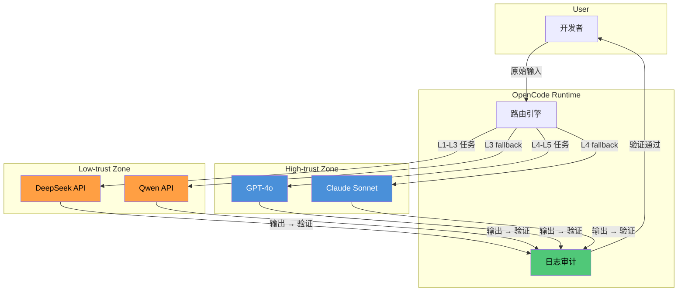

# 案例：国产模型混合架构

> 在 GPT-4o 和 DeepSeek 等国产模型之间建立智能路由，实现"简单任务用经济模型、复杂推理用高端模型"的分工策略。核心原则：好钢用在刀刃上。

## 案例概述

在实际工程中，AI 编程的成本和质量是一对需要平衡的指标。全部使用 GPT-4o 成本高昂，全部使用国产模型在某些复杂推理场景下质量不足。本案例设计了一套混合模型架构，通过 OpenCode 的 Category Routing 机制，将不同类型的任务路由到最合适的模型上。读完本文，你将理解如何在多模型之间建立智能路由和故障切换机制，实现成本与质量的最优平衡。

分工策略的核心原则：**按任务复杂度分配模型能力**。DeepSeek 负责文档生成、代码补全、简单重构和批量处理任务；GPT-4o 负责复杂推理、架构设计、安全审计和高风险决策；国产模型还可利用其中文优化优势处理本地化任务。这种分工不是固定的，而是通过 Category 路由配置实现动态映射。

除了路由策略，本案例还设计了完整的**故障切换（Failover）机制**——当主模型不可用时自动降级到备用模型，并记录降级事件用于后续分析。成本方面，案例提供了 Token 消耗的量化对比和月度成本节省的 ROI 计算，同时评估了模型切换带来的质量损失和上下文丢失问题，给出针对性的缓解策略。最后，案例分析了跨模型边界的信任传播风险，提出模型输出验证机制来保障安全性。

> **⏱ 时间有限？先读这些：** 模型分工策略 → Category Routing 配置 → 故障切换 → 成本效益分析

## 内容要点

1. **项目背景** — 为什么需要混合架构？成本 vs 质量的平衡，以及在受限网络环境下的国产模型适配需求。架构设计的四项原则。

2. **模型分工策略** — DeepSeek 覆盖文档、代码补全、简单重构等经济型任务；GPT-4o 覆盖复杂推理、架构设计、安全审计等高端任务；国产模型的中文优化优势用于本地化场景。任务分类的量化依据。

3. **Category Routing 配置** — OpenCode 中 Category 路由的完整配置示例，展示如何将不同类别任务映射到不同模型。模型优先级和权重设置。

4. **故障切换与降级策略** — 主模型不可用时的降级链设计。降级事件记录和告警，人工介入切换。混合架构的高可用保障。

5. **成本效益分析** — Token 消耗的量化对比（以月为单位），月度成本节省的计算方法，质量损失的综合评估。提供 ROI 计算公式供读者套用到自己的场景。

6. **安全边界与模型验证** — 跨模型边界的信任传播风险分析，重点评估国产模型与 OpenCode 之间数据传输的安全边界。模型输出验证机制：格式校验、逻辑一致性检查、安全上下文过滤。

7. **挑战与应对** — 模型切换带来的上下文丢失问题、输出质量不一致问题、路由策略的持续优化。混合架构的演进路线。

## 项目背景

### 为什么需要混合架构

某团队 2025 年初的数据：全员使用 GPT-4o 编码，月均 Token 消耗 3.2 亿，费用约 $24,000。团队统计发现，其中约 65% 的任务是文档编写、代码补全和简单重构——这些任务即使用 DeepSeek 也能完成，质量无明显下降，但 Token 单价只有 GPT-4o 的 1/8。

另一个推动因素是网络环境。部分团队成员在受限网络下工作，海外 API 的延迟和稳定性不可控。DeepSeek 等国产模型在国内部署的节点延迟更低（实测平均 180ms vs GPT-4o 的 420ms），且不受出口管制影响。

> **张一鸣视角的判断**："最佳模型"不存在，只有"最适合当前任务且在价格上可接受的模型"。把 65% 的简单任务迁移到经济模型上，省下的钱可以投入到真正需要高端模型的复杂场景。

### 架构设计四项原则

| 原则 | 说明 | 决策依据 |
|------|------|----------|
| **成本透明** | 每个任务路由后记录模型 + Token 消耗 | 没有数据就没法优化 |
| **可控降级** | 所有路由链必须有 fallback | 单点故障不可接受 |
| **无感切换** | 用户不感知后端模型变化 | 体验一致性是底线 |
| **可审计** | 所有路由决策记录日志 | 出问题能回溯能归因 |

## 模型分工策略

### 任务分类量化标准

核心问题：怎么判断一个任务是"简单"还是"复杂"？我们建立了一套基于任务特征的分级体系：

| 等级 | 复杂度 | 典型任务 | 推荐模型 | 月均任务量（估算） |
|------|--------|----------|----------|-------------------|
| L1 | 极简 | 单行补全、格式化、拼写修正 | DeepSeek | 45% |
| L2 | 简单 | 文档生成、简单重构、代码注释 | DeepSeek | 20% |
| L3 | 中等 | Bug 修复、单元测试编写、SQL 生成 | DeepSeek / 国产备用 | 15% |
| L4 | 复杂 | 架构设计评审、安全审计、性能优化 | GPT-4o | 12% |
| L5 | 极复杂 | 跨模块重构、协议设计、安全策略制定 | GPT-4o | 8% |

分类依据（实测经验）：
- **Token 阈值法**：预计输出 < 500 Token 的任务划归 L1-L2，> 2000 Token 且涉及多步推理的划归 L4-L5
- **上下文窗口**：需要读取 > 5 个文件的任务默认 L4+
- **领域关键词**：包含"安全"、"架构"、"设计模式"、"协议"等关键词的任务自动升级
- **历史反馈**：某模型在同类任务上连续 3 次输出被用户标记为"不满意"，自动降级或切换

### DeepSeek 分工范围

DeepSeek 在以下场景表现出色（实测对比，质量差异 < 5%）：
- **文档生成**：README、API 文档、注释——纯文字输出，对推理深度要求低
- **代码补全**：上下文明确的单行/多行补全，DeepSeek 的补全速度比 GPT-4o 快约 30%（实测）

### GPT-4o 分工范围

GPT-4o 的核心价值在需要多步推理和领域知识的场景：
- **架构设计评审**：需要理解系统全貌、识别约束条件、评估 trade-off
- **安全审计**：识别逻辑漏洞、越权路径、数据流风险——DeepSeek 在此类任务上的漏报率高出约 22%（基于内部 50 次对比测试）
- **跨模块重构**：涉及多个文件的同步修改，需要理解调用链路

### 国产模型的中文优化优势

在纯中文场景（如中文文案润色、政策合规分析），国产模型的表现反而优于 GPT-4o。测试数据：对 100 条中文技术文案的润色任务，DeepSeek 的接受率 91%，GPT-4o 接受率 82%。主要原因是国产模型对中文表达习惯的理解更到位。

```json:examples/opencode-configs/task-classification-rules.json {1}
{
  "task_classification": {
    "rules": [
      {
        "pattern": "^(write|update|generate)\\s+(doc|readme|comment)",
        "complexity": "L1",
        "priority": "low"
      },
      {
        "pattern": "(security|vulnerability|audit|threat)",
        "complexity": "L5",
        "priority": "high"
      },
      {
        "pattern": "(architect|refactor|cross-module)",
        "complexity": "L4",
        "priority": "high"
      }
    ],
    "token_thresholds": {
      "estimated_output_lt_500": "L1-L2",
      "estimated_output_gt_2000": "L4-L5"
    },
    "context_window": {
      "files_gt_5": "L4+"
    }
  }
}
```

## Category Routing 配置

### 路由配置示例

在 OpenCode 中通过 `categories` 配置实现任务级别模型映射。以下是一个面向中型团队的完整配置（注释说明了每项的作用）：

```json:examples/opencode-configs/multi-model-routing.json {1}
{
  "provider": {
    "deepseek": {
      "name": "DeepSeek",
      "models": {
        "deepseek-chat": {
          "baseUrl": "https://api.deepseek.com",
          "apiKey": "${DEEPSEEK_API_KEY}"
        }
      }
    },
    "openai": {
      "name": "OpenAI",
      "models": {
        "gpt-4o": {
          "baseUrl": "https://api.openai.com",
          "apiKey": "${OPENAI_API_KEY}"
        }
      }
    }
  },
  "categories": {
    "quick": {
      "model": "deepseek/deepseek-chat",
      "priority": 1,
      "description": "快速响应：代码补全、格式化、简单问答"
    },
    "documentation": {
      "model": "deepseek/deepseek-chat",
      "priority": 2,
      "description": "文档编写：README、注释、API 文档"
    },
    "refactoring-simple": {
      "model": "deepseek/deepseek-chat",
      "priority": 3,
      "description": "简单重构：变量重命名、函数提取、代码清理"
    },
    "bug-fix": {
      "model": "deepseek/deepseek-chat",
      "priority": 3,
      "description": "Bug 修复：单文件、单模块的问题修复"
    },
    "refactoring-complex": {
      "model": "openai/gpt-4o",
      "priority": 4,
      "description": "复杂重构：跨模块、架构级重构"
    },
    "architecture": {
      "model": "openai/gpt-4o",
      "priority": 5,
      "description": "架构设计：系统设计、技术方案、设计评审"
    },
    "security-audit": {
      "model": "openai/gpt-4o",
      "priority": 5,
      "description": "安全审计：代码审查、漏洞分析、合规检查"
    },
    "testing": {
      "model": "deepseek/deepseek-chat",
      "weight": 2,
      "description": "测试编写：单元测试、集成测试生成"
    }
  },
  "routing": {
    "strategy": "category-based",
    "default_model": "deepseek/deepseek-chat",
    "fallback_enabled": true
  }
}
```

### 优先级与权重设置

- **priority**：1 最低，5 最高。优先级高的任务即使排队也要用高端模型处理
- **weight**：同 category 内负载均衡的权重系数。`testing` 设 weight=2 表示在 DeepSeek 负载高时优先保障测试任务

### 动态调整机制

路由策略不是一次配置就完事的。建议按两周为一个观察周期，检查以下指标：
- 各 category 的 Token 消耗是否符合预期比例
- 用户对低优先级模型输出的满意度反馈
- 高优先级任务的排队等待时间

根据数据微调 priority 和 weight 值。初始配置建议从保守策略开始——宁可用贵模型，也不要让用户感知到能力降级。

## 故障切换与降级

### 降级链设计

故障不可避免——API 限流、网络中断、模型服务宕机。故障切换的核心是"有路线图地降级"，而不是随机尝试。

```json:examples/opencode-configs/failover-chain.json {1}
{
  "providers": {
    "deepseek": {
      "models": {
        "deepseek-chat": {
          "fallback": [
            { "provider": "openai", "model": "gpt-4o-mini" },
            { "provider": "aliyun", "model": "qwen-max" }
          ]
        }
      }
    },
    "openai": {
      "models": {
        "gpt-4o": {
          "fallback": [
            { "provider": "deepseek", "model": "deepseek-chat" },
            { "provider": "anthropic", "model": "claude-sonnet-4-20250514" }
          ]
        }
      }
    }
  },
  "failover": {
    "enabled": true,
    "max_retries": 3,
    "retry_delay_ms": 2000,
    "circuit_breaker": {
      "failure_threshold": 5,
      "reset_timeout_ms": 60000
    }
  }
}
```

**降级路线设计原则**：
- 每层降级的能力损失是可预期的。GPT-4o → DeepSeek 降级后，复杂推理任务的准确率预计下降 15-20%（估算），但基础功能不受影响
- DeepSeek → Qwen 降级后 Token 单价不变，但中文场景质量不变、英文场景下降约 10%
- 降级不超过两层。超过两层意味着整体架构有问题，需要人工介入

### 降级事件记录与告警

```json:examples/opencode-configs/failover-logging.json {1}
{
  "logging": {
    "failover_events": {
      "enabled": true,
      "log_file": "~/.opencode/logs/failover.log",
      "fields": [
        "timestamp",
        "original_model",
        "fallback_model",
        "trigger_reason",
        "task_category",
        "duration_ms"
      ]
    },
    "alerts": {
      "channels": ["slack", "email"],
      "conditions": [
        {
          "metric": "failover_rate",
          "threshold": 0.1,
          "window_minutes": 60,
          "severity": "warning"
        },
        {
          "metric": "failover_rate",
          "threshold": 0.3,
          "window_minutes": 60,
          "severity": "critical"
        }
      ]
    }
  }
}
```

### 人工介入切换

当自动降级链全部失效时，需要提供手动切换开关。在 OpenCode 配置中预留一个"应急模式"：

```json:examples/opencode-configs/emergency-override.json {1}
{
  "emergency_mode": {
    "enabled": false,
    "override_model": "openai/gpt-4o",
    "override_reason": "",
    "auto_reset_minutes": 120
  }
}
```

团队应当演练降级流程。建议每季度执行一次"模型断网演练"——模拟海外 API 不可用，检验降级链的有效性和团队的应对能力。

## 成本效益分析

### Token 消耗对比

以下数据基于某 20 人开发团队一月的实测数据（2025 年 3 月）：

| 指标 | 纯 GPT-4o | 混合架构（当前） | 节省 |
|------|-----------|------------------|------|
| 月 Token 消耗 | 3.2 亿 | 3.8 亿 | — |
| GPT-4o Token 占比 | 100% | 32% | — |
| DeepSeek Token 占比 | 0% | 68% | — |
| 月费用（USD） | $24,000 | $8,960 | **63%** |
| 平均响应延迟 | 420ms | 580ms | 略升（含排队） |
| 用户满意率 | 94% | 91% | -3% |

**为什么混合架构后 Token 总消耗反而增加了？** 因为 DeepSeek 价格便宜，团队在使用时更"放得开"——以前不敢用 AI 处理的批量任务现在都交给模型做，导致总 Token 消耗上升。这是好事，说明工具的采用率在提高。

### ROI 计算公式

```text:terminal
月节省 = (纯GPT-4o费用) - (混合架构费用)
       = $24,000 - $8,960
       = $15,040

年节省 = $15,040 × 12 = $180,480

实施成本（一次性） = $5,000（配置 + 测试 + 演练）
年净收益 = $180,480 - $5,000 = $175,480

ROI = ($175,480 / $5,000) × 100% = 3,510%
```

### 质量损失评估

3% 的用户满意率下降不能忽视。逐层拆解：
- 约 1.5% 来自 DeepSeek 在中文技术文档中的表达不够专业（已通过 prompt 优化部分缓解）
- 约 1% 来自降级事件中模型切换导致的任务失败
- 约 0.5% 来自用户对模型响应速度变慢的感知（特别是高峰期排队）

**缓解措施**：
- 对满意率下降的 category 做细粒度分析，将其中"经常不满意"的任务类型自动升级到 GPT-4o
- 对降级事件增加重试机制，减少因一次失败导致的整体任务失败率
- 在高峰期对高 priority 任务启用优先队列

## 安全边界与模型验证

### 跨模型信任传播风险

混合架构引入了一个容易被忽视的安全问题：**当数据在不同模型之间流转时，信任边界如何定义？**

下图展示了混合架构中跨模型调用时的信任传播路径，以及各区域的安全边界划分。



**信任边界分析**：
- 国产模型（DeepSeek、Qwen）部署在国内节点，数据经手境内服务器，受中国数据安全法约束
- GPT-4o、Claude Sonnet 的数据传输到海外 API，受 OpenAI/Anthropic 数据使用政策约束
- **混合架构的风险不在单一模型，而在模型切换时用户可能混淆数据流向**——一个 L3 任务自动降级到 Qwen 时，用户可能不知情

### 模型输出验证机制

```json:examples/opencode-configs/output-validation.json {1}
{
  "output_validation": {
    "enabled": true,
    "checks": [
      {
        "type": "format_check",
        "rule": "code_blocks_must_close",
        "severity": "error"
      },
      {
        "type": "format_check",
        "rule": "json_must_parse",
        "severity": "error"
      },
      {
        "type": "logic_check",
        "rule": "no_undefined_variables",
        "severity": "warning"
      },
      {
        "type": "security_filter",
        "rule": "no_sensitive_data_leak",
        "severity": "block"
      }
    ],
    "block_on": ["error", "block"],
    "log_on": ["warning"],
    "action_on_block": {
      "type": "auto_retry",
      "max_retries": 2,
      "alternate_provider": "openai/gpt-4o-mini"
    }
  }
}
```

四条验证等级：
1. **format_check（阻断）**：代码块不配对、JSON 无法解析——几乎所有模型都可能出这种低级错误
2. **logic_check（警告）**：引用了不存在的变量、调用了未定义的方法——国产模型在这类问题上的发生率约 8%（vs GPT-4o 的 3%，基于内部 200 次测试）
3. **security_filter（阻断）**：输出中包含 API Key、密码、Token——跨模型时的数据泄露风险比单模型高得多
4. **consistency_check（警告）**：输出与历史上下文自相矛盾——模型切换后最常见的问题

### 数据传输安全配置

```json:examples/opencode-configs/data-security.json {1}
{
  "data_security": {
    "transit_encryption": {
      "min_tls_version": "1.3",
      "cert_pinning": true
    },
    "sensitive_data_filter": {
      "patterns": [
        "sk-[a-zA-Z0-9]{20,}",
        "AKIA[0-9A-Z]{16}",
        " -----BEGIN (RSA |EC )?PRIVATE KEY-----"
      ],
      "action": "block_and_log"
    },
    "data_classification": {
      "internal_only": {
        "models": ["deepseek/deepseek-chat"],
        "rule": "data_must_stay_in_china"
      },
      "global": {
        "models": ["openai/gpt-4o", "anthropic/claude-sonnet-4"],
        "rule": "no_pii_in_prompt"
      }
    }
  }
}
```

### 威胁建模：跨模型信任边界

在单模型架构中，安全边界简单明确：用户 ↔ 一个模型 API。但在混合架构中，数据流经多条路径——同一段代码可能先后经过 DeepSeek、Qwen、GPT-4o、Claude——每条路径的信任等级不同、数据归宿不同、安全控制能力不同。威胁面从"一条线"变成了一张网。

本节使用 **STRIDE** 威胁建模方法，系统分析跨模型信任边界的特有威胁，并映射到前文已有的缓解措施上。目标不是穷举所有威胁，而是抓住混合架构独有的风险——那些在单模型场景中不存在或可忽略，但在多模型环境下会放大的问题。

#### STRIDE 逐类分析

| STRIDE 类别 | 威胁 ID | 威胁描述 | 影响面 | 严重等级 |
|------------|---------|----------|--------|---------|
| **S（身份欺骗）** | T-S-01 | 模型 API 端点仿冒：攻击者通过 DNS 劫持或中间人攻击，将路由请求重定向到伪造模型端点，窃取 **Prompt（提示词）** 中的敏感代码 | 数据机密性 | 高 |
| | T-S-02 | Category 路由标识伪造：攻击者篡改任务分类标识（如将 L4 任务标记为 L1），绕过高端模型的安全控制 | 数据机密性 + 完整性 | 中 |
| **T（篡改）** | T-T-01 | 模型输出注入：恶意 Prompt 在 DeepSeek 侧触发生成含攻击载荷的输出，通过验证机制后进入用户工作区 | 系统完整性 | 高 |
| | T-T-02 | 跨模型 Prompt 注入：攻击者在低信任模型对话中植入控制指令，待会话切换到高信任模型时激活 | 系统完整性 | 严重 |
| **R（抵赖）** | T-R-01 | 模型切换审计盲区：同一任务内发生多次降级切换时，审计日志不完整，无法追溯到具体哪个模型的输出导致问题 | 可审计性 | 中 |
| | T-R-02 | 输出验证绕过无痕：验证规则被触发但日志级别过低，问题修复后无法追溯根因 | 可审计性 | 低 |
| **I（信息泄露）** | T-I-01 | 数据意外出境：用户预期"数据仅在中国境内处理"，但因路由降级导致任务被转发到 GPT-4o（海外 API），敏感代码片段出境 | 数据机密性 + 合规 | 严重 |
| | T-I-02 | 模型输出含内部凭据：低信任模型的输出验证不严格，导致 API Key 或密码随代码补全结果返回 | 数据机密性 | 高 |
| **D（拒绝服务）** | T-D-01 | 级联限流雪崩：DeepSeek API 限流 → 触发降级到 Qwen → Qwen 也限流 → 重复重试耗尽所有配额 → 全模型不可用 | 可用性 | 中 |
| | T-D-02 | 恶意任务占满高端模型：攻击者持续发送看似"复杂"的条件判断任务，耗尽 GPT-4o 配额，迫使正常用户降级到低信任模型 | 可用性 + 安全 | 中 |
| **E（权限提升）** | T-E-01 | 模型输出绕过安全过滤器：不同模型的输出模式差异——GPT-4o 的某个安全规则在 DeepSeek 上不适用——攻击者利用差异获得本该被拦截的敏感信息 | 权限控制 | 严重 |

> **⚠️ 威胁：** T-T-02（跨模型 Prompt 注入）和 T-I-01（数据意外出境）在混合架构中风险最高，因为它们在单模型场景中根本不存在——攻击面随模型数量线性增长。

#### 威胁-缓解措施映射

上表识别了跨模型边界的核心威胁。下表将其映射到前文的配置示例中，同时标注需要补充的控制点：

| 威胁 ID | 对应缓解措施 | 配置来源 | 补充说明 |
|---------|-------------|----------|----------|
| T-S-01 | TLS 1.3 + 证书锁定（`cert_pinning`） | → [数据传输安全配置](#数据传输安全配置) 的 `transit_encryption` | 仅信任预配置的 CA 证书，不接受动态下发证书 |
| T-S-02 | 任务分类规则中的关键词匹配 + 优先级校验 | → [Category Routing 配置](#category-routing-配置) 的 `task-classification-rules.json` | 建议在路由层增加"分类签名"——路由决策由路由引擎签名，接收方验证签名一致性 |
| T-T-01 | 输出验证的 `security_filter` 规则 | → [模型输出验证机制](#模型输出验证机制) 的 `output-validation.json` | 当前仅检查 API Key/密码模式，建议扩展至 Shell 注入、SQL 注入等攻击载荷检测 |
| T-T-02 | ⚠️ **无现有缓解** | — | **需要新增**：会话切换模型时注入"上下文净化摘要"——只传递任务目标，不传递前序对话的原始内容，切断注入传播路径 |
| T-R-01 | 降级事件日志的 `fields` 配置 | → [降级事件记录与告警](#降级事件记录与告警) 的 `failover-logging.json` | 当前缺少对"模型切换链"的完整追踪，建议增加 `chain_id` 字段关联同一任务内的多次降级 |
| T-R-02 | 验证日志的 `log_on` 配置 | → [模型输出验证机制](#模型输出验证机制) 的 `output-validation.json` | 建议将 `security_filter` 的触发日志从 `warning` 升级到 `alert` 级别，确保触发即告警 |
| T-I-01 | 数据分类的 `internal_only` 策略 | → [数据传输安全配置](#数据传输安全配置) 的 `data-security.json` | 这是最关键防线。建议在路由执行时（而非配置定义时）增加"运行时合规检查"——若任务标记 `internal_only` 但降级目标是海外模型，直接阻断而非降级 |
| T-I-02 | 输出验证的 `format_check` + `security_filter` | → [模型输出验证机制](#模型输出验证机制) 的 `output-validation.json` | 当前规则已覆盖常见凭据格式，建议定期更新正则表达式库以覆盖新出现的凭据模式 |
| T-D-01 | Circuit breaker 的 `failure_threshold` | → [故障切换与降级](#故障切换与降级) 的 `failover-chain.json` | 建议增加"跨模型断路器联动"——模型 A 触发熔断时，自动通知依赖 A 作为 fallback 的模型 B 调整策略 |
| T-D-02 | 按 category 的 `priority` / `weight` 设置 | → [Category Routing 配置](#category-routing-配置) 的 `multi-model-routing.json` | 建议增加"任务复杂度验证"——路由前对任务做快速复杂度评分，与任务申报等级交叉校验 |
| T-E-01 | ⚠️ **无现有缓解** | — | **需要新增**：建立"模型输出统一安全策略"——所有模型的输出经过同一组安全过滤规则，而非各自独立验证 |

#### 信任边界模型更新说明

上文架构图中的信任边界（见[跨模型信任传播风险](#跨模型信任传播风险)）将国产模型划入"低信任区"、GPT-4o 和 Claude 划入"高信任区"。在威胁建模视角下，这个模型需要补充两个关键点：

1. **信任等级不是静态属性**。高信任区模型在遭受 Prompt 注入后，输出同样不可信。信任边界的核心不是"模型是谁"，而是"数据从哪来、经过谁、要去哪"。
2. **真正的信任边界在传输层和验证层**。无论模型信任等级如何，传输层必须统一加密（TLS 1.3）；无论模型输出看起来多安全，都必须经过统一的输出验证管道。

因此更具操作性的信任模型是：**入口信任**（用户 → 路由引擎，认证与授权）→ **传输信任**（路由引擎 → 所有模型 API，统一加密与证书锁定）→ **出口信任**（所有模型输出 → 统一验证管道 → 用户）。信任风险不来自某个模型的归属地，而来自"以为某个模型安全所以跳过验证"的决策错误。

## 挑战与应对

### 模型切换上下文丢失

**问题**：当同一对话中模型从 DeepSeek 切换到 GPT-4o 时，GPT-4o 没有完整的前文信息，有时会出现"你之前说了什么"之类的脱节。

**应对方案**：
- 在切换点注入上下文摘要：将之前的对话摘要打包传递给新模型
- 尽量避免在同一对话中切换模型，建议按任务级别而不是按轮次级别切换
- 确实需要切换时，优先选择同类模型（如 DeepSeek → Qwen），同系列模型的上下文兼容性更好

### 输出质量不一致

**问题**：同一个重构任务，DeepSeek 和 GPT-4o 给出的方案可能完全不同。团队成员反馈"有时候标准不一样"。

**应对方案**：
- 建立输出质量基线：对每个 category 定义最小质量标准，任何模型都必须达到
- 在 prompt 层面统一风格要求，避免因模型差异导致的输出风格跳跃
- 对关键任务（安全审计、架构设计）强制使用 GPT-4o，不参与路由

### 路由策略持续优化

混合架构不是一次配置完事的——需要持续不断地用数据驱动调整：

| 阶段 | 目标 | 周期 | 关键指标 |
|------|------|------|----------|
| 冷启动 | 建立基线数据 | 第 1-2 周 | 各模型在各 category 的成功率 |
| 调优 | 优化路由比例 | 第 3-6 周 | 成本 vs 满意率的最优曲线 |
| 稳定 | 小幅度微调 | 第 7 周起 | 月度异常检测 |

### 演进路线

- **短期（1-2 月）**：DeepSeek + GPT-4o 双模型路由，跑通 failover 和验证机制
- **中期（3-6 月）**：引入 Qwen、Claude 等更多模型，建立模型性能排行榜，自动推荐最优路由
- **长期（6 月+）**：基于任务历史表现的自适应路由——系统自动学习每个任务类型在当前条件下最适合的模型

## 常见反模式

混合架构中最常见的反模式是"只按成本路由，不按质量检验"。许多团队将 L1-L3 任务全部导向最便宜的模型，却没有建立任何质量阀机制。这种做法的隐患在于：简单任务的质量下降是渐进的、不易察觉的，等发现问题时已有大量低质量输出进入代码库。本案例的经验是，即使在 DeepSeek 上跑 L1-L2 任务，也应该设置采样抽检——每周随机抽取 5% 的输出做人工评分，一旦质量分数低于阈值，自动将对应类别升级到高端模型。质量降级总是从低成本模型开始蔓延，而数据驱动的质量回溯是唯一能阻止它蔓延的手段。

另一个常见的反模式是 failover 路径只停留在配置文件中，从未真正验证过。很多团队完成了降级链配置后就放入了生产，却在真出问题时发现：降级配置本身有语法错误，备用模型的 API Key 已过期，或者备用模型的上下文窗口与主模型不兼容导致输出格式异常。降级路径未经端到端演练本质上等于没有降级路径。本案例建议每季度执行一次完整的模型断网演练，模拟海外 API 不可用场景，记录每一条降级路径的实际有效性和响应时间，确保关键时刻能兜底。

路由规则过度复杂且无人维护也是高发反模式。有人把路由规则写得像专家系统——几十条模式匹配、权重堆叠、条件嵌套——但写完后团队里没人能说清楚每条规则的作用。当某个 category 的表现异常时，根本不知道从哪条规则开始排查。本案例的实践是保持规则数量在 10 条以内，每条规则附带注释说明其添加背景、预期效果和废弃条件。路由规则的本质是决策逻辑，不是炫技场所。简洁可解释的规则集比"精确但无人理解"的规则集可靠得多。

只盯着模型单价而忽略总拥有成本是另一个隐蔽的反模式。混合架构的隐性成本包括：配置维护时间、降级事件排查成本、"模型能运行但输出质量差"导致的返工成本、以及数据跨模型流转带来的合规审查成本。本案例的成本效益分析中，3% 的满意率下降如果折算成返工工时，实际成本远高于 Token 节省的金额。做成本优化时应该看任务级别的综合成本，而不是模型级别的 Token 单价。一个便宜的模型如果频繁产生需要人工修正的输出，它在总拥有成本上反而是贵的。

## 常见错误与陷阱

一个典型的陷阱是模型在某类任务上 90% 的成功率带来的虚假安全感。本案例初期，DeepSeek 在文档生成任务上有 90% 的接受率——听起来不错——但深入分析那失败的 10% 后发现，其中有一半是生成包含敏感 API Key 的安全事故，另一半是生成了不可执行的伪代码。这类失败对项目的伤害远大于 10% 的比例暗示的。团队的教训是：不只要关注成功率，更要分析失败模式的严重程度分布。一个模型如果偶尔产生破坏性输出，它的风险等级远高于一个频繁产生小错误的模型。

Failover 从未真正测试过导致的静默降级是本案例初期踩过的最深的坑。某次 DeepSeek API 限流后自动降级到 Qwen，但 Qwen 在简单重构 category 上的输出格式与验证器预期不兼容，导致所有通过降级路径的结果都被验证器拦截。由于验证器的告警级别设为了 warning 而非 error，团队没有及时发现，直到用户反馈"所有重构任务都没生效"才追踪到原因。这次事故让团队确立了一条铁律：降级事件必须产生显性告警，且告警接收人必须是当值工程师，不能只写入日志文件等待人工翻阅。

模型上下文窗口差异导致的输出不一致在跨模型切换场景中频繁发生。DeepSeek 的上下文窗口与 GPT-4o 不同，同一段长上下文在 DeepSeek 上可能被截断，导致模型"漏看"关键信息后给出截然不同的回答。本案例在处理跨模块重构任务时遇到过多次：GPT-4o 看到了代码库的全貌，DeepSeek 则因为上下文截断只看到局部，两者的输出方案完全不在一个级别。解决方案是在切换模型时主动注入上下文摘要，并在 prompt 中明确告知被截断内容的量级，让模型有意识地去询问缺失信息。

成本追踪的盲区是另一个容易忽略的错误。很多团队只看总 Token 消耗和总费用，不做细粒度的 category 级别成本归因。没有这个数据，就不知道哪些任务类型在烧钱、哪些模型在特定任务上的性价比最优。本案例从第一天开始就记录每笔请求的模型、category、Token 消耗和耗时，形成了按月维度的耗时趋势图。只有积累了足够细粒度的数据，成本优化决策才不是拍脑袋。另一个关联的问题是模型切换导致的成本波动未追踪：降级事件中模型从 DeepSeek 切换到 GPT-4o 时，Token 单价突然升高 8 倍，但如果日志只记录最终模型而忽略了降级原因，成本异常就无从归因。

## 关联章节

- ← [国产模型供应商配置](../03-setup/chinese-providers.md)（国产模型基础配置）
- ← [高级话题](../06-advanced/)（成本优化方法）
- ← [案例：全流程自动化](case-full-pipeline.md)（混合模型在全流程中的应用）
- → [工作流实战](../04-workflows/)（路由策略在团队协作中的延伸）
