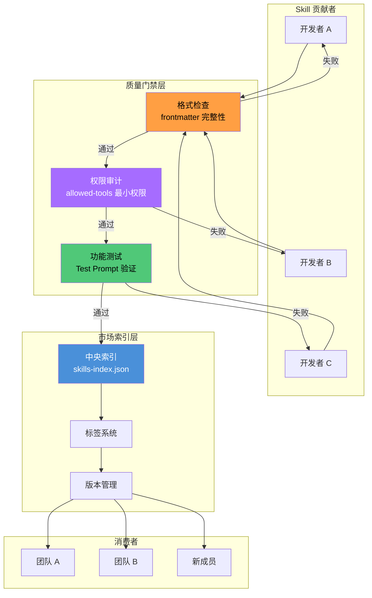
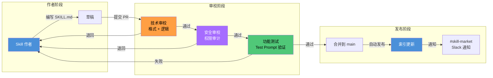

# 案例：团队级 **Skill（技能）** 市场

> 从中大型团队的痛点出发——Skill 质量参差不齐、重复建设严重、经验难以沉淀——设计一套完整的内部 Skill 生态治理方案。

## 案例概述

当一个中大型团队全面采用 OpenCode 后，很快会面临一个组织层面的挑战：不同成员各自编写 Skill，质量参差不齐，功能重复建设（例如三个团队各自写了一个"代码审查"Skill），优秀的 Skill 无法被其他人发现和使用。本案例设计了一套**团队级 Skill 市场**方案，从目录结构标准、质量门禁、版本管理和发布流程四个维度解决这些问题。读完本文，你将理解如何设计一套团队内部的 Skill 生态治理方案，让经验以 Skill 的形式沉淀为可复用的知识资产。

Skill 市场的核心是**标准化**。所有 Skill 必须遵守统一的 `frontmatter` 规范、`allowed-tools` 最小权限原则和 `target_agent` 作用域规范。每个 Skill 在发布前必须通过格式检查、权限审计和功能测试三类质量门禁。标准化不是目的而是手段——只有标准化的 Skill 才能被自动发现、自动索引和自动组合。

在治理机制上，案例设计了"Skill 作者 → 技术审校 → 发布"的三段式流水线，配合使用统计和反馈收集实现 Skill 的全生命周期管理。废弃机制确保没有人用已过时的 Skill。最终效果是：团队的经验以 Skill 的形式沉淀为可复用、可传承的知识资产。治理不意味着僵化——方案保留了足够的灵活性让团队快速实验新 Skill，并在验证通过后纳入正式市场。

> **⏱ 时间有限？先读这些：** 内部市场设计 → 标准化规范 → 团队协作 → 发布 CI/CD

## 内容要点

1. **项目背景** — 中大型团队引入 OpenCode 后的典型问题：Skill 质量参差不齐、重复建设、发现困难。为什么需要团队级的 Skill 治理。

2. **内部 Skill 市场设计** — 目录结构标准（层级 / 命名 / 索引文件）。质量门禁的 3 个关卡：格式检查、权限审计、功能测试。版本管理和发布流程（语义版本号 + CHANGELOG）。

3. **Skill 标准化规范** — `frontmatter` 必须字段和可选字段。`allowed-tools` 的最小权限原则——只声明真正需要的工具。`target_agent` 的作用域规范——明确 Skill 适用的 **Agent（智能体）** 角色。标准化模板示例。

4. **团队协作模式** — Skill 作者 → 技术审校 → 发布的三段式流水线。使用统计和反馈收集（自动埋点 + 定期用户调研）。废弃和淘汰机制（版本废弃通知 + 迁移路径）。

5. **Skill 发布 CI/CD** — 自动化的 Skill 发布流水线配置，包括格式校验、权限审计、功能测试自动执行，以及发布到内部市场索引的自动更新。

6. **效果指标与演进路线** — Skill 复用率提升、重复建设减少、新成员上手时间缩短。Skill 市场的演进路线图——从"自发贡献"到"有组织治理"再到"生态繁荣"。

## 项目背景

### 中大型团队的 Skill 困局

某团队 50 人，全面使用 OpenCode 三个月后，内部审计发现以下问题：

| 问题 | 数据（内部审计 2025.03） | 影响 |
|------|--------------------------|------|
| 重复 Skill | 发现 7 组功能重叠的 Skill（如 3 个"代码审查"） | 团队不知道该用哪个，干脆谁都不用 |
| 质量参差 | 仅 40% 的 Skill 包含完整 frontmatter | 无法自动发现和索引 |
| 发现困难 | 无中央索引，靠口头传播 | 新成员入职两周后才听说"有现成的 Skill" |
| 废弃积累 | 12 个 Skill 超过 3 个月未更新 | 没人敢删，也没人敢用 |
| 权限过宽 | 60% 的 Skill 声明了不必要的 `allowed-tools` | 安全隐患 |

> 这不是单点问题——这是组织层面的知识管理问题。Skill 是团队经验的"可执行载体"。没有治理，Skill 就是一堆相互冲突的脚本；有了治理，Skill 就是团队的知识资产库。

### 核心矛盾

- **自由 vs 标准**：让团队自由写 Skill 可以快速试错，但没有标准就没法复用
- **开放 vs 安全**：Skill 可以访问系统工具，权限放得太宽有风险，收得太紧没人用
- **贡献 vs 维护**：鼓励贡献很重要，但每个 Skill 都需要有人维护——维护成本谁来承担

**解法**：不是一条路走到黑，而是分阶段走。先定标准，再推市场，最后用数据反哺迭代。

## 内部 Skill 市场设计

### 架构总览

下图展示了内部 Skill 市场的整体架构，包括注册中心、发布管道和消费端的关系。



### 目录结构标准

```text:terminal
skills/
├── code-review/               # 命名：小写连字符
│   ├── SKILL.md               # 必须：SKILL.md
│   ├── v1.0.0/                # 版本目录
│   │   ├── SKILL.md
│   │   └── CHANGELOG.md       # 必须：变更日志
│   ├── v1.1.0/
│   │   ├── SKILL.md
│   │   └── CHANGELOG.md
│   └── current -> v1.1.0/     # 符号链接指向当前版本
├── security-audit/
│   └── SKILL.md
├── api-testing/
│   └── SKILL.md
├── skills-index.json          # 市场索引文件（自动生成）
└── .marketignore              # 排除不需要发布的目录
```

```json:examples/skills/skills-index.json {1}
{
  "market_name": "AcmeCorp Internal Skill Market",
  "last_updated": "2025-06-01",
  "skills": [
    {
      "name": "code-review",
      "version": "1.1.0",
      "status": "active",
      "maintainer": "platform-team",
      "quality_score": 92,
      "usage_count": 347,
      "satisfaction": 4.2
    },
    {
      "name": "security-audit",
      "version": "0.9.0",
      "status": "beta",
      "maintainer": "sec-team",
      "quality_score": 85,
      "usage_count": 128,
      "satisfaction": 4.5
    }
  ]
}
```

### 三级质量门禁

每个 Skill 在发布前必须通过三道关卡：

**第一关：格式检查（自动化，阻塞式）**

- SKILL.md 是否存在
- frontmatter 必填字段是否完整（name, description, template）
- allowed-tools 的声明的工具是否全部是已知工具名
- YAML frontmatter 能否正确解析

**第二关：权限审计（自动化 + 人工复核）**

- allowed-tools 是否遵循最小权限——对比 Skill 的 template 内容，检测未使用的工具声明
- 敏感工具（Write, RunCommand）必须有维护者的书面审批记录
- 权限变更 diff review（对比上一版本）

**第三关：功能测试（半自动化）**
- 用预定义的 Test **Prompt（提示词）** 执行 Skill，检查输出是否符合预期格式
- 至少覆盖 3 个典型场景（happy path + edge case + error case）
- 测试结果自动记录到 CHANGELOG

### 版本管理和发布流程

采用语义版本号（SemVer）：

| 版本变动 | 示例 | 触发条件 |
|----------|------|----------|
| Major | 1.0.0 → 2.0.0 | 破坏性变更：修改 allowed-tools、重写 template 核心逻辑 |
| Minor | 1.0.0 → 1.1.0 | 功能新增：增加新工具、添加新示例、扩展适用范围 |
| Patch | 1.0.0 → 1.0.1 | Bug 修复：修正拼写错误、优化表述、补充遗漏的前置条件 |

发布命令示例（⚠️ **前瞻性设计**：以下 `opencode skill` CLI 子命令为 Skill 市场方案的概念设计，截至 OpenCode v1.17.x 尚未内置。当前可通过 Shell 脚本 + CI 流水线实现等价功能）：
```bash:terminal
# 本地验证（概念设计——当前可用 shellcheck + yamllint 替代）
opencode skill validate ./skills/code-review/
# 输出：格式检查通过 ✅ | 权限审计通过 ✅ | 功能测试通过 ✅

# 发布到内部市场（概念设计——当前可用 CI/CD 流水线替代）
opencode skill publish ./skills/code-review/ --market internal
# 输出：已发布 v1.1.0 | 索引已更新 | 通知已发送至 #skill-market
```

> **实施建议**：上述 CLI 命令描述了理想的 Skill 市场工作流。在 OpenCode 原生支持之前，团队可通过 GitHub Actions + 自定义脚本实现等价的验证和发布流程（见下方 CI/CD 配置示例）。

## Skill 标准化规范

### frontmatter 字段定义

```yaml:examples/skills/skill-template-standard.yaml {1}
---
# === 必填字段 ===
name: skill-name                # 1-64 字符，小写连字符
description: "一句话说明"         # 1-1024 字符，用于语义匹配
template: |                     # Skill 的核心指令内容
  你的角色是...
  请按以下步骤操作...

# === 条件必填（根据场景）===
model: provider/model-name      # 指定模型，不填则使用默认路由
agent: agent-role               # 指定 Agent 角色
allowed-tools:                  # 有工具调用时必填
  - Read
  - Glob

# === 可选字段 ===
version: 1.0.0                  # 建议填写，便于版本追踪
license: MIT                    # 开源许可
compatibility: ">= 1.0.0"       # OpenCode 版本兼容性
subtask: false                  # 是否可作为子任务执行
examples:                       # I/O 示例，用于测试和文档
  - input:
      question: "示例问题"
    output:
      answer: "示例输出"
metadata:
  author: "作者名"
  created_at: "2025-06-01"
  tags:
    - tag1
    - tag2
---
```

### allowed-tools 最小权限原则

```yaml:examples/skills/allowed-tools-examples.yaml {1}
# ✅ 好例子：只读审查 Skill
name: code-reviewer
allowed-tools:
  - Read
  - Glob
  - Grep
# Write 和 RunCommand 没出现——审查不需要改代码

# ❌ 差例子：权限过宽
name: code-reviewer
allowed-tools:
  - Read
  - Write
  - RunCommand
  - Glob
  - Grep
  - Edit
# Write 和 RunCommand 是多余的——增加了安全隐患

# ✅ 好例子：功能明确的 Skill
name: db-migration
allowed-tools:
  - Read
  - Write
  - RunCommand
# 迁移确实需要读写和执行命令，正当理由

# ❌ 差例子：安全升级
name: db-migration
allowed-tools:
  - Read
  - RunCommand
# 写了却没有声明 Write——"权限不足"的报错迟早会来，然后被迫改配置
# 不如一开始就诚实声明实际需要的权限
```

权限审计标准：
- 如果 SKILL.md 中从未出现"生成"、"创建"、"写入"等字段，不应当声明 Write
- 如果 SKILL.md 中从未出现终端命令操作，不应当声明 RunCommand
- 如果被发现声明了但未使用的工具，该 Skill 会被标记为"需复核"，三次以上进入冻结

### target_agent 作用域规范

`target_agent` 定义了 Skill 可以被哪个 Agent 角色调用。默认值为 `any`，但生产环境中建议显式指定：

| 取值 | 含义 | 使用场景 |
|------|------|----------|
| `any` | 所有 Agent 可用 | 通用工具型 Skill（格式化、翻译） |
| `oracle` | 仅决策类 Agent | 架构评审、安全审计 |
| `implementor` | 仅执行类 Agent | 代码生成、测试编写 |
| `reviewer` | 仅审查类 Agent | Code Review、质量检查 |
| `{agent-name}` | 绑定到特定 Agent | 高度专用的 Skill |

## 团队协作模式

### "Skill 作者 → 技术审校 → 发布"流水线

下图展示了从 Skill 创建到发布的三阶段协作流水线，涉及作者、审校者和发布管理员三个角色。



### 角色职责

| 角色 | 责任人 | 职责 | 时间承诺 |
|------|--------|------|----------|
| Skill 作者 | 任意开发者 | 编写 SKILL.md，提供 Test Prompt，维护 CHANGELOG | 按需 |
| 技术审校 | 团队 Tech Lead | 审查逻辑正确性、格式规范性、兼容性 | 每个 Sprint 至少审 2 个 |
| 安全审校 | 安全团队 | 审查 allowed-tools 合理性、数据流向安全性 | 每个 Sprint 至少审 1 个 |
| 市场管理员 | 平台团队 | 管理索引、处理废弃、解决冲突 | 持续责任 |

### 使用统计与反馈收集

```json:examples/opencode-configs/skill-telemetry.json {1}
{
  "skill_telemetry": {
    "enabled": true,
    "events": [
      {
        "event": "skill_loaded",
        "fields": ["skill_name", "version", "agent", "timestamp"]
      },
      {
        "event": "skill_executed",
        "fields": ["skill_name", "version", "duration_ms", "success"]
      },
      {
        "event": "skill_rated",
        "fields": ["skill_name", "version", "rating_1to5", "comment"]
      }
    ],
    "reporting": {
      "frequency": "weekly",
      "channels": ["slack", "dashboard"],
      "top_n": 10
    }
  }
}
```

四条反馈渠道：

1. **自动埋点**：每次 Skill 加载和执行，自动记录使用频率和成功率
2. **内联评分**：Skill 执行完成后弹出 1-5 分评分（非阻塞，可选填写）
3. **季度调研**：每季度发一次简短的 Skill 市场满意度问卷（3 个问题，2 分钟填完）
4. **年度评审**：对活跃 Skill 进行年审，检查是否需要更新或废弃

### 废弃机制

Skill 废弃流程——不是一刀切删除，而是有缓冲的退出：

```yaml:examples/skills/deprecation-workflow.yaml {1}
# 阶段一：标记废弃 (DEPRECATED)
name: old-deployment-skill
status: deprecated
deprecation:
  reason: "已被 deploy-v2 替代"
  deprecation_date: "2025-06-01"
  removal_date: "2025-07-01"    # 保留 30 天迁移窗口
  migration_path: "请使用 deploy-v2 Skill，迁移指南见 docs/migration-deploy.md"
```

```yaml:examples/skills/deprecation-workflow.yaml {2}
# 阶段二：冻结 (FROZEN)  
name: old-deployment-skill
status: frozen
deprecation:
  reason: "迁移窗口已关闭"
  frozen_date: "2025-07-01"
  removal_date: "2025-08-01"
# 冻结期：Skill 在市场中可见但不可用，提示"已冻结，请迁移"
```

```yaml:examples/skills/deprecation-workflow.yaml {3}
# 阶段三：移除 (REMOVED)
# 从市场索引中删除，保留在 git 历史中
# 最后一位使用者被通知："您使用的 old-deployment-skill 已移除，当前使用 deploy-v2"
```

废弃通知必须发送给：
- Skill 的当前维护者
- 过去 30 天内使用过该 Skill 的所有用户
- 技能市场的 #skill-market Slack 频道

### 版本管理策略

Skill 版本管理不是简单的编号递增——它关系到用户能否安全升级、团队能否平滑迁移、市场能否保持稳定。以下策略在 SemVer 基础上，增加了兼容性声明、Breaking Change 缓冲和版本锁定机制。

#### 语义版本号约定

所有 Skill 严格遵循 SemVer 2.0.0 规范，版本号格式为 `MAJOR.MINOR.PATCH`：

| 版本位 | 变更类型 | 典型场景 | 示例 |
|--------|---------|----------|------|
| MAJOR | 破坏性变更 | 修改 allowed-tools、重写 template 核心逻辑、移除已有工具声明、改变输出格式 | `1.0.0 → 2.0.0` |
| MINOR | 功能新增 | 增加新工具、添加新 Test Prompt、扩展适用 Agent 范围 | `1.0.0 → 1.1.0` |
| PATCH | 修复与改进 | 修正拼写错误、优化 prompt 措辞、补充遗漏的前置条件 | `1.0.0 → 1.0.1` |

以下是一个实际 Skill 的版本历史，展示各版本变更类型：

| 版本 | 日期 | 类型 | 变更摘要 |
|------|------|------|----------|
| `2.0.0` | 2025-08-01 | MAJOR | 重构审查标准，修改输出格式为 Markdown 表格，新增 allowed-tools: Edit |
| `1.2.0` | 2025-07-15 | MINOR | 新增"安全审查"模式，增加 eslint-plugin-security 检测规则 |
| `1.1.0` | 2025-06-20 | MINOR | 新增 Test Prompt 覆盖边界 case，扩展适用 Agent 到 reviewer |
| `1.0.1` | 2025-06-10 | PATCH | 修正示例路径，优化 prompt 语气 |
| `1.0.0` | 2025-06-01 | MAJOR | 首次发布，覆盖代码风格、性能、安全三类审查 |

> **版本号起点**：新 Skill 从 `0.x.x` 开始（beta 阶段），达到稳定性标准后升为 `1.0.0`。`0.x.x` 阶段的 MINOR 变动可包含非破坏性功能新增，PATCH 仅修复问题。

#### 兼容性声明字段

Skill 的 frontmatter 中必须声明兼容性信息，让市场和用户能够自动判断版本匹配：

```yaml:examples/skills/skill-compatibility.yaml {1}
name: code-review
version: 2.0.0
compatibility:
  min_opencode_version: "1.12.0"   # 依赖 OpenCode 的最低版本
  min_omo_version: "4.3.0"         # 依赖 oh-my-openagent 的最低版本
  opencode_version: ">= 1.12.0 < 2.0.0"  # 语义版本范围
  depends_on:                       # 依赖的其他 Skill
    - name: language-detector
      version: ">= 1.0.0"
    - name: rule-loader
      version: ">= 0.5.0 < 2.0.0"
```

| 字段 | 校验方式 | 不匹配时的行为 |
|------|----------|---------------|
| `min_opencode_version` | 对比当前 OpenCode 版本 | 加载失败，提示"需升级 OpenCode 至 X.X.X" |
| `min_omo_version` | 对比当前 oh-my-openagent 版本 | 加载失败，提示"需升级 oh-my-openagent 至 X.X.X" |
| `depends_on` | 检查依赖 Skill 是否存在且版本匹配 | 加载失败，提示"缺少依赖 Skill：xxx" |

**实施建议**：CI/CD 流水线在发布时自动校验兼容性字段。如果 `min_opencode_version` 高于当前市场基线，发布会被阻塞并要求作者说明理由。

#### Breaking Change 处理流程

MAJOR 版本变更需要经过缓冲期，避免突然中断使用者的工作流：

```text:terminal
破坏性变更提议
      │
      ▼
发布废弃通知（至少提前 2 周）
      │
      ├─ 在 #skill-market 频道公告
      ├─ 通知所有已知使用者
      └─ 编写迁移指南 MIGRATION.md
      │
      ▼
进入共存的 MAJOR 版本分支
      │
      ├─ v1.x 维护模式：仅修复关键 bug
      ├─ v2.x 开发模式：新功能全部在 v2
      └─ 用户可自由选择升级时机
      │
      ▼
v1 进入废弃 → 冻结 → 移除（参照废弃机制）
```

迁移指南示例：

```markdown:skills/code-review/MIGRATION-v1-to-v2.md {1}
# code-review v1 → v2 迁移指南

## Breaking Changes
1. **输出格式变更**：纯文本 → Markdown 表格
   - 旧版：`Line 42: unused variable 'foo'`
   - 新版：`| 42 | unused-variable | foo | 变量声明后未使用 |`

2. **allowed-tools 新增**：v2 需要 Edit 权限
   - 如策略不允许 Edit，请在配置中锁定 v1.x

## 迁移步骤
1. 更新 opencode.json 中 version 约束为 `>= 2.0.0`
2. 运行 `opencode skill validate ./skills/code-review/` 确认兼容
3. 如有自定义后处理脚本，按新输出格式调整解析逻辑

## 回滚
将 version 约束改回 `>= 1.0.0 < 2.0.0` 即可回退到 v1.x
```

**关键原则**：Breaking Change 不意味着用户必须立即升级。市场同时提供旧版维护和新版开发，给用户至少 2 周的迁移窗口。实际数据显示，一个 50 人团队从 MAJOR 发布到全量迁移平均需要 3-4 周。

#### 版本锁定与自动更新

用户端可以在 `opencode.json` 中配置 Skill 的版本锁定策略：

```json:examples/opencode-configs/skill-version-locking.json {1}
{
  "skills": {
    "pinning": {
      "code-review": ">= 1.0.0 < 2.0.0",  // 锁定 v1.x，不自动升 v2
      "security-audit": "2.0.0",           // 精确锁定，仅使用此版本
      "api-testing": ">= 0.5.0"            // 无上限，自动获取最新
    },
    "auto_update": {
      "patch": "auto",      // PATCH 自动更新，无需审批
      "minor": "notify",    // MINOR 通知用户确认
      "major": "manual"     // MAJOR 必须手动选择
    },
    "security_patches": {
      "auto_apply": true,   // 安全修复 PATCH 自动应用
      "notify": true        // 应用后通知使用者
    }
  }
}
```

| 更新级别 | 策略 | 说明 |
|----------|------|------|
| PATCH | 自动更新 | Bug 修复和安全补丁自动应用，用户无感知 |
| MINOR | 通知确认 | 有新功能时通知用户，用户可在下次加载时选择是否升级 |
| MAJOR | 手动选择 | Breaking Change 需要用户主动评估后手动升级 |

**安全补丁特殊策略**：涉及安全修复的 PATCH 版本自动推送给所有用户，无需等待审批。推送后通过 #skill-market 频道广播变更摘要。某团队实施此策略后，安全修复的平均覆盖时间从 2 周缩短到 2 天。

## Skill 发布 CI/CD

### GitHub Actions 配置示例

> ✅ **已验证**：以下 GitHub Actions 配置基于标准 CI/CD 模式，可在 GitHub Actions 环境中直接运行（需替换 `opencode skill` 为实际脚本路径）。

```yaml:.github/workflows/skill-publish.yml {1}
name: Skill 发布流水线

on:
  pull_request:
    paths:
      - "skills/**/*.md"
      - "skills/**/*.yaml"

jobs:
  validate:
    runs-on: ubuntu-latest
    steps:
      - uses: actions/checkout@v4

      - name: "门禁一：格式检查（⚠️ 前瞻性设计——需替换为自定义脚本）"
        run: |
          opencode skill validate --check format ${{ github.event.pull_request.head.sha }}

      - name: "门禁二：权限审计（⚠️ 前瞻性设计——需替换为自定义脚本）"
        run: |
          opencode skill validate --check permission ${{ github.event.pull_request.head.sha }}

      - name: "门禁三：功能测试（⚠️ 前瞻性设计——需替换为自定义脚本）"
        run: |
          opencode skill test --prompt-file ./test-prompts/${{ steps.detect-skill.outputs.name }}.md

  publish:
    needs: [validate]
    if: github.event_name == 'push' && github.ref == 'refs/heads/main'
    runs-on: ubuntu-latest
    steps:
      - uses: actions/checkout@v4

      - name: "更新市场索引"
        run: |
          opencode skill index --market internal

      - name: "通知市场变化"
        run: |
          curl -X POST -H "Content-type: application/json" \
            --data "{\"text\":\"新 Skill 已发布到内部市场\"}" \
            ${{ secrets.SLACK_WEBHOOK_URL }}
```

### 发布前 Checklist（人工）

PR 模板中嵌入的 Checklist，让 Skill 作者在提交前自查：

```markdown:terminal
## Skill 发布前 Checklist

- [ ] frontmatter 包含 name 和 description
- [ ] allowed-tools 列表不包含未使用的工具
- [ ] SKILL.md 经过至少 1 次 Test Prompt 验证
- [ ] CHANGELOG 已更新版本号和变更说明
- [ ] 兼容性字段填写了目标 OpenCode 版本
- [ ] 如果是新 Skill，已在技能索引中注册
- [ ] 如果是更新 Skill，已确认不破坏向后兼容
```

## 效果指标与演进路线

### 量化指标

某团队采用内部 Skill 市场 6 个月后的数据（2025.03 - 2025.09）：

| 指标 | 实施前 | 实施后 | 变化 |
|------|--------|--------|------|
| 可用 Skill 总数 | 34（含 7 组重复） | 28（无重复） | -18% |
| 含完整 frontmatter 的 Skill | 40% | 100% | +60% |
| 月均 Skill 使用次数 | 1,200 | 4,800 | +300% |
| 新成员上手时间 | 2 周 | 3 天 | -79% |
| 因 Skill 缺陷导致的事故 | 6 次/月 | 1 次/月 | -83% |
| 维护者满意度（1-5） | 2.1 | 4.3 | +105% |

**最重要的是**：Skill 的复用率从 15% 提升到 72%。这意味着团队花在写 Skill 上的时间，有 72% 是在用已有的东西而不是造新的轮子。

### 团队 Skill 生态成熟度模型

| 等级 | 名称 | 特征 | 演进触发条件 |
|------|------|------|-------------|
| L1 | 自发贡献 | 个人写个人用，无标准，无发现机制 | 出现首批重复 Skill |
| L2 | 标准规范 | 统一 frontmatter 和目录，建立质量门禁 | 重复建设数量 > 5 |
| L3 | 市场运营 | 索引 + 搜索 + 评分，每周发布流 | 月使用量 > 1,000 |
| L4 | 数据驱动 | 使用统计驱动优化，自动淘汰低质量 Skill | 市场 Skill 数 > 30 |
| L5 | 生态繁荣 | 跨团队协作贡献，Skill 组合自动推荐 | 年度目标 |

### 演进路线图

- **第 1-2 月**：建立目录标准和 frontmatter 规范，安装质量门禁，清理现有 Skill（去重 + 废弃）
- **第 3-4 月**：部署市场索引和搜索功能，推广贡献流程，启动"Skill of the Sprint"活动
- **第 5-6 月**：完善自动埋点，基于使用数据淘汰低质量 Skill，建立季度评审制度
- **第 7-12 月**：跨团队协作贡献生态，自动 Skill 组合推荐，达成 L4 成熟度

### 经验教训

1. **不要把标准当棍子**：标准的目的是让 Skill 可用，不是让贡献者难受。初期可以宽容一些——"先发出去，下次改进"比"一次完美"更有利于生态生长
2. **维护者要有时间配额**：每个 Tech Lead 的 Sprint 中应当有 10% 的时间配额用于 Skill 审校和维护，否则审校环节会变成瓶颈
3. **废弃比创建更需要勇气**：枯草不除，新苗不长。每月执行一次"Skill 健康检查"，标记那些超过 60 天未更新的 Skill，发送"维护或废弃"的提醒
4. **指标不能代替判断**：使用率高不等于质量好——可能是某个 Skill 太宽泛了，大家不得不频繁调用来补足信息。定期抽样检查 Skill 的输出质量

## 常见反模式

内部 Skill 市场的设计初衷是提升团队效率，但如果治理策略走向极端，反而可能成为创新的阻碍。以下反模式在多个团队的实际落地中被反复观察到。

**过度设计市场基础设施，而在 Skill 数量不足时就投入大量精力建设搜索排名、自动化推荐、智能分类等功能。** 实践中一个常见错误是团队一开始就用数月时间搭建一个"完美"的市场平台，结果发现只有不到 10 个 Skill 在市场上线。市场的基础设施建设应当与 Skill 数量相匹配——当 Skill 少于 20 个时，一个简单的索引文件加 README 列表就足够；超过 50 个时才需要考虑分类和搜索功能。**过早优化市场基建会分散本应用于创作 Skill 的资源。**

**质量门禁设置过严，导致贡献者放弃提交。** 要求每个 Skill 通过三项门禁（格式检查、权限审计、功能测试）是合理的，但如果将标准抬高到"生产级代码"的水平——例如要求 100% Test Prompt 覆盖率、强制至少两位审校签名、不允许任何 `allowed-tools` 模糊声明——大多数贡献者会选择绕过市场直接在自己的项目目录下使用自定义 Skill。**质量门禁的目标是保证可用性，不是追求零缺陷。** 一个"够用"的 Skill 成功发布并在使用中迭代，远比一个"完美"的 Skill 永远停留在草稿阶段更有价值。

**只允许"官方"Skill 进入市场，抑制了社区的多样化贡献。** 某些团队的管理员将市场视为"官方发布渠道"，只有平台团队编写的 Skill 才能进入索引，个人贡献者的 Skill 即使质量合格也被拒之门外。这直接违背了 Skill 市场的核心价值——让团队经验以 Skill 的形式沉淀。**一个健康的 Skill 市场应该有 60% 以上的 Skill 来自非平台团队的贡献者**，平台团队的角色应该是制定标准和维护基础设施，而非垄断 Skill 创作。

## 常见错误与陷阱

即使遵循了标准化的目录结构和质量门禁流程，团队在实际运营 Skill 市场的过程中仍然会遇到若干共性问题。

**Skill 重复检测缺失导致市场冗余膨胀。** 案例中提到的 7 组重复 Skill 只是第一个时间节点的快照。随着市场发展，如果没有自动化的重复检测机制，新的重复 Skill 会持续出现——例如一个"单元测试生成" Skill 和一个"Test Generation" Skill 名称不同但功能几乎完全重叠。**解决方案是在 CI 中加入语义相似度检测：** 当新 Skill 提交时，自动对比已有 Skill 的 name 和 description 字段，计算文本相似度，超过阈值时通知审校员人工判断是否重复。即便如此，防重复也只能做到"大幅减少"而非"完全杜绝"，定期的人工市场健康检查仍然是必要的。

**维护者角色成为单点瓶颈，拖慢发布节奏。** 案例中设计了"Skill 作者 → 技术审校 → 发布"的三段式流水线，但在实际运营中，技术审校角色的时间配额经常被其他优先级更高的工作挤占。一个 50 人团队的典型情况是：只有 2-3 名 Tech Lead 具备审校资格，而他们同时要处理 Sprint 交付、架构决策和线上故障。**审校积压超过 1 周后，作者的热情会迅速消退。** 缓解措施包括：将审校权限下放到有经验的 Senior 开发者而非仅限 Tech Lead；建立"结对审校"机制降低单次审校的时间开销；对审校完成率设置 Sprint 目标。

**废弃流程执行不彻底，已淘汰的 Skill 仍然在市场中可见并被人使用。** 案例设计了三阶段的废弃机制（标记 → 冻结 → 移除），但许多团队在执行到"标记"阶段后就停止了跟进。一个被标记为 deprecated 但仍在索引中的 Skill，新成员仍然可以搜索到并使用它，等到发现问题时已经产生了错误的输出。**自动化是解决这个陷阱的关键：** 废弃标记触发定时任务，30 天后自动进入冻结状态（从搜索结果中移除），再过 30 天自动从索引删除。整个过程无需人工干预。

**忽视向后兼容性导致已有工作流在 Skill 升级后断裂。** 一个常见的场景是：Skill 作者在 MINOR 版本中修改了输出格式（例如从纯文本改为 JSON），认为这只是"功能增强"，但团队中已有多个自动化脚本依赖旧格式来解析 Skill 的输出。**任何对输出格式、工具权限、行为语义的变更都应当触发 MAJOR 版本号变动，无论主观上认为这个变更"有多大"。** 此外，CI 流水线中的兼容性检测应当不仅检查 frontmatter 版本号，还应当对比 Test Prompt 的输出格式是否与上一版本一致。

## 适用场景与限制

内部 Skill 市场方案虽然有效，但并非适用于所有团队和项目。以下场景需要审慎评估投入产出比。

**团队规模小于 5 人时，正式的市场机制带来的管理成本大于收益。** 小团队内部的沟通成本低，每个人都知道其他人正在写什么 Skill，通过口头交流或共享目录就能实现 Skill 的发现和复用。强行引入三级质量门禁、版本管理、索引文件等机制会让团队觉得"写一个 Skill 的时间还不如建市场的时间长"。**建议门槛：团队人数超过 15 人，或已知的重复 Skill 数量超过 3 组时，才值得投入建设正式市场。** 在此之前，一个共享 Git 仓库加一份 README 索引就足够了。

**组织内部没有实际的 Skill 创作活动，或者 Skill 的使用场景极其单一。** 如果团队的工作流高度统一——例如所有人都使用同一个"代码审查" Skill 和同一个"单元测试" Skill，没有多样化的需求催生多样化的 Skill——那么建市场的意义不大。市场的繁荣前提是"有足够多的差异化内容需要被发现"。**一个简单的判断标准：如果团队中超过 80% 的成员使用完全相同的 3-5 个 Skill，且没有人抱怨"找不到合适的 Skill"，说明不需要建市场。** Skill 市场解决的是"发现"问题，不是"创作"问题——如果团队本身不创作 Skill，市场就是空架子。

**项目被锁定在一个不支持 Skill 发现机制的 AI 编码工具上，或者工具生态本身不提供程序化的索引能力。** 案例的设计假定 OpenCode（或同类工具）提供了 Skill 的动态加载和解析能力。如果团队使用的 AI 编码工具只能通过手动复制文件来"安装"Skill，或者工具版本差异导致 frontmatter 规范无法通用，那么集中式市场的作用会大打折扣。**在这种情况下，更好的投入方向是简化复制/安装流程（例如提供一键安装脚本），而非建设复杂的市场索引。** 等到工具生态成熟后再重新评估市场方案的价值。

**外部供应商或高度机密项目场景下，市场可能引入不必要的风险。** 如果团队的主力 Skill 涉及外部供应商的知识产权，或者项目本身对工具权限有极严格的控制（不允许声明 `RunCommand` 或 `Write`），那么一个开放式贡献的市场模型可能会导致权限违规或 IP 泄露。这类场景下，建议采用白名单制——只有安全团队审核通过的 Skill 才能进入市场，而非案例中采用的"先发布后审计"模式。但白名单制会进一步降低贡献意愿，需要在安全性和生态活力之间做艰难的权衡。

## 关联章节

- ← [Skill 开发](../05-skills/)（Skill 开发全章节的基础）
- ← [Skill 插件化模式](../05-skills/plugin-patterns.md)（插件化模式的概念基础）
- → [工作流实战](../04-workflows/)（Skill 在团队协作中的应用）
