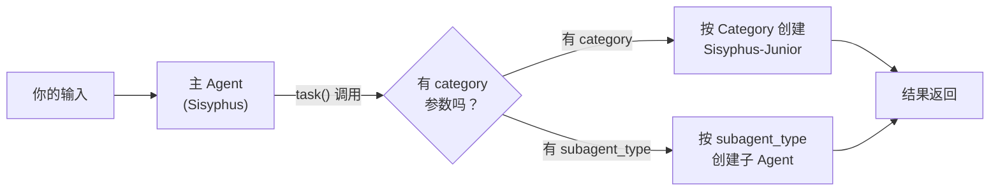
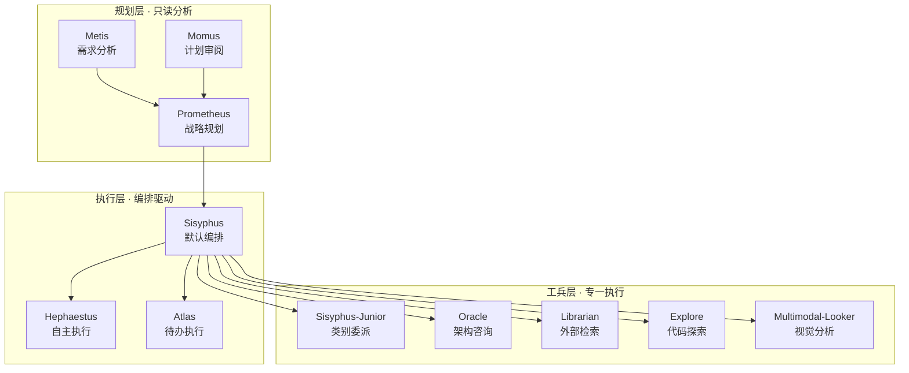

# oh-my-openagent **Agent（智能体）** 设计与开发指南

> 从"怎么配一个自己的 Agent"到"怎么设计一套 Agent 体系"——读完本文，你应该能独立设计、实现并迭代生产级的自定义 Agent。

oh-my-openagent（以下简称 OMO）的核心价值不仅是提供 11 个内置 Agent，更在于设计了一套可复制的 Agent 编排体系。本文面向**需要设计 Agent 的开发者**——不只告诉你有什么，还告诉你怎么想、怎么选、怎么迭代。

---

## 快速上手：创建一个自定义 Agent

创建自定义 Agent 只需要三步：

### 第 1 步：定义 Category

在项目根目录的 `oh-my-openagent.jsonc` 中添加 `categories` 字段：

```jsonc:src/appendix-b/opencode/agent-architecture.md
{
  "categories": {
    "my-sql-optimizer": {
      "model": "anthropic/claude-sonnet-4-6",
      "temperature": 0.1,
      "prompt_append": "你是一个 SQL 优化专家。分析查询瓶颈，建议索引策略，输出可执行的优化方案。"
    }
  }
}
```

> 配置文件修改后立即生效，无需重启。如果项目还没有 `oh-my-openagent.jsonc`，从 [oh-my-openagent 集成](../../03-setup/oh-my-openagent-setup.md) 了解初始化。

### 第 2 步：用 `task()` 调用

```typescript:src/appendix-b/opencode/agent-architecture.md
// 使用自定义 Category
task(category="my-sql-optimizer", prompt="分析这个查询: SELECT * FROM orders WHERE status = 'pending'")

// 组合使用 Category + Skills（推荐）
task(category="visual-engineering", load_skills=["frontend-ui-ux", "playwright"],
     prompt="实现一个响应式导航栏，并在浏览器中验证")
```

### 第 3 步：验证

```typescript:src/appendix-b/opencode/agent-architecture.md
task(category="my-sql-optimizer", prompt="解释一下什么是索引下推（Index Condition Pushdown）")
```

如果输出符合预期，说明自定义 Category 已经生效。你可以像使用内置 Category 一样使用它。

### 完整示例：生产级自定义 Agent

```jsonc:src/appendix-b/opencode/agent-architecture.md
{
  "categories": {
    "api-design-reviewer": {
      "model": "google/gemini-3.1-pro",
      "variant": "high",
      "temperature": 0.2,
      "prompt_append": "你是一个 API 设计评审专家。注意 RESTful 规范、命名一致性、错误处理完整性、安全性隐患。输出格式：问题列表 + 严重级别 + 修改建议。",
      "fallback_models": ["anthropic/claude-sonnet-4-6"],
      "tools": {
        "deny": ["write", "edit", "bash"]
      }
    }
  }
}
```

> 这个示例配置了一个只读的 API 设计评审 Agent，使用 Gemini 模型，如果不可用则降级到 Claude Sonnet。

---

## 快速选型指南

面对配置式 Agent（Category）、SDK、**Plugin（插件）**、**Skill（技能）** 四种扩展方式，新手常不知道从哪个入手。下表帮你 30 秒决策：

| 你的需求 | 推荐方案 | 不推荐方案 | 原因 |
|---------|---------|-----------|------|
| 需要按固定规则重复执行相同任务 | **配置式 Agent（Category）** | 每次用 SDK 写脚本 | Agent 配置一次永久生效，零代码维护 |
| 需要将 AI 能力嵌入 CI/CD 或 Web 应用 | **SDK（@opencode-ai/sdk）** | 用 Plugin 拦截 Hook | SDK 提供干净的编程接口，CI/CD 场景天然适配 |
| 需要拦截系统行为或扩展工具链 | **Plugin** | 用 Skill 注入指令 | Plugin 可以操作 Hook 点、注册新工具，Skill 只能影响对话行为 |
| 需要为特定任务注入领域知识 | **Skill** | 改写 Category prompt | Skill 可复用、可组合、可分享，prompt_append 耦合在单个 Category 中 |
| 需要团队成员共享快捷命令 | **Command** | 每人写自己的 prompt | Command 一处定义，全员使用 |
| 需要精细控制模型参数和工具权限 | **Category** | 用 SDK 每次传参 | Category 集中管理模型、温度、工具黑白名单，SDK 每次调用都要重复配置 |

> **一句话原则**：配得住的用 Category，需要编程集成的用 SDK，要动系统层面的用 Plugin，只需要加知识或流程的用 Skill。

---

## Agent 设计模式

掌握了"怎么配"之后，下一个问题是"怎么设计"。以下五种模式覆盖了 90% 的多 Agent 场景。

### 1. Simple Agent（单 Agent）

**适用场景**：任务边界清晰、不需要分工协作。大多数自定义 Category 都是这种模式。

```jsonc:src/appendix-b/opencode/agent-architecture.md
{
  "categories": {
    "code-reviewer": {
      "model": "anthropic/claude-opus-4-7",
      "variant": "max",
      "temperature": 0.1,
      "prompt_append": "你是严格的代码审查者。检查：逻辑错误、安全漏洞、性能问题、代码风格。对每个问题标注严重级别。"
    }
  }
}
```

**什么时候用**：当你只需要"一个人干一件事"时。这是默认模式，也是大多数自定义 Agent 的模式。

### 2. Chain（链式模式）

**适用场景**：一个任务的输出是下一个任务的输入。典型例子：需求分析 → 方案设计 → 代码实现 → 代码审查。

```typescript:src/appendix-b/opencode/agent-architecture.md
// Chain 模式：A → B → C
const requirements = await task(category="analyst", prompt="分析需求文档，提取核心功能点");
const design = await task(category="architect", prompt=`基于以下需求设计方案：\n${requirements}`);
const code = await task(category="implementor", prompt=`按设计实现代码：\n${design}`);
const review = await task(category="code-reviewer", prompt=`审查以下实现：\n${code}`);
```

Chain 的关键在于**每个 Agent 的 prompt_append 必须聚焦单一职责**——分析的不写代码，审查不改代码。这降低了每个 Agent 的认知负载，提高了输出质量。

### 3. Router（路由模式）

**适用场景**：需要根据输入类型动态决定由哪个 Agent 处理。

```typescript:src/appendix-b/opencode/agent-architecture.md
// Router 逻辑（通常由主 Agent Sisyphus 执行）
function routeTask(input: string) {
  if (isSecurityQuestion(input)) {
    return task(category="security-auditor", prompt=input);
  } else if (isUIQuestion(input)) {
    return task(category="visual-engineering", load_skills=["frontend-ui-ux"], prompt=input);
  } else if (isQuickFix(input)) {
    return task(category="quick", prompt=input);
  } else {
    return task(category="ultrabrain", prompt=input);
  }
}
```

**什么时候用**：当你不确定输入属于哪类任务时。Sisyphus 内置了路由能力——它会根据你的输入自动选择合适的 Category 或子 Agent 委派。

### 4. Parallel（并行模式）

**适用场景**：多个独立任务可以同时执行，互不依赖。

```typescript:src/appendix-b/opencode/agent-architecture.md
// 并行模式：同时启动 3 个独立检查
const bgTasks = [
  task(category="security-auditor", run_in_background=true, prompt="检查代码中的安全漏洞"),
  task(category="performance-reviewer", run_in_background=true, prompt="分析性能瓶颈"),
  task(category="style-checker", run_in_background=true, prompt="检查代码风格一致性")
];

// 稍后收集所有结果
const [security, perf, style] = await Promise.all(
  bgTasks.map(t => background_output(task_id=t.taskId))
);
```

**什么时候用**：互不依赖的审查、独立模块的测试、多维度分析场景。节省总执行时间。

### 5. Orchestrator（编排模式）

**适用场景**：需要一个主 Agent 协调多个子 Agent，根据中间结果动态决策下一步。

```
主 Agent（Sisyphus）
  ├─ 第 1 步：Plan Agent → 输出实现计划
  ├─ 第 2 步：审阅计划通过？
  │    ├─ 是 → 进入第 3 步
  │    └─ 否 → 回到第 1 步（迭代）
  ├─ 第 3 步：并行实现（多个 Implementor）
  ├─ 第 4 步：Reviewer 审查 → 反馈修改
  └─ 第 5 步：Tester 验证 → 完成
```

Orchestrator 模式是最强大的模式，也是 7-Agent Pipeline 的核心。主 Agent 拥有**全权决策**——判断 Plan 是否充分、Review 是否通过、是否要重试。

**实现方式**：Sisyphus 默认就是 Orchestrator。你不需要写编排逻辑，只需要定义好子 Agent 的 Category 和 Skill，Sisyphus 会自动编排。

### 模式选择决策树

```
任务需要多人协作？
  ├─ 否 → Simple Agent
  └─ 是 → 任务步骤有依赖关系？
       ├─ 是，前一步输出是下一步输入 → Chain
       ├─ 否，彼此独立 → Parallel
       └─ 部分依赖，需要主 Agent 协调 → Orchestrator

不确定输入属于哪类任务？
  └─ Router（交给 Sisyphus 自动路由）
```

---

## Agent 路由机制

理解 OMO 如何将你的输入分派给合适的 Agent，有助于你更精准地控制执行流程。



OMO 有三种调用模式：

| 模式 | 触发方式 | 说明 |
|------|---------|------|
| **主 Agent 对话** | Tab 切换（默认 Sisyphus） | 顶层交互，拥有完整工具链 |
| **Category 委派** | `task(category="...")` | 按 Category 选择模型和配置 |
| **显式子 Agent** | `task(subagent_type="oracle")` | 直接指定内置子 Agent 类型 |
| **@ 语法** | `Ask @oracle to review this` | 对话中自然语言触发 |

> 主 Agent 的 Tab 循环顺序（固定优先级）：Sisyphus（0）→ Hephaestus（1）→ Prometheus（2）→ Atlas（3）。可通过 `agent_order` 配置定制。

### 输入分派决策

```
用户输入 → Sisyphus（主 Agent）
  ├─ 普通问答 → Sisyphus 自己处理
  ├─ task(category="...") → 创建 Sisyphus-Junior，用 Category 配置
  ├─ task(subagent_type="oracle") → 创建 Oracle 子 Agent
  └─ @AgentName → 按名称匹配对应的子 Agent
```

---

### Subagent vs Task API 对比

OMO 提供了两种子任务执行机制——`subagent_type`（进程内编排）和 `task()` API（独立会话）。两者看似都可以"让其他 Agent 干活"，但设计哲学完全不同：

| 维度 | Subagent（subagent_type） | Task API（task()） |
|------|--------------------------|-------------------|
| **上下文隔离** | 共享主 Agent 的上下文窗口 | 完全独立的会话上下文 |
| **资源继承** | 继承主 Agent 的工作目录和配置 | 独立初始化，需显式传递参数 |
| **工具权限** | 受子 Agent 类型限制（Oracle 只读等） | 受目标 Category 的 tools 配置限制 |
| **通信模式** | 同步调用，主 Agent 等待结果 | 支持同步（await）和异步（run_in_background） |
| **适用场景** | 需要主 Agent 感知子任务中间状态 | 子任务独立运行，或需要后台并行执行 |
| **典型用例** | `task(subagent_type="oracle", ...)` 做架构评审 | `task(category="quick", prompt="修复这个 bug")` |
| **嵌套深度** | 受系统限制，防止无限递归 | 不受限（每个 task 创建新的 Sisyphus-Junior）|

**什么时候用 Subagent？** 当子任务需要感知主 Agent 的上下文——比如 Oracle 需要理解前面的对话才能给出架构建议。Subagent 共享上下文，沟通成本低，但副作用是子任务可能受主 Agent 上下文中无关内容干扰。

**什么时候用 Task API？** 当子任务完全独立——比如同时审查 3 个模块的安全、性能、风格。Task API 提供完整的隔离性，可以并行，不会互相干扰。它的代价是每次调用都要重新初始化上下文，成本略高。

> 实践中两者常组合使用：主 Agent（Orchestrator）用 `task()` 派发独立子任务，遇到需要深度咨询的场景再用 `subagent_type` 调用 Oracle 或 Librarian。

---

## 四种扩展方式对比

除了 Category，OMO 还提供了其他扩展方式。新手常困惑"该用 Skill 还是 Category 还是 Plugin"，下表帮你决策：

| 方式 | 复杂度 | 谁来使用 | 适合场景 |
|------|--------|---------|---------|
| **Skill** | 低（一个 .md 文件） | 任意 Agent 加载 | 注入特定领域知识、工作流指令 |
| **Category** | 低（json 配置） | `task()` 创建子 Agent | 定义新类型子 Agent，指定模型 + 行为 |
| **Command** | 低（一个 .md 文件） | 交互式 /command | 可复用的斜杠命令 |
| **Plugin** | 高（JS/TS 代码） | 系统级 Hook | 深度定制工具行为、事件拦截 |

**怎么选？**

- 只是想告诉 AI "遇到 XX 问题用 XX 方式处理" → **Skill**
- 想创建一个有特定模型和行为的专属子 Agent → **Category**
- 想做一个团队都能用的快捷命令 → **Command**
- 想拦截文件写入、自定义工具 → **Plugin**

> → Skill 开发指南见 [Skill 开发](../../05-skills/)
> → Command 创建见 [OpenCode 内置命令参考](./commands.md#自定义命令)
> → Plugin 开发见 [OpenCode Plugin 系统参考](./plugins.md)

---

## **Prompt（提示词）** 设计指南

`prompt_append` 是你定义 Agent 行为的核心工具。写得好不好，直接决定 Agent 的输出质量。

### 基本原则

| 原则 | 坏例子 | 好例子 |
|------|--------|--------|
| **具体而非泛泛** | "审查代码质量" | "检查：未处理的错误、SQL 注入风险、超过 50 行的函数" |
| **指定输出格式** | "给出建议" | "每条问题标注 [严重/中等/轻微] 级别" |
| **约束行为边界** | "做代码审查" | "你是代码审查者。只审查不修改。不允许写入文件。" |
| **提供判断标准** | "检查安全性" | "OWASP Top 10 中的每一条都检查一遍" |
| **否定比肯定有效** | "写安全的代码" | "不要用 `eval()`，不要拼接 SQL，不要硬编码密钥" |

### Prompt 模板仓库

以下模板可以直接复制使用：

```jsonc:src/appendix-b/opencode/agent-architecture.md
// 代码审查 Agent
"prompt_append": "你是严格的高级代码审查者。审查维度：① 逻辑正确性 ② 安全漏洞（OWASP Top 10）③ 性能瓶颈 ④ 代码异味。输出格式：[严重级别] 问题描述 → 修改建议。不允许修改代码。"

// 安全审计 Agent
"prompt_append": "你是一名安全审计专家。检查顺序：① 认证与授权 ② 输入验证 ③ 敏感数据泄露 ④ 配置安全 ⑤ 依赖风险。每个发现必须附 CWE ID。只读模式，不修改任何文件。"

// 文档生成 Agent
"prompt_append": "你是一名技术文档写手。用中文输出。风格：简洁、准确、有代码示例。结构：概述 → 安装 → 快速开始 → API → 进阶。不要写与主题无关的内容。"

// SQL 优化 Agent
"prompt_append": "你是 SQL 性能专家。分析查询执行计划，找出全表扫描、缺失索引、N+1 查询等问题。每项建议附带预估的优化效果（如'预计减少 80% 扫描行数'）。"

// 架构评审 Agent（只读）
"prompt_append": "你是解决架构师。评审维度：① 模块职责是否单一 ② 依赖方向是否正确（高层不依赖低层）③ 扩展性 ④ 错误处理完备性。输出格式：问题 → 风险等级 → 建议方案。只读。"
```

### Prompt 反模式

| 反模式 | 为什么有害 | 改正 |
|--------|-----------|------|
| "你是专家" | 太模糊，Agent 不知道具体做什么 | 说明具体领域和判断标准 |
| "请……请……请……" | 浪费 Token | 直接写指令 |
| 一次性要求太多 | Agent 会遗漏后半部分 | 按优先级排列，或拆成多个 Agent |
| 不设边界 | Agent 可能越权执行操作 | 明确允许做什么、禁止做什么 |

---

## 模型选择策略

不同模型有不同的性价比。选对模型可以让你的自定义 Agent 又快又省。

### OMO 模型评级

| 级别 | 代表模型 | 定位 | 相对速度 | 相对成本 |
|------|---------|------|---------|---------|
| **旗舰** | Claude Opus 4.8, GPT-5.5 | 复杂推理、架构设计 | 慢 | 高 |
| **均衡** | Claude Sonnet 4.6, Gemini 3.1 Pro | 日常开发、代码生成 | 中 | 中 |
| **经济** | GPT-5.4-nano ($0.20/$1.25), GPT-5.4-mini, GPT-5.4-mini-fast | 简单任务、搜索、格式化 | 快 | 低 |

### 选择矩阵

| 任务类型 | 推荐模型 | 理由 |
|---------|---------|------|
| 架构设计、复杂调试 | Claude Opus 4.8 / GPT-5.5 | 深度推理能力要求高 |
| 代码审查、安全审计 | Claude Sonnet 4.6 / GPT-5.5 | 需要准确性和一致性 |
| 前端/UI 实现 | Gemini 3.1 Pro | 视觉类任务表现好 |
| SQL 优化、简单修复 | GPT-5.4-mini | 低成本快速出活 |
| 文档生成、翻译 | Kimi K2.5 / GPT-5.4 | 中文场景优先 |
| 代码库搜索、外部检索 | GPT-5.4-mini-fast | 延迟敏感，质量要求不高 |

### 降级链设计

为每个自定义 Agent 配置 `fallback_models`，确保模型不可用时自动降级：

```jsonc:src/appendix-b/opencode/agent-architecture.md
{
  "categories": {
    "critical-code-reviewer": {
      "model": "anthropic/claude-opus-4-7",
      "variant": "max",
      "fallback_models": [
        "openai/gpt-5.5",
        "google/gemini-3.1-pro"
      ],
      "prompt_append": "严格代码审查……"
    }
  }
}
```

降级链的顺序原则：**质量优先**，优先降级到质量接近的模型，最后才是经济模型。

---

## 错误处理与重试

Agent 运行中可能出现各种异常。合理的错误处理策略决定了 Agent 体系的健壮性。

### 常见异常场景

| 异常 | 原因 | 处理方式 |
|------|------|---------|
| 模型不可用 | API 配额超限、网络故障 | `fallback_models` 自动降级 |
| 输出格式不对 | prompt_append 不够具体 | 重试时追加格式约束 |
| Token 超限 | 上下文窗口占满 | 简化输入，或拆成多个子任务 |
| 工具执行失败 | 权限不足、文件不存在 | 重试前检查环境，或者换一种方式 |
| 任务耗时过长 | 子任务太大 | 拆分为更细粒度的子任务 |

### 重试策略模板

在 **Workflow（工作流）** 中实现重试逻辑：

```typescript:src/appendix-b/opencode/agent-architecture.md
async function robustTask(category: string, prompt: string, maxRetries = 2) {
  for (let attempt = 0; attempt <= maxRetries; attempt++) {
    try {
      const result = await task(category, prompt);
      if (validateOutput(result)) return result;
      console.warn(`Attempt ${attempt + 1} output invalid, retrying...`);
    } catch (e) {
      if (attempt === maxRetries) throw e;
      console.warn(`Attempt ${attempt + 1} failed: ${e}, retrying...`);
    }
  }
}
```

### 幂等性设计

Agent 可能重复执行同一个子任务。确保你的 Agent 设计是**幂等**的——多次执行产生相同结果：

- **创建文件的 Agent**：先检查文件是否存在，存在则跳过或对比差异
- **修改代码的 Agent**：基于 diff 操作，而不是覆盖写入
- **执行命令的 Agent**：先检查前置条件是否满足

---

## 测试与迭代方法

Agent 开发不是一次性的。好的 Agent 需要持续迭代。

### 测试四步法

| 步骤 | 做什么 | 验证什么 |
|------|-------|---------|
| **1. 单元测试** | 用最简 prompt 单独调用你的 Category | Agent 能否正确执行单一职责 |
| **2. 边界测试** | 给空输入、超长输入、错误输入 | Agent 能否优雅处理异常 |
| **3. 集成测试** | 在真实工作流中调用多个 Agent | Agent 间的交接是否顺畅 |
| **4. 对比测试** | 用不同模型跑同一个 Category | 模型差异是否影响输出质量 |

### 迭代 Checklist

每次修改 prompt_append 后，问自己：

- [ ] 输出是否更符合预期格式？
- [ ] Agent 是否做了不该做的事（越权）？
- [ ] 有没有遗漏关键检查项？
- [ ] 是否有不必要的冗余输出？
- [ ] 如果删掉一条指令，结果会变差吗？（最少指令原则）

### 版本管理

把 prompt_append 当成代码来管理：

```jsonc:src/appendix-b/opencode/agent-architecture.md
{
  "categories": {
    "code-reviewer-v1": { /* 最初的版本 */ },
    "code-reviewer-v2": { /* 增加了安全审查维度 */ },
    "code-reviewer-v3": { /* 增加了输出格式约束 */ }
  }
}
```

保留旧版本可以快速回退，也方便 A/B 对比。

---

## Category 系统详解

Category 是 OMO 最核心的扩展机制——它定义了"什么类型的任务用哪个模型、什么温度、什么思维框架"。每次 `task()` 调用都会根据 Category 创建一个 **Sisyphus-Junior** 来执行。

### 内置 Category

| Category | 默认模型 | 温度 | 适用场景 |
|----------|---------|------|---------|
| `visual-engineering` | `google/gemini-3.1-pro (high)` | 0.7 | 前端、UI/UX、设计、样式、动画 |
| `ultrabrain` | `openai/gpt-5.5 (xhigh)` | 0.1 | 深度逻辑推理、复杂架构决策 |
| `deep` | `openai/gpt-5.5 (medium)` | 0.3 | 目标导向的自主问题求解，需要深度调研 |
| `artistry` | `google/gemini-3.1-pro (high)` | 0.8 | 高创意/艺术类任务、新颖设计 |
| `quick` | `openai/gpt-5.4-mini` | 0.3 | 单文件修改、拼写修复等简单任务 |
| `unspecified-low` | `anthropic/claude-sonnet-4-6` | 0.5 | 无法归类的低复杂度任务 |
| `unspecified-high` | `anthropic/claude-opus-4-7 (max)` | 0.5 | 无法归类的高复杂度任务 |
| `writing` | `kimi-for-coding/k2p5` | 0.7 | 文档、技术写作 |

**使用技巧**：轻度逻辑任务用 `quick` 比 `ultrabrain` 更省钱，前端原型用 `visual-engineering` 比 `unspecified-low` 效果好。

### Category + Skill 组合策略

Category 决定"用哪个能力"，Skill 注入"额外知识和工具"。组合使用可以创建高度专业化的子 Agent：

| 组合 | Category | Skills | 效果 |
|------|----------|--------|------|
| UI Designer | `visual-engineering` | `frontend-ui-ux`, `playwright` | 实现 UI 并在浏览器中直接验证 |
| Architect | `ultrabrain` | （无） | 纯逻辑推理，适合架构评审 |
| Maintainer | `quick` | `git-master` | 低成本快速修复 + 干净提交 |
| Security Auditor | `deep` | `security-research` | 深度安全审计 |

### 自定义 Category 字段

| 字段 | 类型 | 说明 |
|------|------|------|
| `model` | string | AI 模型 ID |
| `fallback_models` | string/array | 降级模型链 |
| `variant` | string | 模型变体（max, xhigh, high, medium, low）|
| `temperature` | number | 创意度（0.0~2.0）|
| `top_p` | number | 核采样参数 |
| `prompt_append` | string | 追加到系统 Prompt 的内容 |
| `thinking` | object | 思考模型配置 |
| `reasoningEffort` | string | 推理力度 |
| `tools` | object | 工具开关控制 |
| `maxTokens` | number | 最大输出 Token |

---

## 内置 Agent 参考

OMO 内置了 11 个 Agent，分三个层次。以下是你真正需要知道的——**每个 Agent 什么时候用**。

### 概览



| 层次 | 职责 | 包含 Agent | 说明 |
|------|------|-----------|------|
| **规划层** | 分析需求、制定计划、审阅方案 | Prometheus, Metis, Momus | 只读模式，不修改代码 |
| **执行层** | 编排资源、分解任务、协调执行 | Sisyphus, Hephaestus, Atlas | 核心编排逻辑所在 |
| **工兵层** | 执行具体子任务、搜索信息、质量把关 | Sisyphus-Junior, Oracle, Librarian, Explore, Multimodal-Looker | 每类任务有专用 Agent |

### 规划层（Planning）

规划层 Agent 均为**只读模式**，不拥有文件写入和执行权限。在动手编码前完成需求分析和方案设计。

| Agent | 默认模型 | 设计思路 | 什么时候用 |
|-------|---------|---------|----------|
| **Prometheus** | `claude-opus-4-7` | 迭代式提问：从模糊到清晰 | 接到模糊需求时，让它用迭代式提问明确需求边界 |
| **Metis** | `claude-sonnet-4-6` | 对抗性分析：找歧义、找陷阱 | 需求本身复杂时，先让 Metis 分析隐藏意图和 AI 容易翻车的点 |
| **Momus** | `gpt-5.5` | 结构化核查：清晰度 × 可验证性 × 完整性 | Prometheus 出完计划后，让 Momus 从三个维度审查 |

### 执行层（Execution）

核心编排 Agent，负责将高层任务拆解并驱动执行。

| Agent | 默认模型 | 设计思路 | 什么时候用 |
|-------|---------|---------|----------|
| **Sisyphus** | `claude-opus-4-7` | Orchestrator：规划→委派→协调→验证 | **默认主 Agent**。日常开发，需要并行和协作时 |
| **Hephaestus** | `gpt-5.5` | Goal-oriented：不达目的不停止 | 目标明确但步骤不确定的任务，自主推进 |
| **Atlas** | `claude-sonnet-4-6` | Step-by-step：按 todo 逐项推进 | Prometheus 已经生成了 todo 列表时 |

### 工兵层（Worker）

工兵层 Agent 是被编排的"手"—不决策，只执行。Sisyphus 根据任务类型选择合适的工兵 Agent。

| Agent | 默认模型 | 工作模式 | 什么时候用 |
|-------|---------|---------|----------|
| **Sisyphus-Junior** | 类别相关 | 一次性执行，不能再次委派 | 每一次 `task(category="...")` 自动创建 |
| **Oracle** | `gpt-5.5` | 只读咨询（不写文件、不执行命令） | 架构评审、复杂调试、设计决策时 |
| **Librarian** | `gpt-5.4-mini-fast` | 外部信息检索 | 查官方文档、研究开源项目、检索外部资料时 |
| **Explore** | `gpt-5.4-mini-fast` | 代码库内部探索 | 在代码库中搜索模式、定位代码位置时 |
| **Multimodal-Looker** | `gpt-5.5` | 视觉/文档分析 | 分析 PDF、图片、图表、截图时 |

### Agent 模式

每个 Agent 可以扮演两种角色：

| 模式 | 说明 | 示例 |
|------|------|------|
| **Primary（主 Agent）** | 顶层对话中的主动 Agent，拥有完整工具链和委派权限 | Sisyphus（默认），Plan（规划模式） |
| **Subagent（子 Agent）** | 由主 Agent 或其他 Subagent 调用的帮手，权限受限 | Oracle, Librarian, Explore |

> 主 Agent 的切换：Tab 键在各个主 Agent 之间循环。默认顺序是 Sisyphus → Hephaestus → Prometheus → Atlas。

---

## 工具权限体系

OMO 对每个 Agent 的工具有精确的权限控制，防止越权操作。

### 子 Agent 工具限制

| Agent | 限制 | 设计意图 |
|-------|------|---------|
| Oracle | ❌ write, edit, task, call_omo_agent | 只读咨询，不能改代码也不能再委派 |
| Librarian | ❌ write, edit, task, call_omo_agent | 只读搜索，不能修改 |
| Explore | ❌ write, edit, task, call_omo_agent | 只读探索，不能修改 |
| Multimodal-Looker | ✅ 仅允许 `read` | 严格的白名单模式 |
| Atlas | ❌ task, call_omo_agent | 不能委派（防止无限嵌套）|
| Momus | ❌ write, edit, task | 只读审查，不能修改或委派 |

### 为自定义 Category 配置权限

```jsonc:src/appendix-b/opencode/agent-architecture.md
{
  "categories": {
    "read-only-analyst": {
      "model": "anthropic/claude-opus-4-7",
      "prompt_append": "你是一个只读分析 Agent。",
      "tools": {
        "deny": ["write", "edit", "bash", "task"]  // 禁止写入、执行、委派
      }
    },
    "safe-implementor": {
      "model": "anthropic/claude-sonnet-4-6",
      "prompt_append": "你是一个安全的代码实现 Agent。",
      "tools": {
        "allow": ["read", "write", "edit", "glob", "grep", "bash"],  // 白名单模式
        "deny": ["task"]  // 明确禁止委派
      }
    }
  }
}
```

> `allow` 是白名单（只允许列出的工具），`deny` 是黑名单（禁止列出的工具）。同时使用时，`deny` 优先级更高。

### 权限设计原则

1. **最小权限**：子 Agent 只给它完成工作所需的最少工具
2. **规划层只读**：分析、审查类 Agent 永远不拥有写权限
3. **防止无限委派**：工兵层 Agent 禁止调用 `task()`，避免嵌套失控
4. **白名单优于黑名单**：明确列出允许的工具比禁止某些工具更安全

---

## 完整案例：从零构建一个"安全审查 Agent"

以下是一个完整的实战案例——从需求分析到最终迭代。

### 需求定义

> 团队需要一个安全审查 Agent，在代码合并前自动检查安全漏洞。要求：只读、覆盖 OWASP Top 10、输出结构化报告。

### 第 1 版：最小可用

```jsonc:src/appendix-b/opencode/agent-architecture.md
{
  "categories": {
    "security-reviewer-v1": {
      "model": "anthropic/claude-sonnet-4-6",
      "temperature": 0.1,
      "prompt_append": "你是一名安全审计专家。检查代码中的安全问题。只读。",
      "tools": { "deny": ["write", "edit", "bash"] }
    }
  }
}
```

**测试**：`task(category="security-reviewer-v1", prompt="审查这段 Python 代码……")`

**发现的问题**：输出太泛泛，没有结构化格式，缺乏具体的判断标准。

### 第 2 版：增加输出格式

```jsonc:src/appendix-b/opencode/agent-architecture.md
"prompt_append": "你是一名安全审计专家。检查：① 注入漏洞 ② 认证缺陷 ③ 敏感数据泄露 ④ XML 外部实体 ⑤ 失效的访问控制 ⑥ 安全配置错误 ⑦ XSS ⑧ 不安全的反序列化 ⑨ 已知漏洞组件 ⑩ 日志和监控不足。\n\n输出格式：\n| 严重级别 | 问题描述 | 文件位置 | CWE ID | 修改建议 |\n只读模式。"
```

**测试**：增加了格式约束后，输出结构化了很多。但发现 Agent 有时候跳过后面几条 OWASP 条目。

### 第 3 版：拆分职责 + 降级链

```jsonc:src/appendix-b/opencode/agent-architecture.md
"security-reviewer-v3": {
  "model": "anthropic/claude-opus-4-7",   // 升级到旗舰模型
  "variant": "max",
  "temperature": 0.1,
  "fallback_models": ["openai/gpt-5.5", "anthropic/claude-sonnet-4-6"],
  "prompt_append": "你是 OWASP Top 10 安全审计专家。\n\n强制性检查项（按优先级）：\n1. SQL/NoSQL 注入（CWE-89）\n2. XSS（CWE-79）\n3. 敏感数据硬编码（CWE-312）\n4. 认证绕过（CWE-287）\n5. 路径遍历（CWE-22）\n6. 不安全的反序列化（CWE-502）\n\n输出格式（Markdown 表格）：\n| 严重度 | 类型 | 文件:行号 | CWE | 建议 |\n严重度仅限：Critical / High / Medium / Low\n\n严格只读。不做任何修改。你的职责是报告，不是修复。",
  "tools": { "deny": ["write", "edit", "bash", "task"] }
}
```

**测试结果**：
- ✅ OWASP 10 条全部覆盖
- ✅ 输出格式严格符合表格规范
- ✅ 只读模式被严格遵守
- ⚠️ 旗舰模型成本较高，但每月审查次数有限，可以接受

### 集成到工作流

```typescript:src/appendix-b/opencode/agent-architecture.md
// CI 集成脚本
async function preMergeCheck() {
  const result = await task(category="security-reviewer-v3",
    prompt="审查当前分支的所有修改文件");
  printReport(result);
  if (hasCriticalIssues(result)) {
    throw new Error("存在 Critical 级别安全问题，请在合并前修复");
  }
}
```

> 这个 Agent 经过了 3 轮迭代才达到生产可用标准。**不要期望第一版就完美**——每次测试、发现问题、改进 prompt，迭代是最正常的工作方式。

---

## 成本与性能优化

### Token 预算规划

不同类型的任务 Token 消耗差异巨大：

| 任务类型 | 典型输入 Token | 典型输出 Token | 每次调用成本（参考） |
|---------|--------------|--------------|-------------------|
| 简单问题问答 | ~500 | ~200 | 极低 |
| 代码审查 | ~8K | ~2K | 中 |
| 架构评审 | ~15K | ~4K | 高 |
| 深度代码重构 | ~30K | ~10K | 很高 |

### 省钱策略

1. **用 Category 区分成本**：简单任务用 `quick`（`gpt-5.4-mini`），复杂任务才用 `ultrabrain`（`gpt-5.5`）
2. **设置 `maxTokens`**：限制输出长度，防止 Agent 过度生成
3. **缩短 prompt_append**：每精简 100 个 Token，长期累计节省显著
4. **利用 `fallback_models`**：主模型不可用时不用空跑一整个任务
5. **并行转串行**：多个后台任务同时跑可能导致突发高成本，按优先级串行化

### 性能优化

| 问题 | 原因 | 解决 |
|------|------|------|
| Agent 响应慢 | 用了旗舰模型 | 简单任务改用 `quick` Category |
| 输出太长 | prompt_append 没约束长度 | 加"限制在 500 字以内" |
| 反复失败重试 | prompt 不清晰 | 迭代 prompt_append |
| Token 浪费 | prompt 包含无关上下文 | 精简输入内容 |

---

## 开发与调试工作流

### 本地迭代

修改配置文件后无需重启，立即生效。推荐流程：

1. **写一个小测试** — 用最简 prompt 验证自定义 Category 能被正确调用
2. **迭代 prompt_append** — 逐步增加指令细节，每次验证效果
3. **确认模型选择** — 检查选用的模型是否适合任务类型（逻辑 → 低温度，创意 → 高温度）
4. **加上 Skills** — 如果需要特定领域知识，加载对应 Skill
5. **检查边界** — 给空输入、错误输入，看 Agent 是否优雅处理

### Debug 技巧

| 问题 | 排查方向 |
|------|---------|
| 自定义 Category 没生效 | 检查 `oh-my-openagent.jsonc` 的 JSON 格式是否合法 |
| Agent 行为不对 | 检查 `prompt_append` 是否清晰明确 |
| 模型不可用 | 配置 `fallback_models` 降级链 |
| 工具权限不够 | 检查 `tools.deny` 是否误禁了必要工具 |
| Category 不匹配 | 确认 `task()` 中的 `category` 名称完全匹配配置中的键名 |
| 输出格式不对 | 在 prompt_append 末尾追加格式示例 |

### 分享给团队

自定义 Category 和 Agent 配置在 `oh-my-openagent.jsonc` 中定义，提交到 Git 即可团队共享。推荐在项目 `AGENTS.md` 中记录团队的自定义 Category 清单。

> → 使用 `AGENTS.md` 共享团队 Agent 配置见 [AGENTS.md 约定系统](../../06-advanced/agents-dot-md.md)

---

## 其他高级机制

### Hook 系统

OMO 提供 **54 个基础 Hook 点**（启用 Team Mode 后增至 61 个），按 5 层组织：

| 层级 | 说明 | 示例 |
|------|------|------|
| **Session** | 会话生命周期 | `session.created`, `session.compacted` |
| **Message** | 消息处理 | `message.before`, `message.after` |
| **Tool** | 工具调用 | `tool.execute.before`, `tool.execute.after` |
| **Command** | 命令执行 | `command.before`, `command.after` |
| **Permission** | 权限管理 | `permission.asked`, `permission.replied` |

> → Hook 系统的完整用法和事件列表见 [OpenCode Plugin 系统参考](./plugins.md)。

### **MCP（模型上下文协议）** 系统

MCP（Model **Context（上下文）** Protocol）是 Agent 连接外部世界的通道。OMO 提供三层 MCP：

| 层级 | 来源 | 说明 |
|------|------|------|
| **内置远程 MCP** | 插件默认 | `websearch`、`context7`、`grep_app` 等搜索引擎 |
| **项目 MCP** | `.mcp.json` | 项目级别的外部工具配置 |
| **Skill 嵌入式 MCP** | `SKILL.md` 前置元信息 | Skill 附带的外部工具配置 |

> → MCP 配置指南见 [MCP 服务器](../../06-advanced/mcp-servers.md)。

### 多 Agent 协调

当两个以上后台 Agent 同时运行时，需要关注协调问题。以下覆盖最核心的四个场景：并发上限、资源争用、死锁预防、进度监控。

#### 并发上限

后台 Agent 没有硬性的数量上限，但实际受以下因素限制：

| 限制因素 | 说明 | 建议上限 |
|---------|------|---------|
| **模型 API 速率** | 同一模型 API 的并发请求限制 | 同一模型不建议超过 3 个并发 |
| **上下文内存** | 每个后台 Agent 占用独立上下文 | 总 Agent 数 ≤ 5（视任务复杂度调整）|
| **文件系统锁** | 多个 Agent 可能同时操作同一文件 | 写密集型场景建议串行化 |
| **Tmux pane 数量** | 启用 tmux 后每个 Agent 占用一个 pane | 不超过终端窗口容纳的 pane 数 |

```typescript:src/appendix-b/opencode/agent-architecture.md
// 推荐的分批并发模式
async function runWithConcurrencyLimit(tasks: Array<{category: string, prompt: string}>, limit = 3) {
  const results = [];
  for (let i = 0; i < tasks.length; i += limit) {
    const batch = tasks.slice(i, i + limit);
    const bgTasks = batch.map(t =>
      task({category: t.category, prompt: t.prompt, run_in_background: true})
    );
    const batchResults = await Promise.all(
      bgTasks.map(t => background_output({task_id: t.taskId}))
    );
    results.push(...batchResults);
  }
  return results;
}
```

#### 资源争用

当 2 个以上后台 Agent 需要修改同一个文件时，可能出现竞态条件：

| 场景 | 风险 | 解决方案 |
|------|------|---------|
| Agent A 写入的文件被 Agent B 覆盖 | 最后写入者胜出，丢失变更 | 每个 Agent 只写自己的独立输出文件 |
| Agent A 读文件时 Agent B 正在写入 | 读到不完整的内容 | 用 git worktree 或 tmux pane 做工作隔离 |
| Agent A 和 Agent B 都依赖同一个 MCP 服务 | MCP 调用互相干扰 | 确保 MCP 服务是无状态的，或有独立的连接标识 |

**最佳实践**：
- 后台 Agent **只读不写** — 让主 Agent 收集所有输出后统一写入
- 必须写入时，每个 Agent 写独立路径（如 `temp/security-report.md`、`temp/perf-report.md`）
- 启用 tmux 隔离后，每个 Agent 在独立 pane 中运行，文件系统虽未隔离但输出流互不干扰

#### 死锁预防

死锁在 Agent 编排中表现为：Agent A 等待 Agent B 的结果，但 Agent B 又在等待 Agent A 先完成某个前置条件。

| 死锁模式 | 示例 | 预防措施 |
|---------|------|---------|
| **循环依赖** | Agent A 的输出是 B 的输入，B 的输出又是 A 的输入 | 在编排阶段检查依赖图是否有环；用 Chain 模式替代双向依赖 |
| **资源僵持** | Agent A 锁了文件 X 等待文件 Y，B 锁了文件 Y 等待文件 X | 避免后台 Agent 持有排他性资源；所有写入由主 Agent 统一调度 |
| **隐式等待** | `background_output()` 没有设置超时，A 等 B 但 B 永远不会完成 | 始终给 `background_output()` 设置超时参数 |

```typescript:src/appendix-b/opencode/agent-architecture.md
// 安全的带超时结果收集
async function safeCollect(taskIds: string[], timeoutMs = 60000) {
  return Promise.all(
    taskIds.map(id =>
      background_output({task_id: id, timeout: timeoutMs})
        .catch(() => ({error: `Task ${id} timed out after ${timeoutMs}ms`}))
    )
  );
}
```

#### 进度监控

检查后台 Agent 的运行状态和中间结果：

```typescript:src/appendix-b/opencode/agent-architecture.md
// 查询后台 Agent 的完整会话
background_output({task_id: "bg_abc123", full_session: true});

// 只查看最近几条消息（快速诊断）
background_output({task_id: "bg_abc123", full_session: true, message_limit: 5});

// 包含 Agent 的推理过程
background_output({task_id: "bg_abc123", full_session: true, include_thinking: true});
```

| 监控场景 | 做法 |
|---------|------|
| 检查 Agent 是否还在运行 | `background_output({task_id, timeout: 5000})` 短超时快速检查 |
| 查看 Agent 的中间输出 | `full_session: true, message_limit: 5` 获取最近几条消息 |
| 诊断 Agent 为什么会卡住 | `include_thinking: true` 查看推理过程，定位卡点 |
| 等待所有 Agent 完成 | `Promise.all()` 收集所有 task_id，分别设置合理超时 |

> 后台 Agent 继承主会话的工作目录。启用 `tmux.enabled` 后，每个后台 Agent 在独立的 tmux pane 中运行。
>
> → 后台任务机制的完整说明见 [多 Agent 协作](../../04-workflows/multi-agent-collab.md)。

### Team Mode

Team Mode（实验性，默认关闭）是多 Agent 团队协作模式，启用后增加 7 个 Team 专属 Hook 点（总计 61 个）。

| 特性 | 说明 |
|------|------|
| 团队规模 | 1 个领队 + 最多 8 个成员 |
| 通信机制 | 共享 deferred-ack 邮箱 |
| 任务协调 | 共享 todo 列表 + 文件锁定的认领机制 |
| 工作隔离 | 可选按成员的 git worktree |

> → Team Mode 的完整文档见 [Teams 多进程协作](../../04-workflows/teams-collaboration.md)。

### 配置管道

OMO 在启动时按以下 6 个阶段顺序初始化：

```
Provider → Plugin Components → Agents → Tools → MCPs → Commands
```

| 阶段 | 说明 | 配置位置 |
|------|------|---------|
| **Provider** | 模型供应商初始化 | `opencode.json` 的 `providers` |
| **Plugin Components** | 插件核心组件加载 | `oh-my-openagent.jsonc` |
| **Agents** | Agent 定义和模型映射 | `oh-my-openagent.jsonc` 的 `agents` |
| **Tools** | 工具注册（20~39 个工具） | 由配置门控开关决定 |
| **MCPs** | MCP 服务器连接 | `.mcp.json` + Skill 内嵌 |
| **Commands** | 斜杠命令注册 | 内置 + 自定义 |

> → 完整配置指南见 [oh-my-openagent 集成](../../03-setup/oh-my-openagent-setup.md)。

### 工厂模式

OMO 使用工厂模式创建 Agent，统一了 11 个 Agent 的创建逻辑——每个 Agent 通过 `AgentConfig` 描述其模型、Prompt、工具权限、温度等属性。开发者自定义 Category 本质上也是在定义一份 `AgentConfig`。

---

## 相关章节

- ← [OpenCode 内置能力](./capabilities.md) — Agent 章节的全景概览
- ← [oh-my-openagent 集成](../../03-setup/oh-my-openagent-setup.md) — 安装和基础配置
- → [OpenCode Plugin 系统参考](./plugins.md) — Hook 系统和 Plugin 开发
- ← [多 Agent 协作](../../04-workflows/multi-agent-collab.md) — 后台任务机制和 Agent 编排实践
- ← [Agent 编排](../../02-core-concepts/agent-orchestration.md) — Agent 设计哲学和类型体系
- ← [Skill 开发](../../05-skills/) — Custom Agent 与 Skill 的组合使用
- ← [生态参考](./ecosystem.md) — OMO 开源项目地址和社区资源

---

## 读者视角

### 适用读者角色
- 入门开发者 — 适合快速上手 OpenCode 的基础能力，了解核心概念和常用命令
- 智能体开发工程师 — 需要设计、调试、进化 AI 编码智能体，建立系统化的 Agent 工程体系
- 效率开发者 — 已用 AI 工具，想掌握 Agent 编排和工作流模式，提升日常开发效率 2x+
- 技术负责人 — 团队技术决策者，关注标准化，建立团队级 **Harness Engineering（驾驭工程）** 体系
- Skill 作者 — 有 AI 使用经验，想开发高质量、可复用的 Skill
- 工程经理 — 评估团队工具选型，判断 OpenCode 的投资回报率
- 需求分析师/产品经理 — 验证需求覆盖完整性，评估内容价值主张
- 系统架构师/技术顾问 — 评估 OpenCode 的技术可行性、架构集成与安全合规
- 后端开发者/API 工程师 — 将 AI Agent 嵌入后端开发工作流，掌握 MCP 服务端集成
- 前端开发者/UI 工程师 — 将 Agent 编排应用到前端场景，类比理解 Skill 系统
- 文档 UX 专家 — 确保文档可读性、Mermaid 规范、移动端/无障碍体验
- 技术审校/QA 编辑 — 建立质量门禁，验证代码示例可运行性、术语一致性
- 安全工程师/架构师 — 建立 OpenCode 安全基线，评估企业级合规
- 安全研究人员/红队成员 — 评估 AI Agent 攻击面，利用 Agent 自动化安全测试

### 典型使用场景
- 快速上手 OpenCode，完成第一个成功的尝试
- 设计和调试 AI 智能体，建立系统化的 Agent 工程体系
- 掌握 Agent 编排和工作流模式，提升日常开发效率
- 建立团队级 Harness Engineering 体系，进行技术决策
- 开发高质量、可复用的 Skill，封装领域知识
- 评估 OpenCode 的投资回报率，进行工具选型决策
- 验证需求覆盖完整性，评估内容价值主张
- 评估 OpenCode 的技术可行性，进行架构集成与安全合规
- 将 AI Agent 嵌入后端开发工作流，实现 MCP 服务端集成
- 将 Agent 编排应用到前端场景，类比理解 Skill 系统
- 确保文档可读性、Mermaid 规范、移动端/无障碍体验
- 建立质量门禁，验证代码示例可运行性、术语一致性
- 建立 OpenCode 安全基线，评估企业级合规
- 评估 AI Agent 攻击面，利用 Agent 自动化安全测试

### 使用示例
```bash
# 快速上手 OpenCode
opencode serve

# 创建项目知识库
opencode /init

# 使用自定义 Skill
opencode "分析代码质量"

# 执行自动化安全审计
opencode /ralph-loop

# 并行执行多个任务
opencode /hyperplan
```

### 工程化示例

**配置顺序检查表：**

1. **第1步：初始化项目**
   ```bash
   opencode /init
   ```

2. **第2步：配置 Provider**
   ```json
   {
     "providers": {
       "anthropic": {
         "apiKey": "sk-ant-...",
         "defaultModel": "claude-3-5-sonnet-20241022"
       }
     }
   }
   ```

3. **第3步：加载 Skill**
   ```bash
   opencode skills add myorg/my-skill
   ```

### 与前/后文章的衔接
- ← [OpenCode 内置能力](./capabilities.md) — 了解 OpenCode 的核心功能和能力
- → [OpenCode 内置命令参考](./commands.md) — 详细了解每个命令的用法和参数

> 数据来源：oh-my-openagent 官方文档（code-yeongyu/oh-my-openagent）。本文基于 v4.13.x 编写，最新版本以 GitHub 主仓库为准。
